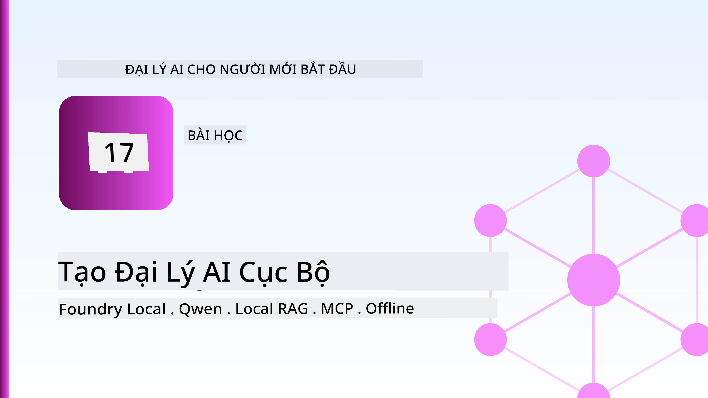
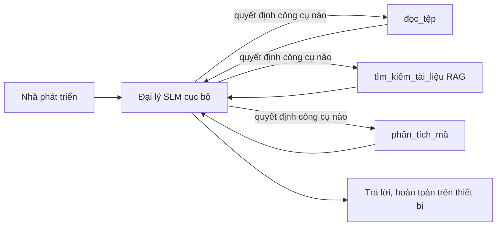
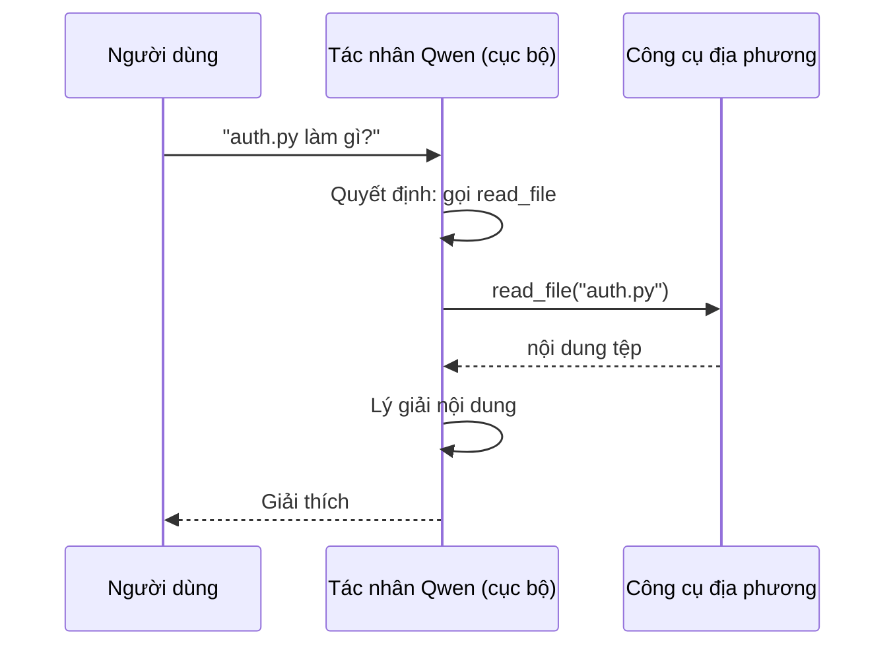
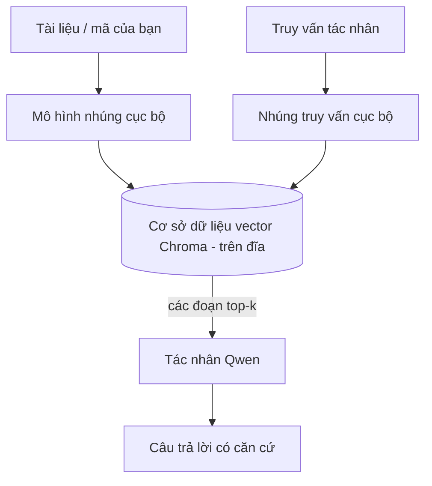
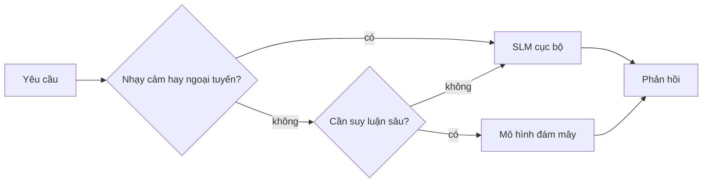

# Tạo Các Đại Lý AI Cục Bộ Sử Dụng Microsoft Foundry Local và Qwen



Bài học trước đã mở rộng các đại lý *lên* đám mây. Bài này đưa chúng *xuống* một máy đơn. Đến cuối bài bạn sẽ có một trợ lý kỹ thuật hoạt động được, có khả năng suy luận, gọi công cụ, đọc file của bạn và tìm kiếm tài liệu — **mà không cần một lần gọi suy diễn trên đám mây nào.**

Tại sao bạn muốn vậy? Ba lý do luôn xuất hiện trong công việc kỹ thuật thực tế:

- **Quyền riêng tư.** Mã nguồn và tài liệu không bao giờ rời khỏi máy. Không có prompt, đoạn mã nào, hoặc dữ liệu khách hàng nào qua ranh giới mạng.
- **Chi phí.** Suy diễn cục bộ không có hóa đơn tính theo token. Bạn có thể thử nghiệm cả ngày với giá điện tiêu thụ.
- **Ngoại tuyến.** Trên máy bay, trong cơ sở an toàn, hoặc trong trường hợp mất kết nối, đại lý vẫn hoạt động.

Điểm hạn chế là bạn đang đánh đổi một mô hình đám mây tiên tiến cho một **Mô hình Ngôn ngữ Nhỏ (SLM)** chạy trên CPU, GPU, hoặc NPU của bạn. Bài học này là về xây dựng các đại lý *tốt* trong giới hạn đó thay vì giả vờ không có giới hạn.

## Giới thiệu

Bài học này sẽ bao gồm:

- **Mô hình Ngôn ngữ Nhỏ (SLMs)** — chúng là gì, điểm mạnh và điểm yếu của chúng.
- **Microsoft Foundry Local** — một runtime tải về và phục vụ mô hình trên thiết bị qua **API tương thích OpenAI**.
- **Mô hình gọi hàm Qwen** — các SLM có khả năng tạo các lệnh gọi công cụ đáng tin cậy, điều này giúp các *đại lý* cục bộ (không chỉ chat cục bộ) trở thành hiện thực.
- **Công cụ cục bộ, RAG cục bộ và MCP cục bộ** — giúp đại lý có năng lực mà không cần tới đám mây.
- **Mẫu lai** — khi nào giữ mọi thứ cục bộ và khi nào sử dụng đám mây.

## Mục tiêu học tập

Sau khi hoàn thành bài học này, bạn sẽ biết cách:

- Giải thích các đánh đổi của SLM và chọn trường hợp sử dụng đại lý cục bộ phù hợp.
- Phục vụ mô hình Qwen cục bộ bằng Foundry Local và kết nối đến nó qua điểm cuối tương thích OpenAI.
- Xây dựng đại lý gọi công cụ chạy hoàn toàn trên máy làm việc.
- Thêm RAG cục bộ trên tài liệu của bạn dùng cơ sở dữ liệu vector cục bộ (Chroma).
- Kết nối đại lý với máy chủ MCP cục bộ và suy xét thiết kế lai giữa cục bộ và đám mây.

## Yêu cầu trước

Bài học giả định bạn đã hoàn thành các bài trước và thành thạo:

- [Sử dụng công cụ](../04-tool-use/README.md) (Bài 4) và [Agentic RAG](../05-agentic-rag/README.md) (Bài 5).
- [Giao thức Agentic / MCP](../11-agentic-protocols/README.md) (Bài 11).
- [Microsoft Agent Framework](../14-microsoft-agent-framework/README.md) (Bài 14).

Bạn cũng cần:

- Một máy làm việc cho nhà phát triển. **Ít nhất 8 GB RAM là cần thiết**; 16 GB trở lên sẽ thoải mái hơn. Có GPU hoặc NPU là lợi thế nhưng không bắt buộc.
- Cài đặt **Microsoft Foundry Local** (xem phần cài đặt bên dưới).
- Python 3.12+ và các gói trong kho [`requirements.txt`](../../../requirements.txt), cộng thêm `foundry-local-sdk`, `openai`, và `chromadb` cho bài học này.

## Mô hình Ngôn ngữ Nhỏ: Công Cụ Phù Hợp Cho Công Việc Cục Bộ

Mô hình tiên phong trên đám mây có hàng trăm tỷ tham số với trung tâm dữ liệu hỗ trợ. SLM có vài tỷ tham số và phải vừa trong RAM máy tính xách tay của bạn. Sự khác biệt đó đặt ra kỳ vọng rõ ràng.

**SLMs giỏi trong việc:**

- Các nhiệm vụ có cấu trúc, giới hạn như phân loại, trích xuất, tóm tắt tài liệu đã biết.
- **Gọi công cụ** — quyết định gọi hàm nào và với tham số gì.
- Thử nghiệm nhanh, rẻ và riêng tư trên dữ liệu của bạn.

**SLMs yếu hơn ở:**

- Lập luận mở rộng, đa bước trên khối lượng ngữ cảnh lớn.
- Kiến thức thế giới rộng lớn (chúng đã thấy ít hơn, và quên nhiều hơn).

Chiến lược thắng cuộc cho đại lý cục bộ là: **để SLM điều phối, và giao công cụ làm phần nặng nhọc.** Mô hình không cần *biết* mã nguồn của bạn — mà cần khi nào gọi `read_file` và `search_docs`. Điều này rất phù hợp với điểm mạnh của SLM.



## Microsoft Foundry Local

**Microsoft Foundry Local** là một runtime nhẹ nhàng tải xuống, quản lý và phục vụ mô hình hoàn toàn trên máy của bạn. Tính năng quan trọng nhất với chúng ta là nó cung cấp **điểm cuối HTTP tương thích OpenAI** — nghĩa là SDK OpenAI và client OpenAI của Microsoft Agent Framework có thể làm việc với nó chỉ bằng cách đổi `base_url`. Tất cả kiến thức bạn học về xây dựng đại lý chuyển trực tiếp; chỉ điểm cuối dịch chuyển từ đám mây sang `localhost`.

Foundry Local cũng tự động chọn phiên bản build mô hình phù hợp nhất cho phần cứng của bạn — build CPU, build CUDA/GPU hoặc build NPU — nên bạn không cần tự tối ưu cho từng máy.

### Cài đặt

Cài đặt Foundry Local (xem [tài liệu](https://learn.microsoft.com/azure/ai-foundry/foundry-local/) cho hệ điều hành của bạn), sau đó xác nhận hoạt động:

```bash
# Cài đặt (ví dụ; làm theo tài liệu cho nền tảng của bạn)
winget install Microsoft.FoundryLocal      # Windows
# brew install microsoft/foundrylocal/foundrylocal   # macOS

# Tải xuống và chạy một mô hình Qwen, sau đó khởi động dịch vụ cục bộ
foundry model run qwen2.5-7b-instruct
foundry service status
```

Khi dịch vụ chạy, bạn có một điểm cuối tương thích OpenAI cục bộ (thường là `http://localhost:PORT/v1`). Notebook sử dụng `foundry-local-sdk` để tự động phát hiện điểm cuối, nên bạn không cần cứng mã cổng.

## Gọi Hàm Qwen: Tại Sao Quan Trọng

Một đại lý chỉ là đại lý nếu nó có thể gọi công cụ. Nhiều SLM có thể chat nhưng tạo các lệnh gọi công cụ không đáng tin, sai cấu trúc. **Qwen** được huấn luyện cho gọi hàm và luôn tạo cấu trúc gọi công cụ chuẩn — chính điều đó biến mô hình chat cục bộ thành một *đại lý* cục bộ.

Quy trình là vòng lặp gọi công cụ tiêu chuẩn mà bạn đã biết, chỉ chạy trên thiết bị:



## RAG Cục Bộ

Tìm kiếm tài liệu là nơi đại lý cục bộ phát huy hiệu quả. Thay vì hy vọng SLM nhớ tài liệu framework của bạn, bạn nhúng tài liệu đó vào **cơ sở dữ liệu vector cục bộ** và để đại lý truy xuất các đoạn liên quan khi cần.

Chúng ta dùng **Chroma**, một kho vector nhúng chạy trong quá trình mà không cần server quản lý. Quy trình hoàn toàn cục bộ: mô hình nhúng cục bộ → vector cục bộ → truy xuất cục bộ → SLM cục bộ.



Đây là mẫu Agentic RAG giống bài 5 — chỉ khác là mỗi thành phần chạy trên máy bạn.

## Máy Chủ MCP Cục Bộ

[MCP](../11-agentic-protocols/README.md) là một giao thức truyền tải, không phải dịch vụ đám mây. Máy chủ MCP có thể chạy cục bộ trên `stdio`, cung cấp công cụ cho đại lý qua giao thức chuẩn. Điều này cho phép bạn tái sử dụng hệ sinh thái máy chủ MCP — truy cập hệ thống tập tin, thao tác git, truy vấn cơ sở dữ liệu — hoàn toàn ngoại tuyến.

Tư thế bảo mật khác với đám mây, nhưng không bị loại bỏ: máy chủ MCP cục bộ vẫn chạy với quyền người dùng của bạn, nên bạn phải giới hạn phạm vi tiếp cận (ví dụ thư mục dự án, không phải toàn bộ thư mục nhà) và coi đầu ra của nó như đầu vào để kiểm tra trước khi xử lý.

## Mẫu Lai Đám Mây và Cục Bộ

Ưu tiên cục bộ không có nghĩa là chỉ dùng cục bộ. Hệ thống trưởng thành định tuyến theo tính nhạy cảm và độ khó:

| Tình huống | Nơi chạy |
| --- | --- |
| Mã/dữ liệu nhạy cảm, hoặc ngoại tuyến | **SLM cục bộ** |
| Nhiệm vụ đơn giản, giới hạn | **SLM cục bộ** (rẻ, nhanh) |
| Lập luận đa bước khó trên dữ liệu không nhạy cảm | **Mô hình đám mây** |
| Mọi thứ khi mất kết nối | **SLM cục bộ** (giảm dần mượt mà) |

Điều này phản ánh ý tưởng **định tuyến mô hình** từ bài 16 — ngoại trừ một trong những "mô hình" giờ là máy tính của bạn. Thiết kế chắc chắn sẽ dự phòng về cục bộ khi đám mây không có, để đại lý giảm chất lượng thay vì lỗi hoàn toàn.



## Thực hành: Trợ lý Kỹ thuật Cục Bộ

Mở [`code_samples/17-local-agent-foundry-local.ipynb`](./code_samples/17-local-agent-foundry-local.ipynb) và làm theo. Bạn sẽ xây dựng trợ lý kỹ thuật cục bộ chạy hoàn toàn trên máy làm việc có thể:

1. **Gọi công cụ** — qua gọi hàm Qwen qua Foundry Local.
2. **Thực hiện thao tác tập tin cục bộ** — liệt kê và đọc tập tin trong thư mục dự án.
3. **Phân tích mã nguồn** — báo cáo các chỉ số cơ bản trên một file nguồn.
4. **Tìm kiếm tài liệu** — RAG cục bộ trên thư mục tài liệu với Chroma.
5. **Dùng MCP** — kết nối với máy chủ MCP cục bộ (và tự bỏ qua nhẹ nhàng nếu không có cấu hình).

Không sử dụng suy diễn đám mây nào trong quá trình.

### Hướng dẫn qua từng bước

Trợ lý kết nối Foundry Local qua điểm cuối tương thích OpenAI, nên mã đại lý gần như giống hệt các bài đám mây — chỉ khác client:

```python
from foundry_local import FoundryLocalManager
from openai import OpenAI

# Foundry Local phát hiện/tải xuống mô hình và cung cấp cho chúng ta một điểm cuối cục bộ.
manager = FoundryLocalManager(\"qwen2.5-7b-instruct\")
client = OpenAI(base_url=manager.endpoint, api_key=manager.api_key)  # api_key là một trình giữ chỗ cục bộ
```

Các công cụ là hàm Python thông thường phạm vi trong thư mục dự án:

```python
def read_file(path: str) -> str:
    \"\"\"Read a file, but only inside the sandboxed project directory.\"\"\"
    full = (PROJECT_ROOT / path).resolve()
    if PROJECT_ROOT not in full.parents and full != PROJECT_ROOT:
        return \"Access denied: path is outside the project directory.\"
    return full.read_text(encoding=\"utf-8\")
```

Lưu ý kiểm tra sandbox — ngay cả khi cục bộ, công cụ đọc đường dẫn tùy tiện là rủi ro. Notebook giữ mọi công cụ phạm vi trong thư mục dự án duy nhất.

## Kiểm tra kiến thức

Kiểm tra hiểu biết của bạn trước khi chuyển đến bài tập.

**1. Đưa ra hai lý do cụ thể để chạy đại lý cục bộ thay vì trên đám mây.**

<details>
<summary>Đáp án</summary>

Bất kỳ hai trong số: **quyền riêng tư** (mã và dữ liệu không rời máy), **chi phí** (không tính phí suy diễn theo token), và **khả năng ngoại tuyến** (vận hành không cần mạng — trên máy bay, trong cơ sở an toàn, hoặc mất kết nối). Giới hạn pháp lý/tuân thủ cấm gửi dữ liệu ra ngoài là nguyên nhân phổ biến gây ra lý do quyền riêng tư.
</details>

**2. Phân công công việc được khuyến nghị giữa SLM và công cụ trong đại lý cục bộ là gì, và tại sao?**

<details>
<summary>Đáp án</summary>

Để SLM **điều phối** (quyết định gọi công cụ nào với tham số gì) và để **công cụ làm phần nặng nhọc** (đọc file, truy xuất tài liệu, tính toán kết quả). SLM mạnh ở các quyết định có giới hạn như chọn công cụ nhưng yếu ở kiến thức rộng và lập luận nhiều bước, nên dựa vào công cụ là phát huy điểm mạnh.
</details>

**3. Điều gì làm cho việc tái sử dụng mã đại lý đám mây với Foundry Local trở nên khả thi?**

<details>
<summary>Đáp án</summary>

Foundry Local cung cấp **điểm cuối HTTP tương thích OpenAI**. SDK OpenAI và client OpenAI của Agent Framework hoạt động với nó chỉ bằng cách đổi `base_url` (và dùng khóa API chỗ giữ chỗ cục bộ). Mọi thứ khác trong mã đại lý vẫn giữ nguyên.
</details>

**4. Tại sao chúng ta dùng mô hình gọi hàm Qwen mà không phải bất kỳ SLM nào khác?**

<details>
<summary>Đáp án</summary>

Vì đại lý phải tạo ra các **lệnh gọi công cụ** chuẩn và đáng tin cậy. Nhiều SLM có thể chat nhưng phát sinh câu lệnh gọi công cụ sai hoặc không nhất quán. Qwen được huấn luyện gọi hàm và luôn tạo các gọi công cụ nhất quán, điều này biến mô hình chat cục bộ thành đại lý cục bộ vận hành được.
</details>

**5. Trong quy trình RAG cục bộ, các thành phần nào chạy trên máy?**

<details>
<summary>Đáp án</summary>

Tất cả: mô hình nhúng, cơ sở dữ liệu vector (Chroma, trên đĩa), bước truy xuất, và SLM. Tài liệu được nhúng cục bộ, lưu trữ cục bộ, truy xuất cục bộ và suy luận bởi mô hình cục bộ — không thành phần nào chạm tới đám mây.
</details>

**6. Máy chủ MCP cục bộ chạy trên máy bạn. Điều đó có nghĩa nó tự động an toàn? Bạn vẫn nên thực hiện biện pháp phòng ngừa nào?**

<details>
<summary>Đáp án</summary>

Không. Máy chủ MCP cục bộ chạy với quyền người dùng của bạn, nên nó có thể truy cập bất cứ thứ gì bạn có thể. Hạn chế phạm vi nó cần (ví dụ, một thư mục dự án duy nhất thay vì toàn bộ thư mục nhà) và coi đầu ra của nó như dữ liệu đầu vào để kiểm tra trước khi thực thi.
</details>

**7. Mô tả quy tắc định tuyến lai hợp lý bao gồm mô hình cục bộ.**

<details>
<summary>Đáp án</summary>

Định tuyến các yêu cầu nhạy cảm hoặc ngoại tuyến tới SLM cục bộ; định tuyến nhiệm vụ giới hạn đơn giản tới SLM cục bộ để nhanh và rẻ; định tuyến lập luận đa bước phức tạp trên dữ liệu không nhạy cảm tới mô hình đám mây; và dự phòng SLM cục bộ khi đám mây không có để đại lý giảm chất lượng mượt mà thay vì lỗi. Đây là định tuyến mô hình (Bài 16) với máy cục bộ là một mô hình.
</details>

**8. Kích thước RAM tối thiểu thực tế để chạy đại lý cục bộ bài này là bao nhiêu, và thêm RAM mang lại lợi ích gì?**

<details>
<summary>Đáp án</summary>

Khoảng **8 GB** là tối thiểu thực tế; 16 GB+ thì thoải mái. Thêm RAM cho phép chạy các mô hình lớn hơn, mạnh hơn và giữ ngữ cảnh nhiều hơn trong bộ nhớ. GPU hay NPU giúp tăng tốc suy diễn nhưng không bắt buộc — Foundry Local chọn phiên bản build CPU khi không có thiết bị tăng tốc.
</details>

## Bài tập

Mở rộng trợ lý kỹ thuật cục bộ thành một **trình xem xét tài liệu cục bộ** cho một dự án nhỏ bạn chọn (có thể dùng một thư mục bài học trong repo này).

Yêu cầu bài làm:

1. **Lập chỉ mục thư mục tài liệu/mã thực tế** vào Chroma (ít nhất năm file).
2. **Thêm công cụ `find_todos`** quét dự án tìm comment `TODO`/`FIXME` và trả về cùng file và số dòng — duy trì kiểm tra sandbox như `read_file`.

3. **Đặt câu hỏi cho tác tử ba câu** buộc nó phải kết hợp các công cụ: một câu hỏi thuần RAG, một câu hỏi yêu cầu đọc một tệp cụ thể, và một câu hỏi yêu cầu tìm các TODO.
4. **Đo lường nó**: tính thời gian cho từng câu trả lời trong ba câu hỏi và ghi chú chúng trong một ô markdown. Bình luận xem độ trễ có chấp nhận được cho quy trình làm việc bạn dự định hay không.

Sau đó viết một đoạn ngắn về **những gì bạn sẽ chuyển lên đám mây và những gì bạn sẽ giữ lại cục bộ** cho người đánh giá này, và lý do. Bạn được đánh giá dựa trên việc các thành phần cục bộ được kết nối chính xác và liệu suy luận kết hợp của bạn có hợp lý hay không — không phải chất lượng mô hình.

## Tóm tắt

Trong bài học này bạn đã xây dựng một tác tử chạy hoàn toàn trên máy của bạn:

- **SLMs** đánh đổi phạm vi để lấy quyền riêng tư, chi phí và vận hành ngoại tuyến — và tỏa sáng khi chúng **điều phối công cụ** thay vì mang tất cả kiến thức tự thân.
- **Foundry Local** phục vụ mô hình trên thiết bị qua một **điểm cuối tương thích OpenAI**, nên mã tác tử đám mây của bạn chỉ cần thay đổi một dòng.
- **Mô hình gọi hàm Qwen** làm cho việc gọi công cụ cục bộ đáng tin cậy trở thành khả thi — và do đó tác tử *cục bộ* cũng khả thi.
- **Local RAG** (Chroma) và **MCP cục bộ** cung cấp khả năng cho tác tử mà không cần rời máy.
- **Các mẫu lai** cho phép bạn định tuyến theo mức độ nhạy cảm và khó khăn, với cục bộ như một lựa chọn dự phòng hợp lý.

Điều này hoàn tất vòng triển khai: Bài học 16 triển khai tác tử quy mô lớn trên Microsoft Foundry, và bài học này triển khai thu nhỏ chúng xuống một máy trạm đơn. Bài học tiếp theo sẽ xoay quanh việc giữ an toàn cho các tác tử triển khai.

## Tài nguyên bổ sung

- <a href="https://learn.microsoft.com/azure/ai-foundry/foundry-local/" target="_blank">Tài liệu Microsoft Foundry Local</a>
- <a href="https://learn.microsoft.com/azure/ai-foundry/what-is-azure-ai-foundry" target="_blank">Tài liệu Microsoft Foundry</a>
- <a href="https://aka.ms/ai-agents-beginners/agent-framework" target="_blank">Microsoft Agent Framework</a>
- <a href="https://qwen.readthedocs.io/en/latest/framework/function_call.html" target="_blank">Tài liệu gọi hàm Qwen</a>
- <a href="https://modelcontextprotocol.io/" target="_blank">Giao thức ngữ cảnh mô hình (MCP)</a>
- <a href="https://docs.trychroma.com/" target="_blank">Cơ sở dữ liệu vector Chroma</a>

## Bài học trước

[Triển khai tác tử quy mô lớn](../16-deploying-scalable-agents/README.md)

## Bài học tiếp theo

[Bảo mật tác tử AI](../18-securing-ai-agents/README.md)

---

<!-- CO-OP TRANSLATOR DISCLAIMER START -->
**Tuyên bố miễn trừ trách nhiệm**:
Tài liệu này đã được dịch bằng dịch vụ dịch thuật AI [Co-op Translator](https://github.com/Azure/co-op-translator). Mặc dù chúng tôi cố gắng đảm bảo độ chính xác, xin lưu ý rằng bản dịch tự động có thể chứa lỗi hoặc sai sót. Tài liệu gốc bằng ngôn ngữ gốc nên được coi là nguồn tin chính thức. Đối với thông tin quan trọng, nên sử dụng dịch vụ dịch thuật chuyên nghiệp bởi con người. Chúng tôi không chịu trách nhiệm về bất kỳ hiểu lầm hoặc giải thích sai nào phát sinh từ việc sử dụng bản dịch này.
<!-- CO-OP TRANSLATOR DISCLAIMER END -->