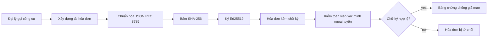
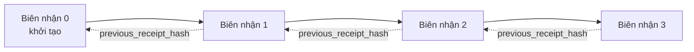

[Xem video bài học: Bảo mật Đại lý AI với Biên nhận Mật mã](https://youtu.be/PLACEHOLDER_VIDEO_ID)

> _(Video bài học và hình thu nhỏ sẽ được nhóm nội dung Microsoft thêm vào sau khi hợp nhất, theo mẫu bài học 14 / 15.)_

# Bảo mật Đại lý AI với Biên nhận Mật mã

## Giới thiệu

Bài học này sẽ đề cập đến:

- Tại sao dấu vết kiểm toán cho đại lý AI lại quan trọng đối với tuân thủ, gỡ lỗi và niềm tin.
- Biên nhận mật mã là gì và nó khác với dòng nhật ký chưa ký như thế nào.
- Cách tạo biên nhận đã ký cho cuộc gọi công cụ của đại lý bằng Python thuần túy.
- Cách xác thực biên nhận ngoại tuyến và phát hiện sự giả mạo.
- Cách liên kết chuỗi các biên nhận sao cho bỏ hoặc sắp xếp lại một biên nhận làm gãy chuỗi.
- Những gì biên nhận chứng minh và những gì chúng không chứng minh rõ ràng.

## Mục tiêu học tập

Sau khi hoàn thành bài học này, bạn sẽ biết cách:

- Xác định các chế độ lỗi thúc đẩy nguồn gốc mật mã cho các hành động của đại lý.
- Tạo biên nhận đã ký Ed25519 trên một payload JSON chuẩn.
- Xác thực biên nhận độc lập chỉ bằng khóa công khai của người ký.
- Phát hiện sự giả mạo bằng cách thực hiện lại việc xác thực trên biên nhận bị sửa đổi.
- Xây dựng chuỗi biên nhận liên kết băm và giải thích tại sao chuỗi đó quan trọng.
- Nhận biết ranh giới giữa những gì biên nhận chứng minh (thuộc tính, tính toàn vẹn, thứ tự) và những gì chúng không chứng minh (độ chính xác của hành động, tính hợp lệ của chính sách).

## Vấn đề: Dấu vết kiểm toán của Đại lý bạn

Hãy tưởng tượng bạn đã triển khai một đại lý AI cho Contoso Travel. Đại lý đọc yêu cầu của khách hàng, gọi API vé bay để tìm lựa chọn, và đặt chỗ thay mặt khách hàng. Quý trước, đại lý đã xử lý 50.000 đặt chỗ.

Hôm nay có một kiểm toán viên đến. Họ đưa ra câu hỏi đơn giản: "Cho tôi xem đại lý của bạn đã làm gì."

Bạn giao nhật ký cho họ xem. Người kiểm toán nhìn vào và đặt câu hỏi khó hơn: "Làm sao tôi biết những nhật ký này không bị chỉnh sửa?"

Đây là vấn đề dấu vết kiểm toán. Hầu hết các triển khai đại lý hiện nay dựa vào:

- **Nhật ký ứng dụng**: được đại lý ghi lại, ai có quyền truy cập hệ thống tập tin cũng có thể chỉnh sửa.
- **Dịch vụ ghi nhật ký đám mây**: bằng chứng không bị giả mạo trên nền tảng nhưng chỉ khi kiểm toán viên tin tưởng nhà điều hành nền tảng.
- **Nhật ký giao dịch cơ sở dữ liệu**: rất phù hợp cho các thay đổi cơ sở dữ liệu nhưng không phù hợp cho các cuộc gọi công cụ tùy ý.

Không cái nào trong số này có thể trả lời câu hỏi của người kiểm toán mà không yêu cầu họ phải tin tưởng ai đó (bạn, nhà cung cấp đám mây, nhà cung cấp cơ sở dữ liệu). Đối với sử dụng nội bộ, sự tin tưởng đó thường chấp nhận được. Đối với khối lượng công việc được quản lý (tài chính, y tế, bất kỳ gì chịu sự điều chỉnh của Đạo luật AI EU), thì không thể.

Biên nhận mật mã giải quyết vấn đề này bằng cách làm cho mỗi hành động của đại lý có thể xác thực độc lập. Người kiểm toán không cần tin bạn. Họ chỉ cần khóa công khai của bạn và bản thân biên nhận.

## Biên nhận Mật mã là gì?

Biên nhận là một đối tượng JSON ghi lại những gì đại lý đã làm, được ký bằng chữ ký số.



Biên nhận tối giản trông như thế này:

```json
{
  "type": "agent.tool_call.v1",
  "agent_id": "contoso-travel-bot",
  "tool_name": "lookup_flights",
  "tool_args_hash": "sha256:a3f9c1...",
  "result_hash": "sha256:7b2e1d...",
  "policy_id": "contoso-travel-policy-v3",
  "timestamp": "2026-04-25T14:30:00Z",
  "sequence": 47,
  "previous_receipt_hash": "sha256:9d4e6a...",
  "signature": {
    "alg": "EdDSA",
    "sig": "c5af83...",
    "public_key": "8f3b2c..."
  }
}
```

Ba thuộc tính sau đây thực hiện công việc:

1. **Chữ ký**. Biên nhận được ký bởi cổng đại lý sử dụng khóa riêng Ed25519. Bất kỳ ai có khóa công khai tương ứng đều có thể xác thực chữ ký ngoại tuyến. Sửa đổi bất kỳ trường nào làm chữ ký không hợp lệ.

2. **Mã hóa chuẩn hóa**. Trước khi ký, biên nhận được tuần tự hóa dùng JSON Canonicalization Scheme (JCS, RFC 8785). Điều này đảm bảo hai cài đặt khác nhau mà tạo ra cùng biên nhận bên logic sẽ cho ra kết quả byte-identical. Nếu không chuẩn hóa, các trình tuần tự hóa JSON khác nhau sẽ tạo ra chữ ký khác nhau cho cùng một nội dung.

3. **Liên kết chuỗi băm**. Trường `previous_receipt_hash` liên kết mỗi biên nhận với biên nhận trước nó. Bỏ hoặc sắp xếp lại một biên nhận làm gãy mọi biên nhận đến sau nó. Việc giả mạo trở nên hiển nhiên ở cấp chuỗi ngay cả khi chữ ký cá nhân bị bỏ qua.

Ba thuộc tính này cung cấp ba đảm bảo:

- **Thuộc tính**: khóa này đã ký nội dung này.
- **Toàn vẹn**: nội dung không thay đổi kể từ khi ký.
- **Thứ tự**: biên nhận này đến sau biên nhận kia trong chuỗi.

## Tạo Biên nhận trong Python

Bạn không cần thư viện đặc biệt để tạo biên nhận. Các nguyên thủy mật mã có sẵn rộng rãi và logic chỉ vài chục dòng Python.

Các bài tập thực hành trong `code_samples/18-signed-receipts.ipynb` hướng dẫn toàn bộ quy trình. Phiên bản tóm tắt:

```python
import json
import hashlib
import base64
from nacl import signing
from jcs import canonicalize  # JSON chuẩn RFC 8785

def b64url_nopad(data: bytes) -> str:
    return base64.urlsafe_b64encode(data).decode("ascii").rstrip("=")

def sha256_canonical(obj) -> str:
    """SHA-256 of a Python object's JCS-canonical JSON form."""
    return f"sha256:{hashlib.sha256(canonicalize(obj)).hexdigest()}"

# Tạo hoặc tải khóa ký (trong sản xuất, lưu trong khoá bảo mật)
signing_key = signing.SigningKey.generate()
verify_key = signing_key.verify_key

# Xây dựng dữ liệu biên nhận (chưa có chữ ký)
tool_args = {"origin": "SYD", "destination": "LAX"}
tool_result = [{"flight": "QF11", "price": 1850, "stops": 0}]

payload = {
    "type": "agent.tool_call.v1",
    "agent_id": "contoso-travel-bot",
    "tool_name": "lookup_flights",
    "tool_args_hash": sha256_canonical(tool_args),
    "result_hash": sha256_canonical(tool_result),
    "policy_id": "contoso-travel-policy-v3",
    "timestamp": "2026-04-25T14:30:00Z",
    "sequence": 0,
    "previous_receipt_hash": None,
}

# Chuẩn hóa, băm, ký.
canonical_bytes = canonicalize(payload)
message_hash = hashlib.sha256(canonical_bytes).digest()
signature_bytes = signing_key.sign(message_hash).signature

# Đính kèm đối tượng chữ ký có cấu trúc.
receipt = {
    **payload,
    "signature": {
        "alg": "EdDSA",
        "sig": b64url_nopad(signature_bytes),
        "public_key": b64url_nopad(bytes(verify_key)),
    },
}
```

Đó là toàn bộ quy trình ký. Các bài tập trong notebook sẽ hướng dẫn từng bước cụ thể.

## Xác thực Biên nhận và Phát hiện Giả mạo

Việc xác thực là thao tác nghịch đảo:

```python
import base64
import hashlib
from nacl import signing
from nacl.exceptions import BadSignatureError
from jcs import canonicalize

def b64url_decode(s: str) -> bytes:
    padding = "=" * ((4 - len(s) % 4) % 4)
    return base64.urlsafe_b64decode(s + padding)

def verify_receipt(receipt: dict) -> bool:
    # Chữ ký là một đối tượng có cấu trúc: {"alg", "sig", "public_key"}.
    sig_obj = receipt.get("signature")
    if not sig_obj or sig_obj.get("alg") != "EdDSA":
        return False

    # Tái tạo payload thực sự đã được ký (mọi thứ ngoại trừ chữ ký).
    payload = {k: v for k, v in receipt.items() if k != "signature"}

    canonical_bytes = canonicalize(payload)
    message_hash = hashlib.sha256(canonical_bytes).digest()

    try:
        verify_key = signing.VerifyKey(b64url_decode(sig_obj["public_key"]))
        verify_key.verify(message_hash, b64url_decode(sig_obj["sig"]))
        return True
    except BadSignatureError:
        return False
```

Hàm này nhận một biên nhận và trả về `True` nếu chữ ký hợp lệ, `False` nếu không. Không gọi mạng, không phụ thuộc dịch vụ, không cần tin bên thứ ba.

Để thấy tính năng phát hiện giả mạo hoạt động, notebook hướng dẫn:

1. Tạo một biên nhận hợp lệ và xác nhận nó được xác thực.
2. Sửa đổi một byte của trường `tool_args_hash`.
3. Thực hiện lại xác thực và thấy nó thất bại.

Đây là minh chứng thực tế rằng biên nhận có tính không thể giả mạo: bất kỳ thay đổi nào dù nhỏ cũng làm gãy chữ ký.

## Liên kết Chuỗi Biên nhận cho Đại lý Nhiều Bước

Một biên nhận đã ký bảo vệ một hành động. Một chuỗi biên nhận bảo vệ một chuỗi hành động.



Mỗi biên nhận ghi lại băm biên nhận trước đó. Để bí mật loại bỏ biên nhận 2, kẻ tấn công phải:

- Sửa đổi trường `previous_receipt_hash` của biên nhận 3 (làm gãy chữ ký biên nhận 3), HOẶC
- Giả mạo chữ ký mới trên biên nhận 3 bị sửa đổi (cần khóa riêng của đại lý).

Nếu khóa riêng được lưu trong kho khóa phần cứng và bạn công bố khóa công khai cùng từng biên nhận, không có cách nào tấn công mà không bị phát hiện.

Notebook hướng dẫn:

1. Xây dựng chuỗi ba biên nhận.
2. Xác thực rằng trường `previous_receipt_hash` của mỗi biên nhận khớp với băm thực tế của biên nhận trước đó.
3. Giả mạo một biên nhận ở giữa và thấy chuỗi bị gãy đúng vị trí đó.

Đây là cách bạn tạo dấu vết kiểm toán mà kiểm toán viên bên ngoài có thể xác thực mà không cần tin bạn.

## Những gì Biên nhận Chứng minh (và Những gì Chúng Không)

Đây là phần quan trọng nhất của bài học. Biên nhận rất mạnh mẽ nhưng sức mạnh của chúng có giới hạn.

**Biên nhận chứng minh ba điều:**

1. **Thuộc tính**: một khóa cụ thể đã ký một payload cụ thể.
2. **Toàn vẹn**: payload không thay đổi kể từ khi ký.
3. **Thứ tự**: biên nhận này đến sau biên nhận kia trong chuỗi băm.

**Biên nhận KHÔNG chứng minh:**

1. **Độ chính xác**: hành động của đại lý có phải đúng không. Một biên nhận có thể ký cho câu trả lời sai cũng trơn tru như câu trả lời đúng.
2. **Tuân thủ chính sách**: chính sách được tham chiếu trong `policy_id` đã được đánh giá thực sự hay không, hoặc liệu chính sách đó có cho phép hành động này nếu được kiểm tra. Biên nhận ghi lại điều được tuyên bố, không phải điều được thực thi.
3. **Danh tính vượt khỏi khóa**: biên nhận nói "khóa này đã ký nội dung này." Nó không nói "nhân viên này đã phê duyệt." Kết nối khóa với người hoặc tổ chức đòi hỏi hạ tầng danh tính riêng biệt (thư mục, đăng ký khóa công khai, v.v.).
4. **Tính trung thực của đầu vào**: nếu đại lý nhận được câu lệnh bị thao túng và hành động theo đó, biên nhận ghi lại hành động một cách trung thực. Biên nhận là bước sau xác thực đầu vào, không phải thay thế cho nó.

Ranh giới này quan trọng vì hai lý do:

- Nó cho bạn biết biên nhận hữu ích cho việc gì: làm cho hành vi đại lý có thể kiểm toán và bằng chứng không bị giả mạo, ngay cả qua các ranh giới tổ chức.
- Nó cho bạn biết các lớp bổ sung bạn vẫn cần: xác thực đầu vào (Bài học 6), thực thi chính sách (đề cập ngắn phía dưới), và hạ tầng danh tính (không nằm trong phạm vi bài học này).

Một lỗi phổ biến là cho rằng "chúng ta có biên nhận" nghĩa là "chúng ta có quản trị." Không phải vậy. Biên nhận là nền tảng. Quản trị là hệ thống bạn xây dựng trên nền tảng đó.

## Chứng minh Một Người Phê duyệt Hành động Chính xác Đó

Mục 3 ở trên xứng đáng có một phần riêng: biên nhận hành động nói "khóa này đã ký nội dung này," không bao giờ nói "một người đã phê duyệt." Với các hành động rủi ro cao (hoàn tiền, xóa, chuyển khoản), các khuôn khổ quản trị ngày càng yêu cầu chính xác câu thiếu này, và điều đó có thể thực hiện bằng cùng các nguyên thủy bạn đã xây ở bài học này.

Notebook tiếp theo `code_samples/human-authorization-receipts.ipynb` thêm loại biên nhận thứ hai, `human.approval.v1`, cùng hình thức đóng gói như biên nhận bài học (payload có kiểu ký Ed25519 trên SHA-256 chuẩn hóa của nó, với đối tượng `signature` nằm ngoài byte ký). Người phê duyệt có tên ký **toàn bộ hành động chuẩn hóa và digest của nó** trước khi thực thi; biên nhận hành động đại lý chứa **digest hành động đó** và `parent_approval_ref`, là `receipt_hash` của sự phê duyệt, theo cùng quy ước như `previous_receipt_hash` trong chuỗi bạn tạo ở trên. Một lệnh `verify_chain` kiểm tra cả hai hiện vật dưới **các đăng ký khóa riêng biệt được ghim** (khóa của người phê duyệt và khóa của đại lý), nên mã dùng chung nhưng quyền kiểm soát chưa bao giờ dùng chung.

Thuộc tính đạt được, nói cẩn thận: *con người đã phê duyệt chính xác hành động này, và đại lý thực thi chính xác hành động được phê duyệt đó.* Các bộ kiểm tra từ chối trong notebook thực sự biến thuộc tính này thành hiện thực thay vì chỉ khẳng định:

- bộ kinh điển: giả mạo, điều phối nhầm, phát lại, khóa giả trên cả hai phía, đầu vào sai định dạng;
- **quyền hạn lỗi thời**: chữ ký vẫn xác thực được nhưng vẫn bị từ chối vì phiên bản chính sách thay đổi, khóa người phê duyệt bị xóa khỏi đăng ký khóa ghim, hoặc phê duyệt hết hạn trước khi thực thi;
- **thay thế digest**: biên nhận hành động ký hợp lệ trỏ đến sự phê duyệt *thật* ràng buộc một hành động chuẩn hóa *khác*.

Mỗi lỗi từ chối với lý do riêng biệt, nên kiểm toán viên đọc từ chối có thể biết liệu quyền hạn đã lỗi thời hay hành động thực thi đã thay đổi. Quy tắc được dạy trong notebook: một phê duyệt đã ký không phải quyền hạn tự thân. Quyền hạn chỉ tồn tại nếu cả hai biên nhận vẫn gắn với cùng hành động chuẩn hóa khi thực thi. Đường dẫn đồng ký trong cùng bản Internet-Draft mà bài học này theo (`draft-farley-acta-signed-receipts`) là hình thức chuẩn hóa tiêu chuẩn của mẫu này.

## Tham khảo cho Sản xuất

Mã Python trong bài học này có chủ đích tối giản để bạn có thể đọc từng dòng và hiểu chính xác những gì xảy ra. Trong sản xuất, bạn có hai lựa chọn:

1. **Xây dựng trực tiếp trên các nguyên thủy mật mã.** 50 dòng bạn thấy ở trên đủ cho nhiều trường hợp sử dụng. PyNaCl (Ed25519) và gói `jcs` (JSON chuẩn hóa) là thư viện được duy trì tốt và đã được kiểm tra.

2. **Dùng thư viện biên nhận sản xuất.** Một số dự án mã nguồn mở thực thi mẫu tương tự với tính năng bổ sung (xoay khóa, xác nhận hàng loạt, phân phối JWK Set, tích hợp với bộ máy chính sách):
   - Định dạng biên nhận dùng trong bài học theo Bản Dự thảo Internet của IETF ([`draft-farley-acta-signed-receipts`](https://datatracker.ietf.org/doc/draft-farley-acta-signed-receipts/), sửa đổi 02) hiện đang trong quá trình chuẩn hoá, với bộ test tuân thủ dùng chung ([agent-governance-testvectors](https://github.com/ScopeBlind/agent-governance-testvectors)) để các cài đặt độc lập xác minh chéo cho đầu ra chuẩn hóa byte-identical.
   - Bộ công cụ Quản trị Đại lý Microsoft kết hợp biên nhận với quyết định chính sách dựa trên Cedar; xem Hướng dẫn 33 trong kho lưu trữ đó cho ví dụ toàn diện.
   - Các gói `protect-mcp` (npm) và `@veritasacta/verify` (npm) cung cấp triển khai Node cho ký biên nhận và xác thực ngoại tuyến, dùng để bọc bất kỳ máy chủ MCP nào với dấu vết kiểm toán chống giả mạo, bao gồm luồng giữ cho đồng ký trong đó hành động bị tạm dừng phát ra biên nhận phê duyệt liên kết với digest hành động (hỗ trợ WebAuthn cho luồng trên máy tính để bàn), cùng mẫu biên nhận phê duyệt như notebook phê duyệt con người ở trên.
   - Bộ SDK Python **[nobulex](https://github.com/arian-gogani/nobulex)** (`pip install nobulex`) cung cấp mẫu ký Ed25519 + JCS tương tự với tích hợp LangChain và CrewAI, bao gồm các vectors test xác nhận chéo đã phát hành và bản đồ tuân thủ đóng góp qua [OWASP PR #2210](https://github.com/OWASP/CheatSheetSeries/pull/2210).

Quyết định giữa tự phát triển và dùng thư viện tương tự như quyết định giữa việc viết thư viện JWT riêng và dùng thư viện đã được kiểm thử: cả hai đều hợp lý; thư viện tiết kiệm thời gian và giảm bề mặt kiểm toán; cách tự viết buộc bạn hiểu rõ từng nguyên thủy. Bài học này dạy cách từ đầu để bạn có nền tảng cho cả hai lựa chọn.

## Kiểm tra Kiến thức

Kiểm tra hiểu biết trước khi chuyển sang bài tập thực hành.

**1. Một biên nhận được ký bằng khóa riêng Ed25519 của đại lý. Kiểm toán viên chỉ có khóa công khai. Kiểm toán viên có thể xác thực biên nhận ngoại tuyến không?**

<details>
<summary>Trả lời</summary>

Có. Xác thực Ed25519 chỉ cần khóa công khai và byte đã ký. Không gọi mạng, không phụ thuộc dịch vụ. Đây là thuộc tính làm cho biên nhận hữu ích trong môi trường kiểm toán tách biệt, đa tổ chức, hoặc tin cậy thấp.
</details>

**2. Kẻ tấn công sửa trường `policy_id` của biên nhận để tuyên bố nó được điều chỉnh bởi chính sách rộng hơn. Chữ ký ở trên payload gốc. Điều gì xảy ra trong quá trình xác thực?**

<details>
<summary>Trả lời</summary>


Xác thực thất bại. Chữ ký được tính trên các byte chính tắc của payload gốc; việc sửa đổi bất kỳ trường nào sẽ làm thay đổi các byte chính tắc, làm thay đổi hàm băm SHA-256, khiến chữ ký không hợp lệ. Kẻ tấn công cần có khóa riêng để tạo ra chữ ký hợp lệ mới, mà họ không có.
</details>

**3. Tại sao biên lai lại bao gồm `tool_args_hash` và `result_hash` thay vì các tham số thô và kết quả?**

<details>
<summary>Trả lời</summary>

Có hai lý do. Đầu tiên, biên lai có thể cần được lưu trữ hoặc truyền trong môi trường mà việc rò rỉ nội dung thô (PII, dữ liệu kinh doanh) là vấn đề. Việc băm giúp giữ biên lai nhỏ và giữ nội dung riêng tư; kiểm toán viên xác minh rằng hàm băm khớp với bản sao nội dung thực được lưu trữ riêng biệt. Thứ hai, các hàm băm có kích thước cố định; một biên lai có hàm băm có kích thước giới hạn bất kể kích thước đầu vào và đầu ra.
</details>

**4. Trường `previous_receipt_hash` liên kết mỗi biên lai với biên lai tiền nhiệm của nó. Nếu kẻ tấn công lặng lẽ xóa một biên lai ở giữa chuỗi, điều gì sẽ trở nên không hợp lệ?**

<details>
<summary>Trả lời</summary>

Mỗi biên lai xuất hiện sau biên lai bị xóa. Trường `previous_receipt_hash` của chúng không còn khớp với chuỗi thực tế (bởi vì biên lai mà chúng tham chiếu không còn tồn tại hoặc chuỗi giờ trỏ tới một tiền nhiệm khác). Để che giấu việc xóa, kẻ tấn công sẽ phải ký lại mỗi biên lai sau đó, điều này đòi hỏi khóa riêng.
</details>

**5. Một biên lai xác thực chính xác. Điều đó chứng minh hành động của tác nhân là đúng, hợp lý hoặc tuân thủ chính sách chứ?**

<details>
<summary>Trả lời</summary>

Không. Một biên lai hợp lệ chứng minh ba điều: sự gán nhãn (khóa này đã ký nội dung này), tính toàn vẹn (nội dung không bị thay đổi), và thứ tự (biên lai này đến sau biên lai kia). Nó KHÔNG chứng minh rằng hành động đó là đúng, rằng chính sách được đặt tên trong `policy_id` thực sự đã được đánh giá, hoặc tác nhân đã tuân theo mọi quy tắc. Biên lai làm cho hành vi của tác nhân có thể kiểm tra được, không nhất thiết là đúng. Đây là ranh giới quan trọng nhất trong bài học.
</details>

## Bài tập thực hành

Mở `code_samples/18-signed-receipts.ipynb` và hoàn thành cả bốn phần:

1. **Phần 1**: Ký biên lai đầu tiên của bạn và xác minh nó.
2. **Phần 2**: Can thiệp vào biên lai và quan sát xác thực thất bại.
3. **Phần 3**: Xây dựng chuỗi ba biên lai và xác minh tính toàn vẹn của chuỗi.
4. **Phần 4**: Áp dụng mẫu cho một tác nhân được xây dựng với Microsoft Agent Framework: đóng gói một lần gọi công cụ trong việc ký biên lai, sau đó xác minh biên lai độc lập.

**Thách thức mở rộng 1:** mở rộng schema biên lai với một trường bổ sung do bạn tự chọn (ví dụ, ID yêu cầu để truy vết), cập nhật logic ký chính tắc để bao gồm nó, và xác nhận rằng biên lai vẫn có thể xác thực hai chiều. Sau đó sửa đổi trường sau khi ký và xác nhận xác thực thất bại. Điều này buộc bạn phải hiểu cách từng byte của mã hóa chính tắc đóng góp vào chữ ký.

**Thách thức mở rộng 2:** Băm SHA-256 hai biên lai của bạn cùng nhau (nối các byte chính tắc của chúng theo thứ tự xác định) và nhúng kết quả băm làm trường mới trên biên lai thứ ba trước khi ký nó. Xác minh rằng cả ba biên lai vẫn có thể xác thực hai chiều. Bạn vừa xây dựng bằng chứng bao gồm một bước: bất kỳ ai giữ biên lai thứ ba có thể chứng minh hai biên lai đầu tiên tồn tại tại thời điểm nó được ký, mà không cần tiết lộ nội dung của chúng. Đây là mẫu mà biên lai tiết lộ chọn lọc sử dụng ở quy mô lớn (cam kết Merkle, RFC 6962).

## Kết luận

Biên lai mã hóa cung cấp cho các tác nhân AI một dấu vết kiểm toán:

- **Có thể xác minh độc lập**: bất kỳ bên nào có khóa công khai cũng có thể xác minh, không phụ thuộc dịch vụ.
- **Chứng tỏ dấu hiệu can thiệp**: bất kỳ sửa đổi nào cũng làm chữ ký không hợp lệ.
- **Di động**: biên lai là một tệp JSON nhỏ; có thể lưu trữ, truyền và xác minh ở bất cứ đâu.
- **Theo tiêu chuẩn**: xây dựng trên Ed25519 (RFC 8032), JCS (RFC 8785), và SHA-256, tất cả đều là các nguyên mẫu phổ biến.

Chúng không thay thế cho việc xác thực đầu vào, thực thi chính sách hoặc hạ tầng danh tính. Chúng là nền tảng cho những lớp đó. Khi bạn triển khai tác nhân vào các khối công việc quy định, luồng công việc đa tổ chức, hoặc bất kỳ môi trường nào mà một kiểm toán viên tương lai không thể tin cậy bạn, biên lai là cách bạn làm cho dấu vết kiểm toán trung thực.

Điều cần nhớ quan trọng nhất: biên lai chứng minh ai nói gì, khi nào. Chúng không chứng minh điều được nói là đúng hoặc chính xác. Hãy giữ phân biệt đó thật chặt. Đó là khác biệt giữa hệ thống nguồn gốc trung thực và hệ thống gây hiểu nhầm.

## Danh sách kiểm tra sản xuất

Khi bạn sẵn sàng tốt nghiệp từ bài học này để triển khai tác nhân ký biên lai trong môi trường thực:

- [ ] **Di chuyển khóa ký ra khỏi laptop của nhà phát triển.** Sử dụng Azure Key Vault, AWS KMS, hoặc mô-đun bảo mật phần cứng. Khóa riêng ký biên lai của bạn không bao giờ được lưu trong hệ thống quản lý mã nguồn hoặc lưu dưới dạng văn bản thuần túy trên máy chủ ứng dụng.
- [ ] **Công bố khóa công khai để xác minh.** Kiểm toán viên cần khóa để xác minh khi không kết nối. Mẫu chuẩn là bộ JWK tại một URL nổi tiếng (RFC 7517), ví dụ `https://your-org.example.com/.well-known/agent-keys.json`.
- [ ] **Neo chuỗi bên ngoài.** Thỉnh thoảng ghi hash của phần đầu chuỗi mới nhất vào nhật ký minh bạch (Sigstore Rekor, RFC 3161 timestamp authority, hoặc hệ thống nội bộ thứ hai) để bên ngoài có thể xác nhận "chuỗi này đã tồn tại tại thời điểm này."
- [ ] **Lưu trữ biên lai không thể thay đổi.** Lưu trữ blob chỉ cho phép thêm (Azure Storage với chính sách không thay đổi, AWS S3 Object Lock) ngăn người bên trong sửa lại lịch sử ở tầng lưu trữ.
- [ ] **Quyết định về việc lưu giữ.** Nhiều quy định yêu cầu lưu trữ nhiều năm. Lập kế hoạch cho sự tăng trưởng của biên lai (mỗi biên lai khoảng ~500 byte; một tác nhân thực hiện 10.000 lượt gọi mỗi ngày tạo ra khoảng ~1.8 GB mỗi năm).
- [ ] **Ghi lại điều mà biên lai không bao phủ.** Biên lai chứng minh sự gán nhãn, tính toàn vẹn và thứ tự. Sổ tay vận hành của bạn nên liệt kê rõ các kiểm soát bổ sung (xác thực đầu vào, thực thi chính sách, giới hạn tốc độ, hạ tầng danh tính) đi kèm biên lai trong tư thế quản trị của bạn.

### Có thêm câu hỏi về bảo mật tác nhân AI?

Tham gia [Microsoft Foundry Discord](https://aka.ms/ai-agents/discord) để gặp gỡ người học khác, tham dự giờ làm việc, và được trả lời câu hỏi về AI Agents.

## Ngoài Bài Học Này

Bài học này bao gồm ký một biên lai đơn và chuỗi liên kết theo hàm băm. Các nguyên mẫu giống nhau kết hợp thành nhiều mẫu nâng cao hơn bạn có thể gặp khi tư thế quản trị của bạn phát triển:

- **Tiết lộ chọn lọc.** Khi các trường của biên lai được cam kết độc lập (cây Merkle kiểu RFC 6962), bạn có thể tiết lộ các trường cụ thể cho kiểm toán viên cụ thể và chứng minh phần còn lại không thay đổi mà không tiết lộ chúng. Hữu ích khi cùng một biên lai phải đáp ứng cả kiểm toán toàn diện (muốn đầy đủ) và các quy định tối thiểu hóa dữ liệu như GDPR (muốn kiểm toán viên thấy càng ít càng tốt).
- **Thu hồi biên lai.** Nếu khóa ký bị xâm phạm, bạn cần cách đánh dấu tất cả biên lai ký bằng khóa đó là không đáng tin từ một điểm thời gian trở đi. Mẫu chuẩn: khóa ký có thời hạn ngắn cùng danh sách thu hồi công khai, hoặc nhật ký minh bạch có mục thu hồi.
- **Biên lai ký đối song / tách chữ ký.** Một số triển khai tách payload ký thành hai phần trước khi thực thi (`authorization_*`) và sau khi thực thi (`result_*`) với chữ ký độc lập, hữu ích khi quyết định ủy quyền và kết quả quan sát do các thực thể khác nhau hoặc thời điểm khác nhau tạo ra. Điều này bổ sung dựa trên định dạng biên lai trong bài học này.
- **Thành phần payload.** Một biên lai niêm phong bất kỳ byte nào bạn đặt trong `result_hash`. Payload thực tế thường phong phú hơn một kết quả gọi công cụ đơn lẻ: lý luận trước quyết định (dự đoán mô hình, lựa chọn xem xét, bằng chứng và độ đầy đủ của nó, tư thế rủi ro, chuỗi trách nhiệm, kết quả kiểm soát) có thể tồn tại bên trong payload, được niêm phong bởi một biên lai duy nhất. Điều này giữ định dạng biên lai tối giản trong khi cho phép schema payload tiến hóa theo từng miền.
- **Tuân thủ đa triển khai.** Nhiều triển khai độc lập của cùng định dạng biên lai (Python, TypeScript, Rust, Go) xác minh chéo dựa trên các vector kiểm thử chung. Nếu bạn tự xây dựng triển khai, xác thực với vector công khai xác nhận tương thích giao thức truyền dữ liệu.
- **Di cư hậu lượng tử.** Ed25519 phổ biến hiện nay nhưng không chống lượng tử. Định dạng biên lai có thể thay đổi thuật toán: trường `signature.alg` có thể mang `ML-DSA-65` (chuẩn chữ ký hậu lượng tử của NIST) khi bạn cần nâng cấp. Lập kế hoạch giai đoạn chuyển tiếp nơi biên lai được ký kép.

## Tài nguyên bổ sung

- <a href="https://datatracker.ietf.org/doc/draft-farley-acta-signed-receipts/" target="_blank">IETF Internet-Draft: Biên lai quyết định ký cho kiểm soát truy cập máy-máy</a>
- <a href="https://learn.microsoft.com/azure/ai-studio/responsible-use-of-ai-overview" target="_blank">Tổng quan về AI có trách nhiệm (Azure AI)</a>
- <a href="https://datatracker.ietf.org/doc/html/rfc8032" target="_blank">RFC 8032: Thuật toán chữ ký số đường cong Edwards (EdDSA)</a>
- <a href="https://datatracker.ietf.org/doc/html/rfc8785" target="_blank">RFC 8785: Kế hoạch chuẩn hóa JSON (JCS)</a>
- <a href="https://datatracker.ietf.org/doc/html/rfc6962" target="_blank">RFC 6962: Minh bạch chứng chỉ</a> (xây dựng cây Merkle dùng cho biên lai tiết lộ chọn lọc)
- <a href="https://github.com/microsoft/agent-governance-toolkit/blob/main/docs/tutorials/33-offline-verifiable-receipts.md" target="_blank">Microsoft Agent Governance Toolkit, Hướng dẫn 33: Biên lai quyết định xác minh offline</a>
- <a href="https://github.com/ScopeBlind/agent-governance-testvectors" target="_blank">Vector kiểm tra tuân thủ đa triển khai</a> cho định dạng biên lai dùng trong bài học này (Apache-2.0)
- <a href="https://pynacl.readthedocs.io/" target="_blank">Tài liệu PyNaCl</a> (Ed25519 trong Python)

## Bài học trước

[Tạo Tác nhân AI Cục bộ](../17-creating-local-ai-agents/README.md)

---

<!-- CO-OP TRANSLATOR DISCLAIMER START -->
**Tuyên bố miễn trừ trách nhiệm**:
Tài liệu này đã được dịch bằng dịch vụ dịch thuật AI [Co-op Translator](https://github.com/Azure/co-op-translator). Mặc dù chúng tôi cố gắng đảm bảo độ chính xác, xin lưu ý rằng bản dịch tự động có thể chứa lỗi hoặc sai sót. Tài liệu gốc bằng ngôn ngữ gốc nên được coi là nguồn tin chính thức. Đối với thông tin quan trọng, nên sử dụng dịch vụ dịch thuật chuyên nghiệp bởi con người. Chúng tôi không chịu trách nhiệm về bất kỳ hiểu lầm hoặc giải thích sai nào phát sinh từ việc sử dụng bản dịch này.
<!-- CO-OP TRANSLATOR DISCLAIMER END -->