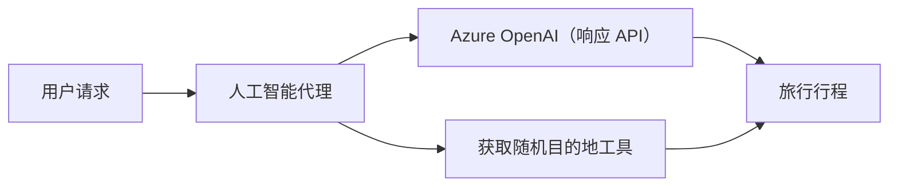

# 🌍 使用 Microsoft Agent Framework (.NET) 的 AI 旅游代理

## 📋 场景概述

本示例演示如何使用适用于 .NET 的 Microsoft Agent Framework 构建智能旅行规划代理。该代理可以自动生成面向全球随机目的地的个性化一日游行程。

### 主要功能：

- 🎲 <strong>随机目的地选择</strong>：使用自定义工具选择度假地点
- 🗺️ <strong>智能旅行规划</strong>：创建详细的每日行程安排
- 🔄 <strong>实时流式传输</strong>：支持即时和流式响应
- 🛠️ <strong>自定义工具集成</strong>：演示如何扩展代理功能

## 🔧 技术架构

### 核心技术

- **Microsoft Agent Framework**：用于 AI 代理开发的最新 .NET 实现
- **Azure OpenAI（响应 API）**：使用 Azure OpenAI 响应 API 执行模型推理
- **Azure 身份验证**：通过 `AzureCliCredential`（`az login`）实现安全登录
- <strong>安全配置</strong>：基于环境的端点管理

### 关键组件

1. **AIAgent**：管理对话流程的主要代理协调器
2. <strong>自定义工具</strong>：代理可调用的 `GetRandomDestination()` 函数
3. <strong>响应客户端</strong>：基于 Azure OpenAI 响应的对话接口
4. <strong>流式支持</strong>：实时响应生成能力

### 集成模式



## 🚀 快速开始

### 前置条件

- [.NET 10 SDK](https://dotnet.microsoft.com/download/dotnet/10.0) 或更高版本
- 拥有 Azure OpenAI 资源和模型部署的 [Azure 订阅](https://azure.microsoft.com/free/)
- [Azure CLI](https://learn.microsoft.com/cli/azure/install-azure-cli) — 使用 `az login` 登录

### 必需的环境变量

```bash
# zsh/bash
export AZURE_OPENAI_ENDPOINT=https://<your-resource>.openai.azure.com
export AZURE_OPENAI_DEPLOYMENT=gpt-5-mini
# 然后登录以便 AzureCliCredential 能获取令牌
az login
```

```powershell
# PowerShell
$env:AZURE_OPENAI_ENDPOINT = "https://<your-resource>.openai.azure.com"
$env:AZURE_OPENAI_DEPLOYMENT = "gpt-5-mini"
# 然后登录以便 AzureCliCredential 可以获取令牌
az login
```

### 示例代码

运行代码示例，

```bash
# zsh/bash
chmod +x ./01-dotnet-agent-framework.cs
./01-dotnet-agent-framework.cs
```

或使用 dotnet CLI：

```bash
dotnet run ./01-dotnet-agent-framework.cs
```

完整代码见 [`01-dotnet-agent-framework.cs`](../../../../01-intro-to-ai-agents/code_samples/01-dotnet-agent-framework.cs)。

```csharp
#!/usr/bin/dotnet run

#:package Microsoft.Extensions.AI@10.4.1
#:package Microsoft.Agents.AI.OpenAI@1.1.0
#:package Azure.AI.OpenAI@2.1.0
#:package Azure.Identity@1.13.1

using System.ComponentModel;

using Microsoft.Agents.AI;
using Microsoft.Extensions.AI;

using Azure.AI.OpenAI;
using Azure.Identity;

// Tool Function: Random Destination Generator
// This static method will be available to the agent as a callable tool
// The [Description] attribute helps the AI understand when to use this function
// This demonstrates how to create custom tools for AI agents
[Description("Provides a random vacation destination.")]
static string GetRandomDestination()
{
    // List of popular vacation destinations around the world
    // The agent will randomly select from these options
    var destinations = new List<string>
    {
        "Paris, France",
        "Tokyo, Japan",
        "New York City, USA",
        "Sydney, Australia",
        "Rome, Italy",
        "Barcelona, Spain",
        "Cape Town, South Africa",
        "Rio de Janeiro, Brazil",
        "Bangkok, Thailand",
        "Vancouver, Canada"
    };

    // Generate random index and return selected destination
    // Uses System.Random for simple random selection
    var random = new Random();
    int index = random.Next(destinations.Count);
    return destinations[index];
}

// Azure OpenAI with the Responses API (stable v1 endpoint). Sign in with `az login`.
var azureEndpoint = Environment.GetEnvironmentVariable("AZURE_OPENAI_ENDPOINT")
    ?? throw new InvalidOperationException("AZURE_OPENAI_ENDPOINT is not set.");
var deployment = Environment.GetEnvironmentVariable("AZURE_OPENAI_DEPLOYMENT") ?? "gpt-5-mini";

var azureClient = new AzureOpenAIClient(new Uri(azureEndpoint), new AzureCliCredential());

// Create AI Agent with Travel Planning Capabilities
// Get the Responses client for the specified deployment and create the AI agent
// Configure agent with travel planning instructions and random destination tool
// The agent can now plan trips using the GetRandomDestination function
AIAgent agent = azureClient
    .GetChatClient(deployment)
    .AsAIAgent(
        instructions: "You are a helpful AI Agent that can help plan vacations for customers at random destinations",
        tools: [AIFunctionFactory.Create(GetRandomDestination)]
    );

// Execute Agent: Plan a Day Trip
// Run the agent with streaming enabled for real-time response display
// Shows the agent's thinking and response as it generates the content
// Provides better user experience with immediate feedback
await foreach (var update in agent.RunStreamingAsync("Plan me a day trip"))
{
    await Task.Delay(10);
    Console.Write(update);
}
```

## 🎓 主要收获

1. <strong>代理架构</strong>：Microsoft Agent Framework 提供了在 .NET 中构建 AI 代理的清晰且类型安全的方法
2. <strong>工具集成</strong>：标有 `[Description]` 属性的函数成为代理可用的工具
3. <strong>配置管理</strong>：环境变量和安全凭据处理遵循 .NET 最佳实践
4. **Azure OpenAI 响应 API**：代理通过 Azure.AI.OpenAI SDK 使用 Azure OpenAI 响应 API

## 🔗 其他资源

- [Microsoft Agent Framework 文档](https://learn.microsoft.com/agent-framework)
- [Microsoft Foundry 的 Azure OpenAI](https://learn.microsoft.com/azure/ai-services/openai/)
- [Microsoft.Extensions.AI](https://learn.microsoft.com/dotnet/ai/microsoft-extensions-ai)
- [.NET 单文件应用](https://devblogs.microsoft.com/dotnet/announcing-dotnet-run-app)

---

<!-- CO-OP TRANSLATOR DISCLAIMER START -->
**免责声明**：
本文件由 AI 翻译服务 [Co-op Translator](https://github.com/Azure/co-op-translator) 翻译完成。尽管我们力求准确，但请注意，自动翻译可能包含错误或不准确之处。原始语言版文件应视为权威来源。对于重要信息，建议使用专业人工翻译。我们对因使用本翻译而产生的任何误解或误释不承担责任。
<!-- CO-OP TRANSLATOR DISCLAIMER END -->