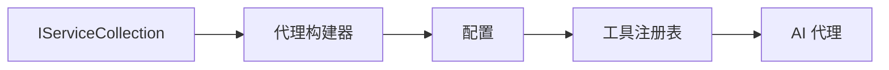

# 🎨 使用 Azure OpenAI （Responses API） 的智能代理设计模式（.NET）

## 📋 学习目标

本示例演示了使用 .NET 中的 Microsoft Agent Framework 结合 Azure OpenAI （Responses API）集成构建智能代理的企业级设计模式。您将学习专业的模式和架构方法，使代理具备生产准备、易维护和可扩展的能力。

### 企业设计模式

- 🏭 <strong>工厂模式</strong>：使用依赖注入实现标准化的代理创建
- 🔧 <strong>生成器模式</strong>：流畅的代理配置与设置
- 🧵 <strong>线程安全模式</strong>：并发对话管理
- 📋 <strong>仓储模式</strong>：有序的工具和能力管理

## 🎯 .NET 特定的架构优势

### 企业功能

- <strong>强类型</strong>：编译时验证与智能感知支持
- <strong>依赖注入</strong>：内置 DI 容器集成
- <strong>配置管理</strong>：IConfiguration 和选项模式
- **异步/等待**：一流的异步编程支持

### 生产就绪模式

- <strong>日志集成</strong>：ILogger 与结构化日志支持
- <strong>健康检查</strong>：内置监控与诊断
- <strong>配置验证</strong>：带数据注解的强类型
- <strong>错误处理</strong>：结构化异常管理

## 🔧 技术架构

### 核心 .NET 组件

- **Microsoft.Extensions.AI**：统一的 AI 服务抽象
- **Microsoft.Agents.AI**：企业级代理编排框架
- **Azure OpenAI（Responses API）**：高性能 API 客户端模式
- <strong>配置系统</strong>：appsettings.json 和环境集成

### 设计模式实现



## 🏗️ 展示的企业模式

### 1. <strong>创建型模式</strong>

- <strong>代理工厂</strong>：集中式代理创建及一致配置
- <strong>生成器模式</strong>：复杂代理配置的流式 API
- <strong>单例模式</strong>：共享资源与配置管理
- <strong>依赖注入</strong>：松耦合与易测试

### 2. <strong>行为型模式</strong>

- <strong>策略模式</strong>：可替换的工具执行策略
- <strong>命令模式</strong>：封装的代理操作支持撤销/重做
- <strong>观察者模式</strong>：事件驱动的代理生命周期管理
- <strong>模板方法</strong>：标准化代理执行工作流

### 3. <strong>结构型模式</strong>

- <strong>适配器模式</strong>：Azure OpenAI（Responses API）集成层
- <strong>装饰器模式</strong>：增强代理能力
- <strong>外观模式</strong>：简化代理交互接口
- <strong>代理模式</strong>：延迟加载与缓存以提升性能

## 📚 .NET 设计原则

### SOLID 原则

- <strong>单一职责</strong>：每个组件只有一个明确职责
- <strong>开闭原则</strong>：可扩展而无需修改
- <strong>里氏替换</strong>：基于接口的工具实现
- <strong>接口隔离</strong>：专注且内聚的接口
- <strong>依赖倒置</strong>：依赖抽象而非具体实现

### 清晰架构

- <strong>领域层</strong>：核心代理和工具抽象
- <strong>应用层</strong>：代理编排与工作流
- <strong>基础设施层</strong>：Azure OpenAI（Responses API）集成及外部服务
- <strong>表现层</strong>：用户交互和响应格式化

## 🔒 企业级注意事项

### 安全性

- <strong>凭证管理</strong>：使用 IConfiguration 安全处理 API 密钥
- <strong>输入验证</strong>：强类型与数据注解验证
- <strong>输出净化</strong>：安全的响应处理与过滤
- <strong>审计日志</strong>：全面的操作跟踪

### 性能

- <strong>异步模式</strong>：非阻塞 I/O 操作
- <strong>连接池</strong>：高效的 HTTP 客户端管理
- <strong>缓存</strong>：响应缓存以提升性能
- <strong>资源管理</strong>：合适的释放与清理模式

### 可扩展性

- <strong>线程安全</strong>：支持并发代理执行
- <strong>资源池</strong>：高效利用资源
- <strong>负载管理</strong>：限流与背压处理
- <strong>监控</strong>：性能指标与健康检查

## 🚀 生产部署

- <strong>配置管理</strong>：环境特定设置
- <strong>日志策略</strong>：带关联 ID 的结构化日志
- <strong>错误处理</strong>：全局异常处理与合适的恢复
- <strong>监控</strong>：应用洞察与性能计数器
- <strong>测试</strong>：单元测试、集成测试和负载测试模式

准备好用 .NET 构建企业级智能代理了吗？让我们共同设计一个强健的架构！🏢✨

## 🚀 入门指南

### 前置条件

- [.NET 10 SDK](https://dotnet.microsoft.com/download/dotnet/10.0) 或更高版本
- 拥有一个带有 Azure OpenAI 资源和模型部署的 [Azure 订阅](https://azure.microsoft.com/free/)
- 安装 [Azure CLI](https://learn.microsoft.com/cli/azure/install-azure-cli) — 使用 `az login` 登录

### 必需的环境变量

```bash
# zsh/bash
export AZURE_OPENAI_ENDPOINT=https://<your-resource>.openai.azure.com
export AZURE_OPENAI_DEPLOYMENT=gpt-5-mini
# 然后登录，以便 AzureCliCredential 可以获取令牌
az login
```

```powershell
# PowerShell
$env:AZURE_OPENAI_ENDPOINT = "https://<your-resource>.openai.azure.com"
$env:AZURE_OPENAI_DEPLOYMENT = "gpt-5-mini"
# 然后登录，以便 AzureCliCredential 可以获取令牌
az login
```

### 示例代码

运行以下代码示例，

```bash
# zsh/bash
chmod +x ./03-dotnet-agent-framework.cs
./03-dotnet-agent-framework.cs
```

或使用 dotnet CLI：

```bash
dotnet run ./03-dotnet-agent-framework.cs
```

完整代码见 [`03-dotnet-agent-framework.cs`](../../../../03-agentic-design-patterns/code_samples/03-dotnet-agent-framework.cs)。

```csharp
#!/usr/bin/dotnet run

#:package Microsoft.Extensions.AI@10.*
#:package Microsoft.Agents.AI.OpenAI@1.*-*
#:package Azure.AI.OpenAI@2.1.0
#:package Azure.Identity@1.13.1

using System.ComponentModel;

using Microsoft.Agents.AI;
using Microsoft.Extensions.AI;

using Azure.AI.OpenAI;
using Azure.Identity;

// Tool Function: Random Destination Generator
// This static method will be available to the agent as a callable tool
// The [Description] attribute helps the AI understand when to use this function
// This demonstrates how to create custom tools for AI agents
[Description("Provides a random vacation destination.")]
static string GetRandomDestination()
{
    // List of popular vacation destinations around the world
    // The agent will randomly select from these options
    var destinations = new List<string>
    {
        "Paris, France",
        "Tokyo, Japan",
        "New York City, USA",
        "Sydney, Australia",
        "Rome, Italy",
        "Barcelona, Spain",
        "Cape Town, South Africa",
        "Rio de Janeiro, Brazil",
        "Bangkok, Thailand",
        "Vancouver, Canada"
    };

    // Generate random index and return selected destination
    // Uses System.Random for simple random selection
    var random = new Random();
    int index = random.Next(destinations.Count);
    return destinations[index];
}

// Azure OpenAI with the Responses API (stable v1 endpoint). Sign in with `az login`.
var azureEndpoint = Environment.GetEnvironmentVariable("AZURE_OPENAI_ENDPOINT")
    ?? throw new InvalidOperationException("AZURE_OPENAI_ENDPOINT is not set.");
var deployment = Environment.GetEnvironmentVariable("AZURE_OPENAI_DEPLOYMENT") ?? "gpt-5-mini";

var azureClient = new AzureOpenAIClient(new Uri(azureEndpoint), new AzureCliCredential());

// Define Agent Identity and Comprehensive Instructions
// Agent name for identification and logging purposes
var AGENT_NAME = "TravelAgent";

// Detailed instructions that define the agent's personality, capabilities, and behavior
// This system prompt shapes how the agent responds and interacts with users
var AGENT_INSTRUCTIONS = """
You are a helpful AI Agent that can help plan vacations for customers.

Important: When users specify a destination, always plan for that location. Only suggest random destinations when the user hasn't specified a preference.

When the conversation begins, introduce yourself with this message:
"Hello! I'm your TravelAgent assistant. I can help plan vacations and suggest interesting destinations for you. Here are some things you can ask me:
1. Plan a day trip to a specific location
2. Suggest a random vacation destination
3. Find destinations with specific features (beaches, mountains, historical sites, etc.)
4. Plan an alternative trip if you don't like my first suggestion

What kind of trip would you like me to help you plan today?"

Always prioritize user preferences. If they mention a specific destination like "Bali" or "Paris," focus your planning on that location rather than suggesting alternatives.
""";

// Create AI Agent with Advanced Travel Planning Capabilities
// Get the Responses client for the deployment and create the AI agent
// Configure agent with name, detailed instructions, and available tools
// This demonstrates the .NET agent creation pattern with full configuration
AIAgent agent = azureClient
    .GetChatClient(deployment)
    .AsAIAgent(
        name: AGENT_NAME,
        instructions: AGENT_INSTRUCTIONS,
        tools: [AIFunctionFactory.Create(GetRandomDestination)]
    );

// Create New Conversation Session for Context Management
// Initialize a new conversation session to maintain context across multiple interactions
// Sessions enable the agent to remember previous exchanges and maintain conversational state
// This is essential for multi-turn conversations and contextual understanding
var session = await agent.CreateSessionAsync();

// Execute Agent: First Travel Planning Request
// Run the agent with an initial request that will likely trigger the random destination tool
// The agent will analyze the request, use the GetRandomDestination tool, and create an itinerary
// Using the session parameter maintains conversation context for subsequent interactions
await foreach (var update in agent.RunStreamingAsync("Plan me a day trip", session))
{
    await Task.Delay(10);
    Console.Write(update);
}

Console.WriteLine();

// Execute Agent: Follow-up Request with Context Awareness
// Demonstrate contextual conversation by referencing the previous response
// The agent remembers the previous destination suggestion and will provide an alternative
// This showcases the power of conversation sessions and contextual understanding in .NET agents
await foreach (var update in agent.RunStreamingAsync("I don't like that destination. Plan me another vacation.", session))
{
    await Task.Delay(10);
    Console.Write(update);
}
```

---

<!-- CO-OP TRANSLATOR DISCLAIMER START -->
**免责声明**：
本文件由 AI 翻译服务 [Co-op Translator](https://github.com/Azure/co-op-translator) 翻译完成。尽管我们力求准确，但请注意，自动翻译可能包含错误或不准确之处。原始语言版文件应视为权威来源。对于重要信息，建议使用专业人工翻译。我们对因使用本翻译而产生的任何误解或误释不承担责任。
<!-- CO-OP TRANSLATOR DISCLAIMER END -->