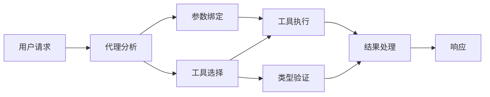

# 🛠️ 使用 Azure OpenAI（Responses API）进行高级工具使用 (.NET)

## 📋 学习目标

本笔记本演示了在 .NET 中使用 Microsoft Agent Framework 和 Azure OpenAI（Responses API）实现企业级工具集成模式。您将学习如何使用多种专业工具构建复杂的代理，利用 C# 的强类型和 .NET 的企业特性。

### 您将掌握的高级工具能力

- 🔧 <strong>多工具架构</strong>：构建具有多种专业能力的代理
- 🎯 <strong>类型安全的工具执行</strong>：利用 C# 的编译时验证
- 📊 <strong>企业级工具模式</strong>：生产准备的工具设计和错误处理
- 🔗 <strong>工具组合</strong>：组合工具以实现复杂业务流程

## 🎯 .NET 工具架构优势

### 企业级工具特性

- <strong>编译时验证</strong>：强类型确保工具参数正确性
- <strong>依赖注入</strong>：IoC 容器集成实现工具管理
- **异步/等待模式**：非阻塞工具执行及资源管理
- <strong>结构化日志</strong>：内置日志集成用于工具执行监控

### 生产就绪模式

- <strong>异常处理</strong>：带类型异常的全面错误管理
- <strong>资源管理</strong>：规范释放模式和内存管理
- <strong>性能监测</strong>：内置指标和性能计数器
- <strong>配置管理</strong>：带验证的类型安全配置

## 🔧 技术架构

### 核心 .NET 工具组件

- **Microsoft.Extensions.AI**：统一的工具抽象层
- **Microsoft.Agents.AI**：企业级工具编排
- **Azure OpenAI（Responses API）**：高性能 API 客户端，支持连接池

### 工具执行管道



## 🛠️ 工具类别和模式

### 1. <strong>数据处理工具</strong>

- <strong>输入验证</strong>：带数据注解的强类型
- <strong>转换操作</strong>：类型安全的数据转换与格式化
- <strong>业务逻辑</strong>：领域特定的计算与分析工具
- <strong>输出格式化</strong>：结构化响应生成

### 2. <strong>集成工具</strong>

- **API 连接器**：使用 HttpClient 进行 RESTful 服务集成
- <strong>数据库工具</strong>：使用 Entity Framework 进行数据访问
- <strong>文件操作</strong>：带验证的安全文件系统操作
- <strong>外部服务</strong>：第三方服务集成模式

### 3. <strong>通用工具</strong>

- <strong>文本处理</strong>：字符串操作与格式化工具
- **日期/时间操作**：文化感知的日期/时间计算
- <strong>数学工具</strong>：精确计算与统计操作
- <strong>验证工具</strong>：业务规则验证与数据校验

准备好在 .NET 中构建具有强大类型安全工具能力的企业级代理了吗？让我们一起设计专业级解决方案！🏢⚡

## 🚀 快速开始

### 前置条件

- [.NET 10 SDK](https://dotnet.microsoft.com/download/dotnet/10.0) 或更高版本
- 一个包含 Azure OpenAI 资源及模型部署的 [Azure 订阅](https://azure.microsoft.com/free/)
- [Azure CLI](https://learn.microsoft.com/cli/azure/install-azure-cli) —— 使用 `az login` 登录

### 必需的环境变量

```bash
# zsh/bash
export AZURE_OPENAI_ENDPOINT=https://<your-resource>.openai.azure.com
export AZURE_OPENAI_DEPLOYMENT=gpt-5-mini
# 然后登录，以便 AzureCliCredential 可以获取令牌
az login
```

```powershell
# PowerShell
$env:AZURE_OPENAI_ENDPOINT = "https://<your-resource>.openai.azure.com"
$env:AZURE_OPENAI_DEPLOYMENT = "gpt-5-mini"
# 然后登录，以便 AzureCliCredential 可以获取令牌
az login
```

### 示例代码

运行以下代码示例，

```bash
# zsh/bash
chmod +x ./04-dotnet-agent-framework.cs
./04-dotnet-agent-framework.cs
```

或使用 dotnet CLI：

```bash
dotnet run ./04-dotnet-agent-framework.cs
```

完整代码见 [`04-dotnet-agent-framework.cs`](../../../../04-tool-use/code_samples/04-dotnet-agent-framework.cs)。

```csharp
#!/usr/bin/dotnet run

#:package Microsoft.Extensions.AI@10.*
#:package Microsoft.Agents.AI.OpenAI@1.*-*
#:package Azure.AI.OpenAI@2.1.0
#:package Azure.Identity@1.13.1

using System.ComponentModel;

using Microsoft.Agents.AI;
using Microsoft.Extensions.AI;

using Azure.AI.OpenAI;
using Azure.Identity;

// Tool Function: Random Destination Generator
// This static method will be available to the agent as a callable tool
// The [Description] attribute helps the AI understand when to use this function
// This demonstrates how to create custom tools for AI agents
[Description("Provides a random vacation destination.")]
static string GetRandomDestination()
{
    // List of popular vacation destinations around the world
    // The agent will randomly select from these options
    var destinations = new List<string>
    {
        "Paris, France",
        "Tokyo, Japan",
        "New York City, USA",
        "Sydney, Australia",
        "Rome, Italy",
        "Barcelona, Spain",
        "Cape Town, South Africa",
        "Rio de Janeiro, Brazil",
        "Bangkok, Thailand",
        "Vancouver, Canada"
    };

    // Generate random index and return selected destination
    // Uses System.Random for simple random selection
    var random = new Random();
    int index = random.Next(destinations.Count);
    return destinations[index];
}

// Azure OpenAI with the Responses API (stable v1 endpoint). Sign in with `az login`.
var azureEndpoint = Environment.GetEnvironmentVariable("AZURE_OPENAI_ENDPOINT")
    ?? throw new InvalidOperationException("AZURE_OPENAI_ENDPOINT is not set.");
var deployment = Environment.GetEnvironmentVariable("AZURE_OPENAI_DEPLOYMENT") ?? "gpt-5-mini";

var azureClient = new AzureOpenAIClient(new Uri(azureEndpoint), new AzureCliCredential());

// Define Agent Identity and Comprehensive Instructions
// Agent name for identification and logging purposes
var AGENT_NAME = "TravelAgent";

// Detailed instructions that define the agent's personality, capabilities, and behavior
// This system prompt shapes how the agent responds and interacts with users
var AGENT_INSTRUCTIONS = """
You are a helpful AI Agent that can help plan vacations for customers.

Important: When users specify a destination, always plan for that location. Only suggest random destinations when the user hasn't specified a preference.

When the conversation begins, introduce yourself with this message:
"Hello! I'm your TravelAgent assistant. I can help plan vacations and suggest interesting destinations for you. Here are some things you can ask me:
1. Plan a day trip to a specific location
2. Suggest a random vacation destination
3. Find destinations with specific features (beaches, mountains, historical sites, etc.)
4. Plan an alternative trip if you don't like my first suggestion

What kind of trip would you like me to help you plan today?"

Always prioritize user preferences. If they mention a specific destination like "Bali" or "Paris," focus your planning on that location rather than suggesting alternatives.
""";

// Create AI Agent with Advanced Travel Planning Capabilities
// Get the Responses client for the deployment and create the AI agent
// Configure agent with name, detailed instructions, and available tools
// This demonstrates the .NET agent creation pattern with full configuration
AIAgent agent = azureClient
    .GetChatClient(deployment)
    .AsAIAgent(
        name: AGENT_NAME,
        instructions: AGENT_INSTRUCTIONS,
        tools: [AIFunctionFactory.Create(GetRandomDestination)]
    );

// Create New Conversation Session for Context Management
// Initialize a new conversation session to maintain context across multiple interactions
// Sessions enable the agent to remember previous exchanges and maintain conversational state
// This is essential for multi-turn conversations and contextual understanding
await using var session = await agent.CreateSessionAsync();

// Execute Agent: First Travel Planning Request
// Run the agent with an initial request that will likely trigger the random destination tool
// The agent will analyze the request, use the GetRandomDestination tool, and create an itinerary
// Using the session parameter maintains conversation context for subsequent interactions
await foreach (var update in agent.RunStreamingAsync("Plan me a day trip", session))
{
    await Task.Delay(10);
    Console.Write(update);
}

Console.WriteLine();

// Execute Agent: Follow-up Request with Context Awareness
// Demonstrate contextual conversation by referencing the previous response
// The agent remembers the previous destination suggestion and will provide an alternative
// This showcases the power of conversation sessions and contextual understanding in .NET agents
await foreach (var update in agent.RunStreamingAsync("I don't like that destination. Plan me another vacation.", session))
{
    await Task.Delay(10);
    Console.Write(update);
}
```

---

<!-- CO-OP TRANSLATOR DISCLAIMER START -->
**免责声明**：
本文件由 AI 翻译服务 [Co-op Translator](https://github.com/Azure/co-op-translator) 翻译完成。尽管我们力求准确，但请注意，自动翻译可能包含错误或不准确之处。原始语言版文件应视为权威来源。对于重要信息，建议使用专业人工翻译。我们对因使用本翻译而产生的任何误解或误释不承担责任。
<!-- CO-OP TRANSLATOR DISCLAIMER END -->