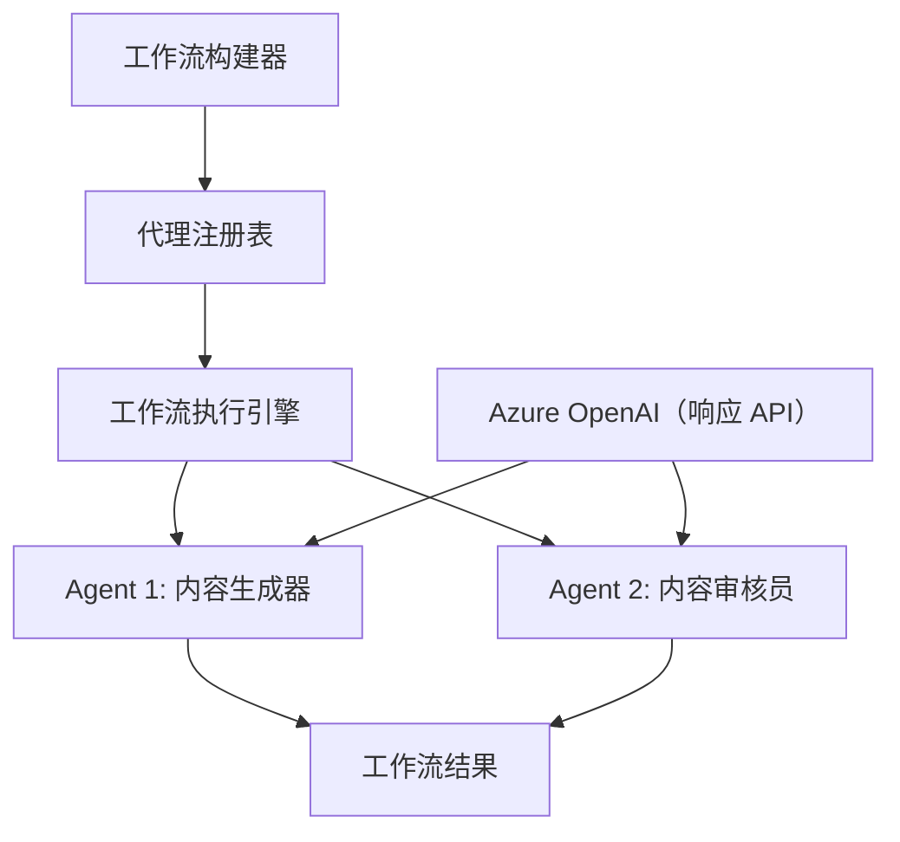

# 🔄 使用 Azure OpenAI（Responses API）的基础代理工作流（.NET）

## 📋 工作流编排教程

本笔记本演示如何使用 Microsoft Agent Framework for .NET 和 Azure OpenAI（Responses API）构建复杂的<strong>代理工作流</strong>。您将学习创建多步骤业务流程，其中 AI 代理通过结构化的编排模式协作完成复杂任务。

## 🎯 学习目标

### 🏗️ <strong>工作流架构基础</strong>
- <strong>工作流构建器</strong>：设计和编排复杂的多步骤 AI 过程
- <strong>代理协调</strong>：在工作流中协调多个专门化代理
- **Azure OpenAI（Responses API）**：在工作流中利用 Azure OpenAI Responses API
- <strong>可视化工作流设计</strong>：创建和可视化工作流结构以便更好理解

### 🔄 <strong>流程编排模式</strong>
- <strong>顺序处理</strong>：按逻辑顺序串联多个代理任务
- <strong>状态管理</strong>：维护跨工作流阶段的上下文和数据流
- <strong>错误处理</strong>：实现强健的错误恢复和工作流弹性
- <strong>性能优化</strong>：设计高效的企业级工作流

### 🏢 <strong>企业工作流应用</strong>
- <strong>业务流程自动化</strong>：自动化复杂的组织工作流
- <strong>内容生产管线</strong>：包含审核和审批阶段的编辑工作流
- <strong>客户服务自动化</strong>：多步骤的客户咨询解决流程
- <strong>数据处理工作流</strong>：带 AI 驱动转换的 ETL 工作流

## ⚙️ 先决条件与设置

### 📦 **所需 NuGet 包**

此工作流演示使用了几个关键的 .NET 包：

```xml
<!-- Core AI Framework -->
<PackageReference Include="Microsoft.Extensions.AI" Version="10.*" />

<!-- Azure OpenAI (Responses API) -->
<PackageReference Include="Azure.AI.OpenAI" Version="2.1.0" />
<PackageReference Include="Azure.Identity" Version="1.15.0" />

<!-- Agent Framework (Local Development) -->
<!-- Microsoft.Agents.AI.dll - Core agent abstractions -->
<!-- Microsoft.Agents.AI.OpenAI.dll - Azure OpenAI (Responses API) integration -->

<!-- Configuration and Environment -->
<PackageReference Include="DotNetEnv" Version="3.1.1" />
```

### 🔑 **Azure OpenAI 配置**

**环境设置（.env 文件）：**
```env
AZURE_OPENAI_ENDPOINT=https://<your-resource>.openai.azure.com
AZURE_OPENAI_DEPLOYMENT=gpt-5-mini
```

**Azure OpenAI 访问：**
1. 在 Azure 门户中创建 Azure OpenAI 资源
2. 部署一个模型（例如 `gpt-5-mini`）并记下部署名称
3. 使用 `az login` 登录，并按上述方式配置环境变量

### 🏗️ <strong>工作流架构概览</strong>



**关键组件：**
- **WorkflowBuilder**：设计工作流的主要编排引擎
- **AIAgent**：具有特定能力的独立专业代理
- **Azure OpenAI 客户端**：Azure OpenAI Responses API 集成
- <strong>执行上下文</strong>：管理工作流阶段之间的状态和数据流

## 🎨 <strong>企业工作流设计模式</strong>

### 📝 <strong>内容生产工作流</strong>
```
User Request → Content Generation → Quality Review → Final Output
```

### 🔍 <strong>文档处理管线</strong>
```
Document Input → Analysis → Extraction → Validation → Structured Output
```

### 💼 <strong>商业智能工作流</strong>
```
Data Collection → Processing → Analysis → Report Generation → Distribution
```

### 🤝 <strong>客户服务自动化</strong>
```
Customer Inquiry → Classification → Processing → Response Generation → Follow-up
```

## 🏢 <strong>企业优势</strong>

### 🎯 <strong>可靠性与可扩展性</strong>
- <strong>确定性执行</strong>：一致、可重复的工作流结果
- <strong>错误恢复</strong>：在任何工作流阶段优雅地处理失败
- <strong>性能监控</strong>：跟踪执行指标和优化机会
- <strong>资源管理</strong>：高效分配和利用 AI 模型资源

### 🔒 <strong>安全性与合规性</strong>
- <strong>安全认证</strong>：通过 `az login` 使用 Microsoft Entra ID 认证（AzureCliCredential）
- <strong>审计跟踪</strong>：完整记录工作流执行和决策点
- <strong>访问控制</strong>：针对工作流执行和监控的细粒度权限
- <strong>数据隐私</strong>：在整个工作流中安全处理敏感信息

### 📊 <strong>可观察性与管理</strong>
- <strong>可视化工作流设计</strong>：清晰表现流程流向和依赖关系
- <strong>执行监控</strong>：实时跟踪工作流进展和性能
- <strong>错误报告</strong>：详细的错误分析和调试能力
- <strong>性能分析</strong>：用于优化和容量规划的指标

让我们构建您的首个面向企业的 AI 工作流！🚀

## 💻 运行代码

完整实现可见于 `01.dotnet-agent-framework-workflow-ghmodel-basic.cs`。该文件展示了：

1. <strong>环境配置</strong> — 从 `.env` 文件加载 Azure OpenAI 配置
2. **Azure OpenAI 客户端设置** — 配置客户端以使用 Azure OpenAI Responses API
3. <strong>代理创建</strong> — 定义专业代理（前台和礼宾）
4. <strong>工作流构建器</strong> — 创建带顺序处理的多代理工作流
5. <strong>工作流执行</strong> — 使用流式结果运行工作流

### 🚀 运行示例

```bash
# 使脚本可执行（Unix/Linux/macOS）
chmod +x 01.dotnet-agent-framework-workflow-ghmodel-basic.cs

# 运行工作流程
./01.dotnet-agent-framework-workflow-ghmodel-basic.cs
```

或在 Windows 上：
```powershell
dotnet run 01.dotnet-agent-framework-workflow-ghmodel-basic.cs
```

### 📝 预期输出

工作流将：
1. 接受您的旅行目的地请求（“我想去巴黎”）
2. 前台代理提供初步推荐
3. 礼宾代理审查并完善推荐
4. 最终输出显示完整对话流

### 🔧 自定义

您可以通过以下方式自定义工作流：
- 修改代理指令以改变其行为
- 添加更多代理以创建复杂的多步骤工作流
- 更改用户消息以测试不同场景
- 调整工作流边缘以创建不同的执行模式

---

<!-- CO-OP TRANSLATOR DISCLAIMER START -->
**免责声明**：
本文件由 AI 翻译服务 [Co-op Translator](https://github.com/Azure/co-op-translator) 翻译完成。尽管我们力求准确，但请注意，自动翻译可能包含错误或不准确之处。原始语言版文件应视为权威来源。对于重要信息，建议使用专业人工翻译。我们对因使用本翻译而产生的任何误解或误释不承担责任。
<!-- CO-OP TRANSLATOR DISCLAIMER END -->