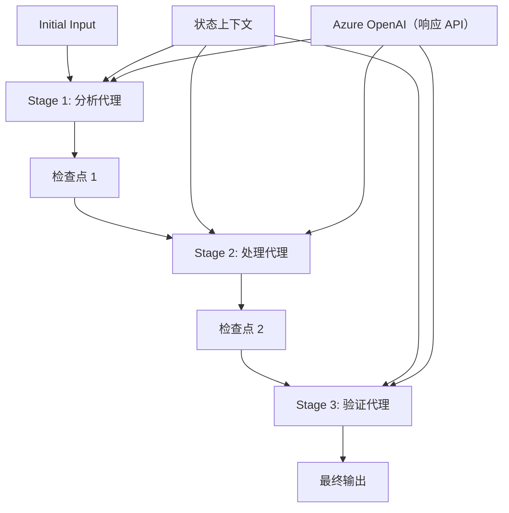

# ⏩ 使用 Azure OpenAI （Responses API）进行顺序代理工作流（.NET）

## 📋 高级顺序处理教程

本笔记本演示了如何使用 .NET 的 Microsoft Agent Framework 和 Azure OpenAI（Responses API）实现<strong>顺序工作流模式</strong>。您将学习如何构建复杂的逐步处理流水线，代理按特定顺序执行，每个阶段基于前一阶段的结果展开。

## 🎯 学习目标

### 🔄 <strong>顺序处理架构</strong>
- <strong>线性工作流设计</strong>：创建具有清晰依赖关系的逐步处理流水线
- <strong>状态管理</strong>：维护跨顺序工作流阶段的上下文和数据流
- **Azure OpenAI（Responses API）**：在多阶段 .NET 工作流中利用 Azure OpenAI 模型
- <strong>企业流水线模式</strong>：构建可用于生产的顺序处理系统

### 🏗️ <strong>高级顺序模式</strong>
- <strong>阶段门控处理</strong>：在工作流阶段间实现验证检查点
- <strong>上下文保留</strong>：维护所有阶段的状态和累积知识
- <strong>错误传播</strong>：优雅地处理顺序处理链中的失败
- <strong>性能优化</strong>：高效的顺序执行，开销最小化

### 🏢 <strong>企业顺序应用</strong>
- <strong>文档处理流水线</strong>：多阶段文档分析、转换和验证
- <strong>质量保证工作流</strong>：顺序审核、验证和审批流程
- <strong>内容生产流水线</strong>：调研 → 写作 → 编辑 → 审核 → 发布
- <strong>业务流程自动化</strong>：具有明确阶段依赖关系的多步骤业务工作流

## ⚙️ 前置条件与设置

### 📦 **必备 NuGet 包**

.NET 顺序工作流所需的核心包：

```xml
<!-- Core AI Framework -->
<PackageReference Include="Microsoft.Extensions.AI" Version="10.*" />

<!-- Azure OpenAI (Responses API) -->
<PackageReference Include="Azure.AI.OpenAI" Version="2.*" />

<!-- Azure Identity and Async LINQ Support -->
<PackageReference Include="Azure.Identity" Version="1.15.0" />
<PackageReference Include="System.Linq.Async" Version="6.0.3" />

<!-- Local Agent Framework References -->
<!-- Microsoft.Agents.AI.dll - Core agent abstractions -->
<!-- Microsoft.Agents.AI.OpenAI.dll - Azure OpenAI (Responses API) integration -->
```

### 🔑 **Azure OpenAI 配置**

**环境设置（.env 文件）：**
```env
AZURE_OPENAI_ENDPOINT=https://<your-resource>.openai.azure.com
AZURE_OPENAI_DEPLOYMENT=gpt-5-mini
```

**配置管理：**
```csharp
// Load environment variables securely
Env.Load("../../../.env");
var azureEndpoint = Environment.GetEnvironmentVariable("AZURE_OPENAI_ENDPOINT");
var deployment = Environment.GetEnvironmentVariable("AZURE_OPENAI_DEPLOYMENT");
```

### 🏗️ <strong>顺序工作流架构</strong>



**关键组件：**
- <strong>顺序代理</strong>：为每个处理阶段提供专门代理
- <strong>状态上下文</strong>：维护跨阶段的累积数据和决策
- <strong>检查点</strong>：阶段间的验证点，确保质量和一致性
- **Azure OpenAI 客户端**：所有工作流阶段一致访问 AI 模型

## 🎨 <strong>顺序工作流设计模式</strong>

### 📝 <strong>文档处理流水线</strong>
```
Raw Document → Content Extraction → Analysis → Validation → Structured Output
```

### 🎯 <strong>内容创作工作流</strong>
```
Brief/Requirements → Research → Content Creation → Review → Final Polish
```

### 🔍 <strong>质量保证流水线</strong>
```
Initial Review → Technical Validation → Compliance Check → Final Approval
```

### 💼 <strong>商业智能工作流</strong>
```
Data Collection → Processing → Analysis → Report Generation → Distribution
```

## 🏢 <strong>企业顺序优势</strong>

### 🎯 <strong>可靠性与质量</strong>
- <strong>确定性处理</strong>：通过结构化阶段实现一致且可重复的结果
- <strong>质量关卡</strong>：验证检查点确保各阶段质量
- <strong>错误隔离</strong>：一阶段的问题不传播至后续阶段
- <strong>审计跟踪</strong>：完整跟踪每个阶段的决策和转换

### 📈 <strong>可扩展性与性能</strong>
- <strong>模块化设计</strong>：各阶段可独立优化
- <strong>资源管理</strong>：跨阶段高效分配 AI 模型资源
- <strong>状态优化</strong>：各阶段间最小化状态传递以优化性能
- <strong>并行阶段组</strong>：允许多个顺序工作流并行运行

### 🔒 <strong>安全性与合规性</strong>
- <strong>阶段级安全</strong>：不同处理阶段应用不同安全策略
- <strong>数据验证</strong>：确保每个检查点数据完整和合规
- <strong>访问控制</strong>：对不同工作流阶段实施细粒度权限
- <strong>法规合规</strong>：通过结构化处理满足法规要求

### 📊 <strong>监控与分析</strong>
- <strong>阶段级指标</strong>：监控每个工作流阶段性能
- <strong>瓶颈识别</strong>：识别并优化缓慢阶段
- <strong>质量指标</strong>：跟踪每阶段的质量和成功率
- <strong>流程优化</strong>：基于阶段级分析不断改进

让我们一起构建稳健的顺序 AI 处理流水线！🚀

## 💻 运行代码

完整实现见 `02.dotnet-agent-framework-workflow-ghmodel-sequential.cs`。该文件展示了一个<strong>三阶段家具分析工作流</strong>：

1. **阶段 1 - 销售代理**：分析家具图片并提供购买建议
2. **阶段 2 - 价格代理**：提供详细价格细目和预算选项
3. **阶段 3 - 报价代理**：生成专业的 Markdown 格式报价文档

### 🏗️ <strong>工作流架构</strong>

```
Image Input → Sales Analysis → Price Estimation → Quote Generation → Final Output
```

每个代理：
- 接收前一阶段的输出作为上下文
- 利用专业知识构建前期分析结果
- 通过状态管理保持工作流连续性

### 🚀 运行示例

**前置条件：**
- 将家具图片放在 `../imgs/home.png`（或更新 `imgPath` 变量）
- 配置 `.env` 文件，包含 Azure OpenAI 端点和部署信息，然后执行 `az login` 登录

```bash
# 使脚本可执行（Unix/Linux/macOS）
chmod +x 02.dotnet-agent-framework-workflow-ghmodel-sequential.cs

# 运行顺序工作流
./02.dotnet-agent-framework-workflow-ghmodel-sequential.cs
```

或在 Windows：
```powershell
dotnet run 02.dotnet-agent-framework-workflow-ghmodel-sequential.cs
```

### 📝 预期输出

工作流将：
1. <strong>销售代理</strong>：从图片识别家具项目并提供建议
2. <strong>价格代理</strong>：增加详细定价分析，包含预算级别和购物建议
3. <strong>报价代理</strong>：生成包含所有信息综合的格式化报价文档

最终输出将是基于图片分析的全面、专业家具报价单。

### 🔧 自定义选项

**修改代理行为：**
```csharp
// Adjust agent instructions to change their focus
const string SalesAgentInstructions = "Your custom instructions...";
```

**更改顺序流程：**
```csharp
// Add or reorder workflow stages
var workflow = new WorkflowBuilder(salesagent)
    .AddEdge(salesagent, priceagent)
    .AddEdge(priceagent, quoteagent)
    .AddEdge(quoteagent, newAgent)  // Add another stage
    .Build();
```

**使用不同输入：**
```csharp
// Process text instead of images
ChatMessage userMessage = new ChatMessage(ChatRole.User, [
    new TextContent("Analyze pricing for a modern living room set")
]);
```

### 🎯 真实应用场景

该顺序模式适用于：
- <strong>电子商务</strong>：产品分析 → 定价 → 报价生成
- <strong>房地产</strong>：物业分析 → 估价 → 上架创建
- <strong>保险</strong>：理赔分析 → 评估 → 报价生成
- <strong>内容创作</strong>：调研 → 写作 → 编辑 → 发布

### 🔍 理解状态流

顺序中每个代理接收：
- <strong>原始输入</strong>：初始用户消息（图片+文本）
- <strong>前序代理输出</strong>：会话历史中所有先前代理响应
- <strong>累积上下文</strong>：贯穿工作流的完整状态维护

这使得多阶段复杂处理成为可能，每个代理基于全部前序阶段的综合上下文进行构建。

---

<!-- CO-OP TRANSLATOR DISCLAIMER START -->
**免责声明**：
本文件由 AI 翻译服务 [Co-op Translator](https://github.com/Azure/co-op-translator) 翻译完成。尽管我们力求准确，但请注意，自动翻译可能包含错误或不准确之处。原始语言版文件应视为权威来源。对于重要信息，建议使用专业人工翻译。我们对因使用本翻译而产生的任何误解或误释不承担责任。
<!-- CO-OP TRANSLATOR DISCLAIMER END -->