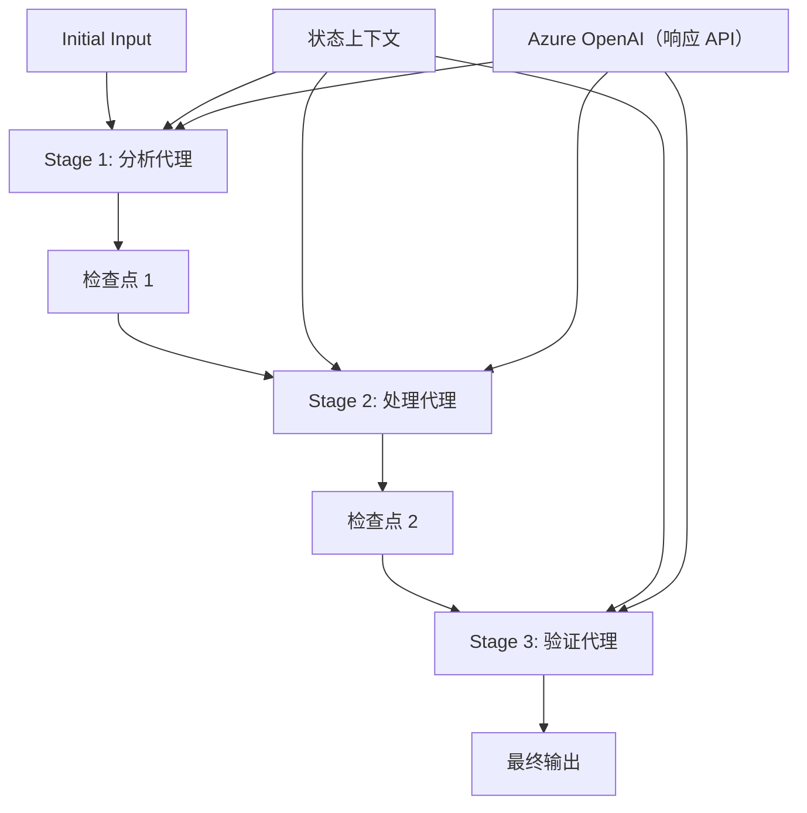

# ⏩ 使用 Azure OpenAI（Responses API）进行顺序代理工作流（.NET）

## 📋 高级顺序处理教程

本笔记本演示了使用 Microsoft Agent Framework for .NET 和 Azure OpenAI（Responses API）的<strong>顺序工作流模式</strong>。您将学习如何构建复杂的逐步处理管道，其中代理按特定顺序执行，每个阶段基于前一阶段的结果。

## 🎯 学习目标

### 🔄 <strong>顺序处理架构</strong>
- <strong>线性工作流设计</strong>：创建具有明确依赖关系的逐步处理管道
- <strong>状态管理</strong>：维护顺序工作流阶段之间的上下文和数据流
- **Azure OpenAI（Responses API）**：在多阶段 .NET 工作流中利用 Azure OpenAI 模型
- <strong>企业管道模式</strong>：构建适合生产环境的顺序处理系统

### 🏗️ <strong>高级顺序模式</strong>
- <strong>关卡处理</strong>：在工作流阶段之间实现验证检查点
- <strong>上下文保存</strong>：维护所有阶段的状态和累积知识
- <strong>错误传播</strong>：在顺序处理链中优雅处理失败
- <strong>性能优化</strong>：高效顺序执行，开销最小

### 🏢 <strong>企业顺序应用</strong>
- <strong>文档处理管道</strong>：多阶段文档分析、转换和验证
- <strong>质量保障工作流</strong>：顺序审查、验证和审批流程
- <strong>内容生产管道</strong>：调研 → 写作 → 编辑 → 审核 → 发布
- <strong>业务流程自动化</strong>：多步骤业务工作流，明确的阶段依赖

## ⚙️ 前提条件与设置

### 📦 **必需的 NuGet 包**

.NET 顺序工作流的基础包：

```xml
<!-- Core AI Framework -->
<PackageReference Include="Microsoft.Extensions.AI" Version="10.*" />

<!-- Azure OpenAI (Responses API) -->
<PackageReference Include="Azure.AI.OpenAI" Version="2.*" />

<!-- Azure Identity and Async LINQ Support -->
<PackageReference Include="Azure.Identity" Version="1.15.0" />
<PackageReference Include="System.Linq.Async" Version="6.0.3" />

<!-- Local Agent Framework References -->
<!-- Microsoft.Agents.AI.dll - Core agent abstractions -->
<!-- Microsoft.Agents.AI.OpenAI.dll - Azure OpenAI (Responses API) integration -->
```

### 🔑 **Azure OpenAI 配置**

**环境设置（.env 文件）：**
```env
AZURE_OPENAI_ENDPOINT=https://<your-resource>.openai.azure.com
AZURE_OPENAI_DEPLOYMENT=gpt-4.1-mini
```

**配置管理：**
```csharp
// Load environment variables securely
Env.Load("../../../.env");
var azureEndpoint = Environment.GetEnvironmentVariable("AZURE_OPENAI_ENDPOINT");
var deployment = Environment.GetEnvironmentVariable("AZURE_OPENAI_DEPLOYMENT");
```

### 🏗️ <strong>顺序工作流架构</strong>



**关键组件：**
- <strong>顺序代理</strong>：为每个处理阶段专门设计的代理
- <strong>状态上下文</strong>：维护跨阶段的累积数据和决策
- <strong>检查点</strong>：阶段间的验证点，确保质量和一致性
- **Azure OpenAI 客户端**：在所有工作流阶段统一访问 AI 模型

## 🎨 <strong>顺序工作流设计模式</strong>

### 📝 <strong>文档处理管道</strong>
```
Raw Document → Content Extraction → Analysis → Validation → Structured Output
```

### 🎯 <strong>内容创建工作流</strong>
```
Brief/Requirements → Research → Content Creation → Review → Final Polish
```

### 🔍 <strong>质量保障管道</strong>
```
Initial Review → Technical Validation → Compliance Check → Final Approval
```

### 💼 <strong>商业智能工作流</strong>
```
Data Collection → Processing → Analysis → Report Generation → Distribution
```

## 🏢 <strong>企业顺序优势</strong>

### 🎯 <strong>可靠性与质量</strong>
- <strong>确定性处理</strong>：通过结构化阶段实现一致、可重复的结果
- <strong>质量关卡</strong>：验证检查点确保每个阶段的质量
- <strong>错误隔离</strong>：一个阶段中的问题不会传播到后续阶段
- <strong>审计轨迹</strong>：完整跟踪每阶段的决策与转换

### 📈 <strong>可扩展性与性能</strong>
- <strong>模块化设计</strong>：每个阶段可独立优化
- <strong>资源管理</strong>：高效分配 AI 模型资源于各阶段
- <strong>状态优化</strong>：各阶段之间状态传递最小化以达到最佳性能
- <strong>并行阶段组</strong>：多个顺序工作流可并行运行

### 🔒 <strong>安全与合规</strong>
- <strong>阶段级安全</strong>：不同处理阶段应用不同安全策略
- <strong>数据验证</strong>：确保每个检查点数据的完整性与合规性
- <strong>访问控制</strong>：针对不同工作流阶段的细粒度权限
- <strong>法规合规</strong>：通过结构化处理满足监管要求

### 📊 <strong>监控与分析</strong>
- <strong>阶段级指标</strong>：监控每个工作流阶段的性能
- <strong>瓶颈识别</strong>：发现并优化瓶颈阶段
- <strong>质量指标</strong>：跟踪各阶段的质量和成功率
- <strong>流程优化</strong>：基于阶段级分析持续改进

让我们一起构建强大的顺序 AI 处理管道！🚀

## 💻 运行代码

完整实现示例见 `02.dotnet-agent-framework-workflow-ghmodel-sequential.cs`。该文件演示了一个<strong>三阶段家具分析工作流</strong>：

1. **阶段 1 - 销售代理**：分析家具图像并提供购买建议
2. **阶段 2 - 价格代理**：提供详细价格分解和预算方案
3. **阶段 3 - 报价代理**：生成 Markdown 格式的专业报价文档

### 🏗️ <strong>工作流架构</strong>

```
Image Input → Sales Analysis → Price Estimation → Quote Generation → Final Output
```

每个代理：
- 接收前一阶段的输出作为上下文
- 以专业知识建立在之前的分析基础上
- 通过状态管理保持工作流连续性

### 🚀 运行示例

**前提条件：**
- 将一张家具图片放置于 `../imgs/home.png`（或更新 `imgPath` 变量）
- 配置 `.env` 文件，填写 Azure OpenAI 端点和部署信息，然后使用 `az login` 登录

```bash
# 使脚本可执行（Unix/Linux/macOS）
chmod +x 02.dotnet-agent-framework-workflow-ghmodel-sequential.cs

# 运行顺序工作流
./02.dotnet-agent-framework-workflow-ghmodel-sequential.cs
```

或在 Windows 上：
```powershell
dotnet run 02.dotnet-agent-framework-workflow-ghmodel-sequential.cs
```

### 📝 预期输出

工作流将：
1. <strong>销售代理</strong>：识别图像中家具物品并提供推荐
2. <strong>价格代理</strong>：添加详细价格分析，含预算层级和购物建议
3. <strong>报价代理</strong>：生成汇总所有信息的格式化报价文档

最终输出将是基于图像分析的综合专业家具报价单。

### 🔧 自定义选项

**修改代理行为：**
```csharp
// Adjust agent instructions to change their focus
const string SalesAgentInstructions = "Your custom instructions...";
```

**更改顺序流程：**
```csharp
// Add or reorder workflow stages
var workflow = new WorkflowBuilder(salesagent)
    .AddEdge(salesagent, priceagent)
    .AddEdge(priceagent, quoteagent)
    .AddEdge(quoteagent, newAgent)  // Add another stage
    .Build();
```

**使用不同输入：**
```csharp
// Process text instead of images
ChatMessage userMessage = new ChatMessage(ChatRole.User, [
    new TextContent("Analyze pricing for a modern living room set")
]);
```

### 🎯 真实世界应用

此顺序模式适用于：
- <strong>电商</strong>：产品分析 → 定价 → 报价生成
- <strong>房地产</strong>：房产分析 → 估价 → 列表创建
- <strong>保险</strong>：理赔分析 → 评估 → 报价生成
- <strong>内容创作</strong>：调研 → 写作 → 编辑 → 发布

### 🔍 理解状态流

顺序中每个代理接收：
- <strong>原始输入</strong>：初始用户消息（图像+文本）
- <strong>之前代理输出</strong>：对话历史中所有前置代理的响应
- <strong>累积上下文</strong>：整个工作流期间维护的完整状态

这使得复杂的多阶段处理成为可能，每个代理都基于前面所有阶段的全面上下文进行构建。

---

<!-- CO-OP TRANSLATOR DISCLAIMER START -->
**免责声明**：
本文件由 AI 翻译服务 [Co-op Translator](https://github.com/Azure/co-op-translator) 翻译完成。尽管我们力求准确，但请注意，自动翻译可能包含错误或不准确之处。原始语言版文件应视为权威来源。对于重要信息，建议使用专业人工翻译。我们对因使用本翻译而产生的任何误解或误释不承担责任。
<!-- CO-OP TRANSLATOR DISCLAIMER END -->