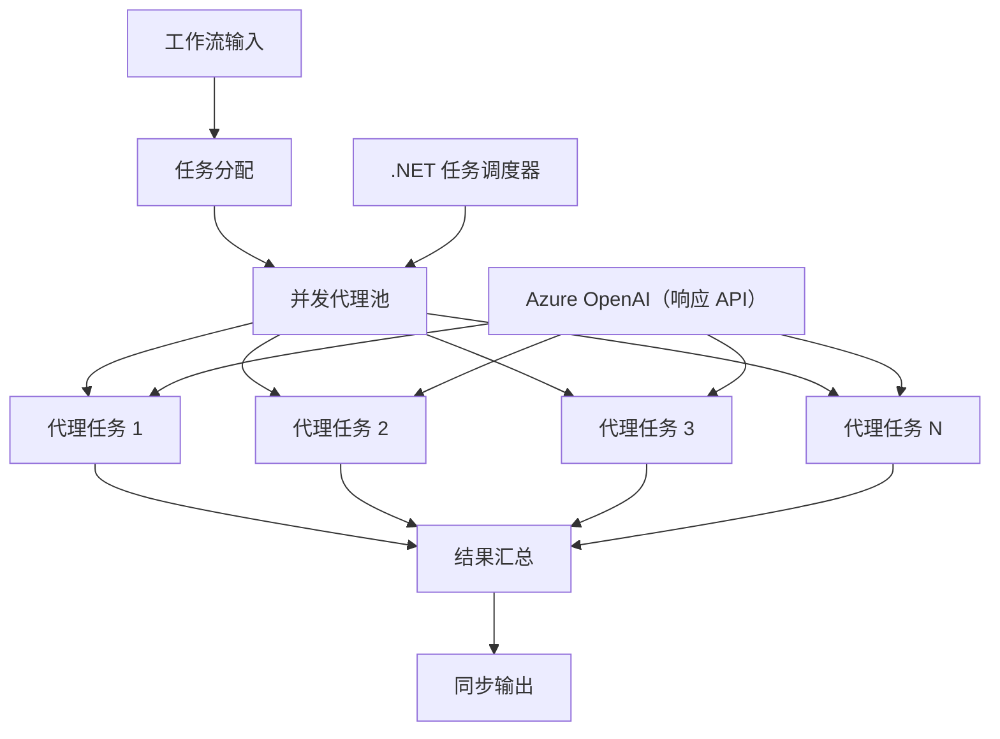

# ⚡ 使用 Azure OpenAI（Responses API）（.NET）进行并发代理工作流

## 📋 高性能并行处理教程

本笔记本演示了使用 Microsoft Agent Framework for .NET 和 Azure OpenAI（Responses API）的<strong>并发工作流模式</strong>。您将学习如何构建高性能的并行处理工作流，通过同时执行多个 AI 代理来最大化吞吐量，同时保持协调和数据一致性。

## 🎯 学习目标

### 🚀 <strong>并发处理基础</strong>
- <strong>并行代理执行</strong>：同时运行多个 AI 代理以实现最大性能
- **Async/Await 模式**：利用 .NET 的异步编程模型实现高效并发
- **Azure OpenAI（Responses API）**：协调对 Azure OpenAI Responses API 的多个并发调用
- <strong>资源管理</strong>：有效管理跨并发操作的 AI 模型资源

### 🏗️ <strong>高级并发架构</strong>
- <strong>基于任务的并行</strong>：使用 .NET 任务并行库实现最佳并发执行
- <strong>同步模式</strong>：协调并发代理，避免竞争条件
- <strong>负载均衡</strong>：高效分配工作负载，充分利用可用并发处理能力
- <strong>容错能力</strong>：处理单个代理失败而不停止整个工作流

### 🏢 <strong>企业并发应用</strong>
- <strong>大批量文档处理</strong>：同时处理多个文档
- <strong>实时内容分析</strong>：对传入数据流进行并发分析
- <strong>批处理优化</strong>：最大化大规模数据处理操作的吞吐量
- <strong>多模态分析</strong>：并行处理不同内容类型和格式

## ⚙️ 前提条件与设置

### 📦 **所需 NuGet 包**

构建高性能并发工作流必备的包：

```xml
<!-- Core AI Framework with Async Support -->
<PackageReference Include="Microsoft.Extensions.AI" Version="9.9.0" />

<!-- Azure OpenAI (Responses API) -->
<PackageReference Include="Azure.AI.OpenAI" Version="2.1.0" />

<!-- Azure Identity and Async LINQ for Advanced Operations -->
<PackageReference Include="Azure.Identity" Version="1.15.0" />
<PackageReference Include="System.Linq.Async" Version="6.0.3" />

<!-- Local Agent Framework References -->
<!-- Microsoft.Agents.AI.dll - Core agent abstractions with async support -->
<!-- Microsoft.Agents.AI.OpenAI.dll - Azure OpenAI (Responses API) integration with concurrency -->
```

### 🔑 **Azure OpenAI 配置**

**环境设置（.env 文件）：**
```env
AZURE_OPENAI_ENDPOINT=https://<your-resource>.openai.azure.com
AZURE_OPENAI_DEPLOYMENT=gpt-5-mini
```

**并发处理注意事项：**
```csharp
// Configure for concurrent operations
var clientOptions = new AzureOpenAIClientOptions()
{
    // Configure network timeout for concurrent requests
    NetworkTimeout = TimeSpan.FromMinutes(5)
};
```

### 🏗️ <strong>并发工作流架构</strong>



**关键组件：**
- <strong>任务并行库</strong>：.NET 内置的并发操作支持
- <strong>代理池</strong>：多个代理实例用于并行处理
- <strong>结果聚合</strong>：协调并合并并发代理结果
- <strong>同步点</strong>：确保并发操作中的数据一致性

## 🎨 <strong>并发工作流设计模式</strong>

### 🔍 <strong>并行研究与分析</strong>
```
Research Topic → Concurrent Research Agents → Result Synthesis → Final Report
```

### 📊 <strong>多源数据处理</strong>
```
Data Sources → Parallel Processing Agents → Data Integration → Unified Output
```

### 🎭 <strong>内容生成流程</strong>
```
Content Requirements → Concurrent Content Generators → Quality Review → Final Content
```

### 🔄 **扇出/扇入处理**
```
Single Input → Multiple Concurrent Processors → Result Aggregation → Single Output
```

## 🏢 <strong>企业性能优势</strong>

### ⚡ <strong>吞吐量与可扩展性</strong>
- <strong>线性性能扩展</strong>：增加更多并发代理以提升吞吐量
- <strong>资源利用率</strong>：最大化可用 AI 模型容量的效率
- <strong>减少处理时间</strong>：通过并行执行显著缩短时间
- <strong>弹性扩展</strong>：根据工作负载动态调整并发代理数量

### 🛡️ <strong>可靠性与韧性</strong>
- <strong>故障隔离</strong>：单个代理失败不会影响其他并发操作
- <strong>优雅降级</strong>：系统在代理容量减少时继续运行
- <strong>错误恢复</strong>：对失败的并发操作自动重试
- <strong>负载分配</strong>：均匀分配工作给可用代理

### 📊 <strong>性能监控</strong>
- <strong>并发执行指标</strong>：跟踪所有并行操作的性能
- <strong>资源使用分析</strong>：监控 CPU、内存和网络利用情况
- <strong>吞吐量分析</strong>：测量并发处理带来的效率提升
- <strong>瓶颈检测</strong>：识别并解决性能瓶颈

### 🔧 <strong>开发与运维</strong>
- <strong>异步编程模型</strong>：利用 .NET 成熟的 async/await 模式
- <strong>任务协调</strong>：内置任务管理和协调能力
- <strong>异常处理</strong>：全面的并发操作错误处理
- <strong>调试支持</strong>：Visual Studio 并发工作流调试工具

让我们一起用 .NET 构建高性能并发 AI 工作流吧！🚀

## 💻 运行代码

完整实现保存在 `03.dotnet-agent-framework-workflow-ghmodel-concurrent.cs` 文件中。此文件演示了一个用于旅行规划的<strong>扇出/扇入并发工作流</strong>：

### 🏗️ <strong>工作流架构</strong>

```
User Request → ConcurrentStartExecutor → [Researcher Agent || Planner Agent] → ConcurrentAggregationExecutor → Final Output
```

**关键组件：**

1. **ConcurrentStartExecutor**：将用户请求同时广播给所有代理
2. **Researcher 代理**：并发分析目的地和景点
3. **Planner 代理**：并发创建详细旅行计划
4. **ConcurrentAggregationExecutor**：收集并合并两个代理的结果

### 🎯 **扇出/扇入模式**

该工作流演示了经典的<strong>扇出/扇入</strong>模式：
- <strong>扇出</strong>：一个输入消息同时广播给多个代理
- <strong>并发处理</strong>：多个代理并行处理同一任务
- <strong>扇入</strong>：来自所有代理的结果被收集并聚合为单一输出

### 🚀 运行示例

```bash
# 使脚本可执行（Unix/Linux/macOS）
chmod +x 03.dotnet-agent-framework-workflow-ghmodel-concurrent.cs

# 运行并发工作流
./03.dotnet-agent-framework-workflow-ghmodel-concurrent.cs
```

或者在 Windows 上：
```powershell
dotnet run 03.dotnet-agent-framework-workflow-ghmodel-concurrent.cs
```

### 📝 预期输出

该工作流将：
1. <strong>广播请求</strong>：将“规划 12 月的西雅图之行”同时发送给两个代理
2. <strong>并发处理</strong>：两个代理同时工作：
   - 研究者识别景点和细节
   - 规划者创建行程和后勤安排
3. <strong>聚合</strong>：合并两个响应，生成综合输出
4. <strong>显示结果</strong>：展示包含所有信息的合并旅行计划

### 🔧 自定义选项

**添加更多并发代理：**
```csharp
// Create additional specialized agents
AIAgent budgetAgent = azureClient.GetOpenAIResponseClient(deployment).CreateAIAgent(
    name: "Budget-Agent", instructions: "Calculate travel costs...");

// Add to fan-out
var workflow = new WorkflowBuilder(startExecutor)
    .AddFanOutEdge(startExecutor, targets: [researcherAgent, plannerAgent, budgetAgent])
    .AddFanInEdge(aggregationExecutor, sources: [researcherAgent, plannerAgent, budgetAgent])
    .WithOutputFrom(aggregationExecutor)
    .Build();

// Update aggregation count
if (this._messages.Count == 3) { ... }
```

**修改代理指令：**
```csharp
const string ResearcherAgentInstructions = "Your custom instructions for research...";
const string PlanAgentInstructions = "Your custom instructions for planning...";
```

**更改任务：**
```csharp
StreamingRun run = await InProcessExecution.StreamAsync(
    workflow, 
    "Plan a European vacation for 2 weeks in summer"
);
```

### 🎯 真实应用场景

此并发模式非常适合：
- <strong>内容创作</strong>：多位作者同时创建不同章节
- <strong>代码审查</strong>：多位评审从不同角度分析代码
- <strong>市场调研</strong>：并行分析不同市场细分
- <strong>文档处理</strong>：并发提取、分析和验证
- <strong>多视角分析</strong>：获取同一输入的多样化观点

### 🔍 了解自定义执行器

**ConcurrentStartExecutor：**
- 实现 `IMessageHandler<string>` 接受字符串输入
- 广播消息给所有连接代理
- 发送 `TurnToken` 触发并发处理

**ConcurrentAggregationExecutor：**
- 实现 `IMessageHandler<ChatMessage>` 接收代理响应
- 以线程安全方式收集消息
- 当所有预期响应到达时聚合结果
- 使用 `context.YieldOutputAsync()` 产出最终输出

### ⚡ 性能优势

**并发与顺序比较：**
- 顺序执行：代理1 (30秒) → 代理2 (30秒) = **总计 60 秒**
- 并发执行：代理1 (30秒) || 代理2 (30秒) = **总计 30 秒**

<strong>吞吐量提升</strong>：对于 N 个并发代理，速度提升可达 N 倍（视工作负载和资源而定）

### 🛡️ 错误处理

工作流能够优雅处理单个代理失败：
- 如有一个代理失败，其他代理继续处理
- 聚合器可实现超时逻辑
- 如有需要可返回部分结果

### 📊 高级功能

**动态代理数量：**
修改聚合逻辑以支持可变代理数量：

```csharp
private int _expectedAgentCount;
private readonly List<ChatMessage> _messages = [];

public async ValueTask HandleAsync(ChatMessage message, IWorkflowContext context)
{
    this._messages.Add(message);
    if (this._messages.Count == _expectedAgentCount)
    {
        // Process aggregation
    }
}
```

此并发工作流模式是构建高性能、可扩展 AI 代理系统的关键！

---

<!-- CO-OP TRANSLATOR DISCLAIMER START -->
**免责声明**：
本文件由 AI 翻译服务 [Co-op Translator](https://github.com/Azure/co-op-translator) 翻译完成。尽管我们力求准确，但请注意，自动翻译可能包含错误或不准确之处。原始语言版文件应视为权威来源。对于重要信息，建议使用专业人工翻译。我们对因使用本翻译而产生的任何误解或误释不承担责任。
<!-- CO-OP TRANSLATOR DISCLAIMER END -->