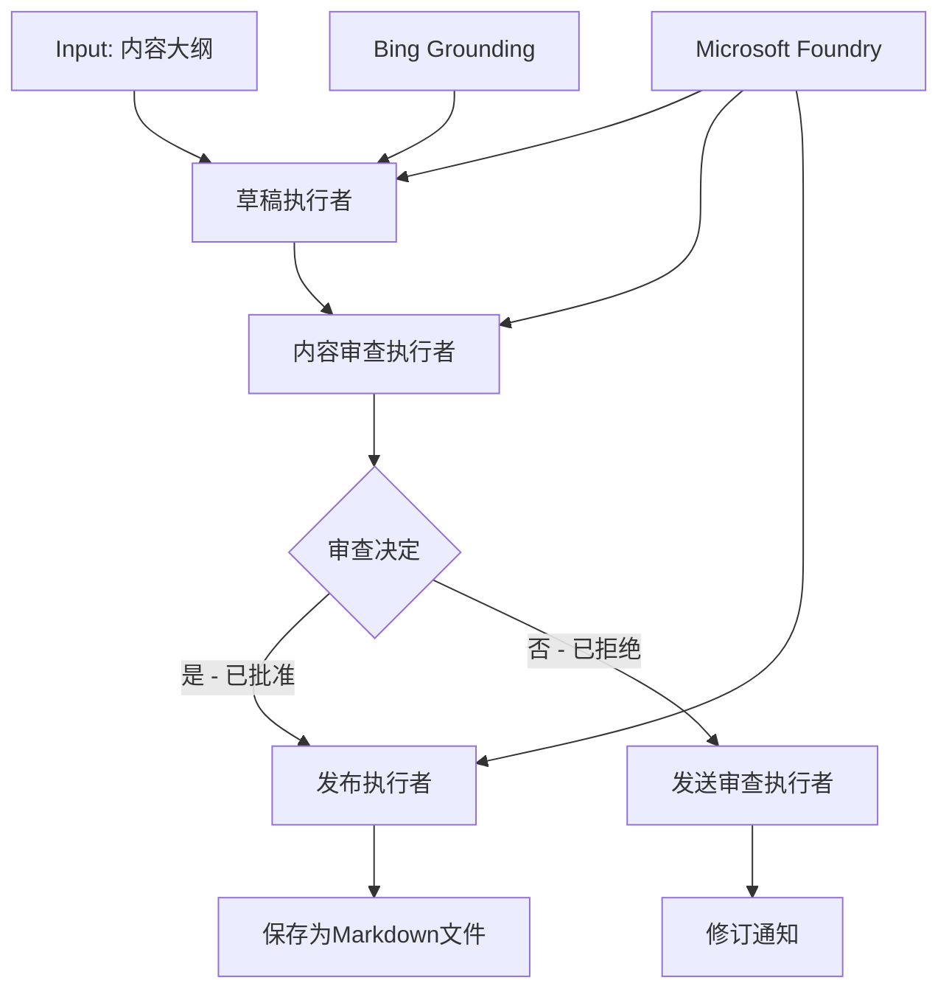

# 🔀 使用 Microsoft Foundry (.NET) 的条件代理工作流

## 📋 智能决策驱动工作流教程

本笔记本演示了使用 Microsoft Foundry 和 .NET 版 Microsoft Agent Framework 的<strong>条件工作流模式</strong>。您将学习如何构建复杂的、基于决策的工作流，通过 AI 分析、业务规则和动态条件智能地路由处理，实现企业级自动化。

## 🎯 学习目标

### 🧠 <strong>智能决策架构</strong>
- <strong>条件逻辑实现</strong>：构建具有多个分支点的复杂决策树
- **AI 驱动的路由**：使用 Microsoft Foundry 模型做出智能路由决策
- <strong>动态工作流适应</strong>：基于运行时分析和条件修改工作流行为
- <strong>企业规则集成</strong>：将业务逻辑和合规需求融入工作流

### 🔀 <strong>高级条件模式</strong>
- <strong>多标准决策制定</strong>：评估多项因素以做出路由决定
- <strong>上下文感知处理</strong>：基于累计的工作流上下文和历史做出决策
- <strong>自适应工作流修改</strong>：根据实时条件动态调整处理路径
- <strong>规则引擎集成</strong>：在工作流中实现复杂的业务规则引擎

### 🏢 <strong>企业级条件应用</strong>
- <strong>文档分类与路由</strong>：自动分类并将文档路由至适当的工作流
- <strong>客户服务分诊</strong>：智能将客户咨询路由至专业处理团队
- <strong>合规与风险处理</strong>：基于风险评估应用不同的验证和审查流程
- <strong>质量保证工作流</strong>：根据质量指标将内容路由至合适的审查流程

## ⚙️ 先决条件与设置

### 📦 **必需的 NuGet 包**

用于条件工作流处理的高级包：

```xml
<!-- Core AI Framework -->
<PackageReference Include="Microsoft.Extensions.AI" Version="9.9.0" />

<!-- Azure AI Agents with Persistent State -->
<PackageReference Include="Azure.AI.Agents.Persistent" Version="1.2.0-beta.5" />

<!-- Azure Identity and Utilities -->
<PackageReference Include="Azure.Identity" Version="1.15.0" />
<PackageReference Include="System.Linq.Async" Version="6.0.3" />
<PackageReference Include="DotNetEnv" Version="3.1.1" />

<!-- Local Workflow Framework References -->
<!-- Microsoft.Agents.Workflows.dll - Advanced workflow orchestration -->
<!-- Microsoft.Agents.AI.AzureAI.dll - Microsoft Foundry integration -->
<!-- Microsoft.Agents.AI.dll - Core agent abstractions -->
```

### 🔑 **Microsoft Foundry 配置**

**所需 Azure 资源：**
- 带有条件处理模型的 Microsoft Foundry 工作区
- 具有合适计算配额和权限的 Azure 订阅
- 部署用于决策和内容分析的 AI 模型
- （可选）用于落实功能的 Bing 搜索 API 连接

**环境配置 (.env 文件)：**
```env
# Microsoft Foundry Configuration
AZURE_AI_PROJECT_ENDPOINT=https://your-project.cognitiveservices.azure.com/
BING_CONNECTION_ID=your-bing-connection-id
```

**身份认证设置：**
```csharp
// Azure CLI or Managed Identity authentication
using Azure.Identity;
var credential = new AzureCliCredential();

// Load environment configuration
DotNetEnv.Env.Load("../../../.env");
```

### 🏗️ <strong>条件工作流架构</strong>



**关键组件：**
- <strong>起草执行器</strong>：基于提纲创建初稿的 AI 代理
- <strong>内容审查执行器</strong>：评估稿件质量和合规性的 AI 代理
- <strong>条件路由</strong>：基于审查结果进行路由的决策逻辑
- **发布/审查路径**：对通过和未通过内容分开的处理路径
- <strong>状态管理</strong>：维护整个工作流中的内容及审查上下文

## 🎨 <strong>条件工作流设计模式</strong>

### 📋 <strong>带质量门控的内容生产</strong>
```
Outline → Draft Creation → Quality Review → {Approve: Publish | Reject: Revise}
```

### 🎯 <strong>基于风险的文档处理</strong>
```
Document → Risk Assessment → {Low: Standard | High: Enhanced Review}
```

### 🔍 <strong>智能客户服务路由</strong>
```
Customer Query → Analysis → {Simple: FAQ Bot | Complex: Human Agent}
```

### 💼 <strong>合规驱动的工作流</strong>
```
Content → Compliance Check → {Pass: Publish | Fail: Legal Review}
```

## 🏢 <strong>企业条件的优势</strong>

### 🎯 <strong>智能自动化</strong>
- <strong>智能决策制定</strong>：基于内容分析和上下文的 AI 路由决策
- <strong>自适应处理</strong>：根据变化条件自动调整的工作流
- <strong>业务规则执行</strong>：自动应用复杂业务逻辑和政策
- <strong>上下文感知路由</strong>：基于完整工作流历史和累计上下文的决策

### 📈 <strong>运营卓越</strong>
- <strong>优化资源分配</strong>：将工作路由到最合适的专家和流程
- <strong>减少人工干预</strong>：自动决策减少人工路由需求
- <strong>更快解决时间</strong>：直接路由到合适的专业知识和处理能力
- <strong>一致性应用</strong>：统一执行业务规则和决策标准

### 🛡️ <strong>风险管理与合规性</strong>
- <strong>自动风险评估</strong>：基于 AI 的内容和情境风险水平评估
- <strong>合规执行</strong>：自动通过所需的法规流程路由
- <strong>安全协议应用</strong>：基于风险评估加强安全措施
- <strong>审计跟踪维护</strong>：完整记录路由决策和原因

### 📊 <strong>分析与持续改进</strong>
- <strong>决策分析</strong>：跟踪路由决策的效果和准确性
- <strong>模式识别</strong>：识别路由决策中的趋势和模式
- <strong>性能优化</strong>：持续改进决策标准和路由效率
- <strong>业务智能</strong>：洞察内容特性和处理需求

### 🔧 <strong>技术卓越</strong>
- <strong>持久状态管理</strong>：在工作流执行中维护复杂状态
- <strong>可扩展架构</strong>：满足高量条件处理需求
- <strong>集成能力</strong>：与现有业务系统和流程无缝集成
- <strong>监控与观测性</strong>：全面跟踪工作流性能和决策

让我们用 .NET 构建智能、决策驱动的企业工作流吧！🚀

## 💻 运行代码

完整实现代码位于 `04.dotnet-agent-framework-workflow-aifoundry-condition.cs`。该示例演示了一个<strong>带质量门控的内容生产工作流</strong>：

### 🏗️ <strong>工作流架构</strong>

```
Content Outline → Draft Creation → Quality Review → Conditional Routing:
                                                      ├─ Approved (>200 words) → Publish
                                                      └─ Rejected (<200 words) → Review Notification
```

**工作流中的代理：**
1. <strong>传教士代理</strong>：基于提纲结合 Bing 落地创建教程草稿
2. <strong>内容审查代理</strong>：评估稿件质量（字数、完整性）
3. <strong>发布代理</strong>：将审批通过的内容保存为带时间戳的 Markdown 文件

**自定义执行器：**
1. **DraftExecutor**：协调起草创建
2. **ContentReviewExecutor**：执行质量评估
3. **PublishExecutor**：处理批准内容发布
4. **SendReviewExecutor**：管理拒绝内容通知

### 🚀 运行示例

**先决条件：**
- 配置好的 Microsoft Foundry 工作区
- Azure CLI 身份验证 (`az login`)
- （可选）用于落地的 Bing 搜索连接

```bash
# 使脚本可执行（Unix/Linux/macOS）
chmod +x 04.dotnet-agent-framework-workflow-aifoundry-condition.cs

# 运行条件工作流
./04.dotnet-agent-framework-workflow-aifoundry-condition.cs
```

或者在 Windows 上：
```powershell
dotnet run 04.dotnet-agent-framework-workflow-aifoundry-condition.cs
```

### 📝 预期输出

工作流将：
1. <strong>创建代理</strong>：初始化三个专门的 Microsoft Foundry 代理
2. <strong>生成草稿</strong>：传教士代理基于提纲创建教程草稿
3. <strong>审查内容</strong>：内容审查代理评估草稿质量
4. <strong>条件路由</strong>：
   - **如果通过（>200字）**：发布执行器将内容保存为 Markdown 文件
   - **如果未通过（<200字）**：发送审查通知
5. <strong>显示结果</strong>：展示最终工作流结果

### 🔧 定制选项

**修改审查标准：**
```csharp
const string ContentReviewerInstructions = @"
You are a content reviewer...
1. Check if content is more than 500 words (instead of 200)
2. Verify technical accuracy
3. Ensure proper formatting
...";
```

**添加更多条件路径：**
```csharp
var workflow = new WorkflowBuilder(draftExecutor)
    .AddEdge(draftExecutor, contentReviewerExecutor)
    .AddEdge(contentReviewerExecutor, publishExecutor, condition: GetCondition("Excellent"))
    .AddEdge(contentReviewerExecutor, editExecutor, condition: GetCondition("Good"))
    .AddEdge(contentReviewerExecutor, sendReviewerExecutor, condition: GetCondition("Poor"))
    .Build();
```

**更改内容要求：**
```csharp
string OUTLINE_Content = @"
# Your Custom Topic
## Section 1
https://your-reference-url
## Section 2
...
";
```

### 🎯 现实应用

该条件工作流模式适用于：
- <strong>内容管理系统</strong>：带质量门控的自动编辑工作流
- <strong>文档处理</strong>：基于分类和合规路由文档
- <strong>客户支持</strong>：基于复杂度和紧急度智能票务路由
- <strong>法律审查</strong>：基于风险评估和价值路由合同
- <strong>人力资源流程</strong>：按适当筛选工作流路由申请

### 🔍 理解条件逻辑

**条件函数：**
```csharp
public Func<object?, bool> GetCondition(string expectedResult) =>
    reviewResult => reviewResult is ReviewResult review && review.Result == expectedResult;
```

该函数创建了一个谓词：
1. 检查结果是否为 `ReviewResult` 类型
2. 比较 `Result` 属性与预期值
3. 返回真假决定路由方向

**带条件的工作流边：**
```csharp
.AddEdge(contentReviewerExecutor, publishExecutor, condition: GetCondition("Yes"))
.AddEdge(contentReviewerExecutor, sendReviewerExecutor, condition: GetCondition("No"))
```

### 📊 高级功能

**JSON 模式验证：**
工作流采用 JSON 模式确保结构化响应：

```csharp
// Define response structure
public class ReviewResult
{
    [JsonPropertyName("review_result")]
    public string Result { get; set; } = string.Empty;
    
    [JsonPropertyName("reason")]
    public string Reason { get; set; } = string.Empty;
    
    [JsonPropertyName("draft_content")]
    public string DraftContent { get; set; } = string.Empty;
}

// Apply to agent
ResponseFormat = ChatResponseFormat.ForJsonSchema(
    AIJsonUtilities.CreateJsonSchema(typeof(ReviewResult)), 
    "ReviewResult", 
    "Review Result From DraftContent"
)
```

**Bing 落地集成：**
传教士代理使用 Bing 落地访问实时信息：

```csharp
var bingGroundingConfig = new BingGroundingSearchConfiguration(bing_conn_id);
BingGroundingToolDefinition bingGroundingTool = new(
    new BingGroundingSearchToolParameters([bingGroundingConfig])
);
```

这使代理能够跟踪提纲中的 URL 并提取最新信息。

### 🛡️ 错误处理

工作流包含了针对拒绝内容的健壮错误处理：
- 审查失败将触发替代路径
- 通知明确拒绝原因
- 内容保留以供修订

### 🔄 扩展工作流

**添加修订循环：**
创建一个自动重新起草内容的反馈循环：

```csharp
.AddEdge(contentReviewerExecutor, publishExecutor, condition: GetCondition("Yes"))
.AddEdge(contentReviewerExecutor, draftExecutor, condition: GetCondition("No")) // Loop back
```

**实现多级审查：**
添加多个具有不同标准的审查阶段：

```csharp
.AddEdge(draftExecutor, technicalReviewer)
.AddEdge(technicalReviewer, editorialReviewer, condition: GetCondition("TechPass"))
.AddEdge(editorialReviewer, publishExecutor, condition: GetCondition("EditPass"))
```

这种条件工作流模式为构建复杂、智能的企业自动化系统奠定了基础！🚀

---

<!-- CO-OP TRANSLATOR DISCLAIMER START -->
**免责声明**：
本文件由 AI 翻译服务 [Co-op Translator](https://github.com/Azure/co-op-translator) 翻译完成。尽管我们力求准确，但请注意，自动翻译可能包含错误或不准确之处。原始语言版文件应视为权威来源。对于重要信息，建议使用专业人工翻译。我们对因使用本翻译而产生的任何误解或误释不承担责任。
<!-- CO-OP TRANSLATOR DISCLAIMER END -->