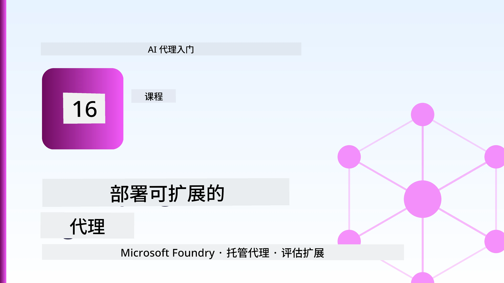
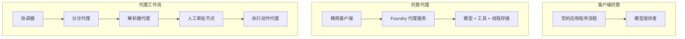
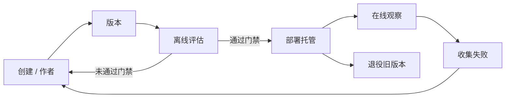
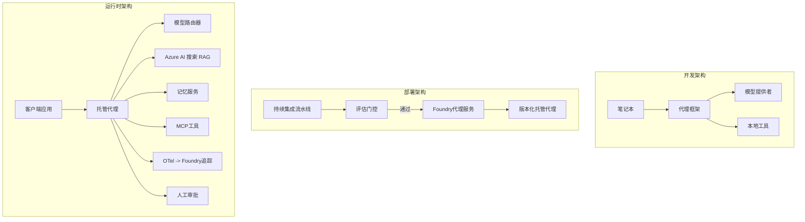

# 使用 Microsoft Foundry 部署可扩展代理



到目前为止，您已经构建了在笔记本电脑上运行的代理，在笔记本中运行，并由 `az login` 和一些环境变量驱动。这是学习的正确方式。但这并不是让成千上万客户依赖的代理在凌晨三点可靠运行的正确方式。

本课内容是关于“在我机器上能运行”和“在生产环境中可靠且经济地运行”之间的差距。我们将通过使用 **Microsoft Foundry** 和 **Microsoft Foundry Agent Service** 来弥合这一差距，并通过构建一个拥有工具、检索、记忆、评估和监控功能的真实客户支持代理来实现。

## 介绍

本课将涵盖：

- <strong>原型代理</strong> 与 <strong>已部署代理</strong> 的区别，以及为什么转变主要涉及模型周围的所有环节。
- 代理的 <strong>部署模式</strong>：客户端托管、服务托管（托管代理）和工作流编排。
- Microsoft Foundry 上的 <strong>代理生命周期</strong> — 创建、版本管理、部署、评估、监控、退役。
- <strong>扩展策略</strong>：模型路由、缓存、并发和无状态设计。
- 使用 OpenTelemetry 和 Foundry 跟踪实现 <strong>可观测性</strong>。
- 通过模型选择、路由和评估门实现 <strong>成本优化</strong>。
- <strong>企业考量</strong>：治理、人类审批以及在生产环境中安全运行 MCP 服务器。

## 学习目标

完成本课后，您将能够：

- 为特定代理工作负载选择正确的部署模式。
- 将代理部署到 Microsoft Foundry Agent Service，实现版本管理、治理和可观测性。
- 为代理添加跟踪功能，并构建每个发布前运行的评估管道。
- 应用模型路由和缓存技术，以控制大规模时的延迟和成本。
- 加入高风险操作的人类审批门，并以生产安全方式集成 MCP 服务器。

## 先决条件

本课前提是您已完成之前的课程，并熟悉：

- 使用 [Microsoft Agent Framework](../14-microsoft-agent-framework/README.md) （第14课）构建代理。
- [工具使用](../04-tool-use/README.md)（第4课）和 [Agentic RAG](../05-agentic-rag/README.md)（第5课）。
- [代理记忆](../13-agent-memory/README.md)（第13课）和 [Agentic 协议 / MCP](../11-agentic-protocols/README.md)（第11课）。
- [可观测性与评估](../10-ai-agents-production/README.md)（第10课）—本课直接在此基础上展开。

您还需要：

- 一个 **Azure 订阅** 和一个至少部署有一个聊天模型的 **Microsoft Foundry 项目**。
- 已认证的 **Azure CLI** (`az login`)。
- Python 3.12+ 及本仓库的 [`requirements.txt`](../../../requirements.txt) 中的依赖包。

## 从原型到生产：实际变化

原型代理和生产代理共享相同的核心循环——推理、调用工具、响应。变化的是环绕该循环的所有部分。模型约占生产代理的20%；其余80%是操作骨架。

| 关注点 | 原型 | 生产 |
| --- | --- | --- |
| <strong>托管</strong> | 在你的笔记本中运行 | 作为托管服务运行，具备版本管理和滚动发布功能 |
| <strong>身份</strong> | 你的 `az login` 令牌 | 受控身份，具有限定范围的RBAC |
| <strong>状态</strong> | 内存中，重启丢失 | 外部存储（线程存储、记忆服务） |
| <strong>失败处理</strong> | 你看到回溯 | 重试、回退、死信处理、告警 |
| <strong>成本</strong> | “几分钱” | 按请求跟踪，路由，缓存，预算管理 |
| <strong>质量</strong> | 你肉眼检查输出 | 每次发布前自动评估 |
| <strong>信任</strong> | 你批准每一操作 | 策略+人机交互式风险操作审批 |

牢记此表。以下各节内容均对应其中一项。

## 代理部署模式

这里有三种模式，且常常组合使用。

### 1. 客户端托管代理

代理对象驻留在<em>您的</em>应用进程内。您的代码直接调用模型提供者；推理循环在您的服务内运行。这是前面所有课程的做法。

- <strong>适用场景</strong>：需要完全控制循环、自定义中间件，或将代理嵌入现有后端时。
- <strong>权衡</strong>：扩展、状态和弹性由您自己负责。

### 2. 托管代理（Foundry Agent Service）

代理作为 Microsoft Foundry 中的<em>资源注册</em>。Foundry 托管推理循环，存储线程，执行内容安全和 RBAC，且使代理在 Foundry 门户中可见。您的应用变成一个轻客户端，负责创建线程和读取响应。

- <strong>适用场景</strong>：想要持久性、自带可观测性、治理和更少运维工作量时。
- <strong>权衡</strong>：以失去部分底层控制换取托管运行时的便利。

### 3. 代理工作流

多个代理（及工具）组合成一个带有显式控制流的图 — 顺序步骤、分支、人类审批节点和可暂停恢复的持久检查点。这是 Microsoft Agent Framework <strong>工作流</strong> 能力在部署规模上的应用。

- <strong>适用场景</strong>：单一任务跨多个专门代理，或中间需要审批步骤时。
- <strong>权衡</strong>：部件较多，需要工作流层面的可观测性。



## Microsoft Foundry 上的代理生命周期

部署代理不是一次性的 `push`。它是一个循环，且很像软件发布周期，因为本质也是如此。



关键思想，继承自[第10课](../10-ai-agents-production/README.md)：**离线评估是门槛，而非事后考虑。** 新代理版本必须通过评估门槛才会发布。上线的可观测性将真实失败反馈回离线测试集。这就是整套循环。

## 扩展策略

扩展代理不同于扩展无状态 Web API，因为每个请求可能触发多个昂贵的模型和工具调用。以下四种技术承担大部分负载。

**无状态请求处理。** 不在进程内存中保持任何每用户状态。将会话线程持久化到 Foundry 线程存储或记忆服务，使任何实例都能处理任何请求。这是允许水平扩展的关键——增加实例，无需粘滞会话。

**模型路由。** 并非每个请求都需要最强大（也最昂贵）的模型。将简单请求（意图分类、简短事实回答）路由到小型快速模型，复杂推理则保留给大型模型。Foundry 的 <strong>模型路由器</strong> 可帮您实现，也可自行实现轻量分类器。实验中您将构建 DIY 版本。

**响应缓存。** 许多支持查询高度重复（“如何重置密码？”）。缓存常见问题答案，直接返回，无需调用模型。即便是适度的缓存命中率，也能显著降低成本和延迟。

**并发与背压。** 模型提供者有速率限制。限制并发量，使用带指数退避的重试，优雅失败（排队的“我们正在处理”响应优于 HTTP 500 错误）。


## 生产环境中的可观测性

看不到就无法运营。如第10课所述，Microsoft Agent Framework 原生发出 **OpenTelemetry** 跟踪 — 每次模型调用、工具执行及编排步骤成为一个跨度。在生产环境中，您将这些跨度导出到 Microsoft Foundry（或任意 OTel 兼容后端），以便：

- 跟踪单个客户投诉，覆盖所有模型及工具调用的端到端流程。
- 监控随时间变化的 P50 / P95 延迟和单请求成本。
- 在用户（或财务团队）察觉前，预警错误率激增和成本异常。

```python
from agent_framework.observability import get_tracer

tracer = get_tracer()

with tracer.start_as_current_span("support_request") as span:
    span.set_attribute("customer.tier", "enterprise")
    span.set_attribute("routed.model", "gpt-4.1-mini")
    # 代理执行自动在此跨度内跟踪
```

像 `customer.tier` 和 `routed.model` 这样的属性，让一堆跟踪数据变得可回答问题（“企业客户是否过度被路由到小模型？”）。

## 成本优化

生产代理的成本以令牌费用为主。三个杠杆，按影响力排序：

1. **选择合适大小的模型。** 能通过评估门的小模型几乎总比同样能通过评估的大模型便宜。评估用来<em>证明</em>小模型足够好，而不是谨慎起见默认最大模型。
2. **按复杂度路由。** 如前所述——仅对需要大型模型推理的请求付出大型模型的代价。
3. **积极缓存。** 最便宜的模型调用是永远不调用的那个。

评估门和成本控制是同一学科的两面：评估告诉您<em>质量下限</em>，路由和缓存则帮助您尽量以该下限的<em>成本</em>运行。

## 企业部署考虑

**治理。** 托管代理继承 Foundry 的 RBAC、内容安全和审计日志。为每个代理分配具有最小权限的托管身份——只读访问知识库、限定范围访问工单 API，别无其他。

**人机交互。** 某些操作后果过大，不能完全自动化——发起退款、删除账户、升级至法律团队。Microsoft Agent Framework 支持 <strong>需审批</strong> 的工具：代理提出操作建议，执行暂停，人类审批或拒绝后，工作流继续。您在[第6课](../06-building-trustworthy-agents/README.md)见过原始版本；这里将其部署。

**生产环境中的 MCP。** [MCP](../11-agentic-protocols/README.md) 允许代理通过标准接口消费外部工具。生产环境中，将每个 MCP 服务器视为不受信任的边界：固定服务器版本，使用限定权限身份运行，验证其输出，且永不将密钥暴露给它。MCP 服务器是依赖，依赖需打补丁、审计和限流。



这三张图——开发、部署、运行时——是同一代理生命周期的三个阶段。接下来的实验带您搭建该代理。

## 实战实验：生产就绪的客户支持代理

打开 [`code_samples/16-python-agent-framework.ipynb`](./code_samples/16-python-agent-framework.ipynb)，从头完成。您将组装一个具备所有生产关注点的 **Contoso 客户支持代理**：

1. <strong>调用工具</strong> — 查询订单状态，开启支持工单。
2. **RAG** — 利用知识库回答政策问题（Azure AI 搜索，带内存回退，让笔记本在无搜索资源时仍能运行）。
3. <strong>记忆</strong> — 记住用户对话轮次中的客户信息。
4. <strong>模型路由</strong> — 复杂度分类器将请求路由至小模型或大模型。
5. <strong>响应缓存</strong> — 重复问题直接从缓存返回。
6. <strong>人工审批</strong> — 超过阈值的退款需等待人工签字。
7. <strong>评估管道</strong> — 小离线测试集对代理评分，作为发布门槛。
8. <strong>可观测性</strong> — 每个请求的 OpenTelemetry 跟踪。

### 逐步讲解

笔记本组织起来，每个生产关注点都是独立、可执行的单元。核心是路由+缓存请求处理：

```python
async def handle_support_request(query: str, customer_id: str) -> str:
    # 1. 尽可能从缓存提供服务。
    cached = response_cache.get(normalize(query))
    if cached:
        return cached

    # 2. 根据复杂度进行路由以控制成本。
    model = "gpt-4.1-mini" if is_simple(query) else "gpt-4.1"

    # 3. 在跟踪跨度内运行代理以实现可观测性。
    with tracer.start_as_current_span("support_request") as span:
        span.set_attribute("routed.model", model)
        span.set_attribute("customer.id", customer_id)
        response = await support_agent.run(query, model=model)

    # 4. 缓存并返回。
    response_cache.set(normalize(query), response.text)
    return response.text
```

保护发布的评估门长这样：

```python
async def evaluation_gate(agent, test_cases, threshold: float = 0.8) -> bool:
    passed = 0
    for case in test_cases:
        result = await agent.run(case["input"])
        if score_response(result.text, case["expected"]) >= 0.8:
            passed += 1
    pass_rate = passed / len(test_cases)
    print(f"Evaluation pass rate: {pass_rate:.0%} (gate: {threshold:.0%})")
    return pass_rate >= threshold  # 仅当门禁通过时才部署
```

逐行阅读——笔记本故意保持原语代码简洁，避免任何隐藏在框架调用背后的东西。

## 用冒烟测试验证已部署代理

上文评估门是<em>离线</em>对代理对象进行的。代理作为托管代理部署后，还需要更便宜的检测：**部署端点是否真的响应？**

“成功部署”仅证明控制平面接受了定义——并不意味着代理能响应。缺少依赖、错误模型路由或过期连接都可能导致绿色部署但无响应。<strong>冒烟测试</strong>能在几秒内捕捉这些问题，在每次部署时运行，成本远低于完整评估。

本仓库提供了即用型冒烟测试管道，基于 [AI Smoke Test](https://github.com/marketplace/actions/ai-smoke-test) GitHub Action：

- <strong>目录</strong> — [`tests/lesson-16-smoke-tests.json`](../../../tests/lesson-16-smoke-tests.json) 包含 Contoso 支持代理的提示与断言（基于政策的答案、订单查询、保持主题和多轮线程连贯性）。其他课程代理的目录并列存放 — 见 [`tests/README.md`](../tests/README.md)。
- <strong>工作流</strong> — [`.github/workflows/smoke-test.yml`](../../../.github/workflows/smoke-test.yml) 使用 Azure OIDC 登录，向代理的 Responses 端点 POST 每个提示，如有断言失败则任务失败。

```yaml
- name: Smoke-test hosted agent
  uses: JFolberth/ai-smoketest@v1
  with:
    project_endpoint: ${{ inputs.project_endpoint }}
    agent_name: ContosoSupportAgent
    tests_file: tests/lesson-16-smoke-tests.json
```


部署代理后，从 **Actions** 选项卡运行它，提供您的 Foundry 项目端点和代理名称。联合身份在 Foundry 项目范围内需要 **Azure AI User** 角色。可以将各层级视为金字塔结构：烟雾测试（可访问且有响应？）在每次部署时运行，离线评估（是否足够好以发布？）在推广前运行，在线评估（在真实环境中的表现如何？）持续运行。

## 知识检测

在开始任务前测试您的理解。

**1. 生产代理中“大约多少比例是模型”，其余部分是什么？**

<details>
<summary>答案</summary>

模型是系统的少数部分——通常约占 20%。其余是操作骨架：托管和版本控制、身份和 RBAC、外部状态、故障处理、成本跟踪、评估和人工干预控制。生产环境主要是围绕推理循环构建完整的支持体系。
</details>

**2. 什么时候选择托管代理而不是客户端托管代理？**

<details>
<summary>答案</summary>

当您希望获得具备内建持久性（线程可持续且可恢复）、可观察性、内容安全和 RBAC 的托管运行时，并愿意以牺牲对推理循环的低层控制换取更少的运维面时，选择托管代理。客户端托管适用于您需要对循环完全控制或将代理嵌入现有后端的情况。
</details>

**3. 为什么可扩展代理必须在进程内存中保持无状态？**

<details>
<summary>答案</summary>

这样任何实例都能处理所有请求，从而支持无粘性会话的横向扩展。每用户的对话状态被外部化到线程存储或内存服务中。如果状态存在于进程内存，重启时会丢失，且无法自由分配负载。
</details>

**4. 模型路由解决了什么问题，它与评估有何关系？**

<details>
<summary>答案</summary>

路由将简单请求发送到小型、廉价、快速的模型，将大型模型保留给真正的推理，控制延迟和成本。它与评估相关，因为评估证明小模型适合某类请求——无评估的路由是猜测。
</details>

**5. 什么是“评估门”，它处于生命周期的哪个阶段？**

<details>
<summary>答案</summary>

评估门会针对新代理版本运行离线测试集，只有通过率超过阈值才允许部署。它位于生命周期的“版本”和“部署”之间，将质量作为发布的前提，而不是发布后再检查。
</details>

**6. 为什么生产环境中 MCP 服务器应被视为不受信任的边界？**

<details>
<summary>答案</summary>

因为它是外部依赖，代理会调用它。应锁定其版本、以作用域身份运行、验证其输出、限流，并且绝不向其暴露机密——这与对待任何第三方依赖的规矩相同。其输出影响代理推理，未经验证的信任是安全风险。
</details>

**7. 哪一项单一变更通常对生产代理成本影响最大，为什么？**

<details>
<summary>答案</summary>

合理选型模型——使用最小且能通过评估门的模型。成本受令牌数主导，满足质量要求的小模型几乎总是比大模型便宜。缓存和路由进一步降低成本，但正确基础模型选择影响最大。
</details>

**8. `customer.tier` 和 `routed.model` 这类跨度属性在可观察性中扮演什么角色？**

<details>
<summary>答案</summary>

它们将原始跟踪转化为可回答的业务问题。无属性时是一堆跨度；有了属性，您可以问“企业客户是否经常被路由到小模型？”或“哪个模型处理了我们最慢的请求？”属性是按重要维度切分遥测的方式。
</details>

## 任务

以实验室的客户支持代理为基础，针对特定场景加固：**SaaS 公司的订阅计费支持代理。**

您的提交应包含：

1. <strong>替换工具</strong>为计费相关的：`get_subscription_status`，`get_invoice` 和 `issue_credit`（超过 $50 的信用额度需要人工审批）。
2. **添加三份 RAG 文档**，涵盖公司的退款政策、计费周期和取消政策。
3. <strong>扩充评估集</strong>至少至八个用例，其中至少两个应触发人工审批路径，并确认您的评估门能正确通过或失败。
4. <strong>添加一份成本报告</strong>：在通过代理运行十个混合查询后，打印有多少使用了小模型，多少使用了大模型，多少从缓存中获取。

用一段简短的段落（markdown 单元）说明您选择了哪条模型路由规则，以及如何用真实流量验证它。没有唯一正确答案——评价看您是否将生产关切合理地结合起来。

## 总结

本课将代理从原型推向生产，使用 Microsoft Foundry：

- 生产跳跃主要是模型外围的 <strong>操作骨架</strong> ——托管、身份、状态、故障处理、成本、质量和信任。
- 你学习了三种 <strong>部署模式</strong> ——客户端托管、托管代理和代理工作流，以及各自适用场景。
- 你浏览了 <strong>代理生命周期</strong>，其中离线 <strong>评估充当发布门</strong>，在线可观察性将故障反馈进测试集。
- 你应用了 <strong>扩展策略</strong> ——无状态设计、模型路由、缓存和有界并发，并连接它们到 <strong>成本优化</strong>。
- 你融合了 <strong>企业控制</strong>：RBAC、人机环控审批和生产安全的 MCP 集成。
- 你构建了一个 <strong>生产就绪的客户支持代理</strong>，将这些关切点全部融入可运行代码。

下一课走反向路线：不再将代理扩展到云端，而是把它们带到单台开发者机器上，完全本地运行。

## 额外资源

- <a href="https://learn.microsoft.com/azure/ai-foundry/what-is-azure-ai-foundry" target="_blank">Microsoft Foundry 文档</a>
- <a href="https://learn.microsoft.com/azure/ai-foundry/agents/overview" target="_blank">Microsoft Foundry 代理服务概览</a>
- <a href="https://aka.ms/ai-agents-beginners/agent-framework" target="_blank">Microsoft Agent Framework</a>
- <a href="https://learn.microsoft.com/azure/ai-foundry/concepts/model-router" target="_blank">Microsoft Foundry 中的模型路由器</a>
- <a href="https://learn.microsoft.com/azure/search/search-what-is-azure-search" target="_blank">Azure AI Search</a>
- <a href="https://opentelemetry.io/" target="_blank">OpenTelemetry</a>
- <a href="https://github.com/marketplace/actions/ai-smoke-test" target="_blank">AI 烟雾测试 GitHub Action</a>
- <a href="https://modelcontextprotocol.io/" target="_blank">模型上下文协议 (MCP)</a>

## 上一课

[构建计算机使用代理 (CUA)](../15-browser-use/README.md)

## 下一课

[创建本地 AI 代理](../17-creating-local-ai-agents/README.md)

---

<!-- CO-OP TRANSLATOR DISCLAIMER START -->
**免责声明**：
本文件由 AI 翻译服务 [Co-op Translator](https://github.com/Azure/co-op-translator) 翻译完成。尽管我们力求准确，但请注意，自动翻译可能包含错误或不准确之处。原始语言版文件应视为权威来源。对于重要信息，建议使用专业人工翻译。我们对因使用本翻译而产生的任何误解或误释不承担责任。
<!-- CO-OP TRANSLATOR DISCLAIMER END -->