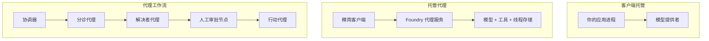
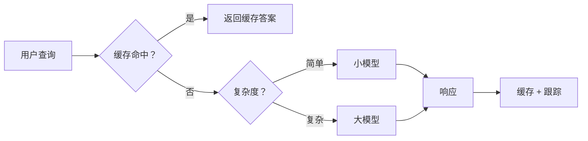
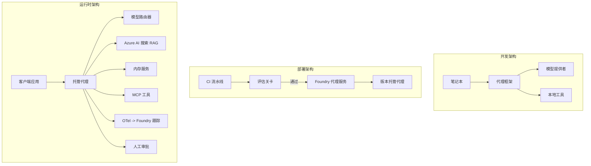

# 使用 Microsoft Foundry 部署可扩展代理


在本课程到目前为止，您已经构建了运行在笔记本内、由 `az login` 和少量环境变量驱动的代理，这些代理运行在您的笔记本电脑上。这完全是学习的正确方式。但这并不是让数千客户在凌晨三点依赖的代理的正确运行方式。

本课讲述的是“在我的机器上运行正常”和“在生产环境中可靠且经济地运行正常”之间的差距。我们通过使用 **Microsoft Foundry** 和 **Microsoft Foundry Agent Service** 来弥合这一差距，并通过构建一个具有工具调用、检索、记忆、评估和监控功能的真实客户支持代理来实现。

## 简介

本课将涵盖：

- <strong>原型代理</strong> 与 <strong>已部署代理</strong> 的区别，以及为什么过渡主要是关于模型<em>周围</em>的一切。
- 代理的 <strong>部署模式</strong>：客户端托管、服务托管（托管代理）和工作流编排。
- Microsoft Foundry 上的 <strong>代理生命周期</strong> — 创建、版本、部署、评估、观察和退休。
- <strong>扩展策略</strong>：模型路由、缓存、并发和无状态设计。
- 使用 OpenTelemetry 和 Foundry 跟踪的 <strong>可观测性</strong>。
- 通过模型选择、路由和评估门实现的 <strong>成本优化</strong>。
- <strong>企业考虑</strong>：治理、人类审批以及在生产环境安全运行 MCP 服务器。

## 学习目标

完成本课后，您将学会：

- 为给定代理工作负载选择合适的部署模式。
- 将代理部署到 Microsoft Foundry Agent Service，使其具备版本控制、治理和可观测性。
- 为代理添加追踪，并设置在每次发布前运行的评估管道。
- 应用模型路由和缓存，在规模化时保持延迟和成本的可控。
- 为高风险操作添加人工审批门，并以生产安全的方式集成 MCP 服务器。

## 先决条件

本课假设您已经完成前面的课程并熟悉：

- 使用 [Microsoft Agent Framework](../14-microsoft-agent-framework/README.md) 构建代理（第14课）。
- [工具使用](../04-tool-use/README.md)（第4课）和 [代理式RAG](../05-agentic-rag/README.md)（第5课）。
- [代理内存](../13-agent-memory/README.md)（第13课）和 [代理协议 / MCP](../11-agentic-protocols/README.md)（第11课）。
- [可观测性和评估](../10-ai-agents-production/README.md)（第10课） — 本课将直接建立在此基础上。

您还需要：

- 一个 **Azure 订阅** 和至少部署了一个聊天模型的 **Microsoft Foundry 项目**。
- 通过身份验证的 **Azure CLI**（`az login`）。
- Python 3.12+ 及本仓库中的 [`requirements.txt`](../../../requirements.txt) 所列的包。

## 从原型到生产：真正变化的是什么

原型代理和生产代理共享相同的核心循环——推理、调用工具、响应。改变的是包裹在该循环周围的一切。模型大约占生产代理的 20%；其余 80% 是运营框架。

| 关注点 | 原型 | 生产 |
| --- | --- | --- |
| <strong>托管</strong> | 在笔记本中运行 | 作为托管服务运行，具备版本管理和推送功能 |
| <strong>身份</strong> | 使用您的 `az login` 令牌 | 使用具有限定 RBAC 的托管身份 |
| <strong>状态</strong> | 内存中，重启后丢失 | 外部持久化（线程存储、内存服务） |
| <strong>失败处理</strong> | 查看堆栈跟踪 | 重试、回退、死信队列和警报 |
| <strong>成本</strong> | “几分钱” | 按请求追踪，路由和缓存，预算控制 |
| <strong>质量</strong> | 手动检查输出 | 在每次发布前自动评估 |
| <strong>信任</strong> | 您批准每个动作 | 策略+人机交互审批高风险操作 |

记住这张表。下面的每个章节都对应表中的一行。

## 代理部署模式

有三种部署模式，通常会组合使用。

### 1. 客户端托管代理

代理对象存在于<em>您的</em>应用进程内。您的代码直接调用模型提供者；推理循环在您的服务中运行。所有前面的课程都是这样操作的。

- <strong>使用场景</strong>：需要完全控制推理循环、定制中间件，或将代理嵌入现有后端。
- <strong>权衡</strong>：您自行负责扩展、状态和可靠性。

### 2. 托管代理（Foundry Agent Service）

代理作为资源<em>注册在</em> Microsoft Foundry 中。Foundry 托管推理循环，存储线程，执行内容安全和 RBAC，并在 Foundry 门户中展示代理。您的应用成为一个瘦客户端，创建线程并读取响应。

- <strong>使用场景</strong>：需要持久性、内置可观测性、治理，且降低运营复杂度。
- <strong>权衡</strong>：以减少底层控制为代价，换取托管运行时。

### 3. 代理工作流

多个代理（和工具）组成有明确控制流的图——顺序步骤、分支、人类审批节点和可暂停恢复的持久检查点。这是 Microsoft Agent Framework <strong>工作流</strong> 功能在部署规模上的应用。

- <strong>使用场景</strong>：当一个任务涉及多个专项代理或中间需要审批步骤时。
- <strong>权衡</strong>：组件更多，需要编排级别的可观测性。



## Microsoft Foundry 上的代理生命周期

部署代理不是一次性的 `push` 操作，而是一个循环，很像软件发布生命周期，因为它就是。


这一核心理念继承自 [第10课](../10-ai-agents-production/README.md)：**离线评估是门槛，而非事后考虑。** 新版本代理必须通过评估门槛后才能发布。上线可观测性将真实失败反馈入离线测试集。整个流程如是。

## 扩展策略

扩展代理不同于扩展无状态的 web API，因为每个请求可能触发多次高成本的模型和工具调用。核心的四种方法：

**无状态请求处理。** 不在进程内存中保存任何用户状态。将对话线程持久化存储在 Foundry 线程存储或内存服务中，任何实例都能处理任意请求。这让您能水平扩展——增加实例，无需粘性会话。

**模型路由。** 并非每个请求都需要最强大（最昂贵）的模型。将简单请求——意图分类、简短事实回答——路由到小型快速模型，复杂推理请求才用大模型。Foundry 的 <strong>模型路由器</strong> 可以帮您做，或您也可以自己做轻量分类器。实验课会实现自定义版本。

**响应缓存。** 很多支持查询是近似重复的（“如何重置密码？”）。缓存常见问题的答案，直接返回，避免触发模型调用。即使是适度的缓存命中率，成本和延迟都能大幅降低。

**并发与背压。** 模型服务有速率限制。限制并发量，使用指数退避重试，优雅失败（排队回复“我们正在处理”要胜过 500 错误）。



## 生产环境中的可观测性

不可见则不可操作。正如第10课所述，Microsoft Agent Framework 原生发出 **OpenTelemetry** 跟踪——每次模型调用、工具调用和编排步骤变成一个跨度。生产环境中将这些跨度导出到 Microsoft Foundry（或任何支持 OTel 的后端），以实现：

- 跨所有模型和工具调用，追踪单个客户投诉的端到端过程。
- 观察随时间变化的 p50/p95 延迟和每请求成本。
- 在用户（或财务团队）发现之前，对错误率激增和成本异常发出警报。

```python
from agent_framework.observability import get_tracer

tracer = get_tracer()

with tracer.start_as_current_span("support_request") as span:
    span.set_attribute("customer.tier", "enterprise")
    span.set_attribute("routed.model", "gpt-5-nano")
    # 代理执行会在此跨度内自动跟踪
```

属性如 `customer.tier` 和 `routed.model` 将大量追踪转化成可回答的问题（“企业客户是否过度地路由到小模型？”）。

## 成本优化

生产代理中成本主要由令牌费用决定。影响最大的三个杠杆：

1. **合理选择模型大小。** 通过评估门槛的较小模型往往比通过评估的更大模型便宜。用评估来<em>证明</em>小模型足够好，而非默认使用最大模型以防万一。
2. **按复杂度路由。** 前述——仅为需要复杂推理的请求付出大模型的价格。
3. **积极缓存。** 最便宜的模型调用是您从不发出的调用。

评估门和成本控制是同一学科的两面：评估告诉您<em>质量下限</em>，路由和缓存让您尽可能接近该下限的<em>成本</em>。

## 企业部署考虑

**治理。** 托管代理继承 Foundry 的 RBAC、内容安全和审计日志。为每个代理分配权限最小的托管身份——只读知识库，限定访问工单 API，不多不少。

**人机交互。** 某些操作影响重大，无法完全自动化——退款、删除账户、提交法律团队等。Microsoft Agent Framework 支持 <strong>需审批的工具</strong>：代理提出操作，执行暂停，人批准或拒绝，之后工作流继续。第6课已介绍该原语；这里是具体部署。

**生产环境中的 MCP。** [MCP](../11-agentic-protocols/README.md) 允许代理通过标准接口调用外部工具。生产中应将每个 MCP 服务器视为不可信边界：锁定服务器版本，使用限定身份运行，验证输出，绝不暴露秘密。MCP 服务是依赖项，需要补丁、审计和速率限制。



这三张图——开发、部署、运行时——展示了同一代理生命的不同时期。接下来的实验引导您一步步构建。

## 实操实验：生产就绪的客户支持代理

打开 [`code_samples/16-python-agent-framework.ipynb`](./code_samples/16-python-agent-framework.ipynb)，从头到尾完成。您将组装一个具有所有生产关切点的 **Contoso 客户支持代理**：

1. <strong>工具调用</strong> — 查询订单状态和开工单。
2. **RAG** — 从知识库（Azure AI 搜索，带内存回退以使笔记本无需 Search 资源即可运行）回答政策相关问题。
3. <strong>记忆</strong> — 记住客户对话中的多轮信息。
4. <strong>模型路由</strong> — 复杂度分类器将请求路由到小模型或大模型。
5. <strong>响应缓存</strong> — 重复问题从缓存服务。
6. <strong>人工审批</strong> — 超过阈值的退款需人工签字。
7. <strong>评估管道</strong> — 小型离线测试集为代理打分，作为发布门槛。
8. <strong>可观测性</strong> — 每条请求均有 OpenTelemetry 跟踪。

### 逐步讲解

笔记本组织成每个生产关切点是独立、可运行的部分。其核心是路由加缓存的请求处理程序：

```python
async def handle_support_request(query: str, customer_id: str) -> str:
    # 1. 尽可能从缓存提供服务。
    cached = response_cache.get(normalize(query))
    if cached:
        return cached

    # 2. 按复杂度路由以控制成本。
    model = "gpt-5-nano" if is_simple(query) else "gpt-5-mini"

    # 3. 在跟踪跨度内运行代理以便观察。
    with tracer.start_as_current_span("support_request") as span:
        span.set_attribute("routed.model", model)
        span.set_attribute("customer.id", customer_id)
        response = await support_agent.run(query, model=model)

    # 4. 缓存并返回。
    response_cache.set(normalize(query), response.text)
    return response.text
```

评估门看起来是这样：

```python
async def evaluation_gate(agent, test_cases, threshold: float = 0.8) -> bool:
    passed = 0
    for case in test_cases:
        result = await agent.run(case["input"])
        if score_response(result.text, case["expected"]) >= 0.8:
            passed += 1
    pass_rate = passed / len(test_cases)
    print(f"Evaluation pass rate: {pass_rate:.0%} (gate: {threshold:.0%})")
    return pass_rate >= threshold  # 只有在门控通过时才部署
```

逐行仔细阅读——笔记本将原语保持非常小巧，没有任何隐藏在框架调用后面。

## 使用冒烟测试验证已部署代理

上述评估门在<em>离线</em>评估您的代理对象。代理一旦作为托管代理部署，您需要另一个更便宜的检查：**已部署的端点是否真的响应？**

“成功部署”只证明控制平面接受了定义——但不能证明代理真的响应。缺少依赖、错误的模型路由或连接过期都可能导致部署成功但无响应。<strong>冒烟测试</strong>可在几秒内捕捉这些问题，每次部署时运行，成本远低于完整评估。

本仓库自带基于 [AI Smoke Test](https://github.com/marketplace/actions/ai-smoke-test) GitHub Action 的现成冒烟测试方案：

- <strong>目录</strong> — [`tests/lesson-16-smoke-tests.json`](../../../tests/lesson-16-smoke-tests.json) 包含 Contoso 支持代理的提示和断言（基于政策的答案、订单查询、保持主题和多轮对话连贯）。其他课程代理的目录文件与其共存—见 [`tests/README.md`](../tests/README.md)。
- <strong>工作流</strong> — [`.github/workflows/smoke-test.yml`](../../../.github/workflows/smoke-test.yml) 使用 Azure OIDC 登录，将每个提示 POST 到代理的 Responses 端点，任何断言失败时任务失败。

```yaml
- name: Smoke-test hosted agent
  uses: JFolberth/ai-smoketest@v1
  with:
    project_endpoint: ${{ inputs.project_endpoint }}
    agent_name: ContosoSupportAgent
    tests_file: tests/lesson-16-smoke-tests.json
```


部署代理后，从 **Actions** 选项卡运行它，提供你的 Foundry 项目端点和代理名称。联邦身份需要在 Foundry 项目范围内拥有 **Azure AI User** 角色。将这些层级想象成金字塔：冒烟测试（是否可达且响应？）在每次部署时运行，离线评估（够好可以发布吗？）在晋级前运行，在线评估（在实际环境中表现如何？）持续运行。

## 知识检测

在进入作业之前测试你的理解。

**1. 生产代理中“大致有多少比例是‘模型’，剩下的是什么？**

<details>
<summary>答案</summary>

模型只是系统的一小部分——通常引用约 20%。其余部分是操作框架：托管和版本控制，身份与 RBAC，外部状态，故障处理，成本跟踪，评估，以及人工干预控制。进入生产主要是构建围绕推理循环的所有其他内容。
</details>

**2. 在什么情况下你会选择托管代理而不是客户机托管的代理？**

<details>
<summary>答案</summary>

当你想要一个带有内置持久性（线程能够保持和恢复）、可观察性、内容安全及 RBAC 的托管运行时，并且愿意在推理循环的部分低级控制上做出让步以减少运维工作量时。需要对循环完全控制或在现有后端中嵌入代理时，客户机托管更合适。
</details>

**3. 为什么可扩展代理在其自身进程内存中必须是无状态的？**

<details>
<summary>答案</summary>

这样任何实例都可以处理任何请求，这允许水平扩展且不需要粘性会话。每个用户的对话状态外部化到线程存储或内存服务。如果状态存在于进程内存中，重启时会丢失状态且无法自由分配负载。
</details>

**4. 模型路由解决什么问题，它和评估有什么关系？**

<details>
<summary>答案</summary>

路由将简单请求发送给小型、便宜且快速的模型，将大型模型保留给真正的推理，从而控制延迟和成本。它与评估相关，因为评估是证明小模型足以处理某类请求——没有评估的路由只是猜测。
</details>

**5. 什么是“评估门”，它在生命周期中处于什么位置？**

<details>
<summary>答案</summary>

评估门是在新代理版本上运行的离线测试集，除非通过率达到阈值，否则阻止部署。它位于生命周期中的“版本”和“部署”之间，使质量成为发布的前提条件，而非发布后的检查项。
</details>

**6. 为什么 MCP 服务器在生产中应被视为不可信边界？**

<details>
<summary>答案</summary>

因为它是你的代理调用的外部依赖。你应该固定其版本，用受限身份运行，验证其输出，限流，并且绝不暴露密钥给它——这和你对任何第三方依赖的管理一样严谨。其输出流入代理的推理，因此未经验证的信任是一种安全风险。
</details>

**7. 通常哪个单一改变对生产代理成本影响最大，为什么？**

<details>
<summary>答案</summary>

选定合适大小的模型——使用尽可能小且能通过你的评估门的模型。成本受令牌数量主导，满足质量标准的小模型几乎总是比大模型便宜。缓存和路由能进一步降低成本，但选择合适的基础模型产生最大的一级影响。
</details>

**8. 像 `customer.tier` 和 `routed.model` 这样的跨度属性在可观察性中扮演什么角色？**

<details>
<summary>答案</summary>

它们将原始跟踪变成可回答的业务问题。没有属性你只有一堆跨度；有属性你可以问“企业客户是否被过多路由到小模型？”或者“哪个模型处理我们最慢的请求？”属性是你按运营重要维度切分遥测数据的工具。
</details>

## 作业

采用实验中的客户支持代理并强化它以适应特定场景：**一个 SaaS 公司的订阅计费支持代理。**

你的提交应包括：

1. <strong>替换工具</strong> 为计费相关工具：`get_subscription_status`、`get_invoice` 和 `issue_credit`（超过 50 美元的信用需人工审批）。
2. **增加三份检索增强生成 (RAG) 文档**，涵盖该公司的退款政策、计费周期和取消政策。
3. <strong>扩展评估集</strong> 至至少八个用例，包括至少两个应触发人工审批路径的用例，并确认你的评估门正确通过或拒绝。
4. <strong>增加一份成本报告</strong>：在通过代理运行十个混合查询后，打印多少查询去了小模型，多少用了大模型，以及多少从缓存中服务。

写一小段文字（Markdown 单元格中），解释你选择了哪条模型路由规则以及如何用真实流量验证它。没有唯一正确答案——评估重点是你是否将生产关注点合理连接起来。

## 总结

本课中，你用 Microsoft Foundry 将代理从原型推向生产：

- 迈向生产主要是围绕模型的 <strong>操作框架</strong>——托管、身份、状态、故障处理、成本、质量和信任。
- 你了解了三种 <strong>部署模式</strong>——客户机托管、托管代理和代理工作流——以及各自适用场景。
- 你走过了 <strong>代理生命周期</strong>，离线<strong>评估作为发布门</strong>，在线可观察性将故障反馈回测试集。
- 你应用了 <strong>扩展策略</strong>——无状态设计、模型路由、缓存和有界并发——并将它们与<strong>成本优化</strong>相连接。
- 你接入了 <strong>企业控制</strong>：RBAC、人工审批以及生产安全的 MCP 集成。
- 你构建了一个 <strong>生产就绪的客户支持代理</strong>，将这些关注点都融合到可运行代码中。

下一课走相反的路线：你将把代理<strong>缩小</strong>到单个开发者机器并完全本地运行。

## 附加资源

- <a href="https://learn.microsoft.com/azure/ai-foundry/what-is-azure-ai-foundry" target="_blank">Microsoft Foundry 文档</a>
- <a href="https://learn.microsoft.com/azure/ai-foundry/agents/overview" target="_blank">Microsoft Foundry 代理服务概览</a>
- <a href="https://aka.ms/ai-agents-beginners/agent-framework" target="_blank">Microsoft 代理框架</a>
- <a href="https://learn.microsoft.com/azure/ai-foundry/concepts/model-router" target="_blank">Microsoft Foundry 中的模型路由器</a>
- <a href="https://learn.microsoft.com/azure/search/search-what-is-azure-search" target="_blank">Azure AI 搜索</a>
- <a href="https://opentelemetry.io/" target="_blank">OpenTelemetry</a>
- <a href="https://github.com/marketplace/actions/ai-smoke-test" target="_blank">AI 冒烟测试 GitHub 操作</a>
- <a href="https://modelcontextprotocol.io/" target="_blank">模型上下文协议 (MCP)</a>

## 上一课

[构建计算机使用代理 (CUA)](../15-browser-use/README.md)

## 下一课

[创建本地 AI 代理](../17-creating-local-ai-agents/README.md)

---

<!-- CO-OP TRANSLATOR DISCLAIMER START -->
**免责声明**：
本文件由 AI 翻译服务 [Co-op Translator](https://github.com/Azure/co-op-translator) 翻译完成。尽管我们力求准确，但请注意，自动翻译可能包含错误或不准确之处。原始语言版文件应视为权威来源。对于重要信息，建议使用专业人工翻译。我们对因使用本翻译而产生的任何误解或误释不承担责任。
<!-- CO-OP TRANSLATOR DISCLAIMER END -->