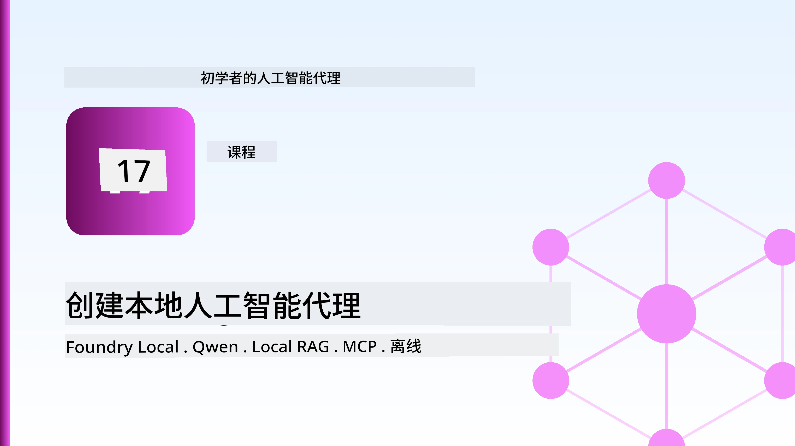
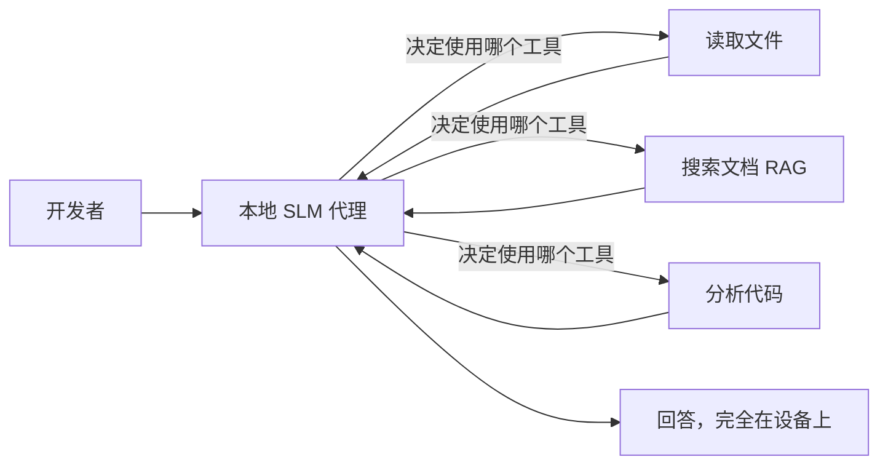
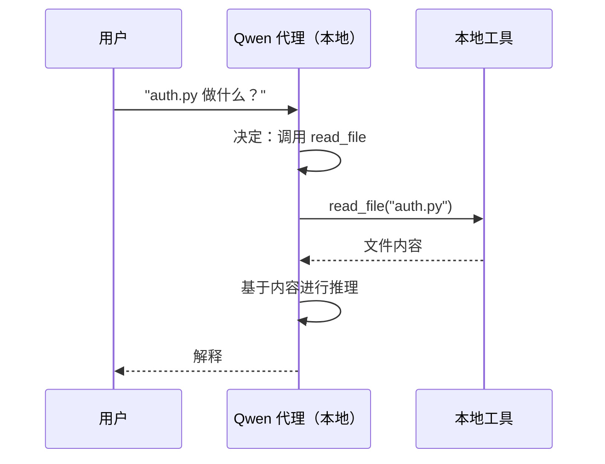
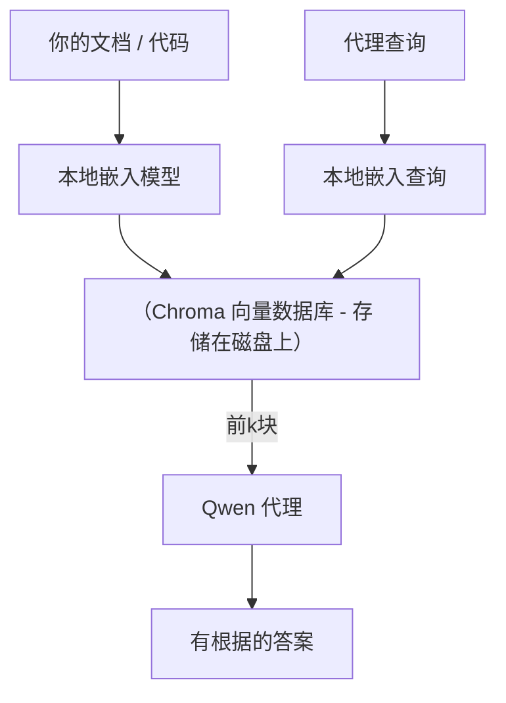
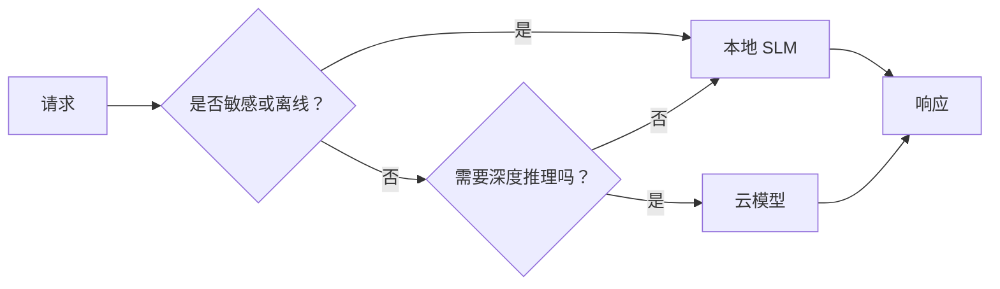

# 使用 Microsoft Foundry Local 和 Qwen 创建本地 AI 代理



上一课将代理扩展到了云端。本课则将它们带回到单机上。完成后，你将拥有一个能推理、调用工具、读取文件、搜索文档的工作中的工程助手——**无需任何云端推理调用。**

为什么要这样做？真实工程工作中经常遇到三个原因：

- **隐私。** 代码和文档永远不会离开本机。没有任何提示、代码片段或客户数据跨网络边界。
- **成本。** 本地推理不产生每 token 收费。你可以用电费价钱整天迭代。
- **离线。** 在飞机上、保密设施中或停电期间，代理依然工作。

代价是你以 CPU、GPU 或 NPU 上运行的<strong>小型语言模型 (SLM)</strong> 取代前沿的云端大模型。本课重点是构建在这个限制下<em>表现良好</em>的代理，而不是假装限制不存在。

## 简介

本课内容包括：

- **小型语言模型 (SLMs)**——它们是什么、适合做什么、不适合做什么。
- **Microsoft Foundry Local**——一个在设备上下载并服务模型的运行时，支持<strong>兼容 OpenAI 的 API</strong>。
- **Qwen 函数调用模型**——SLMs 能可靠地产生工具调用，是本地<em>代理</em>（而非仅本地聊天）成为可能的关键。
- **本地工具、本地 RAG 以及本地 MCP**——赋予代理无需云端即可工作的能力。
- <strong>混合模式</strong>——何时保持本地，何时调用云端。

## 学习目标

完成本课后，你将能够：

- 解释 SLM 的权衡并选择合适的本地代理场景。
- 通过 Foundry Local 本地服务 Qwen 模型，并通过兼容 OpenAI 的端点连接。
- 构建一个完全在工作站上运行的工具调用代理。
- 使用本地向量数据库（Chroma）为自己的文档添加本地 RAG。
- 连接代理到本地 MCP 服务器，并推断本地/云混合设计。

## 前置条件

本课假设你已经完成之前的课程，熟悉：

- [工具使用](../04-tool-use/README.md) (第4课) 和 [Agentic RAG](../05-agentic-rag/README.md) (第5课)。
- [Agentic 协议 / MCP](../11-agentic-protocols/README.md) (第11课)。
- [Microsoft 代理框架](../14-microsoft-agent-framework/README.md) (第14课)。

你还需要：

- 一台开发工作站。**8 GB RAM 是实际最低要求**；16 GB 以上更舒适。有 GPU 或 NPU 有帮助，但非必须。
- 安装 **Microsoft Foundry Local**（见下文安装部分）。
- Python 3.12+ 及仓库中的依赖包 [`requirements.txt`](../../../requirements.txt)，本课还需安装 `foundry-local-sdk`、`openai` 和 `chromadb`。

## 小型语言模型：本地工作的正确工具

一个前沿云端模型有数千亿参数和数据中心支撑。SLM 有几个亿参数，必须适配你笔记本的内存。这个差异带来明确的预期。

**SLM 擅长：**

- 结构化、有边界的任务——分类、抽取、已知文档的摘要。
- <strong>工具调用</strong>——决策调用哪个函数及参数。
- 在你自己的数据上快速、廉价且私密的迭代。

**SLM 不擅长：**

- 开放式、多跳、多上下文的推理。
- 宽泛的世界知识（见闻有限，遗忘多）。

因此，本地代理的制胜策略是：**让 SLM 负责编排，工具负责繁重工作。** 模型不需要<em>懂</em>你的代码库——它需要知道何时调用 `read_file` 和 `search_docs`。这正是 SLM 的优势所在。



## Microsoft Foundry Local

**Microsoft Foundry Local** 是一个轻量级运行时，能在你机器上完全下载、管理和服务模型。对我们最重要的功能是它暴露了<strong>兼容 OpenAI 的 HTTP 端点</strong>——这意味着 OpenAI SDK 和 Microsoft 代理框架的 OpenAI 客户端只需更改 `base_url` 即可对接。你关于构建代理学到的一切都能直接迁移；唯一变化是端点从云变成了 `localhost`。

Foundry Local 还能自动为你的硬件选择最佳模型构建——CPU 构建、CUDA/GPU 构建或 NPU 构建——无需你为每台机器手动优化。

### 安装

安装 Foundry Local（见你的操作系统的[文档](https://learn.microsoft.com/azure/ai-foundry/foundry-local/)），然后确认其功能正常：

```bash
# 安装（示例；请参考您的平台文档）
winget install Microsoft.FoundryLocal      # Windows
# brew install microsoft/foundrylocal/foundrylocal   # macOS

# 下载并运行Qwen模型，然后启动本地服务
foundry model run qwen2.5-7b-instruct
foundry service status
```

服务启动后，你就拥有了本地的兼容 OpenAI 端点（通常是 `http://localhost:PORT/v1`）。笔记本使用 `foundry-local-sdk` 自动发现端点，无需硬编码端口。

## Qwen 函数调用：重要性所在

代理只有能调用工具才是真正的代理。许多 SLM 可以聊天，但无法可靠生成标准格式的工具调用。**Qwen** 模型专门训练用于函数调用，稳定输出格式良好的工具调用结构——这正是让本地聊天模型成为本地<em>代理</em>的关键。

流程是你熟悉的标准工具调用循环，只是运行在设备上：



## 本地 RAG

文档检索是本地代理的立足之地。不是指望 SLM 记住框架文档，而是把文档嵌入到<strong>本地向量数据库</strong>，让代理按需检索相关片段。

我们使用 **Chroma**，它是一个嵌入式向量库，运行在进程内，无需服务器管理。数据流完全本地：本地嵌入模型 → 本地向量 → 本地检索 → 本地 SLM。



这与第5课的 Agentic RAG 模式相同——唯一变化是各组件都运行在你机器上。

## 本地 MCP 服务器

[MCP](../11-agentic-protocols/README.md) 是一种传输协议，不是云服务。MCP 服务器可以作为本地进程运行于 `stdio`，通过标准协议向代理暴露工具。这让你可以离线复用日益丰富的 MCP 服务器生态——文件系统访问、git 操作、数据库查询等。

本地的安全策略不同于云端，但并非不存在：本地 MCP 服务器仍以你的用户权限运行，因此应限制其访问范围（项目目录，而非整个家目录）并将其输出视为输入，进行验证。

## 混合云+本地模式

本地优先不等于只能本地。成熟系统会根据敏感程度和难度分流：

| 场景 | 运行位置 |
| --- | --- |
| 敏感代码/数据，或离线时 | **本地 SLM** |
| 简单、有边界的任务 | **本地 SLM**（廉价、快速） |
| 非敏感数据的复杂多跳推理 | <strong>云端模型</strong> |
| 故障期间 | **本地 SLM**（优雅降级） |

这映射了第16课的<strong>模型路由</strong>理念——区别在于“模型”之一是你的本地机器。健壮设计是云不可用时回退到本地，让代理质量下降而非完全失败。



## 实操实验：本地工程助理

打开 [`code_samples/17-local-agent-foundry-local.ipynb`](./code_samples/17-local-agent-foundry-local.ipynb) 并完成实验。你将构建一个<strong>完全运行在工作站上的本地工程助理</strong>，能够：

1. <strong>工具调用</strong>——通过 Foundry Local 使用 Qwen 函数调用。
2. <strong>本地文件操作</strong>——列出和读取项目目录文件。
3. <strong>代码分析</strong>——对源文件报告基本指标。
4. <strong>文档搜索</strong>——使用 Chroma 在本地文档文件夹上进行 RAG。
5. **使用 MCP**——连接到本地 MCP 服务器（未配置时优雅跳过）。

期间完全不使用云端推理。

### 解析指导

助理通过兼容 OpenAI 的端点连接 Foundry Local，代理代码几乎和云端课程完全一致——唯一变化是客户端：

```python
from foundry_local import FoundryLocalManager
from openai import OpenAI

# Foundry Local 发现/下载模型并为我们提供本地端点。
manager = FoundryLocalManager(\"qwen2.5-7b-instruct\")
client = OpenAI(base_url=manager.endpoint, api_key=manager.api_key)  # api_key 是本地占位符
```

工具是普通的 Python 函数，限制在项目目录内：

```python
def read_file(path: str) -> str:
    \"\"\"Read a file, but only inside the sandboxed project directory.\"\"\"
    full = (PROJECT_ROOT / path).resolve()
    if PROJECT_ROOT not in full.parents and full != PROJECT_ROOT:
        return \"Access denied: path is outside the project directory.\"
    return full.read_text(encoding=\"utf-8\")
```

注意沙箱检查——即使本地，读取任意路径的工具也是风险。笔记本将所有工具均限定在单一项目根目录。

## 知识检测

在做作业前测试你的理解。

**1. 给出在本地运行代理而非云端的两个具体理由。**

<details>
<summary>答案</summary>

任选两项：<strong>隐私</strong>（代码和数据永远不离机）、<strong>成本</strong>（无每 token 推理计费）和<strong>离线能力</strong>（无网络也能工作，如飞机、保密设施或停电时）。法律/合规限制禁止传输数据设备外，往往是隐私驱动的主要原因。
</details>

**2. SLM 与其工具在本地代理中的推荐分工是什么，为什么？**

<details>
<summary>答案</summary>

让 SLM <strong>负责编排</strong>（决定调用哪个工具及参数），让<strong>工具负责繁重工作</strong>（读文件、取文档、计算结果）。SLM 擅长有限决策如工具选择，不擅长广泛知识和长多步推理，因此依赖工具发挥优势。
</details>

**3. 是什么使我们能用 Foundry Local 复用云端代理代码？**

<details>
<summary>答案</summary>

Foundry Local 暴露了<strong>兼容 OpenAI 的 HTTP 端点</strong>。OpenAI SDK 和代理框架的 OpenAI 客户端只需修改 `base_url`（并用本地占位 API key）便可使用。代理代码其他部分保持不变。
</details>

**4. 为什么具体使用 Qwen 函数调用模型，而非任意 SLM？**

<details>
<summary>答案</summary>

因为代理必须生成可靠且格式良好的<strong>工具调用</strong>。许多 SLM 可聊天，但产生格式错误或不一致的工具调用。Qwen 模型专注函数调用训练，产出一致的工具调用，是本地聊天模型变工作代理的关键。
</details>

**5. 在本地 RAG 流程中，哪些组件运行在机器上？**

<details>
<summary>答案</summary>

全部：嵌入模型、向量数据库（磁盘上的 Chroma）、检索步骤和 SLM。文档本地嵌入、本地存储、本地检索、本地模型推理——无组件接触云端。
</details>

**6. 本地 MCP 服务器运行在你机器上，这是否自动意味着它安全？还需采取什么预防措施？**

<details>
<summary>答案</summary>

不是。它以你的用户权限运行，因此能访问你能访问的一切。应限制其范围（如仅限某项目目录，而非整个家目录），并将其输出视为输入，验证后再操作。
</details>

**7. 描述包含本地模型的合理混合路由规则。**

<details>
<summary>答案</summary>

将敏感或离线请求路由到本地 SLM；将简单有边界任务路由到本地 SLM（快速、廉价）；将非敏感数据上的复杂多跳推理路由到云模型；云不可用时回退本地 SLM，使代理优雅降级而非失败。这是第16课模型路由思想，本地机器作为其中一个模型。
</details>

**8. 本课本地代理运行的实际最低内存需求是多少？更多内存带来什么？**

<details>
<summary>答案</summary>

实际最低约 **8 GB**；16 GB 以上更舒适。更多内存允许运行更大更强模型，保持更多上下文。GPU 或 NPU 加速推理，但非必须——无加速时 Foundry Local 选择 CPU 版本。
</details>

## 作业

将本地工程助理扩展成一个你选小项目的<strong>本地文档审阅器</strong>（可用本仓库的任一课程文件夹）。

你的提交应包含：

1. 把真实的文档/代码文件夹索引入 Chroma（至少五个文件）。
2. 添加一个 `find_todos` 工具，扫描项目中的 `TODO`/`FIXME` 注释并返回文件和行号——保持与 `read_file` 一样的沙箱检查。

3. <strong>向代理提三个问题</strong>，迫使它结合使用工具：一个纯RAG问题，一个需要阅读特定文件的问题，以及一个需要查找TODO的问题。
4. <strong>测量它</strong>：记录三个回答的时间，并在markdown单元中注明。评论延迟是否符合您预期的工作流程。

然后写一段简短的文字，说明<strong>您会将哪些内容迁移到云端，哪些内容保留在本地</strong>，以及原因。评估重点是本地组件是否正确连接，以及混合推理是否合理——而非模型质量。

## 总结

在本课中，您构建了一个完全在自己电脑上运行的代理：

- **SLMs** 以隐私、成本和离线操作为代价换取广度——当它们<strong>编排工具</strong>而不是自身承载所有知识时，表现尤为出色。
- **Foundry Local** 在设备上通过一个<strong>兼容OpenAI的端点</strong>提供模型，因此您的云端代理代码只需一行改动即可迁移。
- <strong>Qwen函数调用模型</strong>使得本地工具调用变得可靠，因此本地<em>代理</em>成为可能。
- **本地RAG**（Chroma）和<strong>本地MCP</strong>赋予代理不离开机器的能力。
- <strong>混合模式</strong>让您根据敏感性和难度路由，以本地作为优雅的回退方案。

这完成了部署过程：第16课将代理扩展到了Microsoft Foundry，本课则将它们缩减到了单个工作站。下一课将聚焦于保持已经部署代理的安全。

## 附加资源

- <a href="https://learn.microsoft.com/azure/ai-foundry/foundry-local/" target="_blank">Microsoft Foundry Local 文档</a>
- <a href="https://learn.microsoft.com/azure/ai-foundry/what-is-azure-ai-foundry" target="_blank">Microsoft Foundry 文档</a>
- <a href="https://aka.ms/ai-agents-beginners/agent-framework" target="_blank">Microsoft Agent Framework</a>
- <a href="https://qwen.readthedocs.io/en/latest/framework/function_call.html" target="_blank">Qwen函数调用文档</a>
- <a href="https://modelcontextprotocol.io/" target="_blank">模型上下文协议 (MCP)</a>
- <a href="https://docs.trychroma.com/" target="_blank">Chroma向量数据库</a>

## 上一课

[部署可扩展代理](../16-deploying-scalable-agents/README.md)

## 下一课

[保障AI代理安全](../18-securing-ai-agents/README.md)

---

<!-- CO-OP TRANSLATOR DISCLAIMER START -->
**免责声明**：
本文件由 AI 翻译服务 [Co-op Translator](https://github.com/Azure/co-op-translator) 翻译完成。尽管我们力求准确，但请注意，自动翻译可能包含错误或不准确之处。原始语言版文件应视为权威来源。对于重要信息，建议使用专业人工翻译。我们对因使用本翻译而产生的任何误解或误释不承担责任。
<!-- CO-OP TRANSLATOR DISCLAIMER END -->