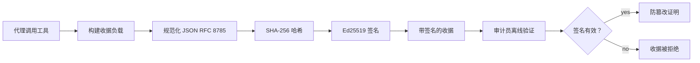
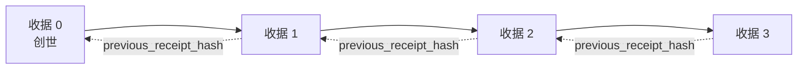

[观看课程视频：利用加密收据保障 AI 代理安全](https://youtu.be/PLACEHOLDER_VIDEO_ID)

> _(课程视频和缩略图将在合并后由微软内容团队添加，符合第14/15课的模式。)_

# 利用加密收据保障 AI 代理安全

## 介绍

本课内容包括：

- 为什么 AI 代理的审计追踪对合规、调试和信任至关重要。
- 什么是加密收据，以及它与未签名日志行的区别。
- 如何使用纯 Python 生成代理工具调用的签名收据。
- 如何离线验证收据并检测篡改。
- 如何链式连接收据，以便移除或重新排序其中一个会破坏整个链条。
- 收据能证明什么，明确不能证明什么。

## 学习目标

完成本课后，您将掌握：

- 识别促使代理动作采用加密溯源的失败模式。
- 生成基于 Ed25519 签名的标准 JSON 负载收据。
- 仅使用签名者的公钥独立验证收据。
- 通过对修改后的收据重新进行验证检测篡改。
- 构建基于哈希链的收据序列，并解释链条的重要性。
- 识别收据能证明的界限（归属、完整性、顺序）与不能证明的界限（操作正确性、策略合理性）。

## 问题所在：代理的审计追踪

设想您已为 Contoso Travel 部署了一个 AI 代理。该代理读取客户请求，调用航班 API 查询选项，并代表客户预订座位。上季度，该代理处理了 50,000 次预订。

今天一位审计员来了。他们问了一个简单的问题：“给我看一下您的代理做了什么。”

您递交了日志文件。审计员看了看又问了一个更难的问题:“我怎么知道这些日志没有被篡改过？”

这就是审计追踪问题。如今大多数代理部署依赖：

- <strong>应用日志</strong>：由代理自身写入，任何有文件系统访问权限的人都可编辑。
- <strong>云日志服务</strong>：在平台层面有防篡改功能，但前提是审计员信任平台运营商。
- <strong>数据库事务日志</strong>：适合数据库变更，但不适合任意工具调用。

这些都无法在无需审计员信任某人（您、云提供商或数据库供应商）的情况下解答审计员的问题。对内部使用来说，这种信任通常可以接受，但对于受监管的工作负载（金融、医疗、受欧盟 AI 法案约束的）则不行。

加密收据通过使每个代理操作都能独立验证，解决了这个问题。审计员无需信任您，只需您的公钥和收据本身。

## 什么是加密收据？

收据是记录代理所做操作的 JSON 对象，并带有数字签名。



一个最简收据示例如下：

```json
{
  "type": "agent.tool_call.v1",
  "agent_id": "contoso-travel-bot",
  "tool_name": "lookup_flights",
  "tool_args_hash": "sha256:a3f9c1...",
  "result_hash": "sha256:7b2e1d...",
  "policy_id": "contoso-travel-policy-v3",
  "timestamp": "2026-04-25T14:30:00Z",
  "sequence": 47,
  "previous_receipt_hash": "sha256:9d4e6a...",
  "signature": {
    "alg": "EdDSA",
    "sig": "c5af83...",
    "public_key": "8f3b2c..."
  }
}
```

有三个属性发挥作用：

1. <strong>签名</strong>。收据由代理网关使用 Ed25519 私钥签名。任何拥有对应公钥的人都可以离线验证签名。篡改任何字段都会使签名无效。

2. <strong>规范编码</strong>。签名前，收据通过 JSON 规范化方案（JCS，RFC 8785）序列化。这确保两种实现只要逻辑上相同，其字节输出完全一致。若无规范化，不同的 JSON 序列化器会为相同内容生成不同签名。

3. <strong>哈希链</strong>。`previous_receipt_hash` 字段将每个收据连接到前一个。移除或重新排序其中一张收据会破坏之后所有收据。即使单个签名被绕过，链条级别的篡改也能被发现。

这些属性综合提供三大保障：

- <strong>归属</strong>：该密钥签署了该内容。
- <strong>完整性</strong>：内容自签署以来未被更改。
- <strong>顺序</strong>：这张收据在链中位于那张收据之后。

## 用 Python 生成收据

生成收据不需要特别的库。加密原语普遍可用，其逻辑仅几十行 Python 代码。

`code_samples/18-signed-receipts.ipynb` 中的动手练习演示了完整流程。总结如下：

```python
import json
import hashlib
import base64
from nacl import signing
from jcs import canonicalize  # RFC 8785 规范JSON

def b64url_nopad(data: bytes) -> str:
    return base64.urlsafe_b64encode(data).decode("ascii").rstrip("=")

def sha256_canonical(obj) -> str:
    """SHA-256 of a Python object's JCS-canonical JSON form."""
    return f"sha256:{hashlib.sha256(canonicalize(obj)).hexdigest()}"

# 生成或加载签名密钥（生产环境中存储在密钥库中）
signing_key = signing.SigningKey.generate()
verify_key = signing_key.verify_key

# 构建收据负载（还未签名）
tool_args = {"origin": "SYD", "destination": "LAX"}
tool_result = [{"flight": "QF11", "price": 1850, "stops": 0}]

payload = {
    "type": "agent.tool_call.v1",
    "agent_id": "contoso-travel-bot",
    "tool_name": "lookup_flights",
    "tool_args_hash": sha256_canonical(tool_args),
    "result_hash": sha256_canonical(tool_result),
    "policy_id": "contoso-travel-policy-v3",
    "timestamp": "2026-04-25T14:30:00Z",
    "sequence": 0,
    "previous_receipt_hash": None,
}

# 规范化，哈希，签名。
canonical_bytes = canonicalize(payload)
message_hash = hashlib.sha256(canonical_bytes).digest()
signature_bytes = signing_key.sign(message_hash).signature

# 附加结构化签名对象。
receipt = {
    **payload,
    "signature": {
        "alg": "EdDSA",
        "sig": b64url_nopad(signature_bytes),
        "public_key": b64url_nopad(bytes(verify_key)),
    },
}
```

这就是全部签名流程。笔记本会带你逐步演示每个步骤。

## 验证收据与检测篡改

验证是逆向操作：

```python
import base64
import hashlib
from nacl import signing
from nacl.exceptions import BadSignatureError
from jcs import canonicalize

def b64url_decode(s: str) -> bytes:
    padding = "=" * ((4 - len(s) % 4) % 4)
    return base64.urlsafe_b64decode(s + padding)

def verify_receipt(receipt: dict) -> bool:
    # 签名是一个结构化对象：{"alg", "sig", "public_key"}。
    sig_obj = receipt.get("signature")
    if not sig_obj or sig_obj.get("alg") != "EdDSA":
        return False

    # 重建实际被签名的负载（除签名外的所有内容）。
    payload = {k: v for k, v in receipt.items() if k != "signature"}

    canonical_bytes = canonicalize(payload)
    message_hash = hashlib.sha256(canonical_bytes).digest()

    try:
        verify_key = signing.VerifyKey(b64url_decode(sig_obj["public_key"]))
        verify_key.verify(message_hash, b64url_decode(sig_obj["sig"]))
        return True
    except BadSignatureError:
        return False
```

此函数接受一个收据，如果签名有效，返回 `True`，否则返回 `False`。无网络调用，无服务依赖，无需信任第三方。

为了演示篡改检测，笔记本演示了：

1. 生成有效收据并确认其验证通过。
2. 修改 `tool_args_hash` 字段中的一个字节。
3. 重新运行验证，验证失败。

这实际演示了收据的防篡改能力：任何修改，不论多小，都会破坏签名。

## 为多步骤代理链式连接收据

一张签名收据保护一个动作，一串收据保护一系列动作。



每张收据记录前一张收据的哈希。要悄无声息地移除第二张收据，攻击者必须：

- 修改第 3 张收据的 `previous_receipt_hash` 字段（会破坏第 3 张收据的签名），或
- 伪造修改后第 3 张收据的新签名（需要代理的私钥）。

如果私钥存储在硬件密钥库中，且您发布的每张收据都携带公钥，以上攻击均无法在不被发现的情况下实现。

笔记本演示了：

1. 构建一条包含三张收据的链。
2. 验证每张收据的 `previous_receipt_hash` 是否匹配前一张收据的实际哈希。
3. 篡改中间一张收据，链条正好在该处断裂。

这就是如何构建外部审计员无需信任您即可验证的审计追踪。

## 收据能证明什么（不能证明什么）

这是本课最重要的部分。收据很强大，但其能力有限。

**收据能证明三件事：**

1. <strong>归属</strong>：特定密钥签署了特定负载。
2. <strong>完整性</strong>：负载自签署后未被更改。
3. <strong>顺序</strong>：该收据在哈希链中排在那张收据之后。

**收据不能证明：**

1. <strong>正确性</strong>：代理操作是否正确。错误答案的收据签名与正确答案的签名同样完整。
2. <strong>策略合规</strong>：`policy_id` 中的策略是否实际被评估，或即使检查过，是否会允许该操作。收据记录的是声明内容，而非执行结果。
3. <strong>密钥以外的身份</strong>：收据说明“该密钥签署此内容”，但不说明“某人批准此操作”。将密钥与人或组织关联需另建身份基础设施（目录、公钥注册表等）。
4. <strong>输入真实性</strong>：如果代理接受了被篡改的提示并据此行动，收据忠实记录了该行为。收据是输入验证之后的产物，不能替代输入验证。

这个边界很重要，原因有二：

- 它告诉你收据的作用：使代理行为可审计且防篡改，跨组织边界亦然。
- 它告诉你还需要哪些额外层次：输入验证（第6课）、策略执行（稍后简述）和身份基础设施（超出本课范围）。

一个常见错误是假设“有收据”即意味着“受治理”。事实并非如此。收据是基础，治理是你建立的体系。

## 证明人类批准了具体操作

上文第三点值得单独成章：一张操作收据说明“该密钥签署此内容”，但绝不表述“某人批准此操作”。对高风险操作（退款、删除、电汇），治理框架越来越要求提供这份缺失声明，且使用本课已有的原语即可实现。

后续笔记本 `code_samples/human-authorization-receipts.ipynb` 新增一种收据类型 `human.approval.v1`，其包封格式与本课收据相同（带类型的负载，通过 Ed25519 对规范化的 SHA-256 摘要签名，且 `signature` 对象位于签名字节之外）。被命名的审批人先签署<strong>完整规范操作及其摘要</strong>，执行前；代理的操作收据携带<strong>相同的操作摘要</strong>及 `parent_approval_ref`，即该批准收据的 `receipt_hash`，采用与链中 `previous_receipt_hash` 相同的约定。一个 `verify_chain` 函数将两个收据在<strong>分开的固定公钥注册表</strong>（审批人和代理人公钥）下验证，代码路径相同，权威方不同。

其属性经过谨慎表述：*人类批准了这确切操作，代理执行了完全批准的操作。* 笔记本中针对拒绝情形的测试用例使该属性真实（非口头）：

- 经典问题集：篡改、误导代理、重放、双方伪造密钥、格式错误输入；
- <strong>过期权威</strong>：签名仍验证成功，但因策略版本变更、审批公钥从固定注册表中撤销或批准已过期而被拒绝；
- <strong>摘要替换</strong>：有效签名的操作收据指向捆绑了<em>不同</em>规范操作的<em>真实</em>批准。

每种失败都有独特理由，审计员看到拒绝便知是权威过期还是执行内容变动。笔记本教你的规则是：签名的批准本身不构成权威。权威仅在执行时两个收据仍捆绑到相同规范操作时成立。同一互联网草案（`draft-farley-acta-signed-receipts`）中的联签方案是该模式的标准轨形态。

## 生产环境参考

本课 Python 代码刻意精简，让你读懂每行代码完整含义。生产环境可选两种方案：

1. **直接基于加密原语搭建。** 前面展示的 50 行代码应付许多场景足够。PyNaCl（Ed25519）和 `jcs` 包（规范 JSON）都是维护良好的审计库。

2. **使用生产用收据库。** 若干开源项目实现了相同模式并加添附加功能（密钥轮换、批量验证、JWK 集分发、与策略引擎整合）：
   - 本课使用的收据格式遵循正在标准化过程中的 IETF 互联网草案（[`draft-farley-acta-signed-receipts`](https://datatracker.ietf.org/doc/draft-farley-acta-signed-receipts/)，修订02），且有共享合规套件（[agent-governance-testvectors](https://github.com/ScopeBlind/agent-governance-testvectors)），独立实现可交叉验证字节一致的规范输出。
   - 微软代理治理工具包将收据与基于 Cedar 的策略决策组合；详见该仓库教程33，涵盖端到端示例。
   - `protect-mcp` （npm）和 `@veritasacta/verify` （npm）包提供了基于 Node 的收据签名及离线验证实现，可包装任何 MCP 服务器生成防篡改审计链，包括支持的共签流程——暂停操作发出绑定操作摘要的批准收据（桌面流程中基于 WebAuthn），与上述人类授权笔记本采用的批准收据方案相同。
   - **[nobulex](https://github.com/arian-gogani/nobulex)** Python SDK（`pip install nobulex`）在 Python 中实现相同的 Ed25519 + JCS 签名模式，集成了 LangChain 和 CrewAI，包含发布的交叉验证测试向量，并通过 [OWASP PR #2210](https://github.com/OWASP/CheatSheetSeries/pull/2210) 提供合规映射。

自建或用库的选择，与写自己的 JWT 库或用成熟库的抉择一样合理；用库节省时间、降低审计风险，自写则促使彻底理解每个原语。本课教学采用自写路径，奠定两者的基础。

## 知识检测

在进入练习前检验你的理解。

**1. 收据使用代理私钥 Ed25519 签名，审计员只有公钥。审计员能否离线验证收据？**

<details>
<summary>答案</summary>

能。Ed25519 验证只需公钥和签名字节。无网络调用，无服务依赖。此特性使收据适用于隔离环境、多组织或低信任审计。
</details>

**2. 攻击者篡改收据的 `policy_id` 字段，声称由更宽松的策略管辖。签名仍基于原始负载。验证时会发生什么？**

<details>
<summary>答案</summary>


验证失败。签名是针对原始负载的规范字节计算的；修改任何字段都会改变规范字节，进而改变 SHA-256 哈希值，使签名无效。攻击者需要私钥才能生成新的有效签名，而他们没有私钥。
</details>

**3. 为什么收据包含 `tool_args_hash` 和 `result_hash` 而不是原始参数和结果？**

<details>
<summary>答复</summary>

有两个原因。首先，收据可能需要存档或在泄露原始内容（PII、业务数据）会有问题的环境中传输。哈希保持收据体积小且内容私密；审核员验证哈希是否与单独存储的实际内容副本匹配。其次，哈希具有固定大小；无论输入和输出多大，有哈希的收据大小都有界限。
</details>

**4. `previous_receipt_hash` 字段将每个收据与其前一个收据链接。如果攻击者悄悄删除链中间的一个收据，会导致什么变得无效？**

<details>
<summary>答复</summary>

删除之后的每一个收据。它们的 `previous_receipt_hash` 字段将不再匹配实际链（因为它们引用的收据已不存在，或者链现在指向了不同的前驱）。为了掩盖删除行为，攻击者必须重新签署之后的每个收据，这需要私钥。
</details>

**5. 一个收据验证通过。这是否证明代理的行为是正确的、合理的或符合政策的？**

<details>
<summary>答复</summary>

不是。有效的收据证明三件事：归属（此密钥签署了此内容）、完整性（内容未被修改）和排序（此收据在那收据之后）。它不证明该行为是正确的、`policy_id` 中命名的政策实际上被评估过，或代理遵守了所有规则。收据使代理行为可审计，但不一定正确。这是本课程最重要的界限。
</details>

## 练习题

打开 `code_samples/18-signed-receipts.ipynb` 并完成以下四个部分：

1. <strong>第一部分</strong>：签署你的第一个收据，并验证它。
2. <strong>第二部分</strong>：篡改收据并观察验证失败。
3. <strong>第三部分</strong>：建立三份收据链并验证链的完整性。
4. <strong>第四部分</strong>：将该模式应用于使用 Microsoft Agent Framework 构建的代理：在调用工具时进行收据签名，然后独立验证收据。

**拓展挑战 1:** 在收据模式中添加一个你自己选择的字段（比如用于追踪的请求 ID），更新规范签名逻辑以包括它，并确认收据仍能通过验证。然后签名后修改该字段并确认验证失败。这迫使你理解规范编码的每个字节如何影响签名。

**拓展挑战 2:** 对两份收据的规范字节进行 SHA-256 哈希（以确定顺序连接字节），将所得摘要作为新字段嵌入第三份收据中后签名。验证三份收据仍能通过验证。你刚建立了一步包含证明：任何持有第三份收据的人均可证明第一和第二份在签署时存在，而无需公开其内容。这是选择性披露收据在大规模使用的模式（默克尔承诺，RFC 6962）。

## 结论

密码学收据为 AI 代理提供了如下审计轨迹：

- <strong>独立验证</strong>：任何拥有公钥的方都可以验证，无需依赖服务。
- <strong>防篡改</strong>：任何修改都会使签名无效。
- <strong>便携</strong>：收据是一个小型 JSON 文件；可在任何地方存档、传输和验证。
- <strong>符合标准</strong>：基于 Ed25519 (RFC 8032)、JCS (RFC 8785) 和 SHA-256，均为广泛部署的原语。

它们不能替代输入验证、政策执行或身份基础设施。它们是这些层的基础。当你将代理部署到受监管的工作负载、多组织工作流或任何未来审核者不可假设信任你的环境时，收据是让审计轨迹保持诚信的方式。

最重要的结论：收据证明谁在何时说了什么。它们不能证明所说内容是正确或真实的。务必紧记这一点。这是诚实溯源系统与误导性系统的区别。

## 生产检查清单

当你准备从本课过渡到在真实环境中部署签名收据代理时：

- [ ] **将签名密钥移离开发者笔记本。** 使用 Azure Key Vault、AWS KMS 或硬件安全模块。签署收据的私钥决不应存在源代码控制或应用机器的明文中。
- [ ] **发布验证公钥。** 审核人员需要离线验证。标准模式是将 JWK 集放置在知名 URL（RFC 7517），例如 `https://your-org.example.com/.well-known/agent-keys.json`。
- [ ] **外部锚定链头。** 定期将最新链头哈希写入透明日志（Sigstore Rekor、RFC 3161 时间戳机构或第二个内部系统），以便外部方确认“此链在此时间存在”。
- [ ] **不可变地存储收据。** 追加式 blob 存储（Azure Storage 配合不可变性策略、AWS S3 对象锁）防止内部人员在存储层改写历史。
- [ ] **确定保留期限。** 许多合规要求多年度保留。计划收据增长（每份收据约 500 字节；代理每天调用 1 万次，每年产生约 1.8 GB）。
- [ ] **记录收据未涵盖内容。** 收据证明归属、完整性和排序。你的运行手册应明确列出额外的控制措施（输入验证、政策执行、限流、身份基础设施）以配合收据构成治理态势。

### 关于保障 AI 代理安全还有更多问题？

加入 [Microsoft Foundry Discord](https://aka.ms/ai-agents/discord)，结识其他学习者，参加答疑时间，获取 AI 代理问题的解答。

## 超越本课

本课涵盖单个收据签名和哈希链序列。随着治理态势成熟，你可能遇到的高级模式基于相同原语组合而成：

- **选择性披露。** 当收据字段独立承诺时（RFC 6962 风格的默克尔树），可向特定审核员单独披露某些字段，并证明其余字段未被更改且未被暴露。适用于同一收据需同时满足全面审计（要求完整性）和数据最小化法规（如 GDPR，要求审核员仅看到必要内容）。
- **收据撤销。** 如果签名密钥泄露，需要有方法标记该密钥签署的所有收据从某时间点起不可信。标准模式是短期签名密钥加发布撤销列表，或带撤销条目的透明日志。
- **双边/分割签名收据。** 一些实现将签名负载拆分为执行前（`authorization_*`）和执行后（`result_*`）两半，并分别签名，适用于授权决策和观察结果由不同演员或不同时间产生的情况。可在本课讲授的收据格式上叠加组合。
- **负载组合。** 收据封装了放入 `result_hash` 的字节。实际负载往往比单一次工具调用结果更丰富：决策前推理（模型预测、考虑的选项、证据及其完整性、风险姿态、问责链、关卡结果）均可存于负载内，通过单个收据封存。这保持收据格式简约，同时让负载模式按领域演进。
- **跨实现兼容。** 多个独立实现（Python、TypeScript、Rust、Go）交叉验证共享测试向量。如果你自行实现，验证已发布向量确认兼容性。
- **后量子迁移。** Ed25519 现被广泛部署但不抗量子。收据格式支持算法敏捷：当需要迁移时，`signature.alg` 字段可携带 `ML-DSA-65`（NIST 后量子签名标准）。规划签名双轨过渡期。

## 其他资源

- <a href="https://datatracker.ietf.org/doc/draft-farley-acta-signed-receipts/" target="_blank">IETF 互联网草案：用于机器对机器访问控制的签名决策收据</a>
- <a href="https://learn.microsoft.com/azure/ai-studio/responsible-use-of-ai-overview" target="_blank">负责任的 AI 概览 (Azure AI)</a>
- <a href="https://datatracker.ietf.org/doc/html/rfc8032" target="_blank">RFC 8032：爱德华兹曲线数字签名算法 (EdDSA)</a>
- <a href="https://datatracker.ietf.org/doc/html/rfc8785" target="_blank">RFC 8785：JSON 规范化方案 (JCS)</a>
- <a href="https://datatracker.ietf.org/doc/html/rfc6962" target="_blank">RFC 6962：证书透明度</a>（选择性披露收据使用的默克尔树构造）
- <a href="https://github.com/microsoft/agent-governance-toolkit/blob/main/docs/tutorials/33-offline-verifiable-receipts.md" target="_blank">Microsoft Agent Governance Toolkit，教程 33：离线可验证决策收据</a>
- <a href="https://github.com/ScopeBlind/agent-governance-testvectors" target="_blank">本课使用的收据格式跨实现兼容测试向量 (Apache-2.0)</a>
- <a href="https://pynacl.readthedocs.io/" target="_blank">PyNaCl 文档</a>（Python 中的 Ed25519）

## 上一课

[创建本地 AI 代理](../17-creating-local-ai-agents/README.md)

---

<!-- CO-OP TRANSLATOR DISCLAIMER START -->
**免责声明**：
本文件由 AI 翻译服务 [Co-op Translator](https://github.com/Azure/co-op-translator) 翻译完成。尽管我们力求准确，但请注意，自动翻译可能包含错误或不准确之处。原始语言版文件应视为权威来源。对于重要信息，建议使用专业人工翻译。我们对因使用本翻译而产生的任何误解或误释不承担责任。
<!-- CO-OP TRANSLATOR DISCLAIMER END -->