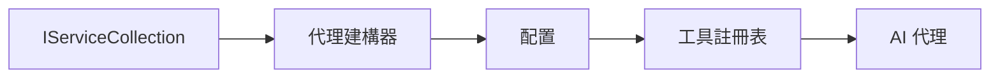

# 🎨 使用 Azure OpenAI（Responses API）(.NET) 的智能代理設計模式

## 📋 學習目標

此範例展示如何使用 .NET 中的 Microsoft Agent Framework 與 Azure OpenAI（Responses API）整合，建立企業級的智能代理設計模式。您將學習專業的模式和架構方法，使代理具備生產級的準備、可維護性和可擴展性。

### 企業設計模式

- 🏭 <strong>工廠模式</strong>：標準化的代理創建與依賴注入
- 🔧 <strong>建造者模式</strong>：流暢的代理配置與設置
- 🧵 <strong>線程安全模式</strong>：併發對話管理
- 📋 <strong>資料庫模式</strong>：工具與能力的有序管理

## 🎯 .NET 專屬架構優勢

### 企業功能

- <strong>強型別</strong>：編譯時驗證與 IntelliSense 支援
- <strong>依賴注入</strong>：內建 DI 容器整合
- <strong>配置管理</strong>：IConfiguration 與 Options 模式
- **Async/Await**：一流的非同步程式設計支援

### 生產就緒模式

- <strong>日誌整合</strong>：ILogger 與結構化日誌支援
- <strong>健康檢查</strong>：內建監控和診斷
- <strong>配置驗證</strong>：強型別與數據註解驗證
- <strong>錯誤處理</strong>：結構化例外管理

## 🔧 技術架構

### 核心 .NET 元件

- **Microsoft.Extensions.AI**：統一的 AI 服務抽象
- **Microsoft.Agents.AI**：企業級代理協調框架
- **Azure OpenAI（Responses API）**：高效能的 API 客戶端模式
- <strong>配置系統</strong>：appsettings.json 與環境整合

### 設計模式實作



## 🏗️ 展示的企業模式

### 1. <strong>創建型模式</strong>

- <strong>代理工廠</strong>：集中式代理創建與一致的配置
- <strong>建造者模式</strong>：用於複雜代理配置的流暢 API
- <strong>單例模式</strong>：共享資源與配置管理
- <strong>依賴注入</strong>：鬆耦合與可測試性

### 2. <strong>行為型模式</strong>

- <strong>策略模式</strong>：可互換的工具執行策略
- <strong>命令模式</strong>：封裝代理操作與復原／重做
- <strong>觀察者模式</strong>：事件驅動的代理生命週期管理
- <strong>模板方法</strong>：標準化的代理執行流程

### 3. <strong>結構型模式</strong>

- <strong>適配器模式</strong>：Azure OpenAI（Responses API）整合層
- <strong>裝飾者模式</strong>：代理能力增強
- <strong>外觀模式</strong>：簡化的代理互動介面
- <strong>代理模式</strong>：性能的延遲載入與快取

## 📚 .NET 設計原則

### SOLID 原則

- <strong>單一職責</strong>：每個元件有明確的單一目的
- <strong>開放封閉</strong>：可擴充但不修改
- <strong>里氏替換</strong>：基於介面的工具實作
- <strong>介面隔離</strong>：專注且內聚的介面
- <strong>依賴反轉</strong>：依賴抽象非具體實作

### 清晰架構

- <strong>領域層</strong>：核心代理與工具抽象
- <strong>應用層</strong>：代理協調與流程
- <strong>基礎設施層</strong>：Azure OpenAI（Responses API）整合與外部服務
- <strong>表示層</strong>：用戶互動與回應格式化

## 🔒 企業考慮事項

### 安全性

- <strong>憑證管理</strong>：使用 IConfiguration 安全管理 API 金鑰
- <strong>輸入驗證</strong>：強型別與資料註解驗證
- <strong>輸出淨化</strong>：安全的回應處理與過濾
- <strong>稽核日誌</strong>：全方位操作追蹤

### 性能

- <strong>非同步模式</strong>：非阻塞 I/O 操作
- <strong>連線池管理</strong>：高效 HTTP 用戶端管理
- <strong>快取</strong>：回應快取以提升性能
- <strong>資源管理</strong>：妥善釋放與清理模式

### 可擴展性

- <strong>線程安全</strong>：支援併發代理執行
- <strong>資源池化</strong>：高效資源利用
- <strong>負載管理</strong>：速率限制與背壓處理
- <strong>監控</strong>：性能指標與健康檢查

## 🚀 生產部署

- <strong>配置管理</strong>：環境特定設定
- <strong>日誌策略</strong>：結構化日誌與關聯 ID
- <strong>錯誤處理</strong>：全域例外處理與適當恢復
- <strong>監控</strong>：應用洞察與性能計數器
- <strong>測試</strong>：單元測試、整合測試與負載測試模式

準備好用 .NET 建立企業級智能代理了嗎？讓我們一起架構堅固穩健的系統吧！🏢✨

## 🚀 快速入門

### 先決條件

- [.NET 10 SDK](https://dotnet.microsoft.com/download/dotnet/10.0) 或更新版本
- 具有 Azure OpenAI 資源及模型部署的 [Azure 訂閱](https://azure.microsoft.com/free/)
- [Azure CLI](https://learn.microsoft.com/cli/azure/install-azure-cli) — 使用 `az login` 登入

### 必須的環境變數

```bash
# zsh/bash
export AZURE_OPENAI_ENDPOINT=https://<your-resource>.openai.azure.com
export AZURE_OPENAI_DEPLOYMENT=gpt-5-mini
# 然後登入，以便 AzureCliCredential 可以取得令牌
az login
```

```powershell
# PowerShell
$env:AZURE_OPENAI_ENDPOINT = "https://<your-resource>.openai.azure.com"
$env:AZURE_OPENAI_DEPLOYMENT = "gpt-5-mini"
# 然後登入以便 AzureCliCredential 可以獲取令牌
az login
```

### 範例程式碼

執行以下程式碼範例，

```bash
# zsh/bash
chmod +x ./03-dotnet-agent-framework.cs
./03-dotnet-agent-framework.cs
```

或者使用 dotnet CLI：

```bash
dotnet run ./03-dotnet-agent-framework.cs
```

完整程式碼請參考 [`03-dotnet-agent-framework.cs`](../../../../03-agentic-design-patterns/code_samples/03-dotnet-agent-framework.cs)。

```csharp
#!/usr/bin/dotnet run

#:package Microsoft.Extensions.AI@10.*
#:package Microsoft.Agents.AI.OpenAI@1.*-*
#:package Azure.AI.OpenAI@2.1.0
#:package Azure.Identity@1.13.1

using System.ComponentModel;

using Microsoft.Agents.AI;
using Microsoft.Extensions.AI;

using Azure.AI.OpenAI;
using Azure.Identity;

// Tool Function: Random Destination Generator
// This static method will be available to the agent as a callable tool
// The [Description] attribute helps the AI understand when to use this function
// This demonstrates how to create custom tools for AI agents
[Description("Provides a random vacation destination.")]
static string GetRandomDestination()
{
    // List of popular vacation destinations around the world
    // The agent will randomly select from these options
    var destinations = new List<string>
    {
        "Paris, France",
        "Tokyo, Japan",
        "New York City, USA",
        "Sydney, Australia",
        "Rome, Italy",
        "Barcelona, Spain",
        "Cape Town, South Africa",
        "Rio de Janeiro, Brazil",
        "Bangkok, Thailand",
        "Vancouver, Canada"
    };

    // Generate random index and return selected destination
    // Uses System.Random for simple random selection
    var random = new Random();
    int index = random.Next(destinations.Count);
    return destinations[index];
}

// Azure OpenAI with the Responses API (stable v1 endpoint). Sign in with `az login`.
var azureEndpoint = Environment.GetEnvironmentVariable("AZURE_OPENAI_ENDPOINT")
    ?? throw new InvalidOperationException("AZURE_OPENAI_ENDPOINT is not set.");
var deployment = Environment.GetEnvironmentVariable("AZURE_OPENAI_DEPLOYMENT") ?? "gpt-5-mini";

var azureClient = new AzureOpenAIClient(new Uri(azureEndpoint), new AzureCliCredential());

// Define Agent Identity and Comprehensive Instructions
// Agent name for identification and logging purposes
var AGENT_NAME = "TravelAgent";

// Detailed instructions that define the agent's personality, capabilities, and behavior
// This system prompt shapes how the agent responds and interacts with users
var AGENT_INSTRUCTIONS = """
You are a helpful AI Agent that can help plan vacations for customers.

Important: When users specify a destination, always plan for that location. Only suggest random destinations when the user hasn't specified a preference.

When the conversation begins, introduce yourself with this message:
"Hello! I'm your TravelAgent assistant. I can help plan vacations and suggest interesting destinations for you. Here are some things you can ask me:
1. Plan a day trip to a specific location
2. Suggest a random vacation destination
3. Find destinations with specific features (beaches, mountains, historical sites, etc.)
4. Plan an alternative trip if you don't like my first suggestion

What kind of trip would you like me to help you plan today?"

Always prioritize user preferences. If they mention a specific destination like "Bali" or "Paris," focus your planning on that location rather than suggesting alternatives.
""";

// Create AI Agent with Advanced Travel Planning Capabilities
// Get the Responses client for the deployment and create the AI agent
// Configure agent with name, detailed instructions, and available tools
// This demonstrates the .NET agent creation pattern with full configuration
AIAgent agent = azureClient
    .GetChatClient(deployment)
    .AsAIAgent(
        name: AGENT_NAME,
        instructions: AGENT_INSTRUCTIONS,
        tools: [AIFunctionFactory.Create(GetRandomDestination)]
    );

// Create New Conversation Session for Context Management
// Initialize a new conversation session to maintain context across multiple interactions
// Sessions enable the agent to remember previous exchanges and maintain conversational state
// This is essential for multi-turn conversations and contextual understanding
var session = await agent.CreateSessionAsync();

// Execute Agent: First Travel Planning Request
// Run the agent with an initial request that will likely trigger the random destination tool
// The agent will analyze the request, use the GetRandomDestination tool, and create an itinerary
// Using the session parameter maintains conversation context for subsequent interactions
await foreach (var update in agent.RunStreamingAsync("Plan me a day trip", session))
{
    await Task.Delay(10);
    Console.Write(update);
}

Console.WriteLine();

// Execute Agent: Follow-up Request with Context Awareness
// Demonstrate contextual conversation by referencing the previous response
// The agent remembers the previous destination suggestion and will provide an alternative
// This showcases the power of conversation sessions and contextual understanding in .NET agents
await foreach (var update in agent.RunStreamingAsync("I don't like that destination. Plan me another vacation.", session))
{
    await Task.Delay(10);
    Console.Write(update);
}
```

---

<!-- CO-OP TRANSLATOR DISCLAIMER START -->
**免責聲明**：
本文件由 AI 翻譯服務 [Co-op Translator](https://github.com/Azure/co-op-translator) 翻譯而成。雖然我們致力於確保準確性，但請注意，機器自動翻譯可能包含錯誤或不準確之處。原始文件的母語版本應被視為權威來源。對於重要資訊，建議進行專業人工翻譯。我們不對因使用本翻譯而產生的任何誤解或誤釋承擔責任。
<!-- CO-OP TRANSLATOR DISCLAIMER END -->