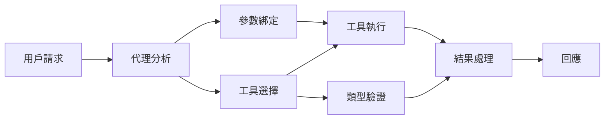

# 🛠️ 使用 Azure OpenAI（Responses API）進階工具使用示範 (.NET)

## 📋 學習目標

本筆記本示範如何在 .NET 中使用 Microsoft Agent Framework 與 Azure OpenAI（Responses API）整合企業等級的工具模式。您將學會建構具多種專業化工具的高級代理，利用 C# 強類型與 .NET 企業級功能。

### 您將掌握的進階工具功能

- 🔧 <strong>多工具架構</strong>：建構具多重專長功能的代理
- 🎯 <strong>類型安全的工具執行</strong>：利用 C# 編譯時驗證
- 📊 <strong>企業級工具模式</strong>：生產環境適用的工具設計與錯誤處理
- 🔗 <strong>工具組合</strong>：結合工具以執行複雜商業流程

## 🎯 .NET 工具架構優勢

### 企業工具特色

- <strong>編譯時驗證</strong>：強型別確保工具參數正確
- <strong>依賴注入</strong>：IoC 容器整合工具管理
- **非同步/等待模式**：非阻塞工具執行及資源妥善管理
- <strong>結構化日誌</strong>：內建日誌整合，監控工具執行情形

### 生產環境準備模式

- <strong>例外處理</strong>：有類型的完整錯誤管理
- <strong>資源管理</strong>：妥善釋放模式與記憶體管理
- <strong>效能監控</strong>：內建度量和效能計數器
- <strong>設定管理</strong>：有驗證的類型安全設定

## 🔧 技術架構

### 核心 .NET 工具組件

- **Microsoft.Extensions.AI**：統一工具抽象層
- **Microsoft.Agents.AI**：企業級工具協調
- **Azure OpenAI (Responses API)**：具連線池的高效能 API 用戶端

### 工具執行流程



## 🛠️ 工具類別與模式

### 1. <strong>資料處理工具</strong>

- <strong>輸入驗證</strong>：使用資料註解的強型別
- <strong>轉換操作</strong>：類型安全的資料轉換與格式化
- <strong>商業邏輯</strong>：領域特定的計算與分析工具
- <strong>輸出格式化</strong>：結構化回應產生

### 2. <strong>整合工具</strong>

- **API 連接器**：使用 HttpClient 的 RESTful 服務整合
- <strong>資料庫工具</strong>：Entity Framework 整合資料存取
- <strong>檔案操作</strong>：驗證後的安全檔案系統操作
- <strong>外部服務</strong>：第三方服務整合模式

### 3. <strong>實用工具</strong>

- <strong>文字處理</strong>：字串操作與格式工具
- **日期/時間操作**：考慮文化差異的日期時間計算
- <strong>數學工具</strong>：精確計算與統計操作
- <strong>驗證工具</strong>：商業規則驗證與資料核對

準備好用 .NET 建造具強大類型安全工具能力的企業等級代理了嗎？讓我們架構一些專業級解決方案吧！🏢⚡

## 🚀 開始使用

### 先決條件

- [.NET 10 SDK](https://dotnet.microsoft.com/download/dotnet/10.0) 或更高版本
- 擁有含 Azure OpenAI 資源與模型部署的 [Azure 訂閱](https://azure.microsoft.com/free/)
- 已安裝 [Azure CLI](https://learn.microsoft.com/cli/azure/install-azure-cli) 並使用 `az login` 登入

### 必要環境變數

```bash
# zsh/bash
export AZURE_OPENAI_ENDPOINT=https://<your-resource>.openai.azure.com
export AZURE_OPENAI_DEPLOYMENT=gpt-5-mini
# 然後登入，令 AzureCliCredential 可以取得權杖
az login
```

```powershell
# PowerShell
$env:AZURE_OPENAI_ENDPOINT = "https://<your-resource>.openai.azure.com"
$env:AZURE_OPENAI_DEPLOYMENT = "gpt-5-mini"
# 然後登入，讓 AzureCliCredential 可以取得令牌
az login
```

### 範例程式碼

執行範例程式碼，

```bash
# zsh/bash
chmod +x ./04-dotnet-agent-framework.cs
./04-dotnet-agent-framework.cs
```

或使用 dotnet CLI：

```bash
dotnet run ./04-dotnet-agent-framework.cs
```

完整程式碼請參閱 [`04-dotnet-agent-framework.cs`](../../../../04-tool-use/code_samples/04-dotnet-agent-framework.cs)。

```csharp
#!/usr/bin/dotnet run

#:package Microsoft.Extensions.AI@10.*
#:package Microsoft.Agents.AI.OpenAI@1.*-*
#:package Azure.AI.OpenAI@2.1.0
#:package Azure.Identity@1.13.1

using System.ComponentModel;

using Microsoft.Agents.AI;
using Microsoft.Extensions.AI;

using Azure.AI.OpenAI;
using Azure.Identity;

// Tool Function: Random Destination Generator
// This static method will be available to the agent as a callable tool
// The [Description] attribute helps the AI understand when to use this function
// This demonstrates how to create custom tools for AI agents
[Description("Provides a random vacation destination.")]
static string GetRandomDestination()
{
    // List of popular vacation destinations around the world
    // The agent will randomly select from these options
    var destinations = new List<string>
    {
        "Paris, France",
        "Tokyo, Japan",
        "New York City, USA",
        "Sydney, Australia",
        "Rome, Italy",
        "Barcelona, Spain",
        "Cape Town, South Africa",
        "Rio de Janeiro, Brazil",
        "Bangkok, Thailand",
        "Vancouver, Canada"
    };

    // Generate random index and return selected destination
    // Uses System.Random for simple random selection
    var random = new Random();
    int index = random.Next(destinations.Count);
    return destinations[index];
}

// Azure OpenAI with the Responses API (stable v1 endpoint). Sign in with `az login`.
var azureEndpoint = Environment.GetEnvironmentVariable("AZURE_OPENAI_ENDPOINT")
    ?? throw new InvalidOperationException("AZURE_OPENAI_ENDPOINT is not set.");
var deployment = Environment.GetEnvironmentVariable("AZURE_OPENAI_DEPLOYMENT") ?? "gpt-5-mini";

var azureClient = new AzureOpenAIClient(new Uri(azureEndpoint), new AzureCliCredential());

// Define Agent Identity and Comprehensive Instructions
// Agent name for identification and logging purposes
var AGENT_NAME = "TravelAgent";

// Detailed instructions that define the agent's personality, capabilities, and behavior
// This system prompt shapes how the agent responds and interacts with users
var AGENT_INSTRUCTIONS = """
You are a helpful AI Agent that can help plan vacations for customers.

Important: When users specify a destination, always plan for that location. Only suggest random destinations when the user hasn't specified a preference.

When the conversation begins, introduce yourself with this message:
"Hello! I'm your TravelAgent assistant. I can help plan vacations and suggest interesting destinations for you. Here are some things you can ask me:
1. Plan a day trip to a specific location
2. Suggest a random vacation destination
3. Find destinations with specific features (beaches, mountains, historical sites, etc.)
4. Plan an alternative trip if you don't like my first suggestion

What kind of trip would you like me to help you plan today?"

Always prioritize user preferences. If they mention a specific destination like "Bali" or "Paris," focus your planning on that location rather than suggesting alternatives.
""";

// Create AI Agent with Advanced Travel Planning Capabilities
// Get the Responses client for the deployment and create the AI agent
// Configure agent with name, detailed instructions, and available tools
// This demonstrates the .NET agent creation pattern with full configuration
AIAgent agent = azureClient
    .GetChatClient(deployment)
    .AsAIAgent(
        name: AGENT_NAME,
        instructions: AGENT_INSTRUCTIONS,
        tools: [AIFunctionFactory.Create(GetRandomDestination)]
    );

// Create New Conversation Session for Context Management
// Initialize a new conversation session to maintain context across multiple interactions
// Sessions enable the agent to remember previous exchanges and maintain conversational state
// This is essential for multi-turn conversations and contextual understanding
await using var session = await agent.CreateSessionAsync();

// Execute Agent: First Travel Planning Request
// Run the agent with an initial request that will likely trigger the random destination tool
// The agent will analyze the request, use the GetRandomDestination tool, and create an itinerary
// Using the session parameter maintains conversation context for subsequent interactions
await foreach (var update in agent.RunStreamingAsync("Plan me a day trip", session))
{
    await Task.Delay(10);
    Console.Write(update);
}

Console.WriteLine();

// Execute Agent: Follow-up Request with Context Awareness
// Demonstrate contextual conversation by referencing the previous response
// The agent remembers the previous destination suggestion and will provide an alternative
// This showcases the power of conversation sessions and contextual understanding in .NET agents
await foreach (var update in agent.RunStreamingAsync("I don't like that destination. Plan me another vacation.", session))
{
    await Task.Delay(10);
    Console.Write(update);
}
```

---

<!-- CO-OP TRANSLATOR DISCLAIMER START -->
**免責聲明**：
本文件由 AI 翻譯服務 [Co-op Translator](https://github.com/Azure/co-op-translator) 翻譯而成。雖然我們致力於確保準確性，但請注意，機器自動翻譯可能包含錯誤或不準確之處。原始文件的母語版本應被視為權威來源。對於重要資訊，建議進行專業人工翻譯。我們不對因使用本翻譯而產生的任何誤解或誤釋承擔責任。
<!-- CO-OP TRANSLATOR DISCLAIMER END -->