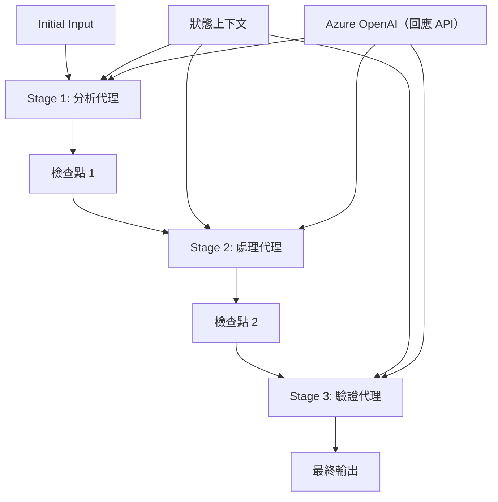

# ⏩ 使用 Azure OpenAI（Responses API）進行連續代理工作流程 (.NET)

## 📋 進階連續處理教學

本筆記本示範如何使用 Microsoft Agent Framework for .NET 和 Azure OpenAI（Responses API）實現<strong>連續工作流程模式</strong>。您將學習如何建立複雜的逐步處理管線，代理將依特定順序執行，每個階段都會基於前一階段的結果。

## 🎯 學習目標

### 🔄 <strong>連續處理架構</strong>
- <strong>線性工作流程設計</strong>：建立逐步處理管線，具有明確相依性
- <strong>狀態管理</strong>：維持跨連續工作流程階段的上下文與資料流
- **Azure OpenAI（Responses API）**：在多階段 .NET 工作流程中運用 Azure OpenAI 模型
- <strong>企業管線模式</strong>：建立生產等級的連續處理系統

### 🏗️ <strong>進階連續模式</strong>
- <strong>階段閘門處理</strong>：實作工作流程階段間的驗證檢查點
- <strong>上下文保持</strong>：跨所有階段維持狀態與累積知識
- <strong>錯誤傳播</strong>：優雅處理連續處理鏈中的失敗
- <strong>效能優化</strong>：以最低開銷達成高效連續執行

### 🏢 <strong>企業連續應用</strong>
- <strong>文件處理管線</strong>：多階段文件分析、轉換與驗證
- <strong>品質保證工作流程</strong>：連續審核、驗證與核准流程
- <strong>內容生產管線</strong>：研究 → 撰寫 → 編輯 → 審核 → 發佈
- <strong>業務流程自動化</strong>：多步驟業務工作流程，具清晰階段相依性

## ⚙️ 前置需求與設定

### 📦 **必要 NuGet 套件**

.NET 連續工作流程所需的核心套件：

```xml
<!-- Core AI Framework -->
<PackageReference Include="Microsoft.Extensions.AI" Version="10.*" />

<!-- Azure OpenAI (Responses API) -->
<PackageReference Include="Azure.AI.OpenAI" Version="2.*" />

<!-- Azure Identity and Async LINQ Support -->
<PackageReference Include="Azure.Identity" Version="1.15.0" />
<PackageReference Include="System.Linq.Async" Version="6.0.3" />

<!-- Local Agent Framework References -->
<!-- Microsoft.Agents.AI.dll - Core agent abstractions -->
<!-- Microsoft.Agents.AI.OpenAI.dll - Azure OpenAI (Responses API) integration -->
```

### 🔑 **Azure OpenAI 設定**

**環境設置（.env 檔案）：**
```env
AZURE_OPENAI_ENDPOINT=https://<your-resource>.openai.azure.com
AZURE_OPENAI_DEPLOYMENT=gpt-5-mini
```

**設定管理：**
```csharp
// Load environment variables securely
Env.Load("../../../.env");
var azureEndpoint = Environment.GetEnvironmentVariable("AZURE_OPENAI_ENDPOINT");
var deployment = Environment.GetEnvironmentVariable("AZURE_OPENAI_DEPLOYMENT");
```

### 🏗️ <strong>連續工作流程架構</strong>



**主要組件：**
- <strong>連續代理</strong>：專門用於每個處理階段的代理
- <strong>狀態上下文</strong>：跨階段維持累積資料與決策
- <strong>檢查點</strong>：階段間的驗證點，確保品質與一致性
- **Azure OpenAI 客戶端**：跨所有工作流程階段一致的 AI 模型存取

## 🎨 <strong>連續工作流程設計模式</strong>

### 📝 <strong>文件處理管線</strong>
```
Raw Document → Content Extraction → Analysis → Validation → Structured Output
```

### 🎯 <strong>內容創作工作流程</strong>
```
Brief/Requirements → Research → Content Creation → Review → Final Polish
```

### 🔍 <strong>品質保證管線</strong>
```
Initial Review → Technical Validation → Compliance Check → Final Approval
```

### 💼 <strong>商業智慧工作流程</strong>
```
Data Collection → Processing → Analysis → Report Generation → Distribution
```

## 🏢 <strong>企業連續優勢</strong>

### 🎯 <strong>可靠性與品質</strong>
- <strong>決定性處理</strong>：透過結構化階段提供一致且可重複的結果
- <strong>品質閘門</strong>：每個階段皆設有驗證檢查點以確保品質
- <strong>錯誤隔離</strong>：一個階段的問題不會影響後續階段
- <strong>稽核追蹤</strong>：每個階段完整追蹤決策與轉換

### 📈 <strong>擴展性與效能</strong>
- <strong>模組化設計</strong>：每個階段可獨立優化
- <strong>資源管理</strong>：高效分配 AI 模型資源
- <strong>狀態優化</strong>：階段間最小化狀態傳遞以提升效能
- <strong>平行階段群組</strong>：可平行執行多條連續工作流程

### 🔒 <strong>安全與合規</strong>
- <strong>階段層級安全</strong>：依不同處理階段設計不同安全政策
- <strong>資料驗證</strong>：每個檢查點確保資料完整性與合規
- <strong>存取控制</strong>：對不同工作流程階段精細權限控管
- <strong>法規遵循</strong>：透過結構化處理滿足法規要求

### 📊 <strong>監控與分析</strong>
- <strong>階段指標</strong>：監控每個工作流程階段的效能
- <strong>瓶頸識別</strong>：找出並優化效能瓶頸階段
- <strong>品質指標</strong>：追蹤每階段的品質與成功率
- <strong>流程優化</strong>：根據階段層級分析持續改善

讓我們打造穩健的連續 AI 處理管線吧！🚀

## 💻 執行程式碼

完整實作位於 `02.dotnet-agent-framework-workflow-ghmodel-sequential.cs`，示範<strong>三階段家具分析工作流程</strong>：

1. **階段 1 - 銷售代理**：分析家具圖片並提供購買建議
2. **階段 2 - 價格代理**：提供詳細價格分析與預算選項
3. **階段 3 - 報價代理**：生成 Markdown 格式的專業報價文件

### 🏗️ <strong>工作流程架構</strong>

```
Image Input → Sales Analysis → Price Estimation → Quote Generation → Final Output
```

每個代理：
- 接收前一階段的輸出作為上下文
- 以專業知識深化先前分析
- 透過狀態管理維持工作流程的連續性

### 🚀 執行範例

**前置需求：**
- 將家具圖片放在 `../imgs/home.png`（或更新 `imgPath` 變數）
- 配置您的 `.env` 檔案以設定 Azure OpenAI 端點及部署，並使用 `az login` 登入

```bash
# 令腳本可執行 (Unix/Linux/macOS)
chmod +x 02.dotnet-agent-framework-workflow-ghmodel-sequential.cs

# 執行順序工作流程
./02.dotnet-agent-framework-workflow-ghmodel-sequential.cs
```

或在 Windows 上：
```powershell
dotnet run 02.dotnet-agent-framework-workflow-ghmodel-sequential.cs
```

### 📝 預期輸出

該工作流程將：
1. <strong>銷售代理</strong>：從圖片識別家具項目並提供建議
2. <strong>價格代理</strong>：增加詳細價格分析，包括預算分級與購物建議
3. <strong>報價代理</strong>：生成整合所有資訊的格式化報價文件

最終輸出將是一份根據圖片分析的完整專業家具報價。

### 🔧 自訂選項

**修改代理行為：**
```csharp
// Adjust agent instructions to change their focus
const string SalesAgentInstructions = "Your custom instructions...";
```

**更改連續流程：**
```csharp
// Add or reorder workflow stages
var workflow = new WorkflowBuilder(salesagent)
    .AddEdge(salesagent, priceagent)
    .AddEdge(priceagent, quoteagent)
    .AddEdge(quoteagent, newAgent)  // Add another stage
    .Build();
```

**使用不同輸入：**
```csharp
// Process text instead of images
ChatMessage userMessage = new ChatMessage(ChatRole.User, [
    new TextContent("Analyze pricing for a modern living room set")
]);
```

### 🎯 實務應用

此連續模式適用於：
- <strong>電子商務</strong>：產品分析 → 價格制定 → 報價產出
- <strong>房地產</strong>：物件分析 → 評估 → 刊登創建
- <strong>保險</strong>：理賠分析 → 評估 → 報價產出
- <strong>內容創作</strong>：研究 → 撰寫 → 編輯 → 發佈

### 🔍 理解狀態流

連續中的每個代理都會接收：
- <strong>原始輸入</strong>：最初的使用者訊息（圖片 + 文字）
- <strong>前一代理輸出</strong>：對話歷史中所有先前代理的回應
- <strong>累積上下文</strong>：貫穿整個工作流程維持的完整狀態

這使得多階段複雜處理成為可能，每個代理都可建立在前階段完整上下文之上。

---

<!-- CO-OP TRANSLATOR DISCLAIMER START -->
**免責聲明**：
本文件由 AI 翻譯服務 [Co-op Translator](https://github.com/Azure/co-op-translator) 翻譯而成。雖然我們致力於確保準確性，但請注意，機器自動翻譯可能包含錯誤或不準確之處。原始文件的母語版本應被視為權威來源。對於重要資訊，建議進行專業人工翻譯。我們不對因使用本翻譯而產生的任何誤解或誤釋承擔責任。
<!-- CO-OP TRANSLATOR DISCLAIMER END -->