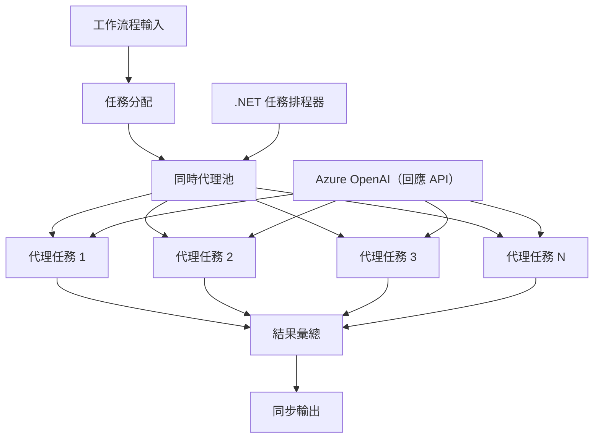

# ⚡ Azure OpenAI (Responses API) 的並發代理工作流程 (.NET)

## 📋 高效能平行處理教學

此筆記本示範了使用 Microsoft Agent Framework for .NET 和 Azure OpenAI (Responses API) 的<strong>並發工作流程模式</strong>。您將學習如何構建高效能的平行處理工作流程，通過同時執行多個 AI 代理來最大化吞吐量，同時保持協調和資料一致性。

## 🎯 學習目標

### 🚀 <strong>並行處理基礎知識</strong>
- <strong>平行代理執行</strong>：同時運行多個 AI 代理以達到最大性能
- **非同步/等待模式**：利用 .NET 的非同步程式設計模型實現高效的並發
- **Azure OpenAI (Responses API)**：協調多個並發呼叫 Azure OpenAI Responses API
- <strong>資源管理</strong>：在並發操作間高效管理 AI 模型資源

### 🏗️ <strong>進階並發架構</strong>
- <strong>基於任務的平行處理</strong>：使用 .NET 任務平行庫實現最佳並發執行
- <strong>同步模式</strong>：協調並發代理，避免競態條件
- <strong>負載均衡</strong>：高效分配工作於可用的並發處理容量
- <strong>容錯</strong>：處理單個代理錯誤而不停止整體工作流程

### 🏢 <strong>企業級並發應用</strong>
- <strong>高量文件處理</strong>：同時處理多個文件
- <strong>即時內容分析</strong>：並發分析進來的資料流
- <strong>批次處理優化</strong>：最大化大型數據處理操作的吞吐量
- <strong>多模態分析</strong>：平行處理不同內容類型和格式

## ⚙️ 前置條件與設定

### 📦 **必需 NuGet 套件**

高效能並發工作流程所需的基本套件：

```xml
<!-- Core AI Framework with Async Support -->
<PackageReference Include="Microsoft.Extensions.AI" Version="9.9.0" />

<!-- Azure OpenAI (Responses API) -->
<PackageReference Include="Azure.AI.OpenAI" Version="2.1.0" />

<!-- Azure Identity and Async LINQ for Advanced Operations -->
<PackageReference Include="Azure.Identity" Version="1.15.0" />
<PackageReference Include="System.Linq.Async" Version="6.0.3" />

<!-- Local Agent Framework References -->
<!-- Microsoft.Agents.AI.dll - Core agent abstractions with async support -->
<!-- Microsoft.Agents.AI.OpenAI.dll - Azure OpenAI (Responses API) integration with concurrency -->
```

### 🔑 **Azure OpenAI 配置**

**環境設定 (.env 檔案)：**
```env
AZURE_OPENAI_ENDPOINT=https://<your-resource>.openai.azure.com
AZURE_OPENAI_DEPLOYMENT=gpt-5-mini
```

**並發處理考量：**
```csharp
// Configure for concurrent operations
var clientOptions = new AzureOpenAIClientOptions()
{
    // Configure network timeout for concurrent requests
    NetworkTimeout = TimeSpan.FromMinutes(5)
};
```

### 🏗️ <strong>並發工作流程架構</strong>



**主要組件：**
- <strong>任務平行庫</strong>：.NET 內建的並發操作支援
- <strong>代理池</strong>：多個代理實例用於平行處理
- <strong>結果聚合</strong>：協調並合併並發代理結果
- <strong>同步點</strong>：確保並發操作間的資料一致性

## 🎨 <strong>並發工作流程設計模式</strong>

### 🔍 <strong>平行研究與分析</strong>
```
Research Topic → Concurrent Research Agents → Result Synthesis → Final Report
```

### 📊 <strong>多來源資料處理</strong>
```
Data Sources → Parallel Processing Agents → Data Integration → Unified Output
```

### 🎭 <strong>內容生成管線</strong>
```
Content Requirements → Concurrent Content Generators → Quality Review → Final Content
```

### 🔄 **Fan-Out/Fan-In 處理**
```
Single Input → Multiple Concurrent Processors → Result Aggregation → Single Output
```

## 🏢 <strong>企業性能效益</strong>

### ⚡ <strong>吞吐量與可擴展性</strong>
- <strong>線性性能擴展</strong>：新增更多並發代理以提升吞吐量
- <strong>資源利用率</strong>：最大化可用 AI 模型資源效率
- <strong>縮短處理時間</strong>：透過平行執行顯著縮短時間
- <strong>彈性擴展</strong>：根據工作負載動態調整並發代理數量

### 🛡️ <strong>可靠性與韌性</strong>
- <strong>故障隔離</strong>：單個代理失效不影響其他並發操作
- <strong>優雅降級</strong>：系統可在減少代理容量下繼續運行
- <strong>錯誤恢復</strong>：對失敗的並發操作自動重試機制
- <strong>負載分配</strong>：均衡分配工作於所有可用代理

### 📊 <strong>性能監控</strong>
- <strong>並發執行指標</strong>：追蹤所有平行操作性能
- <strong>資源使用分析</strong>：監控 CPU、記憶體與網絡利用率
- <strong>吞吐量分析</strong>：衡量並行處理帶來的效率提升
- <strong>瓶頸偵測</strong>：識別並解決性能限制

### 🔧 <strong>開發與運維</strong>
- <strong>非同步程式設計模型</strong>：利用 .NET 成熟的 async/await 模式
- <strong>任務協調</strong>：內建任務管理與協同能力
- <strong>例外處理</strong>：全面的並發錯誤處理
- <strong>除錯支援</strong>：Visual Studio 並發工作流程除錯工具

讓我們使用 .NET 建構高效能的並發 AI 工作流程！🚀

## 💻 執行程式碼

完整實作可見於 `03.dotnet-agent-framework-workflow-ghmodel-concurrent.cs`。此檔示範了針對旅遊規劃的<strong>Fan-Out/Fan-In 並發工作流程</strong>：

### 🏗️ <strong>工作流程架構</strong>

```
User Request → ConcurrentStartExecutor → [Researcher Agent || Planner Agent] → ConcurrentAggregationExecutor → Final Output
```

**主要組件：**

1. **ConcurrentStartExecutor**：同時將使用者請求廣播給所有代理
2. **Researcher Agent**：並行分析目的地與景點
3. **Planner Agent**：並行建立詳細旅遊計畫
4. **ConcurrentAggregationExecutor**：收集並合併兩個代理的結果

### 🎯 **Fan-Out/Fan-In 模式**

此工作流程展示經典的 **Fan-Out/Fan-In** 模式：
- **Fan-Out**：一個輸入訊息同時廣播給多個代理
- <strong>並發處理</strong>：多個代理平行處理同一任務
- **Fan-In**：收集所有代理結果並合併成一個輸出

### 🚀 執行範例

```bash
# 令腳本可執行（Unix/Linux/macOS）
chmod +x 03.dotnet-agent-framework-workflow-ghmodel-concurrent.cs

# 運行並行工作流程
./03.dotnet-agent-framework-workflow-ghmodel-concurrent.cs
```

或在 Windows 執行：
```powershell
dotnet run 03.dotnet-agent-framework-workflow-ghmodel-concurrent.cs
```

### 📝 預期輸出

工作流程將會：
1. <strong>廣播請求</strong>：向兩個代理發送「計劃 12 月前往西雅圖旅行」的訊息
2. <strong>並發處理</strong>：兩個代理同時工作：
   - 研究者找出景點和細節
   - 計劃者製作行程與後勤安排
3. <strong>聚合</strong>：將兩個回應彙整成完整輸出
4. <strong>顯示結果</strong>：展示包含所有資訊的合併旅遊計畫

### 🔧 自訂選項

**新增更多並發代理：**
```csharp
// Create additional specialized agents
AIAgent budgetAgent = azureClient.GetOpenAIResponseClient(deployment).CreateAIAgent(
    name: "Budget-Agent", instructions: "Calculate travel costs...");

// Add to fan-out
var workflow = new WorkflowBuilder(startExecutor)
    .AddFanOutEdge(startExecutor, targets: [researcherAgent, plannerAgent, budgetAgent])
    .AddFanInEdge(aggregationExecutor, sources: [researcherAgent, plannerAgent, budgetAgent])
    .WithOutputFrom(aggregationExecutor)
    .Build();

// Update aggregation count
if (this._messages.Count == 3) { ... }
```

**修改代理指令：**
```csharp
const string ResearcherAgentInstructions = "Your custom instructions for research...";
const string PlanAgentInstructions = "Your custom instructions for planning...";
```

**更改任務：**
```csharp
StreamingRun run = await InProcessExecution.StreamAsync(
    workflow, 
    "Plan a European vacation for 2 weeks in summer"
);
```

### 🎯 真實世界應用

此並發模式適合：
- <strong>內容創作</strong>：多位作者同時創作不同章節
- <strong>程式碼審查</strong>：多位審查者從不同角度分析程式碼
- <strong>市場調查</strong>：平行分析不同市場區塊
- <strong>文件處理</strong>：並發抽取、分析與驗證文件
- <strong>多視角分析</strong>：對同一輸入取得多元觀點

### 🔍 理解自訂執行器

**ConcurrentStartExecutor：**
- 實作 `IMessageHandler<string>` 接受字串輸入
- 將訊息廣播給所有連接的代理
- 傳送 `TurnToken` 觸發並發處理

**ConcurrentAggregationExecutor：**
- 實作 `IMessageHandler<ChatMessage>` 接收代理回應
- 以執行緒安全方式收集訊息
- 當所有預期回應到達時執行聚合
- 使用 `context.YieldOutputAsync()` 輸出最終結果

### ⚡ 性能效益

**並行 vs 串行：**
- 串行：代理1 (30秒) → 代理2 (30秒) = **總共 60 秒**
- 並行：代理1 (30秒) || 代理2 (30秒) = **總共 30 秒**

<strong>吞吐量提升</strong>：N 個並發代理可達到約 N 倍加速（視工作負載與資源而定）

### 🛡️ 錯誤處理

工作流程能夠優雅地處理單個代理失敗：
- 若其中一個代理失敗，其他代理繼續處理
- 聚合器可實作超時邏輯
- 必要時可回傳部分結果

### 📊 進階功能

**動態代理數量：**
修改聚合邏輯以支援變動的代理數量：

```csharp
private int _expectedAgentCount;
private readonly List<ChatMessage> _messages = [];

public async ValueTask HandleAsync(ChatMessage message, IWorkflowContext context)
{
    this._messages.Add(message);
    if (this._messages.Count == _expectedAgentCount)
    {
        // Process aggregation
    }
}
```

此並發工作流模式對於建構高效能、可延展的 AI 代理系統至關重要！

---

<!-- CO-OP TRANSLATOR DISCLAIMER START -->
**免責聲明**：
本文件由 AI 翻譯服務 [Co-op Translator](https://github.com/Azure/co-op-translator) 翻譯而成。雖然我們致力於確保準確性，但請注意，機器自動翻譯可能包含錯誤或不準確之處。原始文件的母語版本應被視為權威來源。對於重要資訊，建議進行專業人工翻譯。我們不對因使用本翻譯而產生的任何誤解或誤釋承擔責任。
<!-- CO-OP TRANSLATOR DISCLAIMER END -->