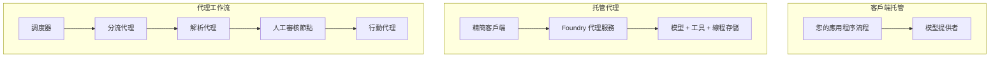
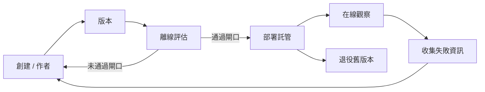
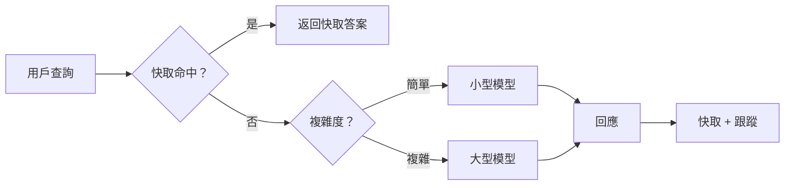
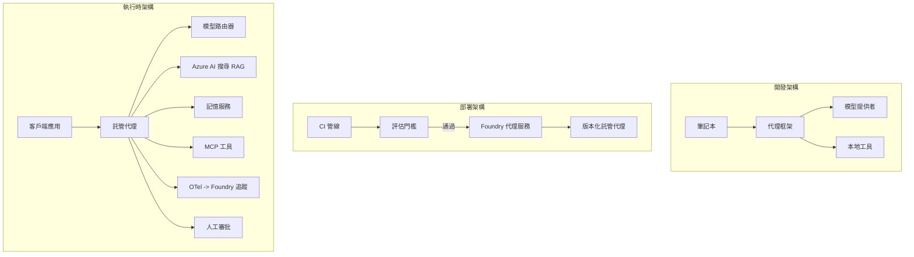

# 使用 Microsoft Foundry 部署可擴充代理


到課程此處為止，你已經建立了在你的筆記型電腦中運行、在筆記本內執行，由 `az login` 和少數環境變數控制的代理。這正是學習的正確方式。這卻不是數千名客戶在凌晨三點仰賴時執行代理的正確方法。

本課程探討「在我的機器上運作」與「在生產環境中可靠且經濟地運作」之間的落差。我們透過 **Microsoft Foundry** 和 **Microsoft Foundry Agent Service** 將此落差關閉，並藉由構建一個具備工具、檢索、記憶、評估與監控的真實客戶支援代理來達成。

## 介紹

本課程將涵蓋：

- <strong>原型代理</strong> 與 <strong>已部署代理</strong> 的差異，以及為何過渡主要關乎模型 <em>周圍</em> 的其他所有事物。
- 代理的 <strong>部署模式</strong>：用戶端託管、服務託管（託管代理）與工作流程協調。
- Microsoft Foundry 上的 <strong>代理生命週期</strong> — 建立、版本、部署、評估、觀察、退役。
- <strong>擴展策略</strong>：模型路由、快取、併發與無狀態設計。
- 使用 OpenTelemetry 與 Foundry 跟蹤的 <strong>可觀察性</strong>。
- 透過模型選擇、路由與評估門的 <strong>成本優化</strong>。
- <strong>企業考量</strong>：治理、人為審批，以及在生產環境中安全執行 MCP 伺服器。

## 學習目標

完成本課程後，你將能夠：

- 為特定代理工作負載選擇正確的部署模式。
- 部署代理至 Microsoft Foundry Agent Service，以便版本管理、治理與可觀察。
- 為代理加入追蹤工具，並連結每次發佈前的評估管線。
- 應用模型路由與快取，讓延遲與成本在擴展下保持可控。
- 為高風險行動新增人為審批閘道，並以生產環境安全方式整合 MCP 伺服器。

## 預備知識

本課程假設你已完成早期課程並熟悉：

- 使用 [Microsoft Agent Framework](../14-microsoft-agent-framework/README.md) 建構代理（課程14）。
- [工具使用](../04-tool-use/README.md)（課程4）與 [Agentic RAG](../05-agentic-rag/README.md)（課程5）。
- [代理記憶](../13-agent-memory/README.md)（課程13）與 [Agentic Protocols / MCP](../11-agentic-protocols/README.md)（課程11）。
- [可觀察性及評估](../10-ai-agents-production/README.md)（課程10） — 本課程直接建立於此基礎。

你還需要：

- 一個 **Azure 訂閱** 和一個擁有至少一個部署聊天模型的 **Microsoft Foundry 專案**。
- 已驗證（金鑰登入）的 **Azure CLI** (`az login`)。
- Python 3.12+ 及本儲存庫中的套件 [`requirements.txt`](../../../requirements.txt)。

## 從原型到生產：實際的變化

原型代理與生產代理共用相同的核心迴圈 —— 推理、呼叫工具、回應。改變的是包裹這個迴圈的周邊一切。模型約佔生產代理的 20%，其餘 80% 是運營骨架。

| 關注點 | 原型 | 生產 |
| --- | --- | --- |
| <strong>主機設定</strong> | 在你的筆記本執行 | 作為託管服務運行，具版本和逐步推出機制 |
| <strong>身份套用</strong> | 你的 `az login` 令牌 | 管理身份配合範圍性 RBAC |
| <strong>狀態管理</strong> | 記憶體中，重啟後遺失 | 外部化（線程存儲、記憶服務） |
| <strong>錯誤處理</strong> | 你看到回溯 | 重試、回退、死信、警報 |
| <strong>成本</strong> | 「幾分錢」 | 按請求追蹤，路由，快取，預算控管 |
| <strong>品質</strong> | 你用眼睛看輸出 | 每次發佈前自動評估 |
| <strong>信任</strong> | 你審批每一步 | 高風險行為為政策和人為介入並進 |

請記住此表。以下每一節都對應表中一項。

## 代理部署模式

通常會採用以下三種模式，有時並用。

### 1. 用戶端託管代理

代理物件存在於<em>你的</em>應用程序進程中。你的程式碼直接呼叫模型服務；推理迴圈在你的服務中運行。這是所有先前課程所採用的方式。

- <strong>適用時機</strong>：當你需要對迴圈擁有完整控制、自訂中介軟體，或將代理嵌入現有後端時。
- <strong>權衡</strong>：你須自行管理擴展、狀態與韌性。

### 2. 託管代理（Foundry Agent Service）

代理被<em>註冊為資源</em>於 Microsoft Foundry。Foundry 托管推理迴圈、存儲線程、強制內容安全和 RBAC，並在 Foundry 門戶中展現代理。你的應用成為一個輕量端，創建線程並讀取回應。

- <strong>適用時機</strong>：你需要持久性、內建可觀察性、治理，與較少運維面。
- <strong>權衡</strong>：以較少低階控制換取管理式執行環境。

### 3. 代理工作流程

多個代理（及工具）組合成一個具有明確控制流程的圖譜 — 順序步驟、分支、人為審批節點，以及可暫停與恢復的持久檢查點。這是 Microsoft Agent Framework <strong>工作流程</strong> 功能在部署規模上的應用。

- <strong>適用時機</strong>：當單一任務涵蓋多個專門代理或中途需審批步驟。
- <strong>權衡</strong>：更多動態部分；需工作流程層級可觀察性。



## Microsoft Foundry 上的代理生命週期

部署代理不是一次性的 `push` 行為，而是一個循環，其形態與軟體發行週期極為相近，因為本質上就是軟體發行週期。



關鍵觀念，承襲自 [課程10](../10-ai-agents-production/README.md)：**離線評估是一道門檻，而非事後想法。** 新代理版本若未通過你的評估標準，則不會發佈。線上可觀察性將實際故障回饋入離線測試集，形成完整迴圈。

## 擴展策略

代理擴展不同於無狀態 Web API，因為每次請求可能觸發多次昂貴的模型和工具呼叫。四種技術承擔大部分負載。

**無狀態請求處理。** 不在進程記憶體中保留用戶狀態。對話線程持久存放在 Foundry 線程庫或記憶服務，任一實例皆可處理任何請求。這使你能水平擴展 — 新增實例，無需黏著會話。

**模型路由。** 並非所有請求都需最強（且最貴）模型。將簡單請求 — 意圖分類、簡短事實回答 — 路由至小型快速模型，將大型模型保留給真正推理任務。Foundry 的 <strong>模型路由器</strong> 可自動處理此事，或你可自行實作輕量分類器。實作版會在實作課中建立。

**回應快取。** 許多支援查詢接近重複（「我如何重設密碼？」）。快取常見問題答案，一律不需要模型呼叫即可回應。即使是適度的快取命中率，也能顯著降低成本及延遲。

**併發與背壓。** 模型服務商有速率限制。限制併發數量，使用指數退避重試，並優雅失敗（排隊中的「我們正在處理」回應總比 500 錯誤強）。



## 生產環境的可觀察性

無法監控、便無法運營。如課程 10 所述，Microsoft Agent Framework 原生輸出 **OpenTelemetry** 追蹤 — 每次模型呼叫、工具執行、協調步驟皆成為一個跨度。生產中你將這些跨度匯出至 Microsoft Foundry（或任何 OTel 兼容端點），以便你能：

- 端對端追蹤單一客訴穿越每個模型和工具呼叫。
- 監測請求的 p50/p95 延遲與成本趨勢。
- 在使用者（或財務團隊）察覺之前，對錯誤率激增和成本異常發出警報。

```python
from agent_framework.observability import get_tracer

tracer = get_tracer()

with tracer.start_as_current_span("support_request") as span:
    span.set_attribute("customer.tier", "enterprise")
    span.set_attribute("routed.model", "gpt-5-nano")
    # 代理執行會自動於此區間內被追蹤
```

如 `customer.tier` 和 `routed.model` 屬性，能把大量追蹤變成可回應的問題（「企業客戶是否過於頻繁被導向小模型？」）。

## 成本優化

生產代理成本主要由令牌主導。有三個槓桿，按影響力排序：

1. **選對模型大小。** 一個小型模型若通過評估門，通常比一個也通過的巨大模型更經濟。以評估結果証明小模型足夠，而非盲目選最大模型以保險。
2. **依複雜度路由。** 如前所述 — 僅對需要複雜推理的請求支付大型模型費用。
3. **積極快取。** 最省錢的模型呼叫是不做的呼叫。

評估門與成本控管是同一門學問的兩個面向：評估告訴你<em>品質底線</em>，路由與快取則將成本壓緊在該底線附近。

## 企業部署考量

**治理。** 託管代理承襲 Foundry 的 RBAC、內容安全和稽核日誌。給每個代理一個具最小權限的管理身份 — 僅只讀知識庫，對票務 API 有範圍存取，別無其他。

**人為介入。** 某些行為過於關鍵，不能全自動 — 退款、刪除帳戶、升級至法務團隊。Microsoft Agent Framework 支援 <strong>需要審批</strong> 的工具：代理提出行動，執行暫停，由人審批通過或否決，工作流程繼續。你在 [課程6](../06-building-trustworthy-agents/README.md) 見過該原語，此處部署它。

**生產中的 MCP。** [MCP](../11-agentic-protocols/README.md) 讓代理透過標準介面使用外部工具。生產中，每個 MCP 伺服器當作不信任邊界：固定伺服器版本，使用範圍限定身份執行，驗證輸出，絕不暴露機密。MCP 伺服器是依賴，依賴需打補丁、稽核與速率限制。



這三張圖 —— 開發、部署、運行時 —— 是同一代理生命週期的三個階段。接下來的實作引導你逐步建立它。

## 實作練習：可生產用的客戶支援代理

開啟 [`code_samples/16-python-agent-framework.ipynb`](./code_samples/16-python-agent-framework.ipynb) 並完整操作。你將組裝一個具有所有生產擔憂連結的 **Contoso 客服代理**：

1. <strong>工具呼叫</strong> — 查詢訂單狀態與開啟支援單。
2. **RAG** — 從知識庫回答政策問題（Azure AI Search，含記憶體備援，讓筆記本可於無 Search 資源下運行）。
3. <strong>記憶</strong> — 記住對話中客戶身份。
4. <strong>模型路由</strong> — 複雜度分類器依請求路由至小模型或大模型。
5. <strong>回應快取</strong> — 重複問題由快取回應。
6. <strong>人工審批</strong> — 高於門檻的退款暫停等待人為批准。
7. <strong>評估管線</strong> — 小型離線測試集評分代理，作為發佈閘道。
8. <strong>可觀察性</strong> — 每次請求加上 OpenTelemetry 追蹤。

### 實作導覽

筆記本組織成每個生產擔憂為獨立、可執行章節。核心為路由加快取的請求處理器：

```python
async def handle_support_request(query: str, customer_id: str) -> str:
    # 1. 盡可能從快取提供服務。
    cached = response_cache.get(normalize(query))
    if cached:
        return cached

    # 2. 按複雜度路由以控制成本。
    model = "gpt-5-nano" if is_simple(query) else "gpt-5-mini"

    # 3. 在追蹤區段內運行代理以便觀察。
    with tracer.start_as_current_span("support_request") as span:
        span.set_attribute("routed.model", model)
        span.set_attribute("customer.id", customer_id)
        response = await support_agent.run(query, model=model)

    # 4. 快取並返回。
    response_cache.set(normalize(query), response.text)
    return response.text
```

守護發佈的評估閘道長這樣：

```python
async def evaluation_gate(agent, test_cases, threshold: float = 0.8) -> bool:
    passed = 0
    for case in test_cases:
        result = await agent.run(case["input"])
        if score_response(result.text, case["expected"]) >= 0.8:
            passed += 1
    pass_rate = passed / len(test_cases)
    print(f"Evaluation pass rate: {pass_rate:.0%} (gate: {threshold:.0%})")
    return pass_rate >= threshold  # 只有閘門通過時才部署
```

請細讀每行 — 筆記本讓基元刻意保持小巧，不隱藏框架呼叫。

## 驗證已部署代理的冒煙測試

上述評估閘門是對你的代理物件<em>離線</em>執行。代理部署為託管代理後，你還需要另一種更簡易的檢查：**已部署端點真的有回應嗎？**

「成功」部署僅證明控制平面接受定義 — 並不代表代理確實回應。遺失依賴、路由錯誤、或連線逾時都可能導致部署顯綠卻無回應。<strong>冒煙測試</strong>能於數秒捕捉此狀況，且在每次部署執行，成本遠低於完整評估。

本儲存庫附帶一套基於 [AI Smoke Test](https://github.com/marketplace/actions/ai-smoke-test) GitHub Action 的現成冒煙測試管線：

- <strong>目錄</strong> — [`tests/lesson-16-smoke-tests.json`](../../../tests/lesson-16-smoke-tests.json) 收錄 Contoso 支援代理的提示與斷言（依據政策的答案、訂單查詢、聚焦主題與多回合連貫）。其他課程代理的目錄與其並列 — 請見 [`tests/README.md`](../tests/README.md)。
- <strong>工作流程</strong> — [`.github/workflows/smoke-test.yml`](../../../.github/workflows/smoke-test.yml) 以 Azure OIDC 登入，將每條提示 POST 至代理的 Responses 端點，任何斷言錯誤即失敗工作。

```yaml
- name: Smoke-test hosted agent
  uses: JFolberth/ai-smoketest@v1
  with:
    project_endpoint: ${{ inputs.project_endpoint }}
    agent_name: ContosoSupportAgent
    tests_file: tests/lesson-16-smoke-tests.json
```


在代理部署後，從 **Actions** 標籤運行它，提供你的 Foundry 專案端點和代理名稱。聯邦身份需要在 Foundry 專案範圍擁有 **Azure AI User** 角色。把這些層次想像成金字塔：煙霧測試（是否可達且有回應？）在每次部署時執行，離線評估（是否足夠好可以發布？）在升級前執行，而線上評估（在實際運作中表現如何？）則是持續執行。

## 知識檢測

在進入作業前測試你的理解。

**1. 大約多少比例的生產代理是「模型」本身，而剩下的是什麼？**

<details>
<summary>答案</summary>

模型只佔系統的少部分——通常約為 20%。其餘的是運營骨架：承載與版本管理、身份識別和 RBAC、外部化狀態、故障處理、成本追蹤、評估以及人機介入控制。投入生產主要是建立推理迴路 <em>周邊</em> 的所有部分。
</details>

**2. 何時會選擇 Hosted Agent 而非客戶端承載代理？**

<details>
<summary>答案</summary>

當你想要一個帶有內建持久性（持續且可恢復的緒程）、可觀察性、內容安全及 RBAC 的託管執行環境，並願意用較少運營面來交換對推理迴路的低層控制時。當需要完全控制推理迴路或將代理嵌入現有後端時，客戶端承載較佳。
</details>

**3. 為什麼可擴展代理必須在自己進程記憶體中無狀態？**

<details>
<summary>答案</summary>

這樣每個實例都可以處理任何請求，從而可在無需黏性會話下水平擴展。每用戶對話狀態被外部化到緒程存儲或記憶服務中。如果狀態存放在進程記憶體中，重啟將會丟失狀態，且無法自由分配負載。
</details>

**4. 模型路由解決了什麼問題，與評估有何關係？**

<details>
<summary>答案</summary>

路由會把簡單請求導給小而便宜又快速的模型，大模型則保留給真正需要推理的情況，這樣能控制延遲和成本。它與評估有關，因為評估是證明小模型對某類請求足夠好的方式——沒有評估的路由只是盲目猜測。
</details>

**5. 什麼是「評估閘門」，它在生命週期中處於哪裡？**

<details>
<summary>答案</summary>

評估閘門會對新代理版本執行離線測試集，若通過率未達門檻則阻止部署。它位於生命週期的「版本」和「部署」間，讓品質成為發布的前提，而非發布後的檢查項目。
</details>

**6. 為什麼 MCP 伺服器在生產環境中應被視為不受信任的邊界？**

<details>
<summary>答案</summary>

因為它是代理調用的外部依賴。你應該鎖定其版本、以專屬身份運行、驗證輸出、限制速率，且絕不應對它暴露密鑰——這與你對任何第三方依賴的規範相同。其輸出會影響代理推理，因此不經驗證的信任是安全風險。
</details>

**7. 哪一項單一變更通常對生產代理成本影響最大？為什麼？**

<details>
<summary>答案</summary>

調整模型大小——使用最小且仍通過你的評估閘門的模型。成本主要由代幣數量決定，而符合品質標準的較小模型幾乎總是比較大模型便宜。快取和路由會進一步降低成本，但選擇合適的基礎模型具有最大的第一級影響。
</details>

**8. 欄位屬性如 `customer.tier` 和 `routed.model` 在可觀察性中扮演什麼角色？**

<details>
<summary>答案</summary>

它們將原始追蹤轉化為可回答的商業問題。沒有屬性的話你只有一堆跨度；有了屬性，你可以問「企業客戶是否太常被路由到小模型？」或「哪個模型處理我們最慢的請求？」屬性是按對你營運重要的維度對遙測資料切片的方式。
</details>

## 作業

拿實驗室裡的客戶支持代理，針對一個特定場景強化它：**SaaS 公司的訂閱計費支援代理。**

你的提交應該：

1. <strong>用與計費相關的工具替代</strong>：`get_subscription_status`、`get_invoice` 和 `issue_credit`（超過 $50 的額外點數需人工批准）。
2. **新增三份 RAG 文件**，涵蓋公司退款政策、計費週期和取消政策。
3. <strong>擴充評估集</strong>至少到八個案例，包含至少兩個<em>應該</em>觸發人工批准流程的案例，並確認評估閘門正確通過或失敗。
4. <strong>新增一份成本報告</strong>：在代理處理十個混合查詢後，印出多少請求送往小模型、多少送往大模型，以及多少由快取處理。

用一個簡短段落（Markdown 單元）說明你選擇的模型路由規則以及如何用真實流量驗證。沒有唯一正確答案——評估重點是你是否合理串接生產環境的考量。

## 總結

本課程中你將代理從原型移轉到 Microsoft Foundry 的生產環境：

- 進入生產主要是圍繞模型的 <strong>運營骨架</strong>——承載、身份、狀態、故障處理、成本、品質及信任。
- 你學會了三種 <strong>部署模式</strong>——客戶端承載、Hosted Agents 和 Agent Workflows——以及它們各自適用時機。
- 你理解了 <strong>代理生命週期</strong>，其中離線 <strong>評估作為發布閘門</strong>，線上可觀察性將故障反饋回測試集。
- 你應用了 <strong>擴展策略</strong>——無狀態設計、模型路由、快取和有界並發——並將它們與 <strong>成本最適化</strong> 聯繫起來。
- 你接入了 <strong>企業控管</strong>：RBAC、人機介入批准，以及生產安全的 MCP 整合。
- 你建立了一個 <strong>生產就緒的客戶支持代理</strong>，將上述考量全部以可執行程式碼串連起來。

下一課將走完全相反的路徑：不是將代理擴展到雲端，而是將它們<em>縮回</em>至單一開發者機器，並在本地端完整執行。

## 額外資源

- <a href="https://learn.microsoft.com/azure/ai-foundry/what-is-azure-ai-foundry" target="_blank">Microsoft Foundry 文件</a>
- <a href="https://learn.microsoft.com/azure/ai-foundry/agents/overview" target="_blank">Microsoft Foundry 代理服務概述</a>
- <a href="https://aka.ms/ai-agents-beginners/agent-framework" target="_blank">Microsoft 代理框架</a>
- <a href="https://learn.microsoft.com/azure/ai-foundry/concepts/model-router" target="_blank">Microsoft Foundry 中的模型路由器</a>
- <a href="https://learn.microsoft.com/azure/search/search-what-is-azure-search" target="_blank">Azure AI 搜尋</a>
- <a href="https://opentelemetry.io/" target="_blank">OpenTelemetry</a>
- <a href="https://github.com/marketplace/actions/ai-smoke-test" target="_blank">AI Smoke Test GitHub Action</a>
- <a href="https://modelcontextprotocol.io/" target="_blank">Model Context Protocol (MCP)</a>

## 上一課

[建構電腦使用代理（CUA）](../15-browser-use/README.md)

## 下一課

[創建本地 AI 代理](../17-creating-local-ai-agents/README.md)

---

<!-- CO-OP TRANSLATOR DISCLAIMER START -->
**免責聲明**：
本文件由 AI 翻譯服務 [Co-op Translator](https://github.com/Azure/co-op-translator) 翻譯而成。雖然我們致力於確保準確性，但請注意，機器自動翻譯可能包含錯誤或不準確之處。原始文件的母語版本應被視為權威來源。對於重要資訊，建議進行專業人工翻譯。我們不對因使用本翻譯而產生的任何誤解或誤釋承擔責任。
<!-- CO-OP TRANSLATOR DISCLAIMER END -->