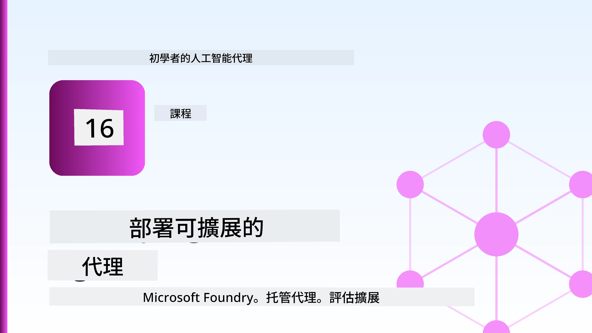
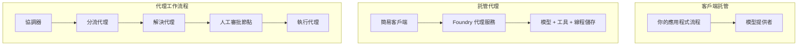
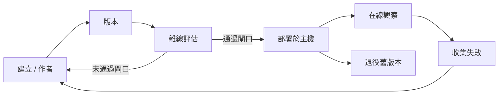
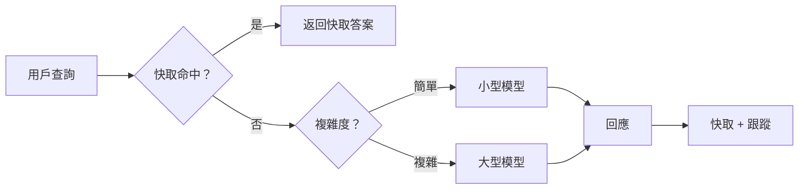
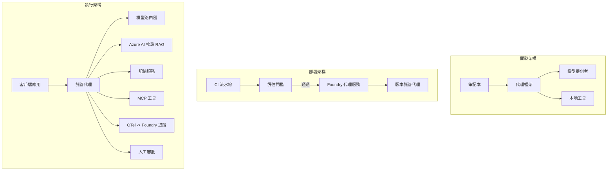

# 使用 Microsoft Foundry 部署可擴展代理



到目前為止的課程中，你建構的代理是在你的筆記本電腦內運行，透過 `az login` 和少量環境變數驅動。這確實是學習的正確方式。但這並不是運行一個在凌晨三點有數千名客戶依賴的代理的正確方式。

本課程涵蓋的是「在我的機器上可運作」和「於生產環境中可靠且經濟地運作」之間的鴻溝。我們利用 **Microsoft Foundry** 和 **Microsoft Foundry Agent Service** 來彌合此差距，透過構建一個具備工具、檢索、記憶、評估與監控的真實客戶支援代理實現。

## 介紹

本課程將涵蓋：

- <strong>原型代理</strong>與<strong>部署代理</strong>之間的差異，以及為何轉換主要關乎模型<em>周圍</em>的所有事物。
- 代理的<strong>部署模式</strong>：用戶端託管、服務託管（託管代理）及工作流程編排。
- Microsoft Foundry 上的<strong>代理生命週期</strong> — 建立、版本、部署、評估、觀察、退役。
- <strong>擴展策略</strong>：模型路由、快取、併發及無狀態設計。
- 使用 OpenTelemetry 和 Foundry 跟踪的<strong>可觀察性</strong>。
- 透過模型選擇、路由和評估門檻進行的<strong>成本優化</strong>。
- <strong>企業考量</strong>：治理、人為審核，及安全運行 MCP 伺服器於生產環境。

## 學習目標

完成本課程後，你將學會：

- 根據代理工作負載選擇合適的部署模式。
- 部署代理至 Microsoft Foundry Agent Service，使之具備版本控制、治理及可觀察性。
- 為代理加裝追蹤儀器與連接評估流程，且該流程於每次發佈前執行。
- 應用模型路由與快取，保持在大規模時的延遲與成本可控。
- 添加高風險行動的人為核准門檻，並以生產安全的方式整合 MCP 伺服器。

## 前置條件

本課程假設你已完成之前的課程，並熟悉：

- 使用 [Microsoft Agent Framework](../14-microsoft-agent-framework/README.md) 建立代理（第 14 課）。
- [工具使用](../04-tool-use/README.md)（第 4 課）及 [Agentic RAG](../05-agentic-rag/README.md)（第 5 課）。
- [代理記憶](../13-agent-memory/README.md)（第 13 課）與 [Agentic Protocols / MCP](../11-agentic-protocols/README.md)（第 11 課）。
- [可觀察性與評估](../10-ai-agents-production/README.md)（第 10 課）— 本課直接建立於該課基礎。

你還需要：

- 擁有一個 **Azure 訂閱** 和一個至少有一個已部署聊天模型的 **Microsoft Foundry 專案**。
- 已驗證登入的 **Azure CLI** (`az login`)。
- Python 3.12+ 及版本庫中的套件 [`requirements.txt`](../../../requirements.txt)。

## 從原型到生產：實際改變了什麼

原型代理與生產代理共享相同的核心循環 — 推理、呼叫工具、回應。改變的是包裹在該循環外的所有事物。模型大約佔生產代理的 20%，其餘 80% 是運營架構。

| 關注點 | 原型 | 生產 |
| --- | --- | --- |
| <strong>託管</strong> | 在你的筆記本運行 | 作為託管服務運行，有版本控制及逐步推出 |
| <strong>身份</strong> | 你的 `az login` 令牌 | 透過範圍 RBAC 管理身份 |
| <strong>狀態</strong> | 記憶體中，重啟即失 | 外部化（執行緒存儲、記憶服務） |
| <strong>錯誤處理</strong> | 看到錯誤追蹤堆疊 | 重試、備援、死信、警報 |
| <strong>成本</strong> | 「幾分錢」 | 逐請求追蹤、路由、快取及預算管控 |
| <strong>品質</strong> | 目視檢查輸出 | 每次發佈前自動評估 |
| <strong>信任</strong> | 你批准每個行動 | 風險行動具政策+人為審核 |

請記住此表，下文每一節對應相關類別。

## 代理部署模式

你將使用三種模式，經常混合搭配使用。

### 1. 用戶端託管代理

代理對象存在於<em>你的</em>應用程式進程中。你的程式碼直接呼叫模型提供者；推理循環在你的服務中執行。這是之前所有課程所做的模式。

- <strong>使用場合</strong>：當你需要對整個循環完全掌控、自訂中介軟體，或將代理嵌入現有後端時。
- <strong>取捨</strong>：你須自行負責擴展、狀態管理與韌性。

### 2. 託管代理（Foundry Agent Service）

代理被<em>註冊為 Microsoft Foundry 的資源</em>。Foundry 托管推理循環，存儲執行緒，執行內容安全及 RBAC，並讓代理在 Foundry 入口網站可見。你的應用變成創建執行緒並讀取回應的輕量端。

- <strong>使用場合</strong>：當你需要耐久性、內建的可觀察性、治理，以及減少營運面積。
- <strong>取捨</strong>：犧牲部分低階控制，換取受管執行環境。

### 3. 代理工作流程

多個代理（以及工具）組成圖形並有明確控制流程 — 順序步驟、分支、人為審核節點及可中斷且可繼續的耐久檢查點。這是 Microsoft Agent Framework <strong>工作流程</strong> 功能於部署規模的應用。

- <strong>使用場合</strong>：單一任務跨越多個專門代理或中途需審核時。
- <strong>取捨</strong>：更多設備組件，需要編排層級的可觀察性。



## Microsoft Foundry 上的代理生命週期

部署代理不是一次性的 `push`，而是一個循環，且非常類似軟體發佈流程，因為本質就是如此。



關鍵理念，延續自[第 10 課](../10-ai-agents-production/README.md)：**離線評估是閘門，不是事後補充。** 新代理版本只有通過你的評估門檻才會發佈。線上可觀察性將實際故障回饋至離線測試集合。這即整個循環。

## 擴展策略

擴展代理不同於擴展無狀態 Web API，因為每個請求可能觸發多個昂貴的模型及工具呼叫。四種技術承擔了大部分負載。

**無狀態請求處理。** 不在進程記憶體保存任何用戶狀態。將對話執行緒持久化於 Foundry 執行緒存儲或記憶服務，讓任一實例可處理任意請求。這使你能水平擴展 — 增加實例，不需黏性會話。

**模型路由。** 並非所有請求都需最強大（也是最昂貴）模型。將簡單請求 — 例如意圖分類、簡短事實答案 — 導向小型快速模型，大模型則保留給真正推理。Foundry 的 <strong>模型路由器</strong> 可幫你做到這點，或你可自行實作輕量分類器。實驗室中你會建立 DIY 版本。

**回應快取。** 許多客戶支援問題接近重複（「如何重設密碼？」）。將常見問題答案快取，直接提供而不需呼叫模型。即便是適度快取命中率，也能顯著降低成本與延遲。

**併發與背壓。** 模型提供者有流量限制。限制併發數，使用帶指數退避的重試機制，並優雅失敗（一則排隊「我們正在處理」回應比 500 錯誤要好）。



## 生產環境可觀察性

你無法操作你無法看到的系統。正如第 10 課所述，Microsoft Agent Framework 原生輸出 **OpenTelemetry** 跟踪 — 每次模型呼叫、工具調用及編排步驟都成為一個 span。在生產環境中你將這些 span 匯出至 Microsoft Foundry（或任何符合 OTel 的後端），以便：

- 對單一客戶抱怨整段流程追蹤，涵蓋每次模型及工具呼叫。
- 觀察每請求的 p50/p95 延遲與成本趨勢。
- 在用戶（或財務團隊）察覺前，針對錯誤率激增及成本異常產生警報。

```python
from agent_framework.observability import get_tracer

tracer = get_tracer()

with tracer.start_as_current_span("support_request") as span:
    span.set_attribute("customer.tier", "enterprise")
    span.set_attribute("routed.model", "gpt-4.1-mini")
    # 代理執行會自動在這個範圍內被追蹤
```

像 `customer.tier` 和 `routed.model` 這樣的屬性，能讓一片跟踪牆轉化為可回答的問題（「企業客戶是否被過度路由至小模型？」）。

## 成本優化

生產代理的成本主要被 token 所主導。有三個影響槓桿，按影響度排序：

1. **適當選擇模型大小。** 一個通過評估門檻的小模型幾乎總是比通過同樣門檻的大模型更經濟。利用評估證明小模型已足夠，而非出於謹慎直接選最大模型。
2. **依複雜度路由。** 如上 — 僅對需要大模型推理的請求支付對應大模型的價格。
3. **積極快取。** 最便宜的模型呼叫就是你從未發出過的那一次。

評估門檻與成本控制是同一門功課的兩個面向：評估保證<em>品質底線</em>，路由與快取則使成本盡可能貼近該底線。

## 企業部署考量

**治理。** 託管代理繼承 Foundry 的 RBAC、內容安全和審計日誌。給每個代理一個最低權限所需的管理身份 — 只讀知識庫、範圍限定的票務 API 存取，不多也不少。

**人為審核。** 部分行動過於重要，無法全自動化 — 發放退款、刪除帳戶、升級法律團隊。Microsoft Agent Framework 支援 <strong>需審核</strong> 工具：代理提出行動，執行暫停，由人員核准或拒絕，工作流程再恢復。你在[第 6 課](../06-building-trustworthy-agents/README.md)已見過原型；此處正式部署它。

**生產環境的 MCP。** [MCP](../11-agentic-protocols/README.md) 讓你的代理透過標準介面使用外部工具。在生產環境中，將每個 MCP 伺服器視為不受信任邊界：固定伺服器版本、使用範圍限定身份執行、驗證其輸出，且絕不暴露秘密給它。MCP 伺服器是一項依賴，依賴將經過修補、稽核與流量限制。



這三幅圖 — 開發、部署與運行時 — 是同一代理生命週期的三個階段。隨後的實驗室將引導你構建它。

## 實作實驗室：具生產準備的客戶支援代理

開啟 [`code_samples/16-python-agent-framework.ipynb`](./code_samples/16-python-agent-framework.ipynb) 並從頭到尾實作。你將組裝一個 **Contoso 客戶支援代理**，所有生產關注點皆已連接：

1. <strong>工具呼叫</strong> — 查詢訂單狀態與開啟支援單。
2. **RAG** — 從知識庫（Azure AI Search，附帶記憶體備援，讓筆記本可在無 Search 資源時執行）回答政策問題。
3. <strong>記憶</strong> — 跨對話回合記住客戶。
4. <strong>模型路由</strong> — 複雜度分類器將請求導向小模型或大模型。
5. <strong>回應快取</strong> — 重複問題由快取提供回應。
6. <strong>人為審核</strong> — 超過閾值的退款需暫停等待人員簽核。
7. <strong>評估流程</strong> — 小型離線測試集評分代理並作為發布閘門。
8. <strong>可觀察性</strong> — 每次請求的 OpenTelemetry 跟踪。

### 實作導覽

筆記本組織形式為每個生產關注點皆為獨立且可執行區段。核心是路由加快取的請求處理器：

```python
async def handle_support_request(query: str, customer_id: str) -> str:
    # 1. 盡量從快取提供服務。
    cached = response_cache.get(normalize(query))
    if cached:
        return cached

    # 2. 根據複雜度進行路由以控制成本。
    model = "gpt-4.1-mini" if is_simple(query) else "gpt-4.1"

    # 3. 在追蹤範圍內運行代理以便觀察。
    with tracer.start_as_current_span("support_request") as span:
        span.set_attribute("routed.model", model)
        span.set_attribute("customer.id", customer_id)
        response = await support_agent.run(query, model=model)

    # 4. 快取並返回。
    response_cache.set(normalize(query), response.text)
    return response.text
```

保護發佈的評估閘門長這樣：

```python
async def evaluation_gate(agent, test_cases, threshold: float = 0.8) -> bool:
    passed = 0
    for case in test_cases:
        result = await agent.run(case["input"])
        if score_response(result.text, case["expected"]) >= 0.8:
            passed += 1
    pass_rate = passed / len(test_cases)
    print(f"Evaluation pass rate: {pass_rate:.0%} (gate: {threshold:.0%})")
    return pass_rate >= threshold  # 只有門通過才部署
```

仔細閱讀每行 — 筆記本刻意保持原始元件小巧，無任何內容藏在框架調用背後。

## 使用煙霧測試驗證已部署代理

上述的評估閘門是在<em>離線</em>用你的代理物件執行。一旦代理部署為託管代理，你需要另一個更便宜的檢查：**部署的端點是否真的在回應？**

「部署成功」只證明控制平面接受定義，卻不保證代理回應。一個缺失的依賴、錯誤的模型路由，或過期的連線都可能造成綠燈部署卻沒有回應。<strong>煙霧測試</strong>在幾秒內偵測此狀況，且每次部署執行，花費遠低於完整評估。

本程式庫提供一個基於 [AI Smoke Test](https://github.com/marketplace/actions/ai-smoke-test) GitHub Action 的現成煙霧測試管線：

- <strong>目錄</strong> — [`tests/lesson-16-smoke-tests.json`](../../../tests/lesson-16-smoke-tests.json) 包含 Contoso 支援代理的提示與斷言（有根據政策的答案、訂單查詢、主題維持和多回合對話連續性）。其他課程代理的目錄也同放於此，見 [`tests/README.md`](../tests/README.md)。
- <strong>工作流程</strong> — [`.github/workflows/smoke-test.yml`](../../../.github/workflows/smoke-test.yml) 透過 Azure OIDC 登入，將每個提示以 POST 發送至代理的 Responses 端點，任何斷言失敗則導致工作失敗。

```yaml
- name: Smoke-test hosted agent
  uses: JFolberth/ai-smoketest@v1
  with:
    project_endpoint: ${{ inputs.project_endpoint }}
    agent_name: ContosoSupportAgent
    tests_file: tests/lesson-16-smoke-tests.json
```


在您的代理部署後，從 **Actions** 標籤執行它，並提供您的 Foundry 專案端點和代理名稱。聯邦身份在 Foundry 專案範圍內需要 **Azure AI User** 角色。將這些層級想像成金字塔：煙霧測試（可達且有回應嗎？）在每次部署時執行，離線評估（足夠好可上線？）在晉級前執行，線上評估（在實際環境中運作如何？）持續進行。

## 知識檢核

在進行作業前測試你的理解程度。

**1. 大約多少比例的生產代理是「模型」，剩餘部分是什麼？**

<details>
<summary>答案</summary>

模型是系統中的少數部分，通常被引用約佔 20%。剩下的是操作架構：主機和版本控制、身份與 RBAC、外部化的狀態、故障處理、成本追蹤、評估以及人機互動控制。轉向生產主要是圍繞推理環路建構一切。
</details>

**2. 何時會選擇使用托管代理而非客戶端托管代理？**

<details>
<summary>答案</summary>

當你需要具備內建耐久性（可持續並可恢復的線程）、可觀察性、內容安全及 RBAC 的受管理執行環境，並且願意為降低操作複雜度而放棄部分對推理環路的底層控制時，會選擇托管代理。若你需要完全控制推理環路，或將代理嵌入既有後端，則客戶端托管較適合。
</details>

**3. 為什麼可擴展代理必須在自己的程序記憶體中是無狀態的？**

<details>
<summary>答案</summary>

這樣任何實例都能處理任何請求，這使得不需黏性會話即可實現橫向擴展。每個用戶的對話狀態被外部化至線程儲存或記憶服務。如果狀態存在於程序記憶體中，重新啟動時會丟失，且無法自由分配負載。
</details>

**4. 模型路由解決了什麼問題，並且它與評估的關係是什麼？**

<details>
<summary>答案</summary>

路由將簡單請求發送到小型、便宜、快速的模型，並將大型模型保留給真正的推理，藉此控制延遲與成本。它與評估相關，因為評估是用來<em>證明</em>小型模型對某類請求足夠好——沒有評估的路由就是猜測。
</details>

**5. 什麼是「評估閘門」，它在生命週期中處於何處？**

<details>
<summary>答案</summary>

評估閘門會對新代理版本執行離線測試集，並在通過率未達標準時阻止部署。它位於生命週期的「版本」與「部署」之間，使品質成為發佈的前提條件，而非出貨後才檢查的項目。
</details>

**6. 為何 MCP 伺服器在生產環境中應被視為不可信的邊界？**

<details>
<summary>答案</summary>

因為它是代理調用的外部依賴。你應該為其固定版本、以範圍限定的身份運行、驗證其輸出、限制其頻率，且不要將密鑰暴露給它——這與你對任何第三方依賴所採取的措施一致。其輸出會進入代理的推理，未經驗證的信任是一項安全風險。
</details>

**7. 通常哪項單一改變對生產代理成本影響最大，為何？**

<details>
<summary>答案</summary>

對模型大小的適當調整——使用最小且能通過評估閘門的模型。成本主要來自 tokens，且達到品質門檻的小模型幾乎總是比大型模型便宜。快取和路由進一步降低成本，但選對基本模型帶來最大的一階影響。
</details>

**8. 像 `customer.tier` 和 `routed.model` 這類跨度屬性在可觀察性中扮演什麼角色？**

<details>
<summary>答案</summary>

它們將原始追蹤轉化為可回答的商業問題。沒有屬性時，你只有一堆跨度；有了它們之後，你可以問「企業客戶是否過於頻繁被路由到小模型？」或「哪個模型處理我們最慢的請求？」屬性是按重要維度切分遙測資料的方式。
</details>

## 作業

以實驗室中的客戶支援代理為基礎，針對特定場景加強：**一個為 SaaS 公司設計的訂閱帳單支援代理。**

您的提交應該包含：

1. <strong>將工具替換為帳單相關工具</strong>：`get_subscription_status`、`get_invoice` 和 `issue_credit`（超過 $50 的信用額需要人工審核）。
2. **新增三個 RAG 文件**，涵蓋公司的退款政策、帳單週期及取消政策。
3. <strong>擴充評估集</strong>至至少八個案例，其中至少兩個<em>應該</em>觸發人工審核路徑，並確認評估閘門正確通過或失敗。
4. <strong>新增一份成本報告</strong>：在代理執行十個混合查詢後，列印多少次查詢轉到小模型，多少次到大模型，以及多少次從快取提供。

用一段簡短的段落（在 markdown 儲存格中）說明你選擇了哪項模型路由規則，以及你將如何用真實流量驗證它。沒有唯一正確答案——評核重點在於這些生產相關的考量是否有連貫的結合在一起。

## 摘要

本課程中，你將代理從原型移至 Microsoft Foundry 生產環境：

- 轉向生產主要是關於模型周圍的<strong>操作架構</strong>——主機、身份、狀態、故障處理、成本、品質及信任。
- 你學習了三種<strong>部署模式</strong>——客戶端托管、托管代理與代理工作流程，及它們的適用時機。
- 你走過了<strong>代理生命週期</strong>，離線<strong>評估作為發佈閘門</strong>，線上可觀察性則將失敗回饋到測試集。
- 你運用了<strong>擴展策略</strong>——無狀態設計、模型路由、快取與有界併發，並連結到<strong>成本優化</strong>。
- 你結合了<strong>企業管控</strong>：RBAC、人機介入審核與生產安全的 MCP 整合。
- 你建立了一個<strong>生產就緒的客戶支援代理</strong>，將上述所有要點整合成可執行程式碼。

下一課程將走向相反的方向：你將把代理從雲端擴展，反過來放到單一開發者機器上，並完全本地執行。

## 補充資源

- <a href="https://learn.microsoft.com/azure/ai-foundry/what-is-azure-ai-foundry" target="_blank">Microsoft Foundry 文件</a>
- <a href="https://learn.microsoft.com/azure/ai-foundry/agents/overview" target="_blank">Microsoft Foundry 代理服務概觀</a>
- <a href="https://aka.ms/ai-agents-beginners/agent-framework" target="_blank">Microsoft 代理架構</a>
- <a href="https://learn.microsoft.com/azure/ai-foundry/concepts/model-router" target="_blank">Microsoft Foundry 中的模型路由器</a>
- <a href="https://learn.microsoft.com/azure/search/search-what-is-azure-search" target="_blank">Azure AI 搜尋</a>
- <a href="https://opentelemetry.io/" target="_blank">OpenTelemetry</a>
- <a href="https://github.com/marketplace/actions/ai-smoke-test" target="_blank">AI Smoke Test GitHub Action</a>
- <a href="https://modelcontextprotocol.io/" target="_blank">模型上下文協議 (MCP)</a>

## 上一課

[建立電腦使用代理 (CUA)](../15-browser-use/README.md)

## 下一課

[建立本地 AI 代理](../17-creating-local-ai-agents/README.md)

---

<!-- CO-OP TRANSLATOR DISCLAIMER START -->
**免責聲明**：
本文件由 AI 翻譯服務 [Co-op Translator](https://github.com/Azure/co-op-translator) 翻譯而成。雖然我們致力於確保準確性，但請注意，機器自動翻譯可能包含錯誤或不準確之處。原始文件的母語版本應被視為權威來源。對於重要資訊，建議進行專業人工翻譯。我們不對因使用本翻譯而產生的任何誤解或誤釋承擔責任。
<!-- CO-OP TRANSLATOR DISCLAIMER END -->