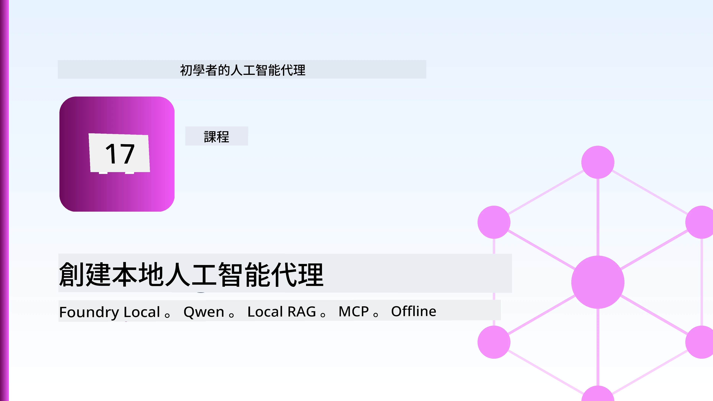
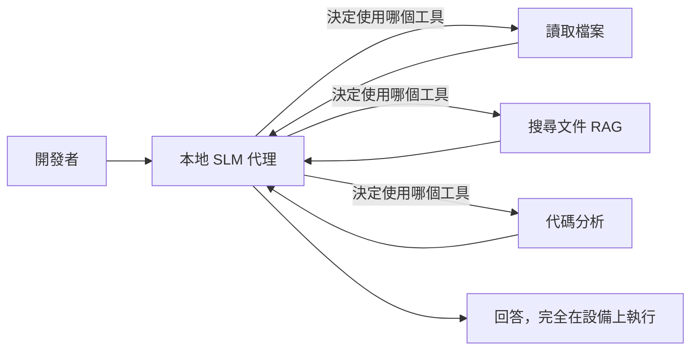
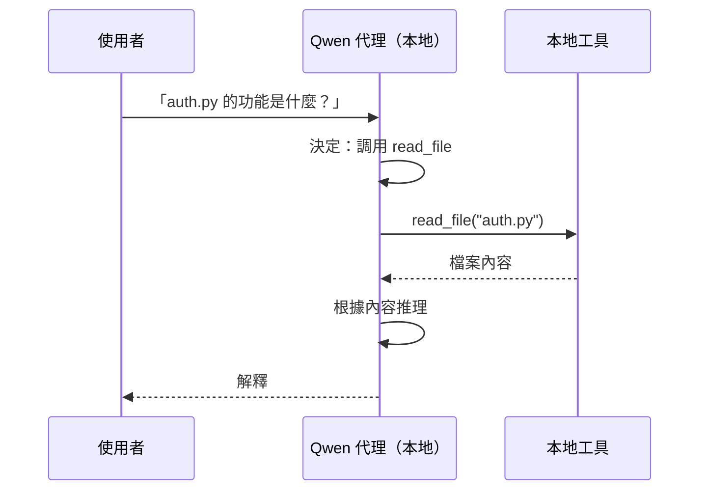
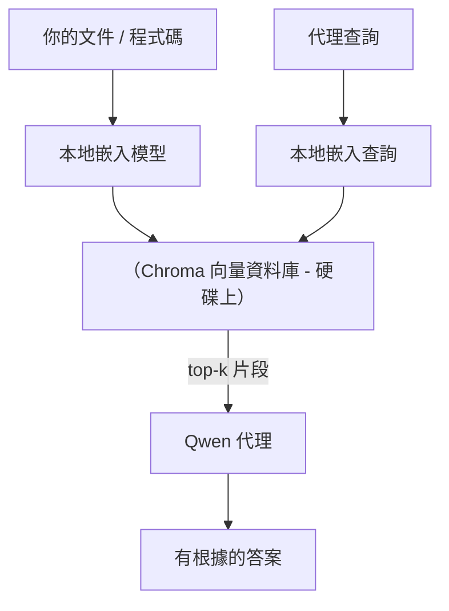
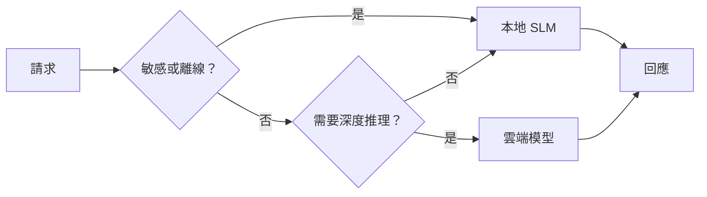

# 使用 Microsoft Foundry Local 和 Qwen 建立本地 AI 助手



前一課將助手擴展至雲端。本課則將它們「拉下」至單一機器。到結束時，你會擁有一個運作中的工程助理，能夠推理、調用工具、讀取你的檔案和搜索文件——**完全不需要任何雲端推論調用。**

為什麼你會需要這樣？在真實工程工作中，這裡有三個常見理由：

- **隱私。** 程式碼和文件從不離開機器。沒有提示、沒有程式碼片段、沒有客戶資料穿越網絡邊界。
- **成本。** 本地推論沒有依據 token 計費。你可以整天迭代，成本只有電費。
- **離線。** 在飛機上、在安全設施或停電期間，助手仍可運作。

關鍵是你用一個在 CPU、GPU 或 NPU 上運行的 **小型語言模型 (SLM)** 取代了頂尖的雲端模型。本課重點是建構在這種限制下 <em>表現良好</em> 的助手，而不是假裝限制不存在。

## 介紹

本課涵蓋：

- **小型语言模型 (SLMs)** — 它們是什麼、擅長哪些場景、不擅長哪些。
- **Microsoft Foundry Local** — 一個在裝置上下載並服務模型的執行環境，透過 **OpenAI 相容 API**。
- **Qwen 函數調用模型** — 可靠產生工具調用的 SLM，使本地 <em>助手</em>（不只是聊天）成為可能。
- **本地工具、本地 RAG 及本地 MCP** — 賦予助手無需雲端即可使用的能力。
- <strong>混合模式</strong> — 何時保留本地，何時使用雲端。

## 學習目標

完成本課後，你將能：

- 解釋 SLM 的取捨，並挑選合適的本地助手應用場景。
- 使用 Foundry Local 在本地啟動 Qwen 模型，並透過 OpenAI 相容端點連接。
- 建立完全在工作站運行的工具調用助手。
- 使用本地向量資料庫 (Chroma) 為自己的文件添加本地 RAG。
- 連接助手到本地 MCP 伺服器，並思考混合本地/雲端設計。

## 先決條件

本課假設你已完成之前課程並熟悉：

- [工具使用](../04-tool-use/README.md) (第4課) 和 [帶代理的 RAG](../05-agentic-rag/README.md) (第5課)。
- [代理協定 / MCP](../11-agentic-protocols/README.md) (第11課)。
- [Microsoft Agent Framework](../14-microsoft-agent-framework/README.md) (第14課)。

你還需要：

- 一台開發工作站。**8 GB RAM 是實際的最低限度**；16 GB 以上較為舒適。GPU 或 NPU 有幫助但非必需。
- 安裝 **Microsoft Foundry Local**（請參見下方設定章節）。
- Python 3.12 以上，以及本倉庫 [`requirements.txt`](../../../requirements.txt) 中的套件，並安裝本課所需的 `foundry-local-sdk`、`openai` 和 `chromadb`。

## 小型語言模型：本地工作的合適工具

頂尖雲端模型擁有數千億參數和一個資料中心支撐。SLM 擁有數十億參數，必須能裝入你筆記型電腦的 RAM。這個差異設定了明確的期望。

**SLM 擅長：**

- 結構清楚、範圍有限的任務 — 分類、抽取、已知文件的摘要。
- <strong>工具調用</strong> — 決定要呼叫哪個函數以及用什麼參數。
- 針對自己資料的快速、廉價且私密的迭代。

**SLM 較弱於：**

- 需大量上下文的開放式多跳推理。
- 廣泛世界知識（它們看到的資料較少且較容易遺忘）。

因此，本地助手的制勝策略是：**讓 SLM 負責協調，讓工具負責重載運算。** 模型不需要 <em>了解</em> 你的程式碼庫，而是要知道何時呼叫 `read_file` 和 `search_docs`。這正好發揮 SLM 的優勢。



## Microsoft Foundry Local

**Microsoft Foundry Local** 是一個輕量執行環境，能在你的機器上下載、管理並服務模型。我們最重要的功能是它提供一個 **OpenAI 相容 HTTP 端點** — 這意味著 OpenAI SDK 和 Microsoft Agent Framework 的 OpenAI 用戶端僅需修改 `base_url` 就能對接它。你在雲端建助手學到的一切都能直接轉移；唯一不同的是端點從雲端移至 `localhost`。

Foundry Local 也會根據硬體自動選擇最佳的模型版本 — CPU 版、CUDA/GPU 版或 NPU 版 — 你不用為每台機器手動調校。

### 安裝設定

安裝 Foundry Local（請參考你的作業系統的[文件](https://learn.microsoft.com/azure/ai-foundry/foundry-local/)），然後確認它運作正常：

```bash
# 安裝（範例；請參考您平台的文件）
winget install Microsoft.FoundryLocal      # Windows（視窗系統）
# brew install microsoft/foundrylocal/foundrylocal   # macOS（蘋果電腦）

# 下載並執行 Qwen 模型，然後啟動本地服務
foundry model run qwen2.5-7b-instruct
foundry service status
```

服務運行後，你會得到一個本地、OpenAI 相容的端點（通常是 `http://localhost:PORT/v1`）。本筆記本使用 `foundry-local-sdk` 自動偵測端點，所以你無須硬編碼端口。

## Qwen 函數調用：為何重要

一個助手只有能調用工具才是真正的助手。許多 SLM 可以聊天，但產生不可靠或格式錯誤的工具調用。**Qwen** 模型專門訓練於函數調用，能持續產生格式良好的工具調用結構——這正是使本地聊天模型轉變成本地 <em>助手</em> 的關鍵。

流程是你已熟悉的標準工具調用迴圈，只是跑在本機上：



## 本地 RAG

文件檢索是本地助手展現價值的地方。你不必期待 SLM 記住你的框架文檔，而是將文檔嵌入至<strong>本地向量資料庫</strong>，讓助手按需檢索相關片段。

我們使用 **Chroma**，一個可嵌入且無需服務器管理的向量資料庫。整個流程都是本地的：本地嵌入模型 → 本地向量 → 本地檢索 → 本地 SLM。



這是第 5 課的 Agentic RAG 模式——唯一不同是所有組件都在你的機器上運行。

## 本地 MCP 伺服器

[MCP](../11-agentic-protocols/README.md) 是一種傳輸協議，而非雲端服務。MCP 伺服器可以作為本地進程在 `stdio` 上運行，以標準協定將工具暴露給你的助手。這使你能夠重用日益增多的 MCP 伺服器生態系統——檔案系統訪問、git 操作、資料庫查詢——完全脫機。

安全態勢與雲端不同，但並非不存在：本地 MCP 伺服器仍以你的使用者權限運行，所以要範圍限定它能操作的目標（例如一個專案資料夾，而非整個使用者目錄），並將其輸出視為輸入加以驗證。

## 混合雲端與本地模式

以本地為先不代表只能本地。成熟系統會依據敏感度與困難度進行路由：

| 情境 | 運行地點 |
| --- | --- |
| 敏感代碼／資料，或離線場景 | **本地 SLM** |
| 簡單有限任務 | **本地 SLM**（便宜且快速） |
| 困難的非敏感多跳推理 | <strong>雲端模型</strong> |
| 停電時所有任務 | **本地 SLM**（優雅降級） |

這呼應了第 16 課的 <strong>模型路由</strong> 概念——只是其中一個「模型」是你的本地機器。堅固的設計會在雲端不可用時退回使用本地，使助手在品質上漸進降低而非完全失效。



## 實作練習：本地工程助理

開啟 [`code_samples/17-local-agent-foundry-local.ipynb`](./code_samples/17-local-agent-foundry-local.ipynb) 並跟著操作。你將建構一個<strong>本地工程助理</strong>，完全在你的工作站運行，並能：

1. <strong>調用工具</strong> — 透過 Foundry Local 的 Qwen 函數調用。
2. <strong>執行本地檔案操作</strong> — 列出並讀取專案目錄的檔案。
3. <strong>分析程式碼</strong> — 報告原始碼檔的基本指標。
4. <strong>搜尋文件</strong> — 使用 Chroma 對文件資料夾進行本地 RAG。
5. **使用 MCP** — 連接到本地 MCP 伺服器（若未配置則優雅跳過）。

任一階段皆不使用雲端推論。

### 步驟導覽

助理透過 OpenAI 相容端點連接 Foundry Local，所以助手程式碼和雲端課程幾乎一模一樣——僅客戶端不同：

```python
from foundry_local import FoundryLocalManager
from openai import OpenAI

# Foundry Local 發現/下載模型，並為我們提供一個本地端點。
manager = FoundryLocalManager(\"qwen2.5-7b-instruct\")
client = OpenAI(base_url=manager.endpoint, api_key=manager.api_key)  # api_key 是本地佔位符
```

工具是作用於專案目錄的普通 Python 函數：

```python
def read_file(path: str) -> str:
    \"\"\"Read a file, but only inside the sandboxed project directory.\"\"\"
    full = (PROJECT_ROOT / path).resolve()
    if PROJECT_ROOT not in full.parents and full != PROJECT_ROOT:
        return \"Access denied: path is outside the project directory.\"
    return full.read_text(encoding=\"utf-8\")
```

留意沙盒檢查——即使是在本地，能讀取任意路徑的工具也是風險。筆記本維持所有工具僅限於單一專案根目錄。

## 知識檢查

在進入作業前測試你的理解。

**1. 請列出兩個把助手放在本地而非雲端執行的具體理由。**

<details>
<summary>解答</summary>

以下任兩項：<strong>隱私</strong>（程式碼與資料從不離開機器）、<strong>成本</strong>（無 token 推論費用）、<strong>離線能力</strong>（無網路時仍能工作，如飛機上、安檢區或停電）。監管合規限制禁止送出設備外資料是隱私理由的常見驅動力。
</details>

**2. 在本地助手中，SLM 與其工具的推薦分工是什麼？為什麼？**

<details>
<summary>解答</summary>

讓 SLM <strong>協調</strong>（決定調用哪個工具及參數），讓<strong>工具負責重載運算</strong>（讀檔、檢索文檔、計算結果）。SLM 擅長有限決策如工具選擇，但在廣泛知識與長距離多跳推理較弱，因此倚賴工具能發揮其強項。
</details>

**3. 是什麼讓我們能用 Foundry Local 重用雲端助手程式碼？**

<details>
<summary>解答</summary>

Foundry Local 提供一個<strong>OpenAI 相容 HTTP 端點</strong>。OpenAI SDK 與 Agent Framework 的 OpenAI 客戶端只要更改 `base_url`（並使用本地占位 API 金鑰）即可對接。其它助手程式碼不變。
</details>

**4. 為何特別選擇 Qwen 函數調用模型而非任意 SLM？**

<details>
<summary>解答</summary>

因為助手必須產生可靠且格式良好的<strong>工具調用</strong>。許多 SLM 能聊天，但產生錯誤或不一致的工具調用結構。Qwen 模型訓練於函數調用並穩定產生格式正確的調用，這正是使本地聊天模型變成工作助手的關鍵。
</details>

**5. 在本地 RAG 流程中，哪些元件運行在機器上？**

<details>
<summary>解答</summary>

全部：嵌入模型、向量資料庫（Chroma，儲存在磁碟）、檢索步驟及 SLM。文件在本地嵌入、儲存、檢索，由本地模型推理——沒有元件接觸雲端。
</details>

**6. 本地 MCP 伺服器運行在你的機器上。這是否自動代表它是安全的？你還應採取什麼預防措施？**

<details>
<summary>解答</summary>

不是。本地 MCP 伺服器以你的使用者權限運行，能操作你能操作的任何東西。請限定它的範圍（例如只限於單一專案資料夾而非全部使用者目錄），並將其輸出視為輸入，對內容進行驗證後再採取行動。
</details>

**7. 描述一個包含本地模型的合理混合路由規則。**

<details>
<summary>解答</summary>

將敏感或離線的請求導向本地 SLM；將簡單且範圍有限的任務導向本地 SLM 以提升速度與降低成本；將困難的非敏感多跳推理導向雲端模型；若雲端不可用則退回本地 SLM，使助手優雅降級而非失效。此為第 16 課模型路由概念的延伸，本地機器作為模型之一。
</details>

**8. 本課本地助手的 RAM 實際最低需求為多少？多 RAM 可帶來什麼好處？**

<details>
<summary>解答</summary>

約 **8 GB** 是實際最低限度；16 GB 以上較為舒適。更多 RAM 讓你能運行更大且更強的模型，並保留更多上下文在記憶中。GPU 或 NPU 可加速推論，但非必需——無硬體加速時 Foundry Local 會選擇 CPU 版本。
</details>

## 作業

將本地工程助理擴展成一個適用於你選擇的小專案的<strong>本地文件審閱器</strong>（如果想，可以使用本倉庫的某一課程底下的資料夾）。

你的提交應包含：

1. **將一個真實的文件/程式碼資料夾編入 Chroma 索引**（至少五個檔案）。
2. **新增一個 `find_todos` 工具**，掃描專案內的 `TODO`/`FIXME` 註解，並回傳包含檔案與行號的清單——保留與 `read_file` 相同的沙盒檢查。

3. <strong>向代理問三個問題</strong>，迫使它結合工具：一個純粹的 RAG 問題、一個需要閱讀特定檔案的問題，以及一個需要尋找 TODO 的問題。
4. <strong>測量時間</strong>：計算三個回應的時間並在 markdown 儲存格中記錄。評論該延遲時間是否符合您預期的工作流程。

然後寫一個簡短的段落說明 **您會把哪些部分移到雲端，哪些會保留在本地** 給這個審查者，以及原因。評估重點在於本地組件是否正確連接，以及您的混合推理是否合理 — 而非模型品質。

## 摘要

在本課程中，您建立了一個完全在您自己機器上運行的代理：

- **SLM** 以隱私、成本和離線操作交換廣度 — 並且當它們 <strong>協調工具</strong> 而非全部知識自己承擔時表現出色。
- **Foundry Local** 在設備上透過 **與 OpenAI 兼容的端點** 服務模型，因此您的雲端代理代碼只需一行修改即可轉移。
- **Qwen 函數呼叫模型** 使本地可靠的工具呼叫成為可能，從而實現本地 <em>代理</em>。
- **本地 RAG** (Chroma) 和 **本地 MCP** 讓代理具備能力而不必離開機器。
- <strong>混合模式</strong> 讓您根據敏感性和難度進行路由，以本地作為優雅的後備方案。

這完成了部署發展線索：第 16 課將代理擴展到 Microsoft Foundry，本課將其縮減到單一工作站。下一課將轉向保持部署代理的安全。

## 額外資源

- <a href="https://learn.microsoft.com/azure/ai-foundry/foundry-local/" target="_blank">Microsoft Foundry Local 文件</a>
- <a href="https://learn.microsoft.com/azure/ai-foundry/what-is-azure-ai-foundry" target="_blank">Microsoft Foundry 文件</a>
- <a href="https://aka.ms/ai-agents-beginners/agent-framework" target="_blank">Microsoft 代理框架</a>
- <a href="https://qwen.readthedocs.io/en/latest/framework/function_call.html" target="_blank">Qwen 函數呼叫文件</a>
- <a href="https://modelcontextprotocol.io/" target="_blank">模型上下文協議 (MCP)</a>
- <a href="https://docs.trychroma.com/" target="_blank">Chroma 向量數據庫</a>

## 前一課

[部署可擴展代理](../16-deploying-scalable-agents/README.md)

## 下一課

[保障 AI 代理安全](../18-securing-ai-agents/README.md)

---

<!-- CO-OP TRANSLATOR DISCLAIMER START -->
**免責聲明**：
本文件由 AI 翻譯服務 [Co-op Translator](https://github.com/Azure/co-op-translator) 翻譯而成。雖然我們致力於確保準確性，但請注意，機器自動翻譯可能包含錯誤或不準確之處。原始文件的母語版本應被視為權威來源。對於重要資訊，建議進行專業人工翻譯。我們不對因使用本翻譯而產生的任何誤解或誤釋承擔責任。
<!-- CO-OP TRANSLATOR DISCLAIMER END -->