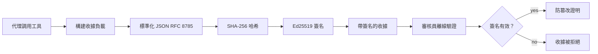
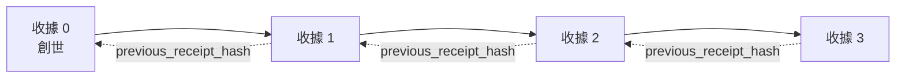

[觀看課程影片：使用加密收據保障 AI 代理](https://youtu.be/PLACEHOLDER_VIDEO_ID)

> _(課程影片與縮圖將由微軟內容團隊於合併後新增，符合第14/15課程模式。)_

# 使用加密收據保障 AI 代理

## 介紹

本課程將涵蓋：

- 為何 AI 代理的稽核軌跡對合規、除錯與信任非常重要。
- 什麼是加密收據，以及它如何不同於未簽署的日誌行。
- 如何在純 Python 中為代理的工具呼叫產生簽署收據。
- 如何離線驗證收據並偵測竄改。
- 如何串連收據，使移除或重新排序任何一個都會破壞整條鏈。
- 收據能證明什麼，明確不證明什麼。

## 學習目標

完成本課程後，您將學會：

- 識別促使代理動作使用加密溯源的故障模式。
- 用 Ed25519 簽署對標準 JSON 負載的收據。
- 僅用簽署者公開金鑰獨立驗證收據。
- 透過重新驗證被修改的收據來偵測竄改。
- 建立一條哈希串鏈收據並說明鏈的重要性。
- 辨識收據能證明（歸屬、完整性、排序）與不能證明（行動正確性、政策合理性）之間的界線。

## 問題：您代理的稽核軌跡

假設您已為 Contoso Travel 部署 AI 代理。該代理會讀取客戶請求，用航班 API 查詢選項，並代表客戶預訂座位。上一季，該代理處理了 50,000 筆訂位。

今天有位稽核員到訪。他們問一個簡單問題：「請展示您的代理做了什麼。」

您交出日誌檔。稽核員看過之後問更難問題：「我怎麼知道這些日誌沒有被修改過？」

這就是稽核軌跡的問題。現今大多數代理部署依賴：

- <strong>應用程式日誌</strong>：由代理自己寫入，任何有檔案系統存取權者都可編輯。
- <strong>雲端日誌服務</strong>：平台層面防竄改，但前提是稽核員信任平台運營者。
- <strong>資料庫交易日誌</strong>：適合資料庫變更，但不適用於任意工具呼叫。

這些都無法解決稽核員的問題，除非稽核員信任某人（您、您的雲端服務商、資料庫供應商）。內部使用時，這種信任通常可接受，但在受規管工作負載（金融、醫療保健、EU AI法案）下則不可。

加密收據透過讓每個代理行為可獨立驗證來解決此問題。稽核員不需信任您，只需要您的公開金鑰和收據本身。

## 什麼是加密收據？

收據是一個記錄代理所做工作的 JSON 物件，並以數位簽章簽署。



一個最簡單的收據如下：

```json
{
  "type": "agent.tool_call.v1",
  "agent_id": "contoso-travel-bot",
  "tool_name": "lookup_flights",
  "tool_args_hash": "sha256:a3f9c1...",
  "result_hash": "sha256:7b2e1d...",
  "policy_id": "contoso-travel-policy-v3",
  "timestamp": "2026-04-25T14:30:00Z",
  "sequence": 47,
  "previous_receipt_hash": "sha256:9d4e6a...",
  "signature": {
    "alg": "EdDSA",
    "sig": "c5af83...",
    "public_key": "8f3b2c..."
  }
}
```

三個屬性發揮作用：

1. <strong>簽章</strong>。收據由代理閘道使用 Ed25519 私鑰簽署。任何擁有對應公開金鑰者可離線驗證簽章。任何欄位被竄改都會使簽章失效。

2. <strong>標準編碼</strong>。簽章前，收據使用 JSON 標準化方案（JCS, RFC 8785）序列化。確保不同實作產生相同邏輯收據時會有完全相同的位元組輸出。若不標準化，會因 JSON 序列器不同而產生不同簽章。

3. <strong>哈希串鏈</strong>。`previous_receipt_hash` 欄位將每筆收據串接到前一筆。移除或重新排序某一收據會破壞其後所有收據。即使個別簽章被繞過，鏈上仍能發現竄改。

這些屬性合力提供三項保障：

- <strong>歸屬</strong>：此金鑰簽署了此內容。
- <strong>完整性</strong>：內容自簽署後未曾更動。
- <strong>排序</strong>：此收據在鏈中位於該收據之後。

## 用 Python 製作收據

產生收據不必使用特殊函式庫。加密原語廣泛可用，邏輯僅數十行 Python。

實作練習可參考 `code_samples/18-signed-receipts.ipynb`，以下是摘要：

```python
import json
import hashlib
import base64
from nacl import signing
from jcs import canonicalize  # RFC 8785 規範化 JSON

def b64url_nopad(data: bytes) -> str:
    return base64.urlsafe_b64encode(data).decode("ascii").rstrip("=")

def sha256_canonical(obj) -> str:
    """SHA-256 of a Python object's JCS-canonical JSON form."""
    return f"sha256:{hashlib.sha256(canonicalize(obj)).hexdigest()}"

# 產生或載入簽名金鑰（生產環境中，存放於金鑰庫）
signing_key = signing.SigningKey.generate()
verify_key = signing_key.verify_key

# 建立收據有效載荷（尚未簽署）
tool_args = {"origin": "SYD", "destination": "LAX"}
tool_result = [{"flight": "QF11", "price": 1850, "stops": 0}]

payload = {
    "type": "agent.tool_call.v1",
    "agent_id": "contoso-travel-bot",
    "tool_name": "lookup_flights",
    "tool_args_hash": sha256_canonical(tool_args),
    "result_hash": sha256_canonical(tool_result),
    "policy_id": "contoso-travel-policy-v3",
    "timestamp": "2026-04-25T14:30:00Z",
    "sequence": 0,
    "previous_receipt_hash": None,
}

# 規範化、雜湊、簽名。
canonical_bytes = canonicalize(payload)
message_hash = hashlib.sha256(canonical_bytes).digest()
signature_bytes = signing_key.sign(message_hash).signature

# 附加結構化簽名物件。
receipt = {
    **payload,
    "signature": {
        "alg": "EdDSA",
        "sig": b64url_nopad(signature_bytes),
        "public_key": b64url_nopad(bytes(verify_key)),
    },
}
```

那是整個簽署流程。筆記本中會詳細說明每個步驟。

## 驗證收據與偵測竄改

驗證為反向操作：

```python
import base64
import hashlib
from nacl import signing
from nacl.exceptions import BadSignatureError
from jcs import canonicalize

def b64url_decode(s: str) -> bytes:
    padding = "=" * ((4 - len(s) % 4) % 4)
    return base64.urlsafe_b64decode(s + padding)

def verify_receipt(receipt: dict) -> bool:
    # 簽名是一個結構化物件：{"alg", "sig", "public_key"}。
    sig_obj = receipt.get("signature")
    if not sig_obj or sig_obj.get("alg") != "EdDSA":
        return False

    # 重新構建實際被簽署的載荷（除簽名外的所有內容）。
    payload = {k: v for k, v in receipt.items() if k != "signature"}

    canonical_bytes = canonicalize(payload)
    message_hash = hashlib.sha256(canonical_bytes).digest()

    try:
        verify_key = signing.VerifyKey(b64url_decode(sig_obj["public_key"]))
        verify_key.verify(message_hash, b64url_decode(sig_obj["sig"]))
        return True
    except BadSignatureError:
        return False
```

此函式接受收據並回傳簽章有效則為 `True`，否則 `False`。無需網路請求、服務依賴或信任第三方。

筆記本演示如何偵測竄改：

1. 產生有效收據並確認驗證成功。
2. 修改 `tool_args_hash` 欄位的一個位元組。
3. 再次驗證結果失敗。

這是收據具備防竄改性的實作證明：任何細微改動都會破壞簽章。

## 為多步驟代理串接收據

單一簽署收據保護一個行動，一串收據保護一連串行動。



每個收據紀錄前一收據的雜湊。若想偷偷移除第二筆收據，攻擊者必須：

- 修改第三筆收據的 `previous_receipt_hash` 欄位（破壞第三筆收據的簽章），或
- 對修改後的第三筆收據偽造簽章（需要代理的私鑰）。

若私鑰存在硬體金鑰庫且您隨每筆收據發佈公開金鑰，任何攻擊都難以不被察覺。

筆記本示範：

1. 建立三筆收據串鏈。
2. 驗證每筆收據的 `previous_receipt_hash` 與前筆收據的實際雜湊吻合。
3. 竄改中間一筆收據並見證鏈條恰於該點斷裂。

如此便能產製外部稽核者無須信任您的可驗證稽核軌跡。

## 收據證明什麼（與不證明什麼）

本節為本課程最重要部分。收據很強大，但其能力有限。

**收據證明三件事：**

1. <strong>歸屬</strong>：特定金鑰簽署特定負載。
2. <strong>完整性</strong>：負載自簽署後未曾更改。
3. <strong>排序</strong>：本收據在哈希鏈中位於該收據之後。

**收據不證明：**

1. <strong>正確性</strong>：代理行動是否正確。錯誤答案也可同樣簽署收據。
2. <strong>政策遵循</strong>：收據中 `policy_id` 所指政策是否真正評估，或若評估是否允許此行動。收據紀錄主張，非強制執行。
3. <strong>超越金鑰的身分</strong>：收據表示「此金鑰簽署此內容」，不代表「此人授權此內容」。將金鑰與人員或組織連結需獨立身分基礎設施（目錄、公鑰註冊等）。
4. <strong>輸入真實性</strong>：若代理收到被操控提示並據此行動，收據只忠實記錄該行動。收據是輸入驗證的下游產物，非替代品。

此界線重要有二：

- 它指引收據的用途：使代理行為可稽核且有防竄改證據，即使跨組織。
- 它指示額外仍須補足的層面：輸入驗證（第6課），政策執行（下方簡述），身分基礎（本課程範圍外）。

常見誤解是認為「有收據」等於「有治理」。事實非也。收據是基礎。治理系統是你構建在其上的整體。

## 如何證明人類批准確切行為

上列第3項值得特別章節說明：行動收據表示「此金鑰簽署此內容」，從未表示「人類授權」。對於高風險行動（退款、刪除、電匯），治理框架逐漸要求該缺失聲明，且可利用本課中的原語產生。

後續筆記本 `code_samples/human-authorization-receipts.ipynb` 新增第二種收據類型 `human.approval.v1`，採與本課收據相同封套格式（帶型別負載，按標準化 SHA-256 用 Ed25519 簽署，`signature` 在簽署外）。命名審批者簽署<strong>完整標準化行動及其摘要</strong>後執行；代理行動收據攜帶<strong>相同行動摘要</strong>與 `parent_approval_ref`（批准收據的 `receipt_hash`），與鏈中的 `previous_receipt_hash` 採用相同慣例。單一 `verify_chain` 於<strong>分別固定金鑰登錄</strong>（審批者金鑰與代理金鑰）下驗證兩負載，程式碼共用但權限分離。

精準描述此屬性：*該人類批准此精確行動，代理精確執行此批准行動。* 筆記本的拒絕機制令此屬性成為事實而非只陳述：

- 經典類型：竄改、混淆代理、重播、雙方偽造金鑰、格式錯誤輸入；
- <strong>過期權限</strong>：仍然能驗證的簽章，因政策版本更新、審批者金鑰被移出固定登錄，或批准過期於執行前故拒絕；
- <strong>摘要替換</strong>：有效簽署的行動收據指向綁定於<em>不同</em>標準化行動的<em>真實</em>批准。

每種失敗均有明確拒絕原因，促使稽核能辨別權限是否過期或執行行動是否被改變。筆記本教導規則：單一簽署批准不等同授權。僅當兩收據執行時仍綁定同一標準化行動，授權成立。此課跟隨的 Internet-Draft（`draft-farley-acta-signed-receipts`）中之聯合簽名路徑是此模式的標準軌道版本。

## 生產參考

本課 Python 程式碼設計極簡，方便閱讀並深入理解。生產環境中，有兩種選擇：

1. **直接構建於加密原語上。** 上述約50行程式碼足以應用於多數場景。PyNaCl（Ed25519）與 `jcs` 套件（標準 JSON）均為維護良好且經審核的函式庫。

2. **採用生產級收據函式庫。** 多個開源專案實作相同模式並提供額外功能（密鑰輪替、批次驗證、JWK 集分發、政策引擎整合）：
   - 本課使用的收據格式遵循一份 IETF Internet-Draft（[`draft-farley-acta-signed-receipts`](https://datatracker.ietf.org/doc/draft-farley-acta-signed-receipts/), 修訂版02），目前進行標準化流程，及共享合規套件（[agent-governance-testvectors](https://github.com/ScopeBlind/agent-governance-testvectors)），供獨立實作互相驗證產生字節相同的標準輸出。
   - 微軟代理治理工具包將收據與基於 Cedar 的政策決策結合；詳見該存儲庫中的教程33，展現端到端範例。
   - `protect-mcp`（npm）與 `@veritasacta/verify`（npm）套件提供基於 Node 的收據簽署與離線驗證實作，旨在為任何 MCP 伺服器封裝防竄改稽核軌跡，包括一種持有並等待共同簽署的流程，其中暫停動作會發出與行動摘要綁定的批准收據（桌面流程中由 WebAuthn 支持），與上述人類授權筆記本中的批准收據模式相同。
   - **[nobulex](https://github.com/arian-gogani/nobulex)** Python SDK（`pip install nobulex`）提供相同行為的 Ed25519 + JCS 簽署模式，並具備 LangChain 與 CrewAI 整合，包含公開的交叉驗證測試向量與通過 [OWASP PR #2210](https://github.com/OWASP/CheatSheetSeries/pull/2210) 貢獻的合規性對照。

自行打造或使用函式庫的抉擇，類似於自己寫 JWT 函式庫與使用已測試函式庫的決定：兩者皆合理；函式庫可節省時間並降低審核範圍；自行撰寫則確保對每個原語都深刻理解。本課採自底層撰寫路徑，為兩種選擇奠定基礎。

## 知識檢核

在進入練習前測試您的理解能力。

**1. 收據由代理私鑰 Ed25519 簽署。稽核員僅持有公開金鑰。稽核員可否離線驗證收據？**

<details>
<summary>答案</summary>

可以。Ed25519 驗證只需公開金鑰與被簽署字節。無需網路呼叫、服務依賴。此特性使收據適用於空氣隔離、多組織或低信任稽核環境。
</details>

**2. 攻擊者修改收據中的 `policy_id` 欄位，使其宣稱受更寬鬆政策管控。簽章是對原始負載的簽署。驗證時會發生什麼？**

<details>
<summary>答案</summary>


驗證失敗。簽名是對原始有效負載的標準位元組計算的；修改任何欄位都會更改標準位元組，進而更改 SHA-256 雜湊值，使簽名無效。攻擊者需要私鑰才能產生新的有效簽名，而他們並沒有。
</details>

**3. 為什麼收據包含 `tool_args_hash` 和 `result_hash`，而不是原始參數和結果？**

<details>
<summary>答案</summary>

有兩個原因。首先，收據可能需要在對洩露原始內容（PII、商業數據）敏感的環境中歸檔或傳輸。雜湊保持收據較小且內容私密；審計者驗證雜湊是否與另行存儲的實際內容副本匹配。其次，雜湊大小是固定的；無論輸入和輸出多大，包含雜湊的收據大小都是有限的。
</details>

**4. `previous_receipt_hash` 欄位將每個收據連結到其前一個收據。如果攻擊者靜默地刪除鏈中間的一個收據，什麼將變得無效？**

<details>
<summary>答案</summary>

刪除的收據之後的所有收據。它們的 `previous_receipt_hash` 欄位將不再匹配實際鏈條（因為它們所參考的收據不再存在，或鏈條現在指向不同的前身）。為了隱藏刪除，攻擊者必須重新簽署每個後續收據，這需要私鑰。
</details>

**5. 收據驗證成功。這是否證明代理的行為是正確、合理或合規？**

<details>
<summary>答案</summary>

不是。有效收據證明三件事：歸屬（此金鑰簽署此內容）、完整性（內容未被更改）和排序（此收據是在該收據之後）。它不證明該行為正確，`policy_id` 中指名的政策確實被評估，或代理遵守了所有規則。收據使代理行為可審計，但不一定正確。這是本課程中最重要的界線。
</details>

## 練習題

打開 `code_samples/18-signed-receipts.ipynb` 並完成以下四個部分：

1. <strong>第一部分</strong>：簽署你的第一份收據並驗證它。
2. <strong>第二部分</strong>：竄改收據並觀察驗證失敗。
3. <strong>第三部分</strong>：建立三個收據的鏈條並驗證鏈條完整性。
4. <strong>第四部分</strong>：將此模式應用於使用 Microsoft Agent Framework 建立的代理：將工具調用包裝在收據簽名中，然後獨立驗證收據。

**擴展挑戰 1：** 擴展收據架構，增加你選擇的欄位（例如，請求 ID 用於追蹤），更新標準簽名邏輯以包含該欄位，並確認收據仍能通過驗證。然後簽名後修改該欄位，確認驗證失敗。這讓你了解標準編碼的每個位元組如何影響簽名。

**擴展挑戰 2：** 對兩個收據的標準位元組（按確定性順序串接）執行 SHA-256 雜湊，並將結果摘要作為第三個收據的新欄位嵌入，然後簽名。驗證三個收據仍能通過驗證。你剛完成一步包含證明：任何持有第三個收據的人都能證明前兩個收據在簽名時存在，且不需揭露內容。這是選擇性披露收據在大規模中使用的模式（Merkle 承諾，RFC 6962）。

## 總結

密碼學收據為 AI 代理提供審計軌跡，具備：

- <strong>獨立驗證</strong>：任何持有公鑰的一方皆可驗證，無需服務依賴。
- <strong>竄改可察覺</strong>：任何修改均使簽名失效。
- <strong>可攜帶</strong>：收據是一個小型 JSON 檔案；可在任處封存、傳輸及驗證。
- <strong>符合標準</strong>：建立於 Ed25519 (RFC 8032)、JCS (RFC 8785) 與 SHA-256 等廣泛部署的原語。

它們不是輸入驗證、政策執行或身份基礎設施的替代品，而是這些層的基礎。當你在受規管的工作負載、多組織工作流程或無法假定未來審計員信任你的環境布署代理時，收據是讓審計軌跡誠實可信的方式。

最重要的結論：收據證明誰、何時宣稱了什麼。但它不證明所宣稱的內容是真實或正確。務必牢記這個區別。這是誠實出處系統與誤導性系統的分水嶺。

## 上線準備檢查清單

當你準備從此課程畢業、部署帶收據簽名的代理到真實環境時：

- [ ] **將簽名金鑰移離開發者筆記型電腦。** 使用 Azure Key Vault、AWS KMS 或硬體安全模組。用於簽署收據的私鑰絕不能存於原始碼控制系統或應用機器的明文中。
- [ ] **發布驗證用公鑰。** 審計者離線驗證需要公鑰。標準做法是將 JWK 集合發布於眾所周知的 URL （RFC 7517），例如 `https://your-org.example.com/.well-known/agent-keys.json`。
- [ ] **外部錨定鏈條。** 定期將最新鏈頭雜湊寫入透明度日誌（Sigstore Rekor、RFC 3161 時戳權威或第二個內部系統），以便外部方確認「此鏈於該時間存在」。
- [ ] **不可變地存儲收據。** 追加型塊儲存（Azure Storage 具不可變策略、AWS S3 物件鎖定）防止內部人員於存儲層改寫歷史。
- [ ] **決定留存政策。** 多數合規規範要求多年保留。規劃收據成長（每份收據約 500 字節；一個每天發出一萬呼叫的代理每年產生約 1.8 GB）。
- [ ] **文件化收據不涵蓋的內容。** 收據證明歸屬、完整性及排序。你的執行手冊應明確列出附加控制（輸入驗證、政策執行、速率限制、身份基礎設施）如何與收據共同形成治理態勢。

### 有更多關於保護 AI 代理的問題嗎？

加入 [Microsoft Foundry Discord](https://aka.ms/ai-agents/discord)，與其他學習者交流，參加問答時間，解決你的 AI 代理問題。

## 課程延伸

本課程涵蓋單一收據簽名與哈希鏈序列。相同原語組合成以下更進階模式，可隨治理態勢成長時遇到：

- **選擇性披露。** 當收據欄位獨立承諾（RFC 6962 風格 Merkle 樹）時，可向特定審計者透露特定欄位並證明其餘未更改且不揭露。適用於同一收據須同時滿足全面審計（要求完整）與遵守像 GDPR 的資料最小化規定（要求發審計者見最少資料）。
- **收據撤銷。** 如果簽名金鑰遭入侵，要有方法自某時起標記該金鑰簽署的所有收據不可信。標準做法：短期簽名金鑰加上公開撤銷清單，或給施行撤銷條目的透明度日誌。
- **雙邊 / 分割簽名收據。** 一些實作將簽署的有效負載拆分為執行前（`authorization_*`）與執行後（`result_*`）兩半，簽名獨立，適用於授權決定與觀察結果由不同角色或時間產生。此模式可附加組合於本課程教學的收據格式上。
- **有效負載組成。** 收據封印的是你放入 `result_hash` 的位元組。實際有效負載常比單一次工具呼叫結果更豐富：執行前推理（模型預測、考慮選項、證據及其完整性、風險態勢、問責鏈條、門控結果）都可封裝在有效負載中，僅由單一收據封印。保持收據格式簡潔，同時讓有效負載架構可隨領域發展。
- **跨實作相容性。** 多個獨立實作同一格式（Python、TypeScript、Rust、Go）使用共享測試向量交叉驗證。自建實作時，針對已發布向量驗證確認線路（wire）相容。
- **後量子轉移。** Ed25519 目前廣泛部署，但不抗量子攻擊。收據格式可更換演算法：`signature.alg` 欄位可帶入需要轉移時的 `ML-DSA-65`（NIST 後量子簽名標準）。規劃轉移期內收據同時雙重簽署。

## 進階資源

- <a href="https://datatracker.ietf.org/doc/draft-farley-acta-signed-receipts/" target="_blank">IETF 網際網路草案：機器對機器存取控制的簽署決策收據</a>
- <a href="https://learn.microsoft.com/azure/ai-studio/responsible-use-of-ai-overview" target="_blank">負責任的 AI 概覽 (Azure AI)</a>
- <a href="https://datatracker.ietf.org/doc/html/rfc8032" target="_blank">RFC 8032：Edwards 曲線數位簽名演算法 (EdDSA)</a>
- <a href="https://datatracker.ietf.org/doc/html/rfc8785" target="_blank">RFC 8785：JSON 標準化架構 (JCS)</a>
- <a href="https://datatracker.ietf.org/doc/html/rfc6962" target="_blank">RFC 6962：憑證透明度</a>（選擇性披露收據採用的 Merkle 樹結構）
- <a href="https://github.com/microsoft/agent-governance-toolkit/blob/main/docs/tutorials/33-offline-verifiable-receipts.md" target="_blank">Microsoft 代理治理工具包，教程 33：離線可驗證決策收據</a>
- <a href="https://github.com/ScopeBlind/agent-governance-testvectors" target="_blank">本課程使用的收據格式跨實作相容性測試向量</a> (Apache-2.0)
- <a href="https://pynacl.readthedocs.io/" target="_blank">PyNaCl 文件</a> (Python 中的 Ed25519)

## 上一課

[建立本地 AI 代理](../17-creating-local-ai-agents/README.md)

---

<!-- CO-OP TRANSLATOR DISCLAIMER START -->
**免責聲明**：
本文件由 AI 翻譯服務 [Co-op Translator](https://github.com/Azure/co-op-translator) 翻譯而成。雖然我們致力於確保準確性，但請注意，機器自動翻譯可能包含錯誤或不準確之處。原始文件的母語版本應被視為權威來源。對於重要資訊，建議進行專業人工翻譯。我們不對因使用本翻譯而產生的任何誤解或誤釋承擔責任。
<!-- CO-OP TRANSLATOR DISCLAIMER END -->