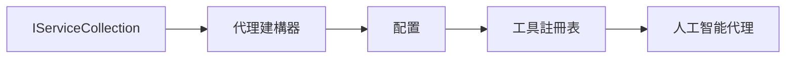

# 🎨 使用 Azure OpenAI（Responses API）（.NET）設計自主代理模式

## 📋 學習目標

本範例展示如何使用 .NET 的 Microsoft Agent Framework 結合 Azure OpenAI（Responses API）整合，建立企業級智能代理的設計模式。您將學習使代理能達到生產環境需求、易於維護與擴展的專業模式和架構方法。

### 企業設計模式

- 🏭 <strong>工廠模式</strong>：透過依賴注入標準化代理建立
- 🔧 <strong>建造者模式</strong>：流暢配置與組裝代理
- 🧵 <strong>線程安全模式</strong>：並發對話管理
- 📋 <strong>倉儲模式</strong>：有組織的工具與能力管理

## 🎯 .NET 特定架構優勢

### 企業特性

- <strong>強型別</strong>：編譯時驗證與 IntelliSense 支援
- <strong>依賴注入</strong>：內建 DI 容器整合
- <strong>設定管理</strong>：IConfiguration 與 Options 模式
- **非同步/等待**：一流的非同步程式設計支援

### 生產就緒模式

- <strong>日誌整合</strong>：ILogger 與結構化日誌支援
- <strong>健康檢查</strong>：內建監控與診斷
- <strong>設定驗證</strong>：強型別配合資料標註
- <strong>錯誤處理</strong>：結構化異常管理

## 🔧 技術架構

### 核心 .NET 元件

- **Microsoft.Extensions.AI**：統一 AI 服務抽象
- **Microsoft.Agents.AI**：企業代理協調框架
- **Azure OpenAI（Responses API）**：高效能 API 用戶端模式
- <strong>設定系統</strong>：appsettings.json 與環境整合

### 設計模式實作



## 🏗️ 展示的企業模式

### 1. <strong>創建型模式</strong>

- <strong>代理工廠</strong>：集中式代理建立與一致配置
- <strong>建造者模式</strong>：為複雜代理配置的流暢 API
- <strong>單例模式</strong>：共用資源與設定管理
- <strong>依賴注入</strong>：鬆耦合與可測試性

### 2. <strong>行為型模式</strong>

- <strong>策略模式</strong>：可互換的工具執行策略
- <strong>命令模式</strong>：封裝代理操作並支援復原/重做
- <strong>觀察者模式</strong>：事件驅動的代理生命週期管理
- <strong>模板方法</strong>：標準化代理執行工作流程

### 3. <strong>結構型模式</strong>

- <strong>介面轉接器模式</strong>：Azure OpenAI（Responses API）整合層
- <strong>裝飾者模式</strong>：增強代理能力
- <strong>外觀模式</strong>：簡化代理互動介面
- <strong>代理模式</strong>：懶加載與快取以提升效能

## 📚 .NET 設計原則

### SOLID 原則

- <strong>單一職責</strong>：每個元件有明確單一目的
- **開放／封閉**：擴展時無需修改原始碼
- <strong>李氏取代原則</strong>：基於介面的工具實作
- <strong>介面隔離</strong>：專注且內聚的介面
- <strong>依賴反轉</strong>：依賴抽象而非具體實作

### 清潔架構

- <strong>領域層</strong>：核心代理與工具抽象
- <strong>應用層</strong>：代理協調與工作流程
- <strong>基礎設施層</strong>：Azure OpenAI（Responses API）整合與外部服務
- <strong>展示層</strong>：用戶互動與回應格式化

## 🔒 企業考量

### 安全性

- <strong>認證管理</strong>：使用 IConfiguration 安全管理 API 金鑰
- <strong>輸入驗證</strong>：強型別與資料標註驗證
- <strong>輸出淨化</strong>：安全的回應處理與過濾
- <strong>審計日誌</strong>：全面操作追蹤

### 效能

- <strong>非同步模式</strong>：非阻塞 I/O 操作
- <strong>連線池</strong>：高效 HTTP 用戶端管理
- <strong>快取</strong>：回應快取以提升效能
- <strong>資源管理</strong>：適當釋放與清理模式

### 擴展性

- <strong>線程安全</strong>：支援代理並發執行
- <strong>資源池</strong>：有效利用資源
- <strong>負載管理</strong>：速率限制與背壓處理
- <strong>監控</strong>：效能指標與健康檢查

## 🚀 生產環境部署

- <strong>設定管理</strong>：環境專屬設定
- <strong>日誌策略</strong>：結構化日誌及相關性 ID
- <strong>錯誤處理</strong>：全域異常處理與適當恢復
- <strong>監控</strong>：應用洞察與效能計數
- <strong>測試</strong>：單元測試、整合測試與負載測試模式

準備用 .NET 建立企業級智能代理了嗎？讓我們架構一個堅固的系統吧！🏢✨

## 🚀 開始使用

### 前置需求

- [.NET 10 SDK](https://dotnet.microsoft.com/download/dotnet/10.0) 或更新版本
- 擁有 Azure OpenAI 資源與模型部署的 [Azure 訂閱](https://azure.microsoft.com/free/)
- [Azure CLI](https://learn.microsoft.com/cli/azure/install-azure-cli) — 使用 `az login` 登入

### 必要環境變數

```bash
# zsh/bash
export AZURE_OPENAI_ENDPOINT=https://<your-resource>.openai.azure.com
export AZURE_OPENAI_DEPLOYMENT=gpt-4.1-mini
# 然後登入，讓 AzureCliCredential 可以取得權杖
az login
```

```powershell
# PowerShell
$env:AZURE_OPENAI_ENDPOINT = "https://<your-resource>.openai.azure.com"
$env:AZURE_OPENAI_DEPLOYMENT = "gpt-4.1-mini"
# 然後登入，讓 AzureCliCredential 可以取得權杖
az login
```

### 範例程式碼

執行此範例程式碼，

```bash
# zsh/bash
chmod +x ./03-dotnet-agent-framework.cs
./03-dotnet-agent-framework.cs
```

或使用 dotnet CLI：

```bash
dotnet run ./03-dotnet-agent-framework.cs
```

完整程式碼請見 [`03-dotnet-agent-framework.cs`](../../../../03-agentic-design-patterns/code_samples/03-dotnet-agent-framework.cs)。

```csharp
#!/usr/bin/dotnet run

#:package Microsoft.Extensions.AI@10.*
#:package Microsoft.Agents.AI.OpenAI@1.*-*
#:package Azure.AI.OpenAI@2.1.0
#:package Azure.Identity@1.13.1

using System.ComponentModel;

using Microsoft.Agents.AI;
using Microsoft.Extensions.AI;

using Azure.AI.OpenAI;
using Azure.Identity;

// Tool Function: Random Destination Generator
// This static method will be available to the agent as a callable tool
// The [Description] attribute helps the AI understand when to use this function
// This demonstrates how to create custom tools for AI agents
[Description("Provides a random vacation destination.")]
static string GetRandomDestination()
{
    // List of popular vacation destinations around the world
    // The agent will randomly select from these options
    var destinations = new List<string>
    {
        "Paris, France",
        "Tokyo, Japan",
        "New York City, USA",
        "Sydney, Australia",
        "Rome, Italy",
        "Barcelona, Spain",
        "Cape Town, South Africa",
        "Rio de Janeiro, Brazil",
        "Bangkok, Thailand",
        "Vancouver, Canada"
    };

    // Generate random index and return selected destination
    // Uses System.Random for simple random selection
    var random = new Random();
    int index = random.Next(destinations.Count);
    return destinations[index];
}

// Azure OpenAI with the Responses API (stable v1 endpoint). Sign in with `az login`.
var azureEndpoint = Environment.GetEnvironmentVariable("AZURE_OPENAI_ENDPOINT")
    ?? throw new InvalidOperationException("AZURE_OPENAI_ENDPOINT is not set.");
var deployment = Environment.GetEnvironmentVariable("AZURE_OPENAI_DEPLOYMENT") ?? "gpt-4.1-mini";

var azureClient = new AzureOpenAIClient(new Uri(azureEndpoint), new AzureCliCredential());

// Define Agent Identity and Comprehensive Instructions
// Agent name for identification and logging purposes
var AGENT_NAME = "TravelAgent";

// Detailed instructions that define the agent's personality, capabilities, and behavior
// This system prompt shapes how the agent responds and interacts with users
var AGENT_INSTRUCTIONS = """
You are a helpful AI Agent that can help plan vacations for customers.

Important: When users specify a destination, always plan for that location. Only suggest random destinations when the user hasn't specified a preference.

When the conversation begins, introduce yourself with this message:
"Hello! I'm your TravelAgent assistant. I can help plan vacations and suggest interesting destinations for you. Here are some things you can ask me:
1. Plan a day trip to a specific location
2. Suggest a random vacation destination
3. Find destinations with specific features (beaches, mountains, historical sites, etc.)
4. Plan an alternative trip if you don't like my first suggestion

What kind of trip would you like me to help you plan today?"

Always prioritize user preferences. If they mention a specific destination like "Bali" or "Paris," focus your planning on that location rather than suggesting alternatives.
""";

// Create AI Agent with Advanced Travel Planning Capabilities
// Get the Responses client for the deployment and create the AI agent
// Configure agent with name, detailed instructions, and available tools
// This demonstrates the .NET agent creation pattern with full configuration
AIAgent agent = azureClient
    .GetChatClient(deployment)
    .AsAIAgent(
        name: AGENT_NAME,
        instructions: AGENT_INSTRUCTIONS,
        tools: [AIFunctionFactory.Create(GetRandomDestination)]
    );

// Create New Conversation Session for Context Management
// Initialize a new conversation session to maintain context across multiple interactions
// Sessions enable the agent to remember previous exchanges and maintain conversational state
// This is essential for multi-turn conversations and contextual understanding
var session = await agent.CreateSessionAsync();

// Execute Agent: First Travel Planning Request
// Run the agent with an initial request that will likely trigger the random destination tool
// The agent will analyze the request, use the GetRandomDestination tool, and create an itinerary
// Using the session parameter maintains conversation context for subsequent interactions
await foreach (var update in agent.RunStreamingAsync("Plan me a day trip", session))
{
    await Task.Delay(10);
    Console.Write(update);
}

Console.WriteLine();

// Execute Agent: Follow-up Request with Context Awareness
// Demonstrate contextual conversation by referencing the previous response
// The agent remembers the previous destination suggestion and will provide an alternative
// This showcases the power of conversation sessions and contextual understanding in .NET agents
await foreach (var update in agent.RunStreamingAsync("I don't like that destination. Plan me another vacation.", session))
{
    await Task.Delay(10);
    Console.Write(update);
}
```

---

<!-- CO-OP TRANSLATOR DISCLAIMER START -->
**免責聲明**：
本文件使用 AI 翻譯服務 [Co-op Translator](https://github.com/Azure/co-op-translator) 進行翻譯。雖然我們力求準確，但請注意，自動翻譯可能包含錯誤或不準確之處。原始文件的母語版本應被視為權威來源。對於重要資訊，建議尋求專業人工翻譯。我們不對因使用本翻譯而引起的任何誤解或曲解承擔責任。
<!-- CO-OP TRANSLATOR DISCLAIMER END -->