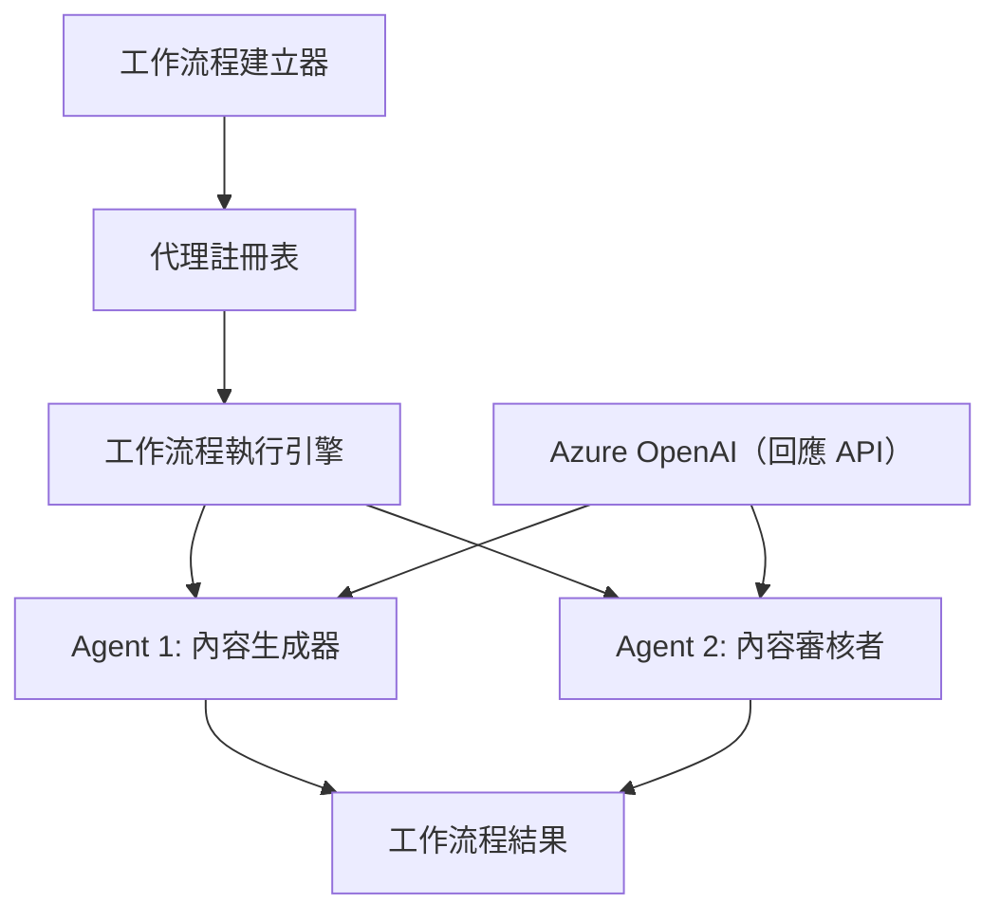

# 🔄 使用 Azure OpenAI (Responses API) 的基本代理工作流程 (.NET)

## 📋 工作流程編排教學

此筆記本展示如何使用 Microsoft Agent Framework for .NET 和 Azure OpenAI (Responses API) 構建複雜的<strong>代理工作流程</strong>。你將學習如何建立多步驟的業務流程，透過結構化的編排模式讓 AI 代理協同完成複雜任務。

## 🎯 學習目標

### 🏗️ <strong>工作流程架構基礎</strong>
- <strong>工作流程建構器</strong>：設計與編排複雜多步驟的 AI 流程
- <strong>代理協調</strong>：在工作流程中協調多個專門代理
- **Azure OpenAI (Responses API)**：在工作流程中利用 Azure OpenAI Responses API
- <strong>視覺化工作流程設計</strong>：創建並視覺化工作流程結構以增進理解

### 🔄 <strong>流程編排模式</strong>
- <strong>順序處理</strong>：按邏輯順序串接多個代理任務
- <strong>狀態管理</strong>：維護工作流程階段間的上下文與資料流
- <strong>錯誤處理</strong>：實作健全的錯誤恢復與工作流程韌性
- <strong>效能優化</strong>：設計高效的工作流程支援企業規模運作

### 🏢 <strong>企業工作流程應用</strong>
- <strong>業務流程自動化</strong>：自動化複雜組織流程
- <strong>內容製作流程</strong>：含審核與核准階段的編輯流程
- <strong>客戶服務自動化</strong>：多步驟客戶查詢解決
- <strong>資料處理工作流程</strong>：以 AI 驅動的 ETL 轉換流程

## ⚙️ 先決條件與設定

### 📦 **必備 NuGet 套件**

本工作流程示範使用多個 .NET 重要套件：

```xml
<!-- Core AI Framework -->
<PackageReference Include="Microsoft.Extensions.AI" Version="10.*" />

<!-- Azure OpenAI (Responses API) -->
<PackageReference Include="Azure.AI.OpenAI" Version="2.1.0" />
<PackageReference Include="Azure.Identity" Version="1.15.0" />

<!-- Agent Framework (Local Development) -->
<!-- Microsoft.Agents.AI.dll - Core agent abstractions -->
<!-- Microsoft.Agents.AI.OpenAI.dll - Azure OpenAI (Responses API) integration -->

<!-- Configuration and Environment -->
<PackageReference Include="DotNetEnv" Version="3.1.1" />
```

### 🔑 **Azure OpenAI 設定**

**環境設定 (.env 檔案)：**
```env
AZURE_OPENAI_ENDPOINT=https://<your-resource>.openai.azure.com
AZURE_OPENAI_DEPLOYMENT=gpt-4.1-mini
```

**Azure OpenAI 存取：**
1. 在 Azure 入口網站建立 Azure OpenAI 資源
2. 部署一個模型（例如 `gpt-4.1-mini`）並記下部署名稱
3. 使用 `az login` 登入，並依上述配置環境變數

### 🏗️ <strong>工作流程架構概述</strong>



**關鍵元件：**
- **WorkflowBuilder**：設計工作流程的主要編排引擎
- **AIAgent**：具備特定能力的個別專業代理
- **Azure OpenAI Client**：Azure OpenAI Responses API 整合
- <strong>執行上下文</strong>：管理工作流程階段之間的狀態與資料流

## 🎨 <strong>企業工作流程設計模式</strong>

### 📝 <strong>內容製作工作流程</strong>
```
User Request → Content Generation → Quality Review → Final Output
```

### 🔍 <strong>文件處理管線</strong>
```
Document Input → Analysis → Extraction → Validation → Structured Output
```

### 💼 <strong>商業情報工作流程</strong>
```
Data Collection → Processing → Analysis → Report Generation → Distribution
```

### 🤝 <strong>客戶服務自動化</strong>
```
Customer Inquiry → Classification → Processing → Response Generation → Follow-up
```

## 🏢 <strong>企業效益</strong>

### 🎯 <strong>可靠性與可擴展性</strong>
- <strong>確定性執行</strong>：一致且可重複的工作流程結果
- <strong>錯誤恢復</strong>：優雅地處理任意工作流程階段失敗
- <strong>效能監控</strong>：追蹤執行指標與優化機會
- <strong>資源管理</strong>：有效分配與利用 AI 模型資源

### 🔒 <strong>安全性與合規性</strong>
- <strong>安全認證</strong>：透過 `az login` (AzureCliCredential) 使用 Microsoft Entra ID 認證
- <strong>審計追蹤</strong>：完整紀錄工作流程執行與決策點
- <strong>存取控制</strong>：細緻的工作流程執行和監控權限
- <strong>資料隱私</strong>：整個工作流程中對敏感資訊的安全處理

### 📊 <strong>可觀察性與管理</strong>
- <strong>視覺化工作流程設計</strong>：清晰呈現流程走向與依賴關係
- <strong>執行監控</strong>：實時追蹤工作流程進度與效能
- <strong>錯誤報告</strong>：詳細的錯誤分析與除錯能力
- <strong>效能分析</strong>：用於優化與容量規劃的指標

讓我們打造您的第一個企業級 AI 工作流程！🚀

## 💻 執行程式碼

完整實作在 `01.dotnet-agent-framework-workflow-ghmodel-basic.cs`。本檔示範：

1. <strong>環境配置</strong> - 從 `.env` 檔案載入 Azure OpenAI 配置
2. **Azure OpenAI 客戶端設定** - 配置用於 Azure OpenAI Responses API 的客戶端
3. <strong>代理建立</strong> - 定義專門代理（接待員與禮賓員）
4. <strong>工作流程建構器</strong> - 創建包含多代理順序處理的工作流程
5. <strong>工作流程執行</strong> - 執行帶串流結果的工作流程

### 🚀 執行範例

```bash
# 令腳本可執行（Unix/Linux/macOS）
chmod +x 01.dotnet-agent-framework-workflow-ghmodel-basic.cs

# 執行工作流程
./01.dotnet-agent-framework-workflow-ghmodel-basic.cs
```

或於 Windows 執行：
```powershell
dotnet run 01.dotnet-agent-framework-workflow-ghmodel-basic.cs
```

### 📝 預期輸出

工作流程將會：
1. 接收你的旅遊目的地請求（“我想去巴黎”）
2. 接待員代理提供初步建議
3. 禮賓員代理審核並優化建議
4. 最終輸出展示完整對話串流

### 🔧 自訂化

你可以自訂工作流程：
- 修改代理指令以改變其行為
- 添加更多代理以建立複雜多步驟流程
- 更改使用者訊息以測試不同場景
- 調整工作流程連結以創造不同執行模式

---

<!-- CO-OP TRANSLATOR DISCLAIMER START -->
**免責聲明**：
本文件使用 AI 翻譯服務 [Co-op Translator](https://github.com/Azure/co-op-translator) 進行翻譯。雖然我們力求準確，但請注意，自動翻譯可能包含錯誤或不準確之處。原始文件的母語版本應被視為權威來源。對於重要資訊，建議尋求專業人工翻譯。我們不對因使用本翻譯而引起的任何誤解或曲解承擔責任。
<!-- CO-OP TRANSLATOR DISCLAIMER END -->