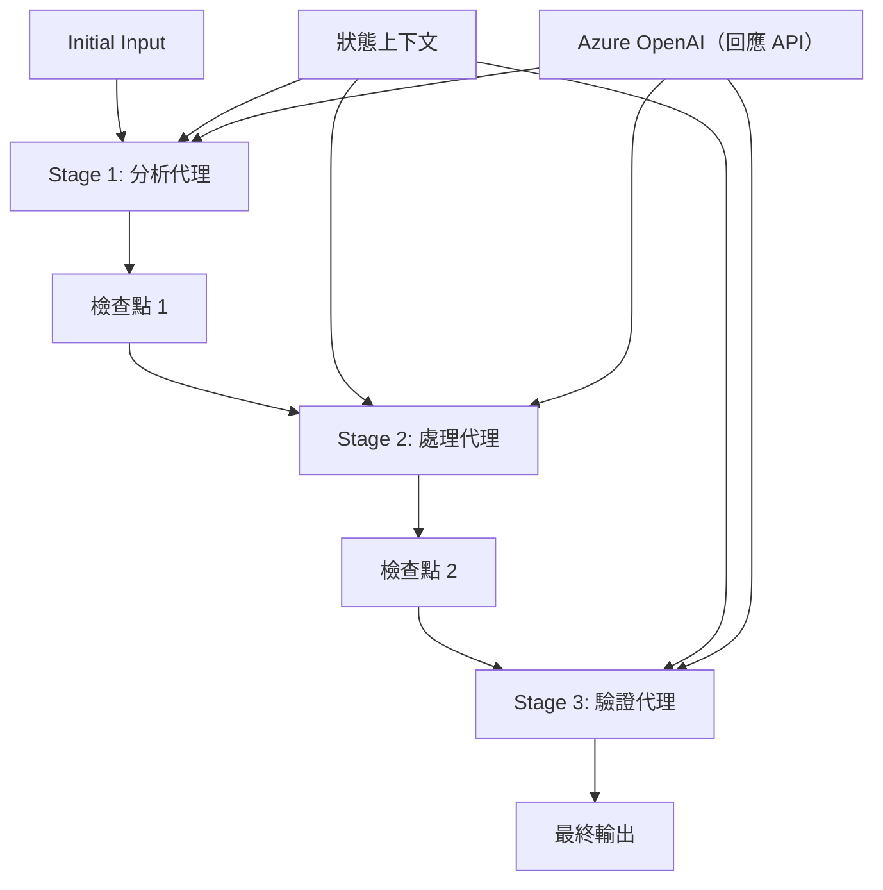

# ⏩ 使用 Azure OpenAI (Responses API) (.NET) 的序列化代理工作流程

## 📋 進階序列處理教學

此筆記本展示使用 Microsoft Agent Framework for .NET 與 Azure OpenAI（Responses API）實現的<strong>序列化工作流程模式</strong>。您將學習如何構建複雜的逐步處理管線，其中代理按特定順序執行，每個階段建立在前一階段的結果上。

## 🎯 學習目標

### 🔄 <strong>序列處理架構</strong>
- <strong>線性工作流程設計</strong>：創建具有明確依賴關係的逐步處理管線
- <strong>狀態管理</strong>：維持序列工作流程階段之間的上下文和數據流
- **Azure OpenAI (Responses API)**：在多階段 .NET 工作流程中利用 Azure OpenAI 模型
- <strong>企業流水線模式</strong>：構建適用於生產的序列化處理系統

### 🏗️ <strong>進階序列模式</strong>
- <strong>階段閘道處理</strong>：在工作流程階段間實施驗證檢查點
- <strong>上下文保留</strong>：跨所有階段維持狀態和累積知識
- <strong>錯誤傳播</strong>：在序列處理鏈中優雅處理失敗
- <strong>效能優化</strong>：以最小開銷實現高效序列執行

### 🏢 <strong>企業序列應用</strong>
- <strong>文件處理管線</strong>：多階段文件分析、轉換與驗證
- <strong>品質保證工作流程</strong>：序列審查、驗證與核准過程
- <strong>內容製作管線</strong>：研究 → 撰寫 → 編輯 → 審查 → 發布
- <strong>業務流程自動化</strong>：具有明確階段依賴的多步驟業務工作流程

## ⚙️ 前置條件與設置

### 📦 **所需 NuGet 套件**

.NET 序列工作流程的必備套件：

```xml
<!-- Core AI Framework -->
<PackageReference Include="Microsoft.Extensions.AI" Version="10.*" />

<!-- Azure OpenAI (Responses API) -->
<PackageReference Include="Azure.AI.OpenAI" Version="2.*" />

<!-- Azure Identity and Async LINQ Support -->
<PackageReference Include="Azure.Identity" Version="1.15.0" />
<PackageReference Include="System.Linq.Async" Version="6.0.3" />

<!-- Local Agent Framework References -->
<!-- Microsoft.Agents.AI.dll - Core agent abstractions -->
<!-- Microsoft.Agents.AI.OpenAI.dll - Azure OpenAI (Responses API) integration -->
```

### 🔑 **Azure OpenAI 配置**

**環境設置 (.env 檔案)：**
```env
AZURE_OPENAI_ENDPOINT=https://<your-resource>.openai.azure.com
AZURE_OPENAI_DEPLOYMENT=gpt-4.1-mini
```

**配置管理：**
```csharp
// Load environment variables securely
Env.Load("../../../.env");
var azureEndpoint = Environment.GetEnvironmentVariable("AZURE_OPENAI_ENDPOINT");
var deployment = Environment.GetEnvironmentVariable("AZURE_OPENAI_DEPLOYMENT");
```

### 🏗️ <strong>序列工作流程架構</strong>



**關鍵組件：**
- <strong>序列代理</strong>：針對每個處理階段的專用代理
- <strong>狀態上下文</strong>：維持跨階段的累積數據與決策
- <strong>檢查點</strong>：建立階段間的驗證點以確保品質與一致性
- **Azure OpenAI 客戶端**：在所有工作流程階段中一致地存取 AI 模型

## 🎨 <strong>序列工作流程設計模式</strong>

### 📝 <strong>文件處理管線</strong>
```
Raw Document → Content Extraction → Analysis → Validation → Structured Output
```

### 🎯 <strong>內容創作工作流程</strong>
```
Brief/Requirements → Research → Content Creation → Review → Final Polish
```

### 🔍 <strong>品質保證管線</strong>
```
Initial Review → Technical Validation → Compliance Check → Final Approval
```

### 💼 <strong>商業智慧工作流程</strong>
```
Data Collection → Processing → Analysis → Report Generation → Distribution
```

## 🏢 <strong>企業序列化效益</strong>

### 🎯 <strong>可靠性與品質</strong>
- <strong>決定性處理</strong>：透過結構化階段實現一致且可重複的成果
- <strong>品質門檻</strong>：驗證檢查點確保每個階段的品質
- <strong>錯誤隔離</strong>：一個階段的問題不會傳播到後續階段
- <strong>審核追蹤</strong>：完整紀錄每階段的決策與轉換

### 📈 <strong>可擴展性與效能</strong>
- <strong>模組化設計</strong>：每個階段可獨立優化
- <strong>資源管理</strong>：高效分配 AI 模型資源於各階段
- <strong>狀態優化</strong>：階段間最小化狀態傳遞以獲得最佳效能
- <strong>並行階段群組</strong>：多個序列工作流程可並行運行

### 🔒 <strong>安全性與合規</strong>
- <strong>階段級別安全</strong>：不同處理階段採用不同安全政策
- <strong>資料驗證</strong>：於每個檢查點確保資料完整性與合規
- <strong>存取控制</strong>：針對不同工作流程階段設置細緻權限
- <strong>法規遵循</strong>：透過結構化處理滿足法規要求

### 📊 <strong>監測與分析</strong>
- <strong>階段級別指標</strong>：監控每個工作流程階段的效能
- <strong>瓶頸識別</strong>：找出並優化較慢的階段
- <strong>品質指標</strong>：追蹤每階段的品質與成功率
- <strong>流程優化</strong>：以階段分析持續改進

讓我們一起構建強健的序列 AI 處理管線吧！🚀

## 💻 執行程式碼

完整實作位於 `02.dotnet-agent-framework-workflow-ghmodel-sequential.cs`。此檔案示範一個<strong>三階段家具分析工作流程</strong>：

1. **階段 1 - 銷售代理**：分析家具圖片並提供購買建議
2. **階段 2 - 價格代理**：提供詳細價格分析與預算選項
3. **階段 3 - 報價代理**：以 Markdown 格式生成專業報價文件

### 🏗️ <strong>工作流程架構</strong>

```
Image Input → Sales Analysis → Price Estimation → Quote Generation → Final Output
```

每個代理：
- 接收上一階段輸出作為上下文
- 基於先前分析以專業知識進行深化
- 透過狀態管理維持工作流程連貫性

### 🚀 運行範例

**前置條件：**
- 將家具圖片放置於 `../imgs/home.png`（或更新 `imgPath` 變數）
- 配置 `.env` 檔案，填寫 Azure OpenAI 端點和部署資訊，然後使用 `az login` 登入

```bash
# 令腳本可執行（Unix/Linux/macOS）
chmod +x 02.dotnet-agent-framework-workflow-ghmodel-sequential.cs

# 執行序列工作流程
./02.dotnet-agent-framework-workflow-ghmodel-sequential.cs
```

或在 Windows 上：
```powershell
dotnet run 02.dotnet-agent-framework-workflow-ghmodel-sequential.cs
```

### 📝 預期輸出

該工作流程將：
1. <strong>銷售代理</strong>：辨識圖片中的家具項目並給出建議
2. <strong>價格代理</strong>：新增詳細價格分析、預算等級及購物建議
3. <strong>報價代理</strong>：生成格式良好的報價文件，整合所有資訊

最終輸出將是一份根據圖片分析的完整且專業家具報價。

### 🔧 自訂選項

**修改代理行為：**
```csharp
// Adjust agent instructions to change their focus
const string SalesAgentInstructions = "Your custom instructions...";
```

**更改序列流程：**
```csharp
// Add or reorder workflow stages
var workflow = new WorkflowBuilder(salesagent)
    .AddEdge(salesagent, priceagent)
    .AddEdge(priceagent, quoteagent)
    .AddEdge(quoteagent, newAgent)  // Add another stage
    .Build();
```

**使用不同輸入：**
```csharp
// Process text instead of images
ChatMessage userMessage = new ChatMessage(ChatRole.User, [
    new TextContent("Analyze pricing for a modern living room set")
]);
```

### 🎯 真實世界應用

此序列模型非常適合：
- <strong>電子商務</strong>：產品分析 → 定價 → 報價生成
- <strong>房地產</strong>：物業分析 → 評估 → 建立上市資料
- <strong>保險</strong>：理賠分析 → 評估 → 報價生成
- <strong>內容創作</strong>：研究 → 撰寫 → 編輯 → 發布

### 🔍 理解狀態流程

序列中的每個代理接收：
- <strong>原始輸入</strong>：初始用戶訊息（圖片 + 文字）
- <strong>前面代理輸出</strong>：對話歷史中所有前序代理的回應
- <strong>累積上下文</strong>：整個工作流程中維持的完整狀態

這使得複雜的多階段處理成為可能，每個代理均基於所有前序階段的綜合上下文進行構建。

---

<!-- CO-OP TRANSLATOR DISCLAIMER START -->
**免責聲明**：
本文件使用 AI 翻譯服務 [Co-op Translator](https://github.com/Azure/co-op-translator) 進行翻譯。雖然我們力求準確，但請注意，自動翻譯可能包含錯誤或不準確之處。原始文件的母語版本應被視為權威來源。對於重要資訊，建議尋求專業人工翻譯。我們不對因使用本翻譯而引起的任何誤解或曲解承擔責任。
<!-- CO-OP TRANSLATOR DISCLAIMER END -->