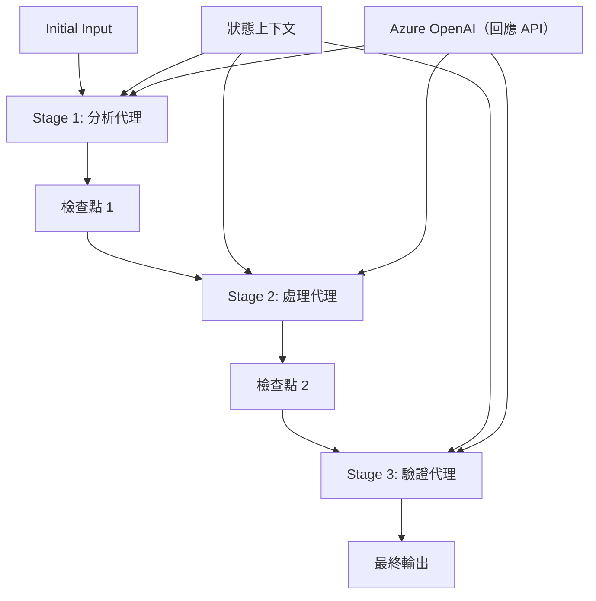

# ⏩ 使用 Azure OpenAI（Responses API）進行順序代理工作流程 (.NET)

## 📋 高級順序處理教學

此筆記本演示了使用 Microsoft Agent Framework for .NET 和 Azure OpenAI（Responses API）的<strong>順序工作流程模式</strong>。您將學習如何構建複雜的逐步處理管道，代理按特定順序執行，並且每個階段基於前一階段的結果。

## 🎯 學習目標

### 🔄 <strong>順序處理架構</strong>
- <strong>線性工作流程設計</strong>：建立具有明確依賴關係的逐步處理管道
- <strong>狀態管理</strong>：在順序工作流程階段之間維護上下文和數據流
- **Azure OpenAI（Responses API）**：在多階段 .NET 工作流程中利用 Azure OpenAI 模型
- <strong>企業生產管道模式</strong>：構建可用於生產的順序處理系統

### 🏗️ <strong>高級順序模式</strong>
- <strong>階段門控處理</strong>：在工作流程階段之間實現驗證檢查點
- <strong>上下文保持</strong>：跨所有階段維護狀態和累積知識
- <strong>錯誤傳播</strong>：優雅處理順序處理鏈中的失敗
- <strong>性能優化</strong>：以最小開銷實現高效順序執行

### 🏢 <strong>企業順序應用</strong>
- <strong>文件處理管道</strong>：多階段文件分析、轉換和驗證
- <strong>品質保證工作流程</strong>：順序審核、驗證和批准流程
- <strong>內容生產管道</strong>：研究 → 撰寫 → 編輯 → 審核 → 發佈
- <strong>業務流程自動化</strong>：具有明確階段依賴的多步驟業務工作流程

## ⚙️ 先決條件與設定

### 📦 **所需 NuGet 套件**

.NET 順序工作流程必備套件：

```xml
<!-- Core AI Framework -->
<PackageReference Include="Microsoft.Extensions.AI" Version="10.*" />

<!-- Azure OpenAI (Responses API) -->
<PackageReference Include="Azure.AI.OpenAI" Version="2.*" />

<!-- Azure Identity and Async LINQ Support -->
<PackageReference Include="Azure.Identity" Version="1.15.0" />
<PackageReference Include="System.Linq.Async" Version="6.0.3" />

<!-- Local Agent Framework References -->
<!-- Microsoft.Agents.AI.dll - Core agent abstractions -->
<!-- Microsoft.Agents.AI.OpenAI.dll - Azure OpenAI (Responses API) integration -->
```

### 🔑 **Azure OpenAI 設定**

**環境設定（.env 文件）：**
```env
AZURE_OPENAI_ENDPOINT=https://<your-resource>.openai.azure.com
AZURE_OPENAI_DEPLOYMENT=gpt-5-mini
```

**設定管理：**
```csharp
// Load environment variables securely
Env.Load("../../../.env");
var azureEndpoint = Environment.GetEnvironmentVariable("AZURE_OPENAI_ENDPOINT");
var deployment = Environment.GetEnvironmentVariable("AZURE_OPENAI_DEPLOYMENT");
```

### 🏗️ <strong>順序工作流程架構</strong>



**關鍵組件：**
- <strong>順序代理</strong>：專門針對每個處理階段的代理
- <strong>狀態上下文</strong>：維護跨階段的累積數據和決策
- <strong>檢查點</strong>：階段間的驗證點以確保品質和一致性
- **Azure OpenAI 用戶端**：在所有工作流程階段中保持一致的 AI 模型訪問

## 🎨 <strong>順序工作流程設計模式</strong>

### 📝 <strong>文件處理管道</strong>
```
Raw Document → Content Extraction → Analysis → Validation → Structured Output
```

### 🎯 <strong>內容創建工作流程</strong>
```
Brief/Requirements → Research → Content Creation → Review → Final Polish
```

### 🔍 <strong>品質保證管道</strong>
```
Initial Review → Technical Validation → Compliance Check → Final Approval
```

### 💼 <strong>商業情報工作流程</strong>
```
Data Collection → Processing → Analysis → Report Generation → Distribution
```

## 🏢 <strong>企業順序優勢</strong>

### 🎯 <strong>可靠性與品質</strong>
- <strong>確定性處理</strong>：通過結構化階段實現一致且可重複的結果
- <strong>品質門檻</strong>：驗證檢查點確保每個階段的品質
- <strong>錯誤隔離</strong>：單一階段的問題不會傳播至後續階段
- <strong>審計追蹤</strong>：完整追蹤每個階段的決策與轉換

### 📈 <strong>可擴展性與性能</strong>
- <strong>模組化設計</strong>：每個階段可獨立優化
- <strong>資源管理</strong>：階段間有效分配 AI 模型資源
- <strong>狀態優化</strong>：階段間的狀態轉移最小化以達到最佳效能
- <strong>平行階段群組</strong>：多條順序工作流程可同時運行

### 🔒 <strong>安全與合規</strong>
- <strong>階段層級安全</strong>：不同處理階段適用不同安全政策
- <strong>資料驗證</strong>：每個檢查點確保資料完整性與合規性
- <strong>存取控制</strong>：不同工作流程階段的細粒度權限
- <strong>法規合規</strong>：通過結構化處理滿足法規要求

### 📊 <strong>監控與分析</strong>
- <strong>階段層級指標</strong>：監控每個工作流程階段的效能
- <strong>瓶頸識別</strong>：找出並優化緩慢階段
- <strong>品質指標</strong>：追蹤每個階段的品質與成功率
- <strong>流程優化</strong>：基於階段層級分析持續改進

讓我們打造穩健的順序 AI 處理管道！🚀

## 💻 執行程式碼

完整實現見 `02.dotnet-agent-framework-workflow-ghmodel-sequential.cs`。此檔示範了一個<strong>三階段家具分析工作流程</strong>：

1. **階段 1 - 銷售代理**：分析家具圖片並提供購買建議
2. **階段 2 - 價格代理**：提供詳細定價明細和預算方案
3. **階段 3 - 報價代理**：生成 Markdown 格式的專業報價文件

### 🏗️ <strong>工作流程架構</strong>

```
Image Input → Sales Analysis → Price Estimation → Quote Generation → Final Output
```

每個代理：
- 接收前一階段輸出的上下文
- 以專業專長基於先前分析進行構建
- 通過狀態管理保持工作流程連續性

### 🚀 執行範例

**先決條件：**
- 將家具圖片放置於 `../imgs/home.png`（或更新 `imgPath` 變數）
- 用您的 Azure OpenAI 端點和部署設定 `.env` 檔，並使用 `az login` 登入

```bash
# 令腳本可執行（Unix/Linux/macOS）
chmod +x 02.dotnet-agent-framework-workflow-ghmodel-sequential.cs

# 執行順序工作流程
./02.dotnet-agent-framework-workflow-ghmodel-sequential.cs
```

Windows 系統使用：
```powershell
dotnet run 02.dotnet-agent-framework-workflow-ghmodel-sequential.cs
```

### 📝 預期輸出

工作流程將：
1. <strong>銷售代理</strong>：識別圖片中的家具項目並提供推薦
2. <strong>價格代理</strong>：加入詳細定價分析，含預算層級和購物建議
3. <strong>報價代理</strong>：生成綜合所有資訊的格式化報價文件

最終輸出將是一份基於圖片分析的全面專業家具報價。

### 🔧 自訂選項

**修改代理行為：**
```csharp
// Adjust agent instructions to change their focus
const string SalesAgentInstructions = "Your custom instructions...";
```

**改變順序流程：**
```csharp
// Add or reorder workflow stages
var workflow = new WorkflowBuilder(salesagent)
    .AddEdge(salesagent, priceagent)
    .AddEdge(priceagent, quoteagent)
    .AddEdge(quoteagent, newAgent)  // Add another stage
    .Build();
```

**使用不同輸入：**
```csharp
// Process text instead of images
ChatMessage userMessage = new ChatMessage(ChatRole.User, [
    new TextContent("Analyze pricing for a modern living room set")
]);
```

### 🎯 實務應用

此順序模式適用於：
- <strong>電子商務</strong>：產品分析 → 定價 → 報價生成
- <strong>房地產</strong>：物業分析 → 評估 → 刊登創建
- <strong>保險</strong>：理賠分析 → 評估 → 報價生成
- <strong>內容創作</strong>：研究 → 撰寫 → 編輯 → 發佈

### 🔍 理解狀態流程

序列中的每個代理接收：
- <strong>原始輸入</strong>：初始使用者訊息（圖片+文字）
- <strong>前一代理輸出</strong>：會話歷史中所有先前代理回應
- <strong>累積上下文</strong>：整個工作流程維護的完整狀態

這使得多階段複雜處理成為可能，每個代理基於前面所有階段的完整上下文進行構建。

---

<!-- CO-OP TRANSLATOR DISCLAIMER START -->
**免責聲明**：
本文件使用 AI 翻譯服務 [Co-op Translator](https://github.com/Azure/co-op-translator) 進行翻譯。雖然我們力求準確，但請注意，自動翻譯可能包含錯誤或不準確之處。原始文件的母語版本應被視為權威來源。對於重要資訊，建議尋求專業人工翻譯。我們不對因使用本翻譯而引起的任何誤解或曲解承擔責任。
<!-- CO-OP TRANSLATOR DISCLAIMER END -->