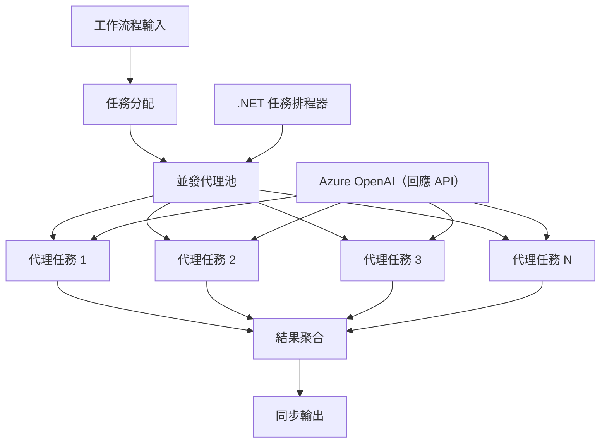

# ⚡ 使用 Azure OpenAI（Responses API）進行並發代理工作流程（.NET）

## 📋 高效能平行處理教學

此筆記本展示了使用 Microsoft Agent Framework for .NET 和 Azure OpenAI（Responses API）的<strong>並發工作流程模式</strong>。您將學習如何建構高效能、平行處理工作流程，透過同時執行多個 AI 代理來最大化吞吐量，同時保持協調與資料一致性。

## 🎯 學習目標

### 🚀 <strong>並發處理基礎</strong>
- <strong>平行代理執行</strong>：同時運行多個 AI 代理以獲得最大效能
- **Async/Await 模式**：運用 .NET 的非同步程式設計模型以提升併發效率
- **Azure OpenAI（Responses API）**：協調多個並發呼叫 Azure OpenAI Responses API
- <strong>資源管理</strong>：有效管理多重併發操作中的 AI 模型資源

### 🏗️ <strong>進階併發架構</strong>
- <strong>基於任務的平行處理</strong>：使用 .NET Task 平行函式庫實現最佳併發執行
- <strong>同步模式</strong>：協調並發代理，避免競態條件
- <strong>負載平衡</strong>：有效分配工作於可用的並發處理能力
- <strong>錯誤容忍</strong>：個別代理失敗時不影響整個工作流程

### 🏢 <strong>企業併發應用</strong>
- <strong>大量文件處理</strong>：同時處理多份文件
- <strong>即時內容分析</strong>：並行分析即時資料流
- <strong>批次處理優化</strong>：最大化大規模資料處理操作的吞吐量
- <strong>多模態分析</strong>：不同內容類型與格式的平行處理

## ⚙️ 先決條件與設定

### 📦 **必要的 NuGet 套件**

高效能並發工作流程所需的套件：

```xml
<!-- Core AI Framework with Async Support -->
<PackageReference Include="Microsoft.Extensions.AI" Version="9.9.0" />

<!-- Azure OpenAI (Responses API) -->
<PackageReference Include="Azure.AI.OpenAI" Version="2.1.0" />

<!-- Azure Identity and Async LINQ for Advanced Operations -->
<PackageReference Include="Azure.Identity" Version="1.15.0" />
<PackageReference Include="System.Linq.Async" Version="6.0.3" />

<!-- Local Agent Framework References -->
<!-- Microsoft.Agents.AI.dll - Core agent abstractions with async support -->
<!-- Microsoft.Agents.AI.OpenAI.dll - Azure OpenAI (Responses API) integration with concurrency -->
```

### 🔑 **Azure OpenAI 配置**

**環境設定（.env 檔案）：**
```env
AZURE_OPENAI_ENDPOINT=https://<your-resource>.openai.azure.com
AZURE_OPENAI_DEPLOYMENT=gpt-4.1-mini
```

**並發處理考量：**
```csharp
// Configure for concurrent operations
var clientOptions = new AzureOpenAIClientOptions()
{
    // Configure network timeout for concurrent requests
    NetworkTimeout = TimeSpan.FromMinutes(5)
};
```

### 🏗️ <strong>並發工作流程架構</strong>



**主要元件：**
- **Task Parallel Library**：.NET 建置的並發操作支援
- <strong>代理池</strong>：多個代理實例進行平行處理
- <strong>結果彙總</strong>：協調並合併並發代理結果
- <strong>同步點</strong>：確保並發操作中的資料一致性

## 🎨 <strong>並發工作流程設計模式</strong>

### 🔍 <strong>平行研究與分析</strong>
```
Research Topic → Concurrent Research Agents → Result Synthesis → Final Report
```

### 📊 <strong>多來源資料處理</strong>
```
Data Sources → Parallel Processing Agents → Data Integration → Unified Output
```

### 🎭 <strong>內容生成流程</strong>
```
Content Requirements → Concurrent Content Generators → Quality Review → Final Content
```

### 🔄 **分散/聚合處理**
```
Single Input → Multiple Concurrent Processors → Result Aggregation → Single Output
```

## 🏢 <strong>企業效能優勢</strong>

### ⚡ <strong>吞吐量與擴展性</strong>
- <strong>線性效能擴展</strong>：新增更多並發代理提升吞吐量
- <strong>資源利用率</strong>：最大化現有 AI 模型容量的效率
- <strong>縮減處理時間</strong>：透過平行執行大幅縮短時間
- <strong>彈性擴展</strong>：根據工作負載動態調整並發代理數量

### 🛡️ <strong>可靠性與韌性</strong>
- <strong>錯誤隔離</strong>：個別代理故障不影響其他並發操作
- <strong>優雅降級</strong>：系統可在代理容量降低時繼續運作
- <strong>錯誤復原</strong>：對失敗的併發操作自動重試機制
- <strong>工作分配</strong>：均勻分配工作於可用代理

### 📊 <strong>效能監控</strong>
- <strong>並發執行指標</strong>：追蹤所有平行操作效能
- <strong>資源使用分析</strong>：監控 CPU、記憶體與網絡利用率
- <strong>吞吐量分析</strong>：評估並發處理的效率提升
- <strong>瓶頸偵測</strong>：識別並解決效能限制

### 🔧 <strong>開發與運維</strong>
- <strong>非同步程式設計模型</strong>：運用 .NET 成熟的 async/await 模式
- <strong>任務協調</strong>：內建任務管理與協調功能
- <strong>異常處理</strong>：完善的併發操作錯誤處理
- <strong>除錯支援</strong>：Visual Studio 平行工作流程的除錯工具

讓我們用 .NET 建構高效能的並發 AI 工作流程吧！🚀

## 💻 執行程式碼

完整實作可在 `03.dotnet-agent-framework-workflow-ghmodel-concurrent.cs` 找到。此檔示範一個旅遊規劃的<strong>分散/聚合並發工作流程</strong>：

### 🏗️ <strong>工作流程架構</strong>

```
User Request → ConcurrentStartExecutor → [Researcher Agent || Planner Agent] → ConcurrentAggregationExecutor → Final Output
```

**主要元件：**

1. **ConcurrentStartExecutor**：同時向所有代理廣播使用者請求
2. **Researcher Agent**：並行分析目的地與景點
3. **Planner Agent**：並行建立詳細旅遊計劃
4. **ConcurrentAggregationExecutor**：收集並合併兩代理結果

### 🎯 **分散/聚合模式**

此工作流程展示經典的<strong>分散/聚合</strong>模式：
- <strong>分散</strong>：將一則輸入訊息同時廣播到多個代理
- <strong>併發處理</strong>：多個代理平行處理同一任務
- <strong>聚合</strong>：收集所有代理結果並合併成單一輸出

### 🚀 執行範例

```bash
# 令脚本可执行（Unix/Linux/macOS）
chmod +x 03.dotnet-agent-framework-workflow-ghmodel-concurrent.cs

# 运行并发工作流程
./03.dotnet-agent-framework-workflow-ghmodel-concurrent.cs
```

或在 Windows 上：
```powershell
dotnet run 03.dotnet-agent-framework-workflow-ghmodel-concurrent.cs
```

### 📝 預期輸出

工作流程將：
1. <strong>廣播請求</strong>：將「規劃 12 月前往西雅圖的旅程」發送給兩個代理
2. <strong>併發處理</strong>：兩代理同時工作：
   - Researcher 研究景點與細節
   - Planner 建立行程與後勤安排
3. <strong>彙總</strong>：將兩者回應整合成詳盡輸出
4. <strong>顯示結果</strong>：呈現合併的完整旅遊計劃

### 🔧 自訂選項

**新增更多並發代理：**
```csharp
// Create additional specialized agents
AIAgent budgetAgent = azureClient.GetOpenAIResponseClient(deployment).CreateAIAgent(
    name: "Budget-Agent", instructions: "Calculate travel costs...");

// Add to fan-out
var workflow = new WorkflowBuilder(startExecutor)
    .AddFanOutEdge(startExecutor, targets: [researcherAgent, plannerAgent, budgetAgent])
    .AddFanInEdge(aggregationExecutor, sources: [researcherAgent, plannerAgent, budgetAgent])
    .WithOutputFrom(aggregationExecutor)
    .Build();

// Update aggregation count
if (this._messages.Count == 3) { ... }
```

**修改代理指令：**
```csharp
const string ResearcherAgentInstructions = "Your custom instructions for research...";
const string PlanAgentInstructions = "Your custom instructions for planning...";
```

**更換任務內容：**
```csharp
StreamingRun run = await InProcessExecution.StreamAsync(
    workflow, 
    "Plan a European vacation for 2 weeks in summer"
);
```

### 🎯 實際應用

此並發模式適合用於：
- <strong>內容創作</strong>：多位作家同時撰寫不同章節
- <strong>程式碼審查</strong>：多名審查者從不同角度分析程式碼
- <strong>市場調查</strong>：平行分析不同市場區塊
- <strong>文件處理</strong>：同時抽取、分析與驗證文件
- <strong>多觀點分析</strong>：取得同一輸入的多元看法

### 🔍 了解自訂執行器

**ConcurrentStartExecutor:**
- 實作 `IMessageHandler<string>` 以接收字串輸入
- 廣播訊息至所有連結代理
- 傳送 `TurnToken` 觸發並發處理

**ConcurrentAggregationExecutor:**
- 實作 `IMessageHandler<ChatMessage>` 以接收代理回應
- 以執行緒安全方式收集訊息
- 當收到所有預期回應時合併結果
- 使用 `context.YieldOutputAsync()` 回傳最終輸出

### ⚡ 效能優勢

**並發 vs 序列執行：**
- 序列：Agent1 (30秒) → Agent2 (30秒) = **共60秒**
- 並發：Agent1 (30秒) || Agent2 (30秒) = **共30秒**

<strong>吞吐量提升</strong>：N個並發代理可達到最高 N 倍加速（視工作負載與資源而定）

### 🛡️ 錯誤處理

工作流程優雅地處理個別代理失敗：
- 若一代理故障，其他代理仍持續處理
- 聚合器可實作逾時邏輯
- 必要時可回傳部份結果

### 📊 進階功能

**動態代理數量：**
修改聚合邏輯以支援可變代理數：

```csharp
private int _expectedAgentCount;
private readonly List<ChatMessage> _messages = [];

public async ValueTask HandleAsync(ChatMessage message, IWorkflowContext context)
{
    this._messages.Add(message);
    if (this._messages.Count == _expectedAgentCount)
    {
        // Process aggregation
    }
}
```

此並發工作流程模式對建構高效能、可擴展的 AI 代理系統至關重要！

---

<!-- CO-OP TRANSLATOR DISCLAIMER START -->
**免責聲明**：
本文件使用 AI 翻譯服務 [Co-op Translator](https://github.com/Azure/co-op-translator) 進行翻譯。雖然我們力求準確，但請注意，自動翻譯可能包含錯誤或不準確之處。原始文件的母語版本應被視為權威來源。對於重要資訊，建議尋求專業人工翻譯。我們不對因使用本翻譯而引起的任何誤解或曲解承擔責任。
<!-- CO-OP TRANSLATOR DISCLAIMER END -->