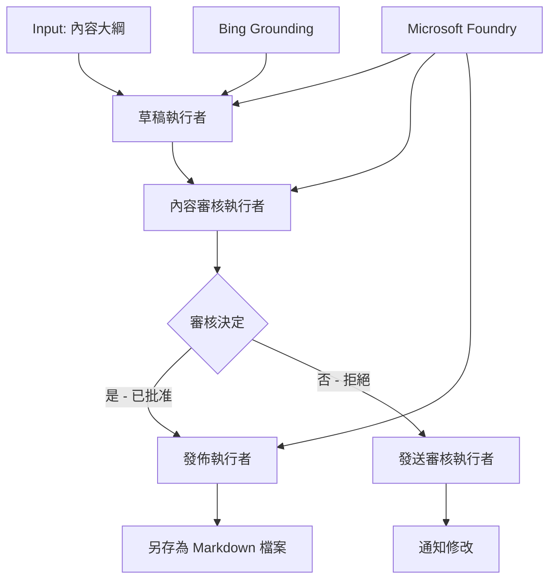

# 🔀 使用 Microsoft Foundry (.NET) 的條件代理工作流程

## 📋 智能決策驅動的工作流程教程

本筆記本示範了使用 Microsoft Foundry 與 .NET Microsoft Agent Framework 的<strong>條件工作流程模式</strong>。您將學會如何構建複雜且決策驅動的工作流程，基於 AI 分析、業務規則和動態條件，智能地路由處理，實現企業級自動化。

## 🎯 學習目標

### 🧠 <strong>智能決策架構</strong>
- <strong>條件邏輯實現</strong>：構建擁有多個分支點的複雜決策樹
- **AI 驅動路由**：使用 Microsoft Foundry 模型做出智能路由決策
- <strong>動態工作流程適應</strong>：根據運行時分析和條件修改工作流程行為
- <strong>企業規則整合</strong>：將業務邏輯與合規要求融入工作流程

### 🔀 <strong>進階條件模式</strong>
- <strong>多標準決策制定</strong>：評估多項因素以決定路由
- <strong>情境感知處理</strong>：根據累積的工作流程內容與歷史做出決策
- <strong>自適應工作流程調整</strong>：根據即時條件動態調整處理路徑
- <strong>規則引擎整合</strong>：在工作流程內實現複雜的業務規則引擎

### 🏢 <strong>企業條件應用</strong>
- <strong>文件分類與路由</strong>：自動分類文件並路由至適當工作流程
- <strong>客戶服務分診</strong>：智能將客戶查詢路由到專門處理團隊
- <strong>合規與風險處理</strong>：根據風險評估套用不同驗證與審核流程
- <strong>品質保證工作流程</strong>：根據品質指標將內容導向適當審閱流程

## ⚙️ 前置條件與設置

### 📦 **所需 NuGet 套件**

用於條件工作流程處理的進階套件：

```xml
<!-- Core AI Framework -->
<PackageReference Include="Microsoft.Extensions.AI" Version="9.9.0" />

<!-- Azure AI Agents with Persistent State -->
<PackageReference Include="Azure.AI.Agents.Persistent" Version="1.2.0-beta.5" />

<!-- Azure Identity and Utilities -->
<PackageReference Include="Azure.Identity" Version="1.15.0" />
<PackageReference Include="System.Linq.Async" Version="6.0.3" />
<PackageReference Include="DotNetEnv" Version="3.1.1" />

<!-- Local Workflow Framework References -->
<!-- Microsoft.Agents.Workflows.dll - Advanced workflow orchestration -->
<!-- Microsoft.Agents.AI.AzureAI.dll - Microsoft Foundry integration -->
<!-- Microsoft.Agents.AI.dll - Core agent abstractions -->
```

### 🔑 **Microsoft Foundry 配置**

**需要的 Azure 資源：**
- 配備條件處理模型的 Microsoft Foundry 工作區
- 具備相應計算配額和權限的 Azure 訂閱
- 部署用於決策與內容分析的 AI 模型
- （可選）用於基底支持的 Bing Search API 連接

**環境配置 (.env 檔案)：**
```env
# Microsoft Foundry Configuration
AZURE_AI_PROJECT_ENDPOINT=https://your-project.cognitiveservices.azure.com/
BING_CONNECTION_ID=your-bing-connection-id
```

**驗證設置：**
```csharp
// Azure CLI or Managed Identity authentication
using Azure.Identity;
var credential = new AzureCliCredential();

// Load environment configuration
DotNetEnv.Env.Load("../../../.env");
```

### 🏗️ <strong>條件工作流程架構</strong>



**主要組件：**
- <strong>草稿執行者</strong>：AI 代理，根據大綱創建初始內容草稿
- <strong>內容審核執行者</strong>：AI 代理，評估草稿的品質與合規性
- <strong>條件路由</strong>：基於審核結果做出路由決策的邏輯
- **發佈/審閱路徑**：分別處理核准和拒絕的內容路徑
- <strong>狀態管理</strong>：在整個工作流程中維護內容與審核的上下文

## 🎨 <strong>條件工作流程設計模式</strong>

### 📋 <strong>帶品質閘道的內容生產</strong>
```
Outline → Draft Creation → Quality Review → {Approve: Publish | Reject: Revise}
```

### 🎯 <strong>基於風險的文件處理</strong>
```
Document → Risk Assessment → {Low: Standard | High: Enhanced Review}
```

### 🔍 <strong>智能客戶服務路由</strong>
```
Customer Query → Analysis → {Simple: FAQ Bot | Complex: Human Agent}
```

### 💼 <strong>合規驅動工作流程</strong>
```
Content → Compliance Check → {Pass: Publish | Fail: Legal Review}
```

## 🏢 <strong>企業條件優勢</strong>

### 🎯 <strong>智能自動化</strong>
- <strong>智慧決策制定</strong>：基於內容分析和情境的 AI 驅動路由決策
- <strong>自適應處理</strong>：工作流程可自動隨條件變化調整
- <strong>業務規則執行</strong>：自動套用複雜的業務邏輯和政策
- <strong>情境感知路由</strong>：根據完整工作流程歷史和累積上下文做決策

### 📈 <strong>營運卓越</strong>
- <strong>資源優化分配</strong>：將工作路由給最合適的專家及流程
- <strong>減少人工干預</strong>：自動化決策減少對人工路由的需求
- <strong>加快解決時間</strong>：直接路由至合適專業與處理能力
- <strong>一致性應用</strong>：統一執行業務規則和決策準則

### 🛡️ <strong>風險管理與合規</strong>
- <strong>自動風險評估</strong>：AI 驅動內容和情境風險水準評估
- <strong>合規執行</strong>：自動路由至必需的監管流程
- <strong>安全協定應用</strong>：根據風險評估套用強化的安全措施
- <strong>審計追蹤維護</strong>：完整紀錄路由決策與原因

### 📊 <strong>分析與持續改進</strong>
- <strong>決策分析</strong>：追蹤路由決策的有效性與準確度
- <strong>模式識別</strong>：辨識路由決策中的趨勢與模式
- <strong>性能優化</strong>：持續改進決策準則和路由效率
- <strong>商業智慧</strong>：洞察內容特性與處理需求

### 🔧 <strong>技術卓越</strong>
- <strong>持續狀態管理</strong>：維持工作流程執行中的複雜狀態
- <strong>可擴充架構</strong>：應對高量條件處理需求
- <strong>整合能力</strong>：與現有業務系統和流程無縫整合
- <strong>監控與可觀測性</strong>：全面追蹤工作流程績效和決策

讓我們用 .NET 構建智能、決策驅動的企業工作流程吧！🚀

## 💻 執行程式碼

完整實現程式碼位於 `04.dotnet-agent-framework-workflow-aifoundry-condition.cs`，示範一個<strong>帶品質閘道的內容生產工作流程</strong>：

### 🏗️ <strong>工作流程架構</strong>

```
Content Outline → Draft Creation → Quality Review → Conditional Routing:
                                                      ├─ Approved (>200 words) → Publish
                                                      └─ Rejected (<200 words) → Review Notification
```

**工作流程中的代理：**
1. **Evangelist 代理**：從大綱創建教學草稿，並以 Bing 為基底
2. <strong>內容審核代理</strong>：評估草稿品質（字數、完整性）
3. <strong>發佈代理</strong>：保存經核准內容為帶時間戳的 Markdown 檔案

**自訂執行者：**
1. **DraftExecutor**：協調草稿創建
2. **ContentReviewExecutor**：執行品質評估
3. **PublishExecutor**：處理核准內容發佈
4. **SendReviewExecutor**：管理拒絕內容通知

### 🚀 執行示例

**前置條件：**
- 已配置 Microsoft Foundry 工作區
- Azure CLI 認證（`az login`）
- （可選）Bing Search 連接作為基底

```bash
# 令腳本可執行 (Unix/Linux/macOS)
chmod +x 04.dotnet-agent-framework-workflow-aifoundry-condition.cs

# 執行條件流程
./04.dotnet-agent-framework-workflow-aifoundry-condition.cs
```

Windows 系統上使用：
```powershell
dotnet run 04.dotnet-agent-framework-workflow-aifoundry-condition.cs
```

### 📝 預期輸出

工作流程將會：
1. <strong>建立代理</strong>：初始化三個專業 Microsoft Foundry 代理
2. <strong>生成草稿</strong>：Evangelist 代理根據大綱創建教學草稿
3. <strong>內容審核</strong>：內容審核代理評估草稿品質
4. <strong>條件路由</strong>：
   - **核准 (>200 字)**：發佈執行者將內容保存為 Markdown 檔案
   - **拒絕 (<200 字)**：發送審核通知
5. <strong>顯示結果</strong>：呈現最終工作流程結果

### 🔧 自訂選項

**修改審核標準：**
```csharp
const string ContentReviewerInstructions = @"
You are a content reviewer...
1. Check if content is more than 500 words (instead of 200)
2. Verify technical accuracy
3. Ensure proper formatting
...";
```

**新增更多條件路徑：**
```csharp
var workflow = new WorkflowBuilder(draftExecutor)
    .AddEdge(draftExecutor, contentReviewerExecutor)
    .AddEdge(contentReviewerExecutor, publishExecutor, condition: GetCondition("Excellent"))
    .AddEdge(contentReviewerExecutor, editExecutor, condition: GetCondition("Good"))
    .AddEdge(contentReviewerExecutor, sendReviewerExecutor, condition: GetCondition("Poor"))
    .Build();
```

**更改內容要求：**
```csharp
string OUTLINE_Content = @"
# Your Custom Topic
## Section 1
https://your-reference-url
## Section 2
...
";
```

### 🎯 實務應用

此條件工作流程模式適用於：
- <strong>內容管理系統</strong>：帶品質閘道的自動編輯工作流程
- <strong>文件處理</strong>：根據分類與合規性做路由
- <strong>客戶支援</strong>：根據複雜度和緊急性智能分派工單
- <strong>法律審核</strong>：根據風險評估與價值路由合約
- <strong>人力資源流程</strong>：將申請導向合適的審核工作流程

### 🔍 理解條件邏輯

**條件函數：**
```csharp
public Func<object?, bool> GetCondition(string expectedResult) =>
    reviewResult => reviewResult is ReviewResult review && review.Result == expectedResult;
```

此函數建立一個謂詞：
1. 檢查結果是否為 `ReviewResult` 類型
2. 比較 `Result` 屬性是否符合預期值
3. 返回 true/false 以決定路由行為

**帶條件的工作流程邊緣：**
```csharp
.AddEdge(contentReviewerExecutor, publishExecutor, condition: GetCondition("Yes"))
.AddEdge(contentReviewerExecutor, sendReviewerExecutor, condition: GetCondition("No"))
```

### 📊 進階功能

**JSON Schema 驗證：**
工作流程使用 JSON schema 以確保結構化回應：

```csharp
// Define response structure
public class ReviewResult
{
    [JsonPropertyName("review_result")]
    public string Result { get; set; } = string.Empty;
    
    [JsonPropertyName("reason")]
    public string Reason { get; set; } = string.Empty;
    
    [JsonPropertyName("draft_content")]
    public string DraftContent { get; set; } = string.Empty;
}

// Apply to agent
ResponseFormat = ChatResponseFormat.ForJsonSchema(
    AIJsonUtilities.CreateJsonSchema(typeof(ReviewResult)), 
    "ReviewResult", 
    "Review Result From DraftContent"
)
```

**Bing 基底集成：**
Evangelist 代理使用 Bing 基底存取即時資訊：

```csharp
var bingGroundingConfig = new BingGroundingSearchConfiguration(bing_conn_id);
BingGroundingToolDefinition bingGroundingTool = new(
    new BingGroundingSearchToolParameters([bingGroundingConfig])
);
```

此功能讓代理可跟隨大綱中 URL 並提取最新資訊。

### 🛡️ 錯誤處理

工作流程針對拒絕內容具備強健的錯誤處理：
- 審核失敗會觸發另一條路徑
- 通知會提供清楚的拒絕原因
- 保留內容以便修訂

### 🔄 擴展工作流程

**加入修訂循環：**
創建自動重新草擬內容的反饋循環：

```csharp
.AddEdge(contentReviewerExecutor, publishExecutor, condition: GetCondition("Yes"))
.AddEdge(contentReviewerExecutor, draftExecutor, condition: GetCondition("No")) // Loop back
```

**實作多層審核：**
新增多階段審核，各階段有不同標準：

```csharp
.AddEdge(draftExecutor, technicalReviewer)
.AddEdge(technicalReviewer, editorialReviewer, condition: GetCondition("TechPass"))
.AddEdge(editorialReviewer, publishExecutor, condition: GetCondition("EditPass"))
```

此條件工作流程模式為建構複雜、智能企業自動化系統奠定基礎！🚀

---

<!-- CO-OP TRANSLATOR DISCLAIMER START -->
**免責聲明**：
本文件使用 AI 翻譯服務 [Co-op Translator](https://github.com/Azure/co-op-translator) 進行翻譯。雖然我們力求準確，但請注意，自動翻譯可能包含錯誤或不準確之處。原始文件的母語版本應被視為權威來源。對於重要資訊，建議尋求專業人工翻譯。我們不對因使用本翻譯而引起的任何誤解或曲解承擔責任。
<!-- CO-OP TRANSLATOR DISCLAIMER END -->