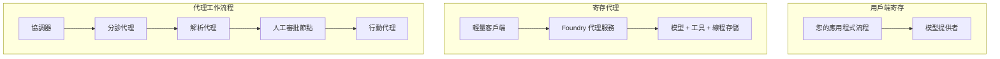
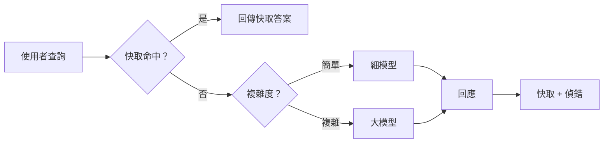
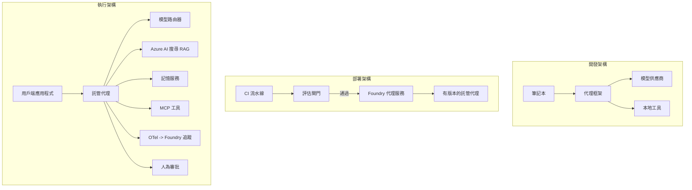

# 使用 Microsoft Foundry 部署可擴展的代理


到目前為止，您已構建了運行在筆記本電腦上、由 `az login` 和少量環境變數驅動的代理。這正是學習的正確方式。但這不是在凌晨三點數千名客戶依賴的代理運行的正確方式。

本課程講述了「在我的機器上能運行」與「在生產環境中可靠且經濟地運行」之間的差距。我們將使用 **Microsoft Foundry** 和 **Microsoft Foundry Agent Service** 來彌合這個差距，通過構建一個真正的客戶支持代理，該代理包含工具、檢索、記憶、評估和監控。

## 介紹

本課將涵蓋：

- <strong>原型代理</strong> 與 <strong>部署代理</strong> 的差異，以及為什麼轉換主要關乎模型 <em>周圍</em> 的一切。
- 代理的 <strong>部署模式</strong>：客戶端託管、服務器託管（託管代理）、和流程編排。
- Microsoft Foundry 上的 <strong>代理生命週期</strong> — 創建、版本控制、部署、評估、觀察、退役。
- <strong>擴展策略</strong>：模型路由、緩存、併發和無狀態設計。
- 使用 OpenTelemetry 和 Foundry 跟蹤的 <strong>可觀察性</strong>。
- 通過模型選擇、路由和評估門檻的 <strong>成本優化</strong>。
- <strong>企業考量</strong>：治理、人為審批，以及安全地在生產中運行 MCP 服務器。

## 學習目標

完成本課後，您將能夠：

- 為給定的代理工作負載選擇合適的部署模式。
- 將代理部署到 Microsoft Foundry Agent Service，使其具備版本控制、治理和可觀察性。
- 為代理植入追蹤，並連接一個在每次發布前運行的評估流水線。
- 應用模型路由和緩存，確保在大規模下控制延遲和成本。
- 為高風險操作加入人工審批門檻，並安全整合 MCP 服務器到生產環境。

## 前置條件

本課假設您已完成早期課程並熟悉：

- 使用 [Microsoft Agent Framework](../14-microsoft-agent-framework/README.md) (第14課) 构建代理。
- [工具使用](../04-tool-use/README.md) (第4課) 和 [Agentic RAG](../05-agentic-rag/README.md) (第5課)。
- [代理記憶](../13-agent-memory/README.md) (第13課) 和 [Agentic 協議 / MCP](../11-agentic-protocols/README.md) (第11課)。
- [可觀察性和評估](../10-ai-agents-production/README.md) (第10課) — 本課直接建立在其基礎上。

您還將需要：

- 一個 **Azure 訂閱** 及至少有一個已部署聊天模型的 **Microsoft Foundry 專案**。
- 已驗證的 **Azure CLI** (`az login`)。
- Python 3.12+ 以及存儲庫中 [`requirements.txt`](../../../requirements.txt) 內的套件。

## 從原型到生產：實際的變化

原型代理和生產代理共享相同的核心循環 — 推理、調用工具、回應。改變的是包圍該循環的所有東西。模型大概佔生產代理的 20%；其餘80%是運營骨架。

| 關注點 | 原型 | 生產 |
| --- | --- | --- |
| <strong>託管</strong> | 運行於筆記本中 | 運行於託管服務，具版本控制和滾動發布 |
| <strong>身份識別</strong> | 您的 `az login` 令牌 | 授權範圍 RBAC 的受管身份 |
| <strong>狀態</strong> | 暫存於記憶體，重啓即丟失 | 外部化（線程存儲、記憶服務） |
| <strong>失敗處理</strong> | 顯示追蹤回溯 | 重試、回退、死信、警告 |
| <strong>成本</strong> | 「幾分錢」 | 逐請求跟蹤，路由，緩存，預算 |
| <strong>品質</strong> | 您目視輸出 | 每次發布前自動評估 |
| <strong>信任</strong> | 您批准每個動作 | 風險操作結合政策與人工干預 |

請記住此表。以下每一節都對應表中一行。

## 代理部署模式

您將使用三種模式，通常是結合使用。

### 1. 客戶端託管代理

代理對象存在於 <em>您的</em> 應用程序進程中。您的代碼直接呼叫模型提供者；推理循環運行於您的服務中。這是之前每課所做的方式。

- <strong>適用情況</strong>：當您需要對循環完整控制、自定義中介軟件，或者將代理嵌入現有後端時。
- <strong>權衡</strong>：您需自行承擔擴展、狀態和韌性。

### 2. 託管代理（Foundry Agent Service）

代理作為資源註冊在 Microsoft Foundry 中。Foundry 託管推理循環、存儲線程、強制內容安全和 RBAC，並使代理在 Foundry 入口網站中可見。您的應用成為薄客戶端，創建線程並讀取回應。

- <strong>適用情況</strong>：想要耐久性、內建可觀察性、治理和較少運營負擔時。
- <strong>權衡</strong>：以託管運行時換取較少的底層控制。

### 3. 代理流程

多個代理（和工具）組合成一個帶有明確控制流程的圖譜 — 順序步驟、分支、人類批准節點和可暫停/恢復的持久檢查點。這是 Microsoft Agent Framework <strong>流程</strong> 能力在部署規模上的應用。

- <strong>適用情況</strong>：單一任務跨多個專門代理，或中間需要審批步驟時。
- <strong>權衡</strong>：更多移動組件；需要流程層面的可觀察性。



## Microsoft Foundry 上的代理生命週期

部署代理不是一次性的 `push`。它是一個循環，非常像軟件發布週期，因為它就是那樣。


關鍵理念，沿用自 [第10課](../10-ai-agents-production/README.md)：**離線評估是一道門檻，不是事後補充。** 新版本代理不通過評估門檻將不會發布。線上可觀察性將真實失敗輸出回離線測試集。這就是整個循環。

## 擴展策略

擴展代理不同於擴展無狀態 web API，因為每個請求可能觸發多個昂貴的模型和工具調用。四種技術承擔大部分負載。

**無狀態請求處理。** 不在進程記憶體中保留每用戶狀態。將對話線程持久化在 Foundry 線程存儲或記憶服務，任何實例都能處理任何請求。這讓你水平擴展成為可能 — 新增實例，無需綁定會話。

**模型路由。** 並非每個請求都需要最強大（最昂貴）的模型。將簡單請求——意圖分類、短事實回答——路由到小而快的模型，保留大型模型處理真實推理。Foundry 的 <strong>模型路由器</strong> 可以為您做到這點，或者您可自建輕量級分類器。您會在實作中構建 DIY 版本。

**回應緩存。** 許多支援查詢近乎重複（「如何重設密碼？」）。緩存常見問題的答案，避免每次都調用模型。即使是適度的緩存命中率，也會顯著降低成本和延遲。

**併發與背壓。** 模型提供者有速率限制。限制併發數量，使用指數回退重試，並優雅失敗（一個排隊的「我們正在處理」比 500 錯誤好）。



## 生產中的可觀察性

看不到就管不好。如第10課所述，Microsoft Agent Framework 原生發出 **OpenTelemetry** 跟蹤——每個模型調用、工具調用和編排步驟都是一個跨度。在生產環境中，您可以將這些跨度匯出到 Microsoft Foundry（或任何 OTEL 相容後端），以便：

- 追蹤單一客戶投訴的端到端流程，穿過每個模型和工具調用。
- 隨時間觀察 P50/P95 延遲和每請求成本。
- 在使用者（或財務團隊）察覺之前，對錯誤率飆升和成本異常發出警報。

```python
from agent_framework.observability import get_tracer

tracer = get_tracer()

with tracer.start_as_current_span("support_request") as span:
    span.set_attribute("customer.tier", "enterprise")
    span.set_attribute("routed.model", "gpt-5-nano")
    # 代理執行會自動在此區間內被追蹤
```

像 `customer.tier` 和 `routed.model` 這樣的屬性，讓一堵牆的追蹤變成可回答的問題（「企業客戶是否過度路由到小模型？」）。

## 成本優化

生產代理的成本主導是代幣。三個杠杆，按影響力排序：

1. **選擇合適大小的模型。** 通過評估門檻的小模型幾乎總是比同樣通過的大模型便宜。用評估來<em>證明</em>小模型足夠好，而不是出於謹慎預設用最大模型。
2. **按複雜度路由。** 如上所述—只為需要大型模型推理的請求支付大模型價格。
3. **積極緩存。** 最便宜的模型調用是您從不執行的調用。

評估門檻和成本控制是從兩個角度看同一件事：評估告訴您<em>品質底線</em>，路由和緩存使成本盡可能接近該底線。

## 企業部署考量

**治理。** 託管代理繼承 Foundry 的 RBAC、內容安全和審計日誌。給每個代理一個最低權限的受管身份 — 對知識庫只讀，對工單 API 有作用範圍訪問，無更多權限。

**人工審批。** 有些操作後果太嚴重，不能全自動化—發放退款、刪除賬戶、升級到法律團隊。Microsoft Agent Framework 支持 <strong>需要審批</strong> 的工具：代理提出操作，執行暫停，人批准或拒絕，流程繼續。您在 [第6課](../06-building-trustworthy-agents/README.md) 見過原始版本；這裡將其部署。

**生產中的 MCP。** [MCP](../11-agentic-protocols/README.md) 使代理可通過標準接口使用外部工具。在生產環境中，將每個 MCP 服務視為不受信任邊界：釘住服務版本，用有作用域的身份運行，驗證輸出，且永不暴露秘密。MCP 服務是依賴，依賴需要打補丁、審核和速率限制。



這三張圖 — 開發、部署、運行時 — 是同一代理在三個生命階段。接下來的實驗將帶您構建它。

## 實作實驗：生產級客戶支持代理

開啟 [`code_samples/16-python-agent-framework.ipynb`](./code_samples/16-python-agent-framework.ipynb)，從頭到尾完成。您將組裝一個 **Contoso 客戶支持代理**，完整連結每個生產關注點：

1. <strong>工具調用</strong> — 查詢訂單狀態並開立支援單。
2. **RAG** — 從知識庫回答政策問題（Azure AI Search，包含記憶體回退，讓筆記本無需搜尋資源也能運行）。
3. <strong>記憶</strong> — 在對話多回合中記住客戶。
4. <strong>模型路由</strong> — 複雜度分類器將每個請求路由到小模型或大模型。
5. <strong>回應緩存</strong> — 重複問題從緩存提供答案。
6. <strong>人工審批</strong> — 超過門檻的退款暫停等待人工簽核。
7. <strong>評估流水線</strong> — 小規模離線測試集為代理打分並作為發布門檻。
8. <strong>可觀察性</strong> — 每次請求都含 OpenTelemetry 跟蹤。

### 實作流程說明

筆記本組織為每個生產關注點一個獨立可執行區塊。核心是路由加緩存的請求處理器：

```python
async def handle_support_request(query: str, customer_id: str) -> str:
    # 1. 儘量由快取服務。
    cached = response_cache.get(normalize(query))
    if cached:
        return cached

    # 2. 按複雜度路由以控制成本。
    model = "gpt-5-nano" if is_simple(query) else "gpt-5-mini"

    # 3. 喺追蹤跨度內運行代理以便觀察。
    with tracer.start_as_current_span("support_request") as span:
        span.set_attribute("routed.model", model)
        span.set_attribute("customer.id", customer_id)
        response = await support_agent.run(query, model=model)

    # 4. 快取並返回。
    response_cache.set(normalize(query), response.text)
    return response.text
```

用來守護發布的評估門檻看起來是這樣：

```python
async def evaluation_gate(agent, test_cases, threshold: float = 0.8) -> bool:
    passed = 0
    for case in test_cases:
        result = await agent.run(case["input"])
        if score_response(result.text, case["expected"]) >= 0.8:
            passed += 1
    pass_rate = passed / len(test_cases)
    print(f"Evaluation pass rate: {pass_rate:.0%} (gate: {threshold:.0%})")
    return pass_rate >= threshold  # 只有當門檻通過才部署
```

詳讀每行 — 筆記本故意讓原語保持小而細，讓沒東西藏在框架調用背後。

## 驗證已部署代理的煙霧測試

上述評估門檻在 <em>離線</em> 對代理對象執行。代理一旦部署為託管代理，您還需要一個更便宜的檢查：**已部署的端點真的有回應嗎？**

「成功」部署僅證明控制平面接受了定義 — 不保證代理有回答。缺少依賴、模型路由不佳或連線過期，都能導致綠燈部署卻無回應。<strong>煙霧測試</strong>秒級發現此類問題，每次部署都執行，且成本遠低於完整評估。

本存儲庫自帶基於 [AI Smoke Test](https://github.com/marketplace/actions/ai-smoke-test) GitHub Action 的即用型煙霧測試管線：

- <strong>目錄</strong> — [`tests/lesson-16-smoke-tests.json`](../../../tests/lesson-16-smoke-tests.json) 包含 Contoso 支持代理的提示和斷言（基於政策的答案、訂單查詢、保持話題和多回合線程連貫性）。其他課程代理的目錄與之並列 — 參見 [`tests/README.md`](../tests/README.md)。
- <strong>工作流程</strong> — [`.github/workflows/smoke-test.yml`](../../../.github/workflows/smoke-test.yml) 用 Azure OIDC 登錄並對代理的 Responses 端點 POST 每個提示，任意斷言失敗則任務失敗。

```yaml
- name: Smoke-test hosted agent
  uses: JFolberth/ai-smoketest@v1
  with:
    project_endpoint: ${{ inputs.project_endpoint }}
    agent_name: ContosoSupportAgent
    tests_file: tests/lesson-16-smoke-tests.json
```


在代理已部署後，從 **Actions** 標籤頁運行它，並提供你的 Foundry 專案端點和代理名稱。聯邦身份需要在 Foundry 專案範圍內擁有 **Azure AI User** 角色。可將這些層次想像成一個金字塔：冒煙測試（可達且有回應？）在每次部署時運行，離線評估（是否足夠好可以發佈？）在推廣前運行，線上評估（在實際情況中表現如何？）則持續運行。

## 知識檢測

在進入任務前測試你的理解。

**1. 大約多少比例的生產代理是「模型」，其餘的是什麼？**

<details>
<summary>答案</summary>

模型只是系統中的少部分 — 通常引用為約 20%。其餘是運營骨架：託管與版本控制、身份與 RBAC、外部化狀態、故障處理、成本追蹤、評估與人機互動控管。轉入生產主要是圍繞推理迴圈建設全部其他部分。
</details>

**2. 何時會選擇 Hosted Agent 而非客戶端託管代理？**

<details>
<summary>答案</summary>

當你想要一個帶有內建持久性（線程可持續且可繼續）、可觀察性、內容安全和 RBAC 的管理運行時，並願意為減少運營複雜度而放棄部分推理迴圈的底層控制時，會選擇 Hosted Agent。當你需要完全控制迴圈或將代理嵌入既有後端時，客戶端託管較佳。
</details>

**3. 為何可擴展代理必須在其自身處理程序記憶體中保持無狀態？**

<details>
<summary>答案</summary>

如此任何實例都可處理任何請求，這使得水平擴展無需持久性會話成為可能。每用戶會話狀態外部寄存於線程存儲或記憶服務中。如狀態存在於處理程序記憶體中，重啟後會遺失且無法自由分配負載。
</details>

**4. 模型路由解決什麼問題，它與評估有何關聯？**

<details>
<summary>答案</summary>

路由將簡單請求發給小型、廉價且快速的模型，並將大型模型保留給真正推理的情況，控制延遲與成本。它與評估相關，因評估是證明小模型對某類請求夠用的依據 — 沒有評估的路由只是在猜測。
</details>

**5. 什麼是「評估閘門」，它在生命週期中的位置？**

<details>
<summary>答案</summary>

評估閘門對新代理版本執行離線測試集，且除非通過率達標，否則阻止部署。它位於生命週期中「版本」與「部署」之間，將品質設定為發行前提條件，而非發佈後才檢查。
</details>

**6. 為何 MCP 伺服器在生產中應被視作不信任邊界？**

<details>
<summary>答案</summary>

因為它是代理呼叫的外部依賴。你應該固定其版本、用範圍限定的身份執行、驗證其輸出、限速，且切勿將機密暴露給它 — 這與對任何第三方依賴的紀律相同。其輸出影響代理推理，故未驗證的信任是安全風險。
</details>

**7. 通常哪一個單一變更對生產代理成本影響最大，為什麼？**

<details>
<summary>答案</summary>

正確調整模型大小 — 使用仍能通過評估閘門的最小模型。成本由標記控制，且符合品質標準的小模型幾乎總是比大型模型便宜。快取與路由可進一步降低成本，但選擇合適的基礎模型是具最大一次性影響的因素。
</details>

**8. 像是 `customer.tier` 與 `routed.model` 之類的跨度屬性在可觀測性中扮演什麼角色？**

<details>
<summary>答案</summary>

它們將原始追蹤轉換成可回答的商業問題。沒有屬性你只有一堆跨度；有了屬性你可以問「企業客戶是否太頻繁被路由至小模型？」或者「哪個模型處理我們最慢的請求？」屬性是依運營重要維度切分遙測的方式。
</details>

## 任務

拿實驗室的客戶支援代理並強化它以對應特定場景：**一個針對 SaaS 公司的訂閱帳單支援代理。**

你的提交應該：

1. <strong>用帳單相關的工具替換</strong>：`get_subscription_status`、`get_invoice` 和 `issue_credit`（超過 $50 的信用額度需人工批准）。
2. **新增三份 RAG 文件**，涵蓋公司的退款政策、帳單週期和取消政策。
3. <strong>擴充評估集</strong> 至至少八個案例，其中至少兩個 <em>應該</em> 觸發人工批准流程，並確保你的評估閘門正確通過或失敗。
4. <strong>新增一份成本報告</strong>：在代理處理十個混合查詢後，列印有多少請求送至小模型、多少送至大模型、多少從快取提供。

用一小段文字（markdown 單元格）說明你選擇的模型路由規則以及如何用實際流量驗證它。沒有唯一正確答案 — 評估重點在於你是否能將生產顧慮合理串接起來。

## 小結

在本課程你用 Microsoft Foundry 將代理從原型推進到生產：

- 跳入生產主要是關於模型周圍的 <strong>運營骨架</strong> — 託管、身份、狀態、故障處理、成本、品質與信任。
- 你學到三種 <strong>部署模式</strong> — 客戶端託管、Hosted Agent 與 Agent 工作流程 — 及各自適用時機。
- 你經歷了 <strong>代理生命週期</strong>，其中離線 <strong>評估扮演發行閘門</strong>，線上可觀測性將故障回饋至測試集。
- 你應用了 <strong>擴展策略</strong> — 無狀態設計、模型路由、快取與有界併發 — 並將它們與 <strong>成本優化</strong> 連結。
- 你接入了 <strong>企業控管</strong>：RBAC、人機互動審核與生產安全的 MCP 整合。
- 你構建了一個 <strong>生產就緒的客戶支援代理</strong>，將每項顧慮以可執行程式碼串連起來。

下一課將走相反旅程：你將把代理從規模化雲端縮小，<em>帶到</em>單一開發者機器上並完全本地運行。

## 附加資源

- <a href="https://learn.microsoft.com/azure/ai-foundry/what-is-azure-ai-foundry" target="_blank">Microsoft Foundry 文件</a>
- <a href="https://learn.microsoft.com/azure/ai-foundry/agents/overview" target="_blank">Microsoft Foundry 代理服務概覽</a>
- <a href="https://aka.ms/ai-agents-beginners/agent-framework" target="_blank">Microsoft 代理框架</a>
- <a href="https://learn.microsoft.com/azure/ai-foundry/concepts/model-router" target="_blank">Microsoft Foundry 中的模型路由器</a>
- <a href="https://learn.microsoft.com/azure/search/search-what-is-azure-search" target="_blank">Azure AI 搜尋</a>
- <a href="https://opentelemetry.io/" target="_blank">OpenTelemetry</a>
- <a href="https://github.com/marketplace/actions/ai-smoke-test" target="_blank">AI 冒煙測試 GitHub Action</a>
- <a href="https://modelcontextprotocol.io/" target="_blank">模型上下文協議 (MCP)</a>

## 前一課

[建構電腦使用代理 (CUA)](../15-browser-use/README.md)

## 下一課

[創建本地 AI 代理](../17-creating-local-ai-agents/README.md)

---

<!-- CO-OP TRANSLATOR DISCLAIMER START -->
**免責聲明**：
本文件使用 AI 翻譯服務 [Co-op Translator](https://github.com/Azure/co-op-translator) 進行翻譯。雖然我們力求準確，但請注意，自動翻譯可能包含錯誤或不準確之處。原始文件的母語版本應被視為權威來源。對於重要資訊，建議尋求專業人工翻譯。我們不對因使用本翻譯而引起的任何誤解或曲解承擔責任。
<!-- CO-OP TRANSLATOR DISCLAIMER END -->