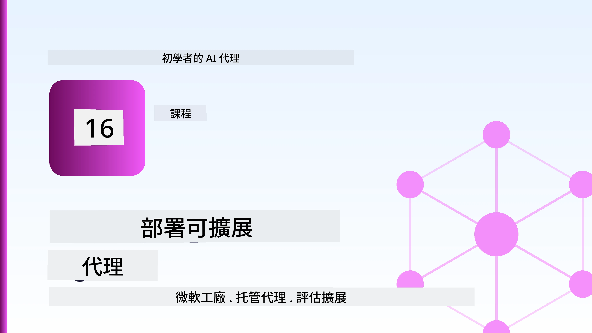
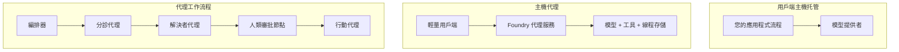
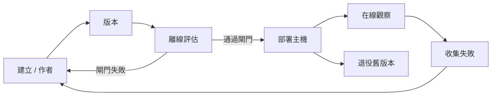
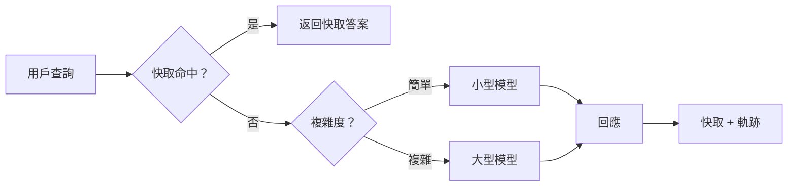
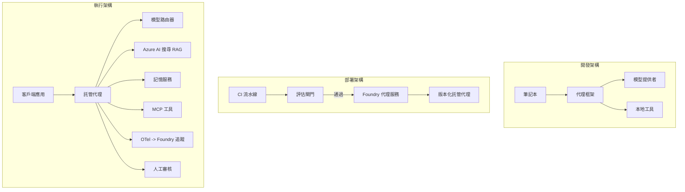

# 使用 Microsoft Foundry 部署可擴展代理



到目前為止，課程中您已經建立了在筆記本內、由 `az login` 和一些環境變數驅動，在您的筆記型電腦上運行的代理。這正是學習的正確方法。但這並不是運行一個成千上萬客戶在凌晨三點依賴的代理的正確做法。

本課程講述了「在我的機器上可運行」與「在生產環境中可靠且經濟地運行」之間的差距。我們使用 **Microsoft Foundry** 和 **Microsoft Foundry 代理服務** 來彌補這個差距，通過構建一個擁有工具、檢索、記憶、評估和監控的真實客戶支持代理。

## 介紹

本課程將涵蓋：

- <strong>原型代理</strong> 和 <strong>已部署代理</strong> 之間的差異，以及為什麼轉換過程主要是模型 <em>周圍</em> 的所有事情。
- 代理的 <strong>部署模式</strong>：客戶端託管、服務託管（托管代理），以及工作流編排。
- Microsoft Foundry 上的 <strong>代理生命週期</strong> — 建立、版本控制、部署、評估、觀察、退役。
- <strong>擴展策略</strong>：模型路由、緩存、併發和無狀態設計。
- 使用 OpenTelemetry 和 Foundry 跟蹤的 <strong>可觀察性</strong>。
- 通過模型選擇、路由和評估閘道實現的 <strong>成本優化</strong>。
- <strong>企業考量</strong>：治理、人類審批和安全運行 MCP 伺服器於生產環境。

## 學習目標

完成本課程後，您將能夠：

- 為特定代理工作負載選擇合適的部署模式。
- 將代理部署到 Microsoft Foundry 代理服務，使其版本化、治理和可觀察。
- 為代理添加追蹤工具，並連接一條在每次發布前運行的評估流程。
- 應用模型路由和緩存，以維持大規模下的延遲和成本可控。
- 為高風險操作添加人工審批門，並以生產安全的方式整合 MCP 伺服器。

## 先決條件

本課程假設您已完成之前的課程，並熟悉：

- 使用 [Microsoft Agent Framework](../14-microsoft-agent-framework/README.md) 建立代理（第14課）。
- [工具使用](../04-tool-use/README.md)（第4課）與 [Agentic RAG](../05-agentic-rag/README.md)（第5課）。
- [代理記憶](../13-agent-memory/README.md)（第13課）與 [Agentic Protocols / MCP](../11-agentic-protocols/README.md)（第11課）。
- [可觀察性與評估](../10-ai-agents-production/README.md)（第10課）— 本課程正是建立於此。

您還需要：

- 一個 **Azure 訂閱** 和一個至少包含一個已部署聊天模型的 **Microsoft Foundry 專案**。
- 已驗證 `az login` 的 **Azure CLI**。
- Python 3.12+ 及存儲庫內的 [`requirements.txt`](../../../requirements.txt) 套件。

## 從原型到生產：究竟改變了什麼

原型代理與生產代理共享相同的核心循環 — 推理、調用工具、回應。改變的是包裹在這個循環外的所有東西。模型大約佔生產代理的20%，其餘80%是運營結構。

| 關注點 | 原型 | 生產 |
| --- | --- | --- |
| <strong>託管</strong> | 於您的筆記本上運行 | 作為托管服務運行，版本控制並逐步發布 |
| <strong>身份</strong> | 您的 `az login` 權杖 | 使用有範圍 RBAC 的託管身份 |
| <strong>狀態</strong> | 內存中，重啟則丟失 | 外部化（線程儲存、記憶服務） |
| <strong>失敗</strong> | 顯示追蹤信息 | 重試、備援、死信、警報 |
| <strong>成本</strong> | “幾分錢” | 按請求跟蹤、路由、緩存、預算管理 |
| <strong>質量</strong> | 親眼檢查輸出 | 每次發布前自動評估 |
| <strong>信任</strong> | 您批准每次操作 | 風險操作的策略+人工介入 |

請記住此表。下方每個章節對應其中一行。

## 代理部署模式

您會使用三種常見模式，且經常組合使用。

### 1. 客戶端託管代理

代理物件存在於 <em>您的</em> 應用程式流程中。您的程式碼直接呼叫模型提供者；推理循環在您的服務中運行。這是之前所有課程所做的。

- <strong>適用情境</strong> 當您需要完全控制循環、自訂中介軟件或將代理嵌入現有後端時。
- <strong>權衡</strong>：您必須自行負責擴展、狀態與韌性。

### 2. 托管代理（Foundry 代理服務）

代理以 <em>資源形式註冊</em> 到 Microsoft Foundry。Foundry 託管推理循環，存儲線程，強制內容安全與 RBAC，並在 Foundry 入口網站中顯示代理。您的應用成為一個輕量客戶端，建立線程並讀取回應。

- <strong>適用情境</strong> 當您需要耐久性、內建可觀察性、治理與較少運維面時。
- <strong>權衡</strong>：以受管理執行環境換取較少底層控制。

### 3. 代理工作流

多個代理（與工具）被組成一個帶有明確控制流程的圖形 — 順序步驟、分支、人機審批節點與可暫停恢復的持久檢查點。這是 Microsoft Agent Framework 的 <strong>工作流</strong> 功能在部署規模上的應用。

- <strong>適用情境</strong> 單個任務涵蓋多個專門代理或中間需審批步驟時。
- <strong>權衡</strong>：更多移動部件，需要編排層級的可觀察性。



## Microsoft Foundry 上的代理生命週期

部署代理不是一次性的 `push`。它是一個循環，很像軟體發布流程，因為它確實就是如此。



關鍵想法，從 [第10課](../10-ai-agents-production/README.md) 延續：**離線評估是一道門檻，不是事後思考。** 新代理版本必須通過評估門檻才能發布。線上可觀察性則將真實故障回饋到離線測試集中。這便是整個循環。

## 擴展策略

代理擴展不同於無狀態網頁 API，因為每個請求可能觸發多個昂貴的模型和工具調用。四種技術承擔大部分負載。

**無狀態請求處理。** 不在記憶體中維護每用戶狀態。將對話線程存於 Foundry 線程庫或記憶服務，任一實例都能處理任一請求。這允許水平擴展 — 增加實例，無需黏存會話。

**模型路由。** 並非每個請求都需使用最強大（且最昂貴）的模型。將簡單請求 — 意圖分類、短事實性答覆 — 路由至小型且快速模型，將大型模型保留給真正推理。Foundry 的 <strong>模型路由器</strong> 可協助這一點，或者您也可以自己實作輕量分類器。實驗室中您會構建 DIY 版本。

**回應緩存。** 許多支援查詢都是近似重複（“如何重設密碼?”）。緩存常見問題答案，直接提供而無需調用模型。即使是適度的緩存命中率也能顯著降低成本與延遲。

**併發與背壓。** 模型提供方存在速率限制。限制併發數，使用指數退避重試，並優雅失敗（排隊回覆「我們正在處理」勝過 500 錯誤）。



## 生產可觀察性

沒有可見，便無法運營。正如第10課所述，Microsoft Agent Framework 原生發出 **OpenTelemetry** 跟蹤 — 每次模型呼叫、工具啟動與編排步驟皆成為一個 span。生產環境中，將這些 span 匯出到 Microsoft Foundry（或任何 OTel 兼容後端），以便您可以：

- 跟蹤單一客戶投訴，橫跨每次模型和工具呼叫。
- 隨時間觀察每請求 p50/p95 延遲與成本。
- 在用戶（或財務團隊）察覺錯誤率激增與成本異常前發出警報。

```python
from agent_framework.observability import get_tracer

tracer = get_tracer()

with tracer.start_as_current_span("support_request") as span:
    span.set_attribute("customer.tier", "enterprise")
    span.set_attribute("routed.model", "gpt-4.1-mini")
    # 代理執行會在此範圍內自動追蹤
```

類似 `customer.tier` 與 `routed.model` 的屬性可將大量追蹤轉化為可回答問題的資料（「企業客戶是否過度被路由到小型模型？」）。

## 成本優化

生產代理的成本主要來自 token。三個杠杆，按影響力排序：

1. **選擇適當模型大小。** 通過評估門檻的小模型，幾乎總比通過門檻的大模型成本低。使用評估來<em>證明</em>小模型足夠好，而非基於謹慎預設最大模型。
2. **依複雜度路由。** 如前所述 — 僅對需複雜推理的請求支付大模型價格。
3. **積極緩存。** 最便宜的模型調用是永遠不需發出的調用。

評估門檻與成本控制是同一紀律的兩種視角：評估告訴您<em>品質底線</em>，路由與緩存則讓您盡量保持在這底線的<em>成本</em>附近。

## 企業部署考量

**治理。** 托管代理繼承 Foundry 的 RBAC、內容安全與稽核日誌。賦予每個代理一個最小權限的託管身份 — 僅能讀取知識庫、範圍限定的工單 API 訪問，無額外權限。

**人工介入。** 有些操作太重要，無法完全自動化 — 退款、刪除帳戶、升級法務團隊。Microsoft Agent Framework 支援 <strong>須審批工具</strong>：代理提議操作，執行暫停，人工核准或拒絕，工作流繼續。您在[第6課](../06-building-trustworthy-agents/README.md)見過這個原語；本課部署它。

**生產環境中的 MCP。** [MCP](../11-agentic-protocols/README.md) 允許代理通過標準介面調用外部工具。生產中，將每個 MCP 伺服器視為不信任邊界：固定伺服器版本，以範圍身份執行，驗證其輸出，切勿暴露機密。MCP 伺服器是一個依賴，依賴需打補丁、審計與速率限制。



這三張圖 — 開發、部署、執行時 — 是同一代理的三個生命階段。隨後的實驗室將帶您打造它。

## 實作實驗室：生產就緒的客戶支持代理

打開 [`code_samples/16-python-agent-framework.ipynb`](./code_samples/16-python-agent-framework.ipynb) 完整操作。您將組裝一個<strong>Contoso 客戶支持代理</strong>，其中包括所有生產層面考慮：

1. <strong>工具調用</strong> — 查詢訂單狀態與打開支援工單。
2. **RAG** — 從知識庫回答政策問題（Azure AI 搜索，帶有筆記本內存回退，不需搜索資源即可運行）。
3. <strong>記憶</strong> — 記住多輪對話中的客戶。
4. <strong>模型路由</strong> — 複雜度分類器將每個請求路由至小模型或大模型。
5. <strong>回應緩存</strong> — 重複問題從緩存中提供答案。
6. <strong>人工審批</strong> — 超過閾值的退款暫停等待人工簽署。
7. <strong>評估流程</strong> — 一組小型離線測試集為代理排序，作為發布門檻。
8. <strong>可觀察性</strong> — 每次請求的 OpenTelemetry 跟蹤。

### 演練指引

筆記本組織成每個生產層面作為獨立可執行區段。核心是路由與緩存請求處理器：

```python
async def handle_support_request(query: str, customer_id: str) -> str:
    # 1. 盡可能從快取提供服務。
    cached = response_cache.get(normalize(query))
    if cached:
        return cached

    # 2. 根據複雜度路由以控制成本。
    model = "gpt-4.1-mini" if is_simple(query) else "gpt-4.1"

    # 3. 在追蹤範圍內執行代理以觀察。
    with tracer.start_as_current_span("support_request") as span:
        span.set_attribute("routed.model", model)
        span.set_attribute("customer.id", customer_id)
        response = await support_agent.run(query, model=model)

    # 4. 快取並返回。
    response_cache.set(normalize(query), response.text)
    return response.text
```

保護釋出用的評估門檻如下：

```python
async def evaluation_gate(agent, test_cases, threshold: float = 0.8) -> bool:
    passed = 0
    for case in test_cases:
        result = await agent.run(case["input"])
        if score_response(result.text, case["expected"]) >= 0.8:
            passed += 1
    pass_rate = passed / len(test_cases)
    print(f"Evaluation pass rate: {pass_rate:.0%} (gate: {threshold:.0%})")
    return pass_rate >= threshold  # 只在門閘通過時部署
```

仔細閱讀每一行 — 筆記本特意將原語保持簡潔，避免隱藏在框架調用後。

## 使用冒煙測試驗證已部署代理

上述評估門檻為<em>離線</em>評估您的代理物件。當代理部署為托管代理後，您還需要一個更廉價的檢測：**已部署端點是否真的在回應？**

「成功部署」只證明控制平面接受定義 — 無法證明代理有回應。缺少依賴、錯誤模型路由或連線過期，都會導致部署成功但無回應。<strong>冒煙測試</strong>可在每次部署後數秒內抓住此問題，成本遠低於完整評估。

本存儲庫附帶基於 [AI Smoke Test](https://github.com/marketplace/actions/ai-smoke-test) GitHub Action 的即用冒煙測試流程：

- <strong>目錄</strong> — [`tests/lesson-16-smoke-tests.json`](../../../tests/lesson-16-smoke-tests.json) 含 Contoso 支持代理的提示與斷言（依據政策答案、訂單查詢、保持主題、與多輪線程連續性）。其他課程代理的目錄與它並列 — 請參閱 [`tests/README.md`](../tests/README.md)。
- <strong>工作流程</strong> — [`.github/workflows/smoke-test.yml`](../../../.github/workflows/smoke-test.yml) 以 Azure OIDC 登入並逐個將提示 POST 到代理的 Responses 端點，任一斷言失敗則工作失敗。

```yaml
- name: Smoke-test hosted agent
  uses: JFolberth/ai-smoketest@v1
  with:
    project_endpoint: ${{ inputs.project_endpoint }}
    agent_name: ContosoSupportAgent
    tests_file: tests/lesson-16-smoke-tests.json
```


部署代理後，從 <strong>動作</strong> 標籤頁運行它，並提供你的 Foundry 專案端點和代理名稱。聯邦身份需要在 Foundry 專案範圍內擁有 **Azure AI 使用者** 角色。將層次視為金字塔：煙霧測試（是否可達且有回應？）在每次部署時執行，離線評估（品質夠好可以發布嗎？）在推廣前執行，線上評估（在實際環境中的表現如何？）持續運行。

## 知識測驗

在進入作業前測試你的理解。

**1. 大約生產代理中「模型」佔多少比例？其餘的是什麼？**

<details>
<summary>答案</summary>

模型是系統中的少數部分——通常大約佔 20%。其餘的是操作框架：託管和版本管理、身分識別和角色基礎存取控制（RBAC）、外部化狀態、故障處理、成本追蹤、評估，以及人機介入控制。投入生產大多是圍繞推理迴圈構建整個結構。
</details>

**2. 何時會選擇使用 Hosted Agent 而非客戶端託管代理？**

<details>
<summary>答案</summary>

當你想要一個內建持久性（可持續並可恢復的執行緒）、可觀察性、內容安全和 RBAC 的托管運行時，且願意以犧牲部分推理迴圈的底層控制權來換取較少的操作面積時。若你需要完全控制迴圈或將代理嵌入現有後端，客戶端託管較合適。
</details>

**3. 為什麼可擴展的代理必須在其自身的程序記憶體中是無狀態的？**

<details>
<summary>答案</summary>

如此任何實例都能處理任何請求，這讓水平擴展無需黏性會話成為可能。每個用戶的會話狀態被外部化至執行緒存儲或記憶體服務。若狀態存在程序記憶體中，重啟後將遺失，且無法自由分配負載。
</details>

**4. 模型路由解決什麼問題？它與評估有何關聯？**

<details>
<summary>答案</summary>

路由將簡單請求發送給小型、廉價且快速的模型，並保留大型模型用於真正的推理，從而控制延遲和成本。它與評估相關，因為評估是<em>證明</em>小模型對某類請求已足夠好用的手段——沒有評估的路由只是猜測。
</details>

**5. 什麼是「評估閘門（evaluation gate）」？它位於生命周期的哪裡？**

<details>
<summary>答案</summary>

評估閘門會針對新代理版本執行一組離線測試，除非通過率達標，否則阻擋部署。它位於生命周期中的「版本」與「部署」之間，讓品質成為發布的前置條件，而非發佈後才檢查。
</details>

**6. 為什麼 MCP 伺服器在生產環境中應被視為不受信任的邊界？**

<details>
<summary>答案</summary>

因為它是代理呼叫的外部依賴。你應釘定其版本，使用範圍限制的身份執行，驗證其輸出，進行速率限制，且絕不暴露機密給它——同任何第三方依賴的安全要求一樣。其輸出會流入代理的推理，所以未驗證的信任是安全風險。
</details>

**7. 通常哪一項改變對生產代理成本影響最大？為什麼？**

<details>
<summary>答案</summary>

模型大小合適——使用在評估閘門中通過的最小模型。成本主要由代幣數決定，且一個達到品質標準的較小模型幾乎總是比大型模型便宜。緩存和路由可進一步降低成本，但選對基礎模型是最大的首要影響因素。
</details>

**8. 像 `customer.tier` 和 `routed.model` 的 span 屬性在可觀察性中扮演什麼角色？**

<details>
<summary>答案</summary>

它們將原始追蹤轉變為可回答的商業問題。沒有屬性，你只能看到一堆 spans；有了屬性，你可以問「企業客戶是否過於頻繁地被路由到小模型？」或「哪個模型處理我們最慢的請求？」屬性是你按照對營運重要維度切割遙測資料的方式。
</details>

## 作業

取用實驗室的客戶支援代理，並針對特定場景強化它：**一個為 SaaS 公司設計的訂閱計費支援代理。**

你的提交內容應包含：

1. <strong>替換工具</strong>為與計費相關的：`get_subscription_status`、`get_invoice` 和 `issue_credit`（超過 50 美元的信用額需人工批准）。
2. **新增三份 RAG 文件**，涵蓋公司的退款政策、計費週期與取消政策。
3. <strong>擴充評估集</strong>至至少八個案例，包括至少兩個<em>應該</em>觸發人工批准路徑，並確認你的評估閘門正確通過或失敗。
4. <strong>新增一份成本報告</strong>：在代理處理十個混合查詢後，列印有多少送給小模型、多少送給大模型、多少從快取中獲得服務。

撰寫一個簡短段落（markdown 單元格中），說明你選擇的模型路由規則，以及你如何用實際流量驗證它。沒有單一正確答案——評估重點在於生產相關考量是否相互連結合理。

## 總結

在本課中，你將代理從原型推向生產，使用 Microsoft Foundry：

- 跳到生產主要是建立環繞模型的<strong>操作架構</strong>——託管、身份、狀態、故障處理、成本、品質與信任。
- 你學習了三種<strong>部署模式</strong>——客戶端託管、Hosted Agents 與代理工作流程，並了解何時適用。
- 你實際演練了<strong>代理生命周期</strong>，其中離線<strong>評估作為發佈閘門</strong>，線上可觀察性將故障回饋至測試集。
- 你應用了<strong>擴展策略</strong>——無狀態設計、模型路由、緩存和有限併發，並將它們與<strong>成本優化</strong>連結。
- 你接入了<strong>企業控管</strong>：RBAC、人工審核環節，以及生產安全的 MCP 整合。
- 你建置了一個<strong>生產就緒的客戶支援代理</strong>，將上述各考量整合於可執行程式碼。

下一課將走反方向旅程：不再將代理擴展到雲端，而是將它們<em>下放</em>到單一開發者機器上，完全在本地運行。

## 參考資源

- <a href="https://learn.microsoft.com/azure/ai-foundry/what-is-azure-ai-foundry" target="_blank">Microsoft Foundry 文件</a>
- <a href="https://learn.microsoft.com/azure/ai-foundry/agents/overview" target="_blank">Microsoft Foundry 代理服務總覽</a>
- <a href="https://aka.ms/ai-agents-beginners/agent-framework" target="_blank">Microsoft Agent Framework</a>
- <a href="https://learn.microsoft.com/azure/ai-foundry/concepts/model-router" target="_blank">Microsoft Foundry 中的模型路由器</a>
- <a href="https://learn.microsoft.com/azure/search/search-what-is-azure-search" target="_blank">Azure AI 搜尋</a>
- <a href="https://opentelemetry.io/" target="_blank">OpenTelemetry</a>
- <a href="https://github.com/marketplace/actions/ai-smoke-test" target="_blank">AI 煙霧測試 GitHub Action</a>
- <a href="https://modelcontextprotocol.io/" target="_blank">模型上下文協定 (MCP)</a>

## 上一課

[建構電腦使用代理（CUA）](../15-browser-use/README.md)

## 下一課

[建立本地 AI 代理](../17-creating-local-ai-agents/README.md)

---

<!-- CO-OP TRANSLATOR DISCLAIMER START -->
**免責聲明**：
本文件使用 AI 翻譯服務 [Co-op Translator](https://github.com/Azure/co-op-translator) 進行翻譯。雖然我們力求準確，但請注意，自動翻譯可能包含錯誤或不準確之處。原始文件的母語版本應被視為權威來源。對於重要資訊，建議尋求專業人工翻譯。我們不對因使用本翻譯而引起的任何誤解或曲解承擔責任。
<!-- CO-OP TRANSLATOR DISCLAIMER END -->