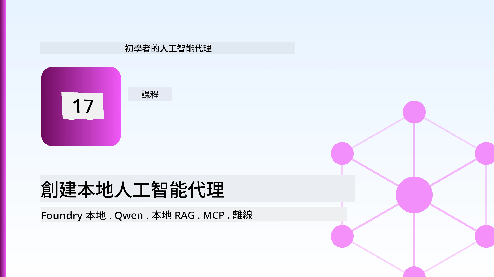
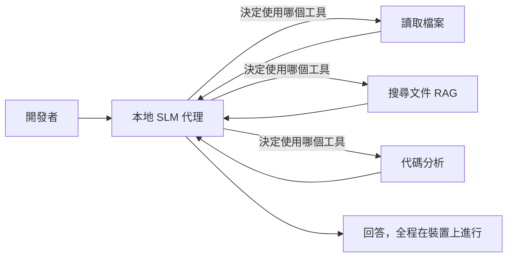
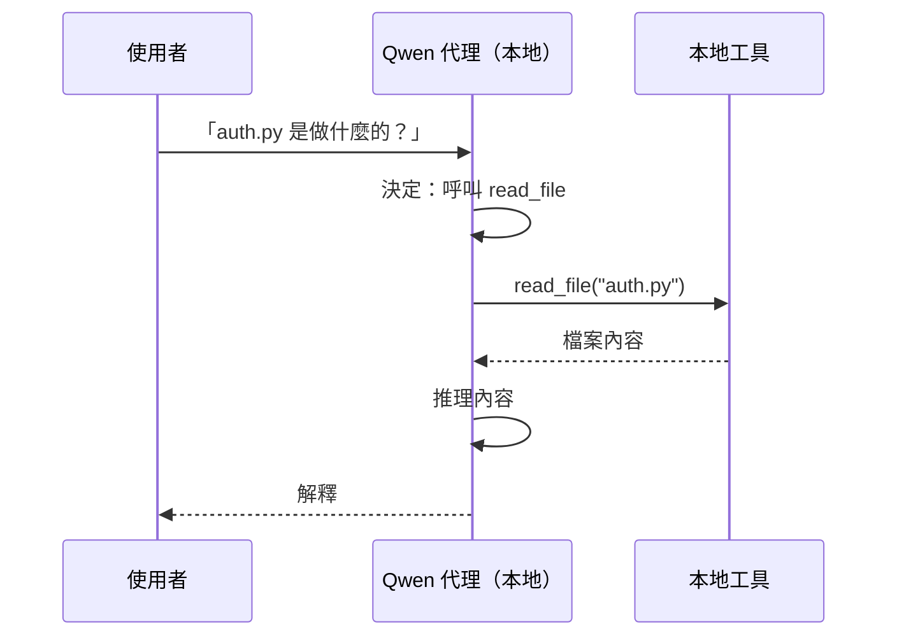
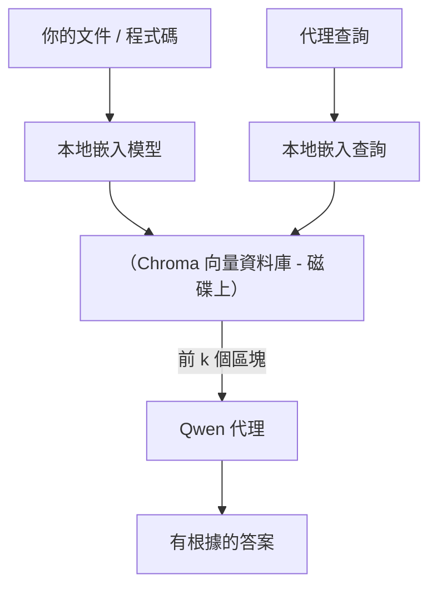
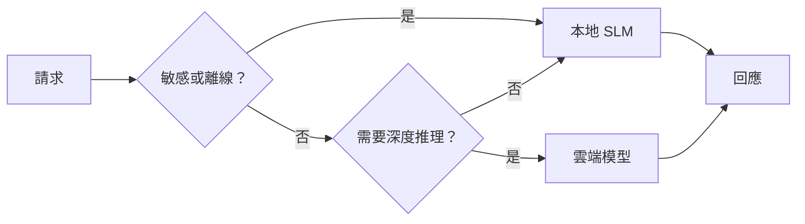

# 使用 Microsoft Foundry Local 和 Qwen 建立本地 AI 代理



上一課將代理 <em>擴展</em> 至雲端。本課則將代理 <em>縮減</em> 至單一機器上。結束時你將擁有一個能進行推理、呼叫工具、閱讀你的檔案，並搜尋你的文件的運作中工程助理 — **完全不透過任何雲端推論呼叫。**

為什麼你會想要這樣？在實際工程工作中經常出現以下三個理由：

- **隱私。** 程式碼和文件永遠不會離開機器。沒有提示、片段或客戶資料越過網絡邊界。
- **成本。** 本地推論沒有每個字元計費。你可以用一天的電費反覆迭代。
- **離線。** 在飛機上、安全設施內或停電期間，代理依然能運作。

缺點是你要從前沿的雲端模型換成在 CPU、GPU 或 NPU 運行的 **小型語言模型（SLM）**。本課討論如何建立能在該限制下 <em>良好</em> 運作的代理，而不是假裝限制不存在。

## 介紹

本課將涵蓋：

- **小型語言模型（SLMs）** — 它們是什麼、擅長什麼、不擅長什麼。
- **Microsoft Foundry Local** — 一個在裝置上下載並提供模型的運行時，通過 **OpenAI 相容 API**。
- **Qwen 函數呼叫模型** — 可靠產生工具呼叫的 SLM，使得本地 <em>代理</em>（不只是本地聊天）成為可能。
- **本地工具、本地 RAG 和本地 MCP** — 在無雲的情況下給代理能力。
- <strong>混合模式</strong> — 何時保持本地，何時伸手往雲端。

## 學習目標

完成本課後，你將會知道如何：

- 解釋 SLM 的權衡並挑選適合的本地代理使用案例。
- 使用 Foundry Local 本地服務 Qwen 模型，並通過 OpenAI 相容端點連接。
- 建立完全在你的工作站上運行的工具呼叫代理。
- 使用本地向量資料庫（Chroma）在自有文件上加上本地 RAG。
- 將代理連接到本地 MCP 伺服器並思考混合本地/雲端設計。

## 先備條件

本課假設你已完成前面課程並熟悉：

- [工具使用](../04-tool-use/README.md)（第4課）與 [Agentic RAG](../05-agentic-rag/README.md)（第5課）。
- [Agentic Protocols / MCP](../11-agentic-protocols/README.md)（第11課）。
- [Microsoft 代理框架](../14-microsoft-agent-framework/README.md)（第14課）。

你還需：

- 一台開發工作站。**8 GB RAM 是實際的最低限度**，16 GB 以上較為舒適。有 GPU 或 NPU 有幫助但非必要。
- 已安裝 **Microsoft Foundry Local**（參見下文安裝部分）。
- Python 3.12+ 及本倉庫 `requirements.txt` 中的套件，還有本課用到的 `foundry-local-sdk`、`openai` 和 `chromadb`。

## 小型語言模型：本地工作的合適工具

前沿雲端模型有數千億參數和資料中心支撐。小型語言模型有數十億參數且必須塞入筆記型電腦 RAM。差異設定了明確的期待。

**SLMs 擅長：**

- 結構化、有界的任務 — 分類、提取、已知文件的摘要。
- <strong>工具呼叫</strong> — 決定呼叫哪個函數以及使用哪些參數。
- 針對自己的資料快速、便宜、私下迭代。

**SLMs 較弱：**

- 開放式、多步推理於大型上下文。
- 廣泛世界知識（見得少且容易忘）。

本地代理的最佳策略為：**讓 SLM 負責協調，讓工具做重活。** 模型不需 <em>知道</em> 你的程式碼庫，只要知道何時呼叫 `read_file` 和 `search_docs`。這直擊 SLM 的擅長點。



## Microsoft Foundry Local

**Microsoft Foundry Local** 是輕量級執行環境，能在你的機器上下載、管理並提供模型。最重要的是對我們而言，它公開了一個 **OpenAI 相容 HTTP 端點** — 意味著 OpenAI SDK 與 Microsoft 代理框架的 OpenAI 用戶端可經由僅變更 `base_url` 來使用它。你先前學習的代理編寫技巧完全可延用；只是端點從雲端變成 `localhost`。

Foundry Local 還會自動為硬體選擇最佳模型版本 — CPU 版本、CUDA/GPU 版本或 NPU 版本 — 不用你針對每台機器手動優化。

### 安裝設定

安裝 Foundry Local（參見你的作業系統專屬[文件](https://learn.microsoft.com/azure/ai-foundry/foundry-local/)），然後確認其運作：

```bash
# 安裝（範例；請依據您的平台參考文件）
winget install Microsoft.FoundryLocal      # Windows 作業系統
# brew install microsoft/foundrylocal/foundrylocal   ＃ macOS

# 下載並執行 Qwen 模型，然後啟動本地服務
foundry model run qwen2.5-7b-instruct
foundry service status
```

服務啟動後，你就有一個本地 OpenAI 相容端點（通常是 `http://localhost:PORT/v1`）。筆記本使用 `foundry-local-sdk` 自動發現端點，省去你硬編碼埠號的麻煩。

## Qwen 函數呼叫：為何重要

一個代理只有能呼叫工具才是真正代理。許多 SLM 能聊天卻產生不可靠、格式錯誤的工具呼叫。**Qwen** 模型受訓於函數呼叫，穩定產生格式良好的工具呼叫結構 — 正是將本地聊天模型轉成本地 <em>代理</em> 的關鍵。

流程是你已知的標準工具呼叫迴圈，只是移至本機運行：



## 本地 RAG

文件搜尋是本地代理的賣點。不需指望 SLM 記住你的框架文件，而是將這些文件嵌入至 <strong>本地向量資料庫</strong>，令代理按需檢索相關片段。

我們使用 **Chroma**，一個內嵌向量庫，無需管理伺服器。整條管線完全本地：本地嵌入模型→本地向量→本地檢索→本地 SLM。



這是第5課中 Agentic RAG 的相同模式 — 唯一改變是每個組件皆在你的機器上運行。

## 本地 MCP 伺服器

[MCP](../11-agentic-protocols/README.md) 是一種傳輸協議，非雲端服務。MCP 伺服器能以本地進程方式於 `stdio` 運行，透過標準協議向代理暴露工具。你可以離線重用 MCP 生態系統中的伺服器 — 檔案系統存取、git 操作、資料庫查詢。

安全姿態與雲端不同，但並非不存在：本地 MCP 伺服器仍以你的使用者權限運行，請限制其能接觸的範圍（如專案資料夾，非整個家目錄），並將其輸出視為輸入來驗證。

## 混合雲端與本地模式

本地優先不等於只有本地。成熟系統依敏感度與難度分流：

| 情境 | 運行地點 |
| --- | --- |
| 敏感程式碼/資料，或離線 | **本地 SLM** |
| 簡單、有界任務 | **本地 SLM**（便宜、快速） |
| 非敏感資料上的艱深多步推理 | <strong>雲端模型</strong> |
| 任何情況下停電 | **本地 SLM**（優雅降級） |

這和第16課的 <strong>模型路由</strong> 概念類似 — 差別是現在「模型」之一是你的機器。穩健設計在雲端不可用時退回本地，讓代理品質降低但不中斷。



## 實作操作：本地工程助理

打開 [`code_samples/17-local-agent-foundry-local.ipynb`](./code_samples/17-local-agent-foundry-local.ipynb) 跟著做。你會構建一個 <strong>完全在工作站運行</strong> 的本地工程助理，能做到：

1. <strong>呼叫工具</strong> — 透過 Foundry Local 的 Qwen 函數呼叫。
2. <strong>執行本地檔案操作</strong> — 列出及閱讀專案目錄中的檔案。
3. <strong>分析程式碼</strong> — 報告源檔的基本度量。
4. <strong>搜尋文件</strong> — 利用 Chroma 對文件資料夾執行本地 RAG。
5. **使用 MCP** — 連接本地 MCP 伺服器（若無設定則優雅跳過）。

全流程不透過雲端推論。

### 過程解說

助理透過 OpenAI 相容端點連接 Foundry Local，因此代理編碼看起來與雲端課程幾乎相同 — 唯獨用戶端改變：

```python
from foundry_local import FoundryLocalManager
from openai import OpenAI

# Foundry Local 會發現/下載模型並提供本地端點。
manager = FoundryLocalManager(\"qwen2.5-7b-instruct\")
client = OpenAI(base_url=manager.endpoint, api_key=manager.api_key)  # api_key 是一個本地佔位符。
```

工具是範圍限定的普通 Python 函數，限定於專案目錄：

```python
def read_file(path: str) -> str:
    \"\"\"Read a file, but only inside the sandboxed project directory.\"\"\"
    full = (PROJECT_ROOT / path).resolve()
    if PROJECT_ROOT not in full.parents and full != PROJECT_ROOT:
        return \"Access denied: path is outside the project directory.\"
    return full.read_text(encoding=\"utf-8\")
```

留意沙盒檢查 — 即使本地，讀取任意路徑的工具依然風險高。筆記本將所有工具限制於單一專案根目錄內。

## 知識檢核

進入作業前先自測理解。

**1. 請舉出兩個將代理運行於本地而非雲端的具體原因。**

<details>
<summary>答案</summary>

三者擇二：<strong>隱私</strong>（程式碼及資料永遠留在機器）、<strong>成本</strong>（無每字元推論費用）、<strong>離線能力</strong>（無網路依舊可用 — 飛機上、安全場所或停電）。法規合規限制不允許設備外傳資料也是促成隱私理由的常見原因。
</details>

**2. 在本地代理中，SLM 與工具的推薦分工是什麼？為何如此？**

<details>
<summary>答案</summary>

讓 SLM 擔任 <strong>協調者</strong>（決定呼叫何種工具及參數），工具負責 <strong>重活</strong>（讀檔、取文、計算結果）。SLMs 擅長有界決策如工具選擇，並在廣泛知識與長多步推理上較弱，故依靠工具能發揮其長處。
</details>

**3. 什麼讓 Foundry Local 能夠重用雲端代理程式碼？**

<details>
<summary>答案</summary>

Foundry Local 公開 **OpenAI 相容 HTTP 端點**。OpenAI SDK 與代理框架的 OpenAI 用戶端只需改變 `base_url`（並使用本地假 API key）即可使用。代理程式碼其它部分無須變動。
</details>

**4. 為何特別使用 Qwen 函數呼叫模型，而非任何 SLM？**

<details>
<summary>答案</summary>

因為代理必須產生可靠、格式良好的 <strong>工具呼叫</strong>。許多 SLM 可聊聊對話，卻釋出格式錯誤或不一致的呼叫結構。Qwen 模型受訓於函數呼叫，可穩定產生一致工具呼叫，這正是使本地聊天模型成為可用本地代理的關鍵。
</details>

**5. 在本地 RAG 管線中，哪些組件運行於機器上？**

<details>
<summary>答案</summary>

全部：嵌入模型、向量資料庫（Chroma，磁碟上）、檢索步驟以及 SLM。文件在本機被嵌入、存储、檢索並由本機模型推理 — 無一觸及雲端。
</details>

**6. 本地 MCP 伺服器在你機器上執行，這是否自動表示安全？你仍應採取什麼預防？**

<details>
<summary>答案</summary>

否。本地 MCP 伺服器以你使用者權限運行，因此可以接觸你能接觸的任何東西。請限制其範圍（例如限制於單一專案目錄，而非整個家目錄），並將其輸出視為需驗證的輸入再行動。
</details>

**7. 請描述包含本地模型的合理混合路由規則。**

<details>
<summary>答案</summary>

將敏感或離線請求路由至本地 SLM；將簡單且有限任務路由至本地 SLM 以求快速及降低成本；將非敏感資料上的複雜多步推理委由雲端模型處理；當雲端不可用時退回本地 SLM，使代理優雅降級而非直接失敗。這是第16課的模型路由，並將本地機器視為其中一個模型。
</details>

**8. 本課本地代理的實際最低 RAM 容量為多少？多點 RAM 有什麼好處？**

<details>
<summary>答案</summary>

約 **8 GB** 是實際最低；16 GB 以上較舒適。較多 RAM 允許你運行更大、更強能力的模型並記憶更多上下文。GPU 或 NPU 可加速推論，但非必要 — 若無硬體加速器，Foundry Local 會選 CPU 版本。
</details>

## 作業

將本地工程助理擴充為小型專案的 <strong>本地文件審查員</strong>（若想可使用本倉庫的任一課程資料夾）。

你的提交應包含：

1. 將一個真實文件/程式碼資料夾索引進 Chroma（至少五個檔案）。
2. 新增一個 `find_todos` 工具，掃描專案中含 `TODO`/`FIXME` 的註解並返回它們及其檔案與行號 — 同時維護與 `read_file` 相同的沙盒檢查。

3. <strong>問代理人三個問題</strong>，迫使它結合工具：一個純 RAG 問題，一個需要閱讀特定文件，另一個需要尋找 TODO。
4. <strong>測量它</strong>：計時這三個回應，並在 markdown 儲存格中記錄。評述延遲是否符合你的預期工作流程。

接著寫一小段落說明<strong>你會將哪些部分遷移到雲端、哪些部分會保留在本地</strong>給這位審查者，以及原因。你的評估標準是本地組件是否正確串接，以及你的混合推理是否合理 — 並非模型品質。

## 摘要

在本課中，你建構了一個完全在你自己機器上運行的代理：

- **SLMs** 換取隱私、成本和離線操作的廣度 — 並在<strong>協調工具</strong>時發揮最佳，而不是承擔所有知識。
- **Foundry Local** 在裝置端後面提供模型，且有一個<strong>相容 OpenAI 的端點</strong>，讓你的雲端代理碼只需一行變更即可轉移。
- **Qwen 函數調用模型** 使可靠的本地工具調用成為可能，因而也成就了本地<em>代理</em>。
- **本地 RAG**（Chroma）與<strong>本地 MCP</strong> 讓代理在不離開機器的情況下具備能力。
- <strong>混合模式</strong> 讓你能依敏感性與難度進行路由，本地則作為一個優雅的後備方案。

本課完成了部署弧線：第 16 章將代理規模擴展至 Microsoft Foundry，本課則縮減至單一工作站。下一課將聚焦於保持部署代理的安全。

## 其他資源

- <a href="https://learn.microsoft.com/azure/ai-foundry/foundry-local/" target="_blank">Microsoft Foundry Local 文件</a>
- <a href="https://learn.microsoft.com/azure/ai-foundry/what-is-azure-ai-foundry" target="_blank">Microsoft Foundry 文件</a>
- <a href="https://aka.ms/ai-agents-beginners/agent-framework" target="_blank">Microsoft Agent Framework</a>
- <a href="https://qwen.readthedocs.io/en/latest/framework/function_call.html" target="_blank">Qwen 函數調用文件</a>
- <a href="https://modelcontextprotocol.io/" target="_blank">Model Context Protocol (MCP)</a>
- <a href="https://docs.trychroma.com/" target="_blank">Chroma 向量資料庫</a>

## 上一課

[部署可擴展代理](../16-deploying-scalable-agents/README.md)

## 下一課

[保障 AI 代理安全](../18-securing-ai-agents/README.md)

---

<!-- CO-OP TRANSLATOR DISCLAIMER START -->
**免責聲明**：
本文件使用 AI 翻譯服務 [Co-op Translator](https://github.com/Azure/co-op-translator) 進行翻譯。雖然我們力求準確，但請注意，自動翻譯可能包含錯誤或不準確之處。原始文件的母語版本應被視為權威來源。對於重要資訊，建議尋求專業人工翻譯。我們不對因使用本翻譯而引起的任何誤解或曲解承擔責任。
<!-- CO-OP TRANSLATOR DISCLAIMER END -->