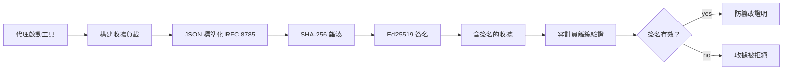
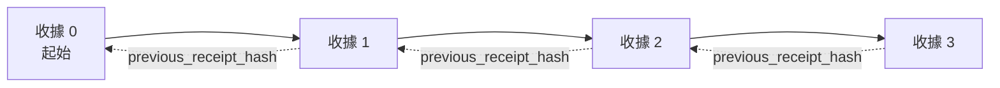

[觀看課程影片：使用密碼收據保障 AI 代理的安全性](https://youtu.be/PLACEHOLDER_VIDEO_ID)

> _(課程影片與縮圖將由 Microsoft 內容團隊於合併後補充，符合課程第 14 / 15 節的模式。)_

# 使用密碼收據保障 AI 代理的安全性

## 介紹

本課程將涵蓋：

- 為何 AI 代理的稽核軌跡對合規、除錯和信任至關重要。
- 什麼是密碼收據，以及它與未簽名日誌行的差異。
- 如何使用純 Python 為代理的工具呼叫產生簽署收據。
- 如何離線驗證收據並偵測竄改。
- 如何將收據串鏈，使得刪除或重新排序其中一個收據會破壞整條鏈。
- 收據證明什麼，以及它們明確不證明什麼。

## 學習目標

完成本課程後，您將能夠：

- 辨識促使代理行動採用密碼出處驗證的錯誤模式。
- 產生針對標準 JSON 輸載的 Ed25519 簽署收據。
- 只用簽署者的公開金鑰獨立驗證收據。
- 透過重新驗證被修改的收據來偵測竄改。
- 構建含雜湊串鏈的收據序列，並說明串鏈重要性。
- 辨認收據證明的邊界（歸屬、完整性、排序）與不證明的內容（行動正確性、政策合理性）。

## 問題：您的代理的稽核軌跡

想像您已為 Contoso 旅行公司部署了 AI 代理。該代理閱讀客戶請求、呼叫航班 API 查詢選項，並代表客戶訂票。上季度，代理處理了 50,000 筆訂單。

今天一位稽核員到來。他問一個簡單問題：「展示您的代理做了什麼。」

您交出日誌檔案，稽核員查看後提出更難的問題：「我怎麼知道這些日誌沒有被編輯過？」

這就是稽核軌跡問題。當今多數代理部署依賴：

- <strong>應用日誌</strong>：由代理自身撰寫，任何有檔案系統存取權限的人都可編輯。
- <strong>雲端日誌服務</strong>：在平台層面可證明篡改，但前提是稽核員信任平台營運者。
- <strong>資料庫交易日誌</strong>：適合資料庫變更，但不適用於任意工具呼叫。

這些方法均無法在不依賴某人（您、您的雲端供應商、資料庫廠商）信任的情況下回答稽核員問題。對內部使用，這種信任通常可接受，但對受監管工作負載（金融、醫療、或 EU AI Act 範疇）則不可。

密碼收據透過讓每個代理行動獨立可驗證來解決此問題。稽核員不需信任您，只需要您的公開金鑰和收據本身。

## 什麼是密碼收據？

收據是一個 JSON 物件，記錄代理的行動，並由數位簽章簽署。



簡約的收據長這樣：

```json
{
  "type": "agent.tool_call.v1",
  "agent_id": "contoso-travel-bot",
  "tool_name": "lookup_flights",
  "tool_args_hash": "sha256:a3f9c1...",
  "result_hash": "sha256:7b2e1d...",
  "policy_id": "contoso-travel-policy-v3",
  "timestamp": "2026-04-25T14:30:00Z",
  "sequence": 47,
  "previous_receipt_hash": "sha256:9d4e6a...",
  "signature": {
    "alg": "EdDSA",
    "sig": "c5af83...",
    "public_key": "8f3b2c..."
  }
}
```

三個屬性負責此功能：

1. <strong>簽名</strong>。收據由代理的閘道使用 Ed25519 私鑰簽署。任何持有相對應公開鑰者均可離線驗證簽名。篡改任何欄位會使簽名失效。

2. <strong>標準編碼</strong>。簽署前，收據使用 JSON 標準化方案（JCS，RFC 8785）序列化。此步驟確保兩個產生相同邏輯收據的實作輸出位元組完全一致。若無標準化，不同 JSON 序列化器對相同內容產生不同簽名。

3. <strong>雜湊串鏈</strong>。`previous_receipt_hash` 欄位連結每個收據與其前一筆。移除或重新排序收據會破壞之後所有收據。即使繞過單個簽名，篡改也將於整條串鏈層級顯現。

這些特性共同提供三項保證：

- <strong>歸屬</strong>：此鑰匙簽署了此內容。
- <strong>完整性</strong>：自簽署後內容未被變更。
- <strong>排序</strong>：此收據在串鏈中位於該收據之後。

## 在 Python 中產生收據

您不需要特殊函式庫即可產生收據。密碼原語廣泛可用，邏輯只有數十行 Python 程式碼。

`code_samples/18-signed-receipts.ipynb` 的動手練習會帶您完整走過流程。以下為摘要版本：

```python
import json
import hashlib
import base64
from nacl import signing
from jcs import canonicalize  # RFC 8785 規範 JSON

def b64url_nopad(data: bytes) -> str:
    return base64.urlsafe_b64encode(data).decode("ascii").rstrip("=")

def sha256_canonical(obj) -> str:
    """SHA-256 of a Python object's JCS-canonical JSON form."""
    return f"sha256:{hashlib.sha256(canonicalize(obj)).hexdigest()}"

# 產生或載入簽署金鑰（於生產環境中，應儲存於金鑰庫）
signing_key = signing.SigningKey.generate()
verify_key = signing_key.verify_key

# 建立收據有效載荷（尚未簽署）
tool_args = {"origin": "SYD", "destination": "LAX"}
tool_result = [{"flight": "QF11", "price": 1850, "stops": 0}]

payload = {
    "type": "agent.tool_call.v1",
    "agent_id": "contoso-travel-bot",
    "tool_name": "lookup_flights",
    "tool_args_hash": sha256_canonical(tool_args),
    "result_hash": sha256_canonical(tool_result),
    "policy_id": "contoso-travel-policy-v3",
    "timestamp": "2026-04-25T14:30:00Z",
    "sequence": 0,
    "previous_receipt_hash": None,
}

# 規範化、雜湊、簽署。
canonical_bytes = canonicalize(payload)
message_hash = hashlib.sha256(canonical_bytes).digest()
signature_bytes = signing_key.sign(message_hash).signature

# 附加結構化簽名物件。
receipt = {
    **payload,
    "signature": {
        "alg": "EdDSA",
        "sig": b64url_nopad(signature_bytes),
        "public_key": b64url_nopad(bytes(verify_key)),
    },
}
```

這就是整個簽署流程。筆記本中的練習會逐步帶您操作每個步驟。

## 驗證收據並偵測篡改

驗證為相反操作：

```python
import base64
import hashlib
from nacl import signing
from nacl.exceptions import BadSignatureError
from jcs import canonicalize

def b64url_decode(s: str) -> bytes:
    padding = "=" * ((4 - len(s) % 4) % 4)
    return base64.urlsafe_b64decode(s + padding)

def verify_receipt(receipt: dict) -> bool:
    # 簽名是一個結構化物件：{"alg", "sig", "public_key"}。
    sig_obj = receipt.get("signature")
    if not sig_obj or sig_obj.get("alg") != "EdDSA":
        return False

    # 重構實際被簽署的有效載荷（除了簽名之外的所有內容）。
    payload = {k: v for k, v in receipt.items() if k != "signature"}

    canonical_bytes = canonicalize(payload)
    message_hash = hashlib.sha256(canonical_bytes).digest()

    try:
        verify_key = signing.VerifyKey(b64url_decode(sig_obj["public_key"]))
        verify_key.verify(message_hash, b64url_decode(sig_obj["sig"]))
        return True
    except BadSignatureError:
        return False
```

此函式接受收據，若簽名有效回傳 `True`，否則回傳 `False`。無需網路呼叫、無服務依賴，也不需信任第三方。

若要觀察篡改偵測如何運作，筆記本會示範：

1. 產生有效收據並確認其能成功驗證。
2. 修改 `tool_args_hash` 欄位中一個位元組。
3. 重新執行驗證，見る驗證失敗。

這是收據防竄改的實際演示：任何修改（即使極小）均會破壞簽名。

## 為多步驟代理串接收據

單一簽署收據保護一個行動，一串收據保護一序列行動。



每個收據記錄前一收據的雜湊。要靜默移除收據 2，攻擊者須：

- 修改收據 3 的 `previous_receipt_hash` 欄位（破壞收據 3 的簽名），或
- 偽造修改後收據 3 的新簽名（需代理私鑰）。

若私鑰存放於硬體金鑰保管庫且您隨每張收據公布公開鑰，兩種攻擊均無法未被偵測而進行。

筆記本示範：

1. 建立三張收據的串鏈。
2. 驗證每張收據的 `previous_receipt_hash` 與前一收據實際雜湊相符。
3. 篡改中間某張收據，觀察串鏈於該點斷裂。

這即是您提供外部稽核員可獨立驗證且無需信任您的稽核軌跡的方法。

## 收據能證明什麼（和不能證明什麼）

這是本課程最重要的一節。收據強大但其效力有限。

**收據證明三件事：**

1. <strong>歸屬</strong>：特定鑰匙簽署特定載荷。
2. <strong>完整性</strong>：載荷自簽名後未被變更。
3. <strong>排序</strong>：此收據在雜湊鏈中位於另一收據之後。

**收據不證明：**

1. <strong>正確性</strong>：代理的行動是否正確。簽署收據可同樣清楚地為錯誤答案簽署。
2. <strong>政策合規</strong>：`policy_id` 指涉的政策是否真被評估，或若檢查會否允許此行動。收據記錄的是宣稱的內容，而非執行的結果。
3. <strong>超越鑰匙的身份</strong>：收據表明「此鑰匙簽署此內容」，但不表示「此人授權」。把鑰匙與人員或組織連結，需另行身份基建（目錄、公鑰登記等）。
4. <strong>輸入真實性</strong>：若代理收到被操控的提示並依此行事，收據會真實記錄行動。收據位於輸入驗證之後，非其替代品。

此邊界重要有兩原因：

- 它告訴您收據能用來做什麼：使代理行為可審核並防篡改，即使跨組織邊界。
- 它告訴您仍需哪些額外層級：輸入驗證（第6課）、政策執行（下文簡述）、身份基建（本課程範圍外）。

常見誤解是「有收據」即表示「受治理」。非也。收據是基礎，治理是建立於其上的系統。

## 證明是人類批准了確切行動

上述第 3 點值得獨立討論：行動收據說「此鑰匙簽署此內容」，不說「人類授權」。對高風險行動（退款、刪除、匯款），治理框架日益要求明確這類授權聲明，且可用本課程建構的相同原語實現。

後續筆記本 `code_samples/human-authorization-receipts.ipynb` 加入第二種收據類型 `human.approval.v1`，與本課程收據同樣包裝格式（帶類型的載荷，對其標準 SHA-256 雜湊由 Ed25519 簽署，`signature` 物件位於簽署字節外），指定批准者簽署<strong>完整標準行動及其摘要</strong>於執行前；代理行動收據攜帶<strong>相同的行動摘要</strong>與一個 `parent_approval_ref`（批准的 `receipt_hash`），此慣例與您上方串鏈的 `previous_receipt_hash` 相同。一個 `verify_chain` 函式同時驗證兩個文件，分別使用<strong>獨立固化的金鑰登記</strong>（批准者金鑰對代理金鑰），因此程式路徑共用，權限機關永不重複。

這帶來的特性（謹慎說明）：*人類批准了此確切行動，代理正確執行該批准行動。* 筆記本中設置的拒絕條件確保此特性不是僅口頭聲明：

- 經典防禦集：竄改、代理困惑、重放、雙方偽造金鑰、格式錯誤輸入；
- <strong>過期權限</strong>：簽名仍驗證，但因政策版本變動、批准者金鑰自登記中移除，或批准於執行前過期而拒絕；
- <strong>摘要替代</strong>：有效簽署的行動收據指向一個綁定不同標準行動的<em>真</em>批准。

每項失敗均返回不同拒絕理由，稽核員可辨別是權限過期還是執行行動更改。筆記本所教規則：簽署批准本身非權限，權限在執行時雙方收據確實綁定相同標準行動方成立。同一份互聯網草案（`draft-farley-acta-signed-receipts`）中的聯署簽名路徑即此模式的標準軌跡形態。

## 生產環境參考

本課程中的 Python 代碼特意寫得極簡，以便您閱讀每行並充分理解其作用。生產環境有兩種選擇：

1. **直接基於密碼原語構建。** 您之前看到的 50 行代碼足以應付很多用例。PyNaCl（Ed25519）和 `jcs` 套件（標準化 JSON）是經常維護且經過審計的函式庫。

2. **使用生產收據函式庫。** 多個開源項目實現同一模式且有額外特性（金鑰輪替、批次驗證、JWK Set 發佈、與政策引擎整合）：
   - 本課程所用的收據格式遵循目前標準化程序中 IETF 互聯網草案（[`draft-farley-acta-signed-receipts`](https://datatracker.ietf.org/doc/draft-farley-acta-signed-receipts/)，修訂版 02），擁有共享符合度套件（[agent-governance-testvectors](https://github.com/ScopeBlind/agent-governance-testvectors)），各獨立實作用以交叉驗證產生位元組完全相同的標準化輸出。
   - Microsoft Agent Governance Toolkit 組合收據與基於 Cedar 的政策決策；該程式庫中的教學 33 是端對端範例。
   - `protect-mcp` (npm) 與 `@veritasacta/verify` (npm) 套件提供基於 Node 的收據簽署與離線驗證實作，旨在包裝任何 MCP 伺服器以產生防篡改稽核軌跡，包括一個持證聯署流程，該流程中暫停行動會發出綁定行動摘要的批准收據（桌面流程以 WebAuthn 支援），同上方人類授權筆記本中的批准收據模式。
   - **[nobulex](https://github.com/arian-gogani/nobulex)** Python SDK（`pip install nobulex`）提供相同 Ed25519 + JCS 簽署模式，整合 LangChain 和 CrewAI，並發布交叉驗證測試向量與透過 [OWASP PR #2210](https://github.com/OWASP/CheatSheetSeries/pull/2210) 貢獻的合規映射。

自行構建與使用函式庫之間的選擇，如同自行撰寫 JWT 函式庫與使用經測試函式庫的決策：皆合理；函式庫節省時間並減少審計範圍；自行構建強迫您理解每個原語。本課程為您教授從零開始路徑，為任何選擇打下基礎。

## 知識檢核

練習前先測試您的理解。

**1. 收據由代理的 Ed25519 私鑰簽署。稽核員僅持公開鑰。稽核員能否離線驗證收據？**

<details>
<summary>答案</summary>

可以。Ed25519 驗證僅需公開鑰與簽署字節。無需網路呼叫，無服務依賴。此特性能讓收據於隔離網路、多組織或低信任稽核環境有效使用。
</details>

**2. 攻擊者修改收據的 `policy_id` 欄位，聲稱其受更寬鬆政策管轄，簽名是針對原始載荷。驗證時會發生什麼？**

<details>
<summary>答案</summary>


驗證失敗。簽名是針對原始有效負載的規範字節計算的；修改任何欄位都會改變規範字節，進而改變 SHA-256 雜湊，導致簽名無效。攻擊者需要私鑰來產生新的有效簽名，但他們沒有私鑰。
</details>

**3. 為什麼收據包含 `tool_args_hash` 和 `result_hash`，而不是原始參數和結果？**

<details>
<summary>答案</summary>

有兩個原因。首先，收據可能需要在會洩露原始內容（個人識別資訊、商業數據）有問題的環境中存檔或傳輸。雜湊能保持收據大小小且內容私密；審計員驗證該雜湊是否與另存的實際內容匹配。其次，雜湊大小固定；使用雜湊的收據大小有界，不會因輸入和輸出多大而變化。
</details>

**4. `previous_receipt_hash` 欄位將每個收據鏈接至其前身。如果攻擊者在鏈條中間靜默刪除一張收據，什麼會變得無效？**

<details>
<summary>答案</summary>

被刪除的收據之後的每張收據。它們的 `previous_receipt_hash` 欄位將不再與實際鏈條匹配（因為它們所參考的收據不存在了，或者鏈條指向了不同的前身）。為了掩蓋刪除，攻擊者必須重新簽署每張後續收據，這需要私鑰。
</details>

**5. 一張收據驗證通過。這代表代理的行動是正確、健全或符合政策嗎？**

<details>
<summary>答案</summary>

不。有效收據證明三件事：歸屬（此私鑰簽署了此內容）、完整性（內容未被修改）、以及順序（此收據在另一收據之後）。它不代表行動正確，`policy_id` 中的政策確實被評估，或代理遵循所有規則。收據讓代理行為可審計，但不代表一定正確。這是本課程最重要的界限。
</details>

## 練習題

打開 `code_samples/18-signed-receipts.ipynb` 並完成所有四個部分：

1. **第1部份**：簽署你的第一張收據並驗證它。
2. **第2部份**：篡改收據並觀察驗證失敗。
3. **第3部份**：建立一個三張收據鏈，並驗證鏈條完整性。
4. **第4部份**：將此模式應用於用 Microsoft Agent Framework 建立的代理人：將工具呼叫包裝在收據簽署中，然後獨立驗證收據。

**進階挑戰 1：** 擴充收據架構，新增一個你自行選擇的欄位（例如，追蹤用的請求 ID），更新簽署時的規範邏輯以包含它，並確認收據仍能正確驗證。然後在簽署後修改該欄位並確認驗證失敗。這將強迫你理解規範編碼的每一個位元如何影響簽名。

**進階挑戰 2：** 將兩張收據的規範字節按決定性次序串聯並進行 SHA-256 雜湊，然後將得到的摘要作為第三張收據的一個新欄位，在簽署前嵌入其中。驗證三張收據均能正常驗證。你剛建構出一個一步包含證明：持有第三張收據的任何人都能證明第一、二張收據在簽署時存在，而無需揭露其內容。這是選擇性揭露收據大規模應用的模式（Merkle 承諾，RFC 6962）。

## 結論

密碼學收據為 AI 代理提供了審計追蹤，其特點是：

- <strong>獨立可驗證</strong>：任何持有公鑰的一方都能驗證，無需依賴服務。
- <strong>防篡改明顯</strong>：任何修改都會使簽名失效。
- <strong>可攜帶</strong>：收據是小型 JSON 檔，能被存檔、傳輸及驗證於任處。
- <strong>符合標準</strong>：基於 Ed25519（RFC 8032）、JCS（RFC 8785）、及 SHA-256，皆為廣泛使用的基元。

它們非替代輸入驗證、政策執行或身份基礎設施，而是這些層面的基礎。當您部署代理於受規範的工作負載、多組織工作流程，或任何無法假設未來審計者會信任您的情況下，收據即是讓審計追蹤誠實可信的方式。

最重要的啟示：收據證明誰在何時說了什麼。它們不證明所說內容是真的或正確。謹守這區別。這是誠實的出處系統和誤導性系統的差別。

## 生產準備清單

當你準備從本課程邁入在真實環境中部署收據簽署代理人：

- [ ] **將簽署鑰匙移出開發人員筆電。** 使用 Azure Key Vault、AWS KMS 或硬體安全模組。簽署收據的私鑰絕不可出現在原始碼控制或應用機器的明文中。
- [ ] **發布驗證用公鑰。** 審計員需要離線驗證。標準做法是於知名 URL 發布 JWK 集（RFC 7517），例如 `https://your-org.example.com/.well-known/agent-keys.json`。
- [ ] **鏈條外部記錄錨點。** 定期將最新鏈首雜湊寫入透明日誌（Sigstore Rekor、RFC 3161 時間戳服務或第二內部系統），以便外部方確認「此鏈於該時存在」。
- [ ] **不可變存儲收據。** 附加式區塊存儲（Azure Storage 搭配不可變策略、AWS S3 Object Lock）防止內部人從存儲層重寫歷史。
- [ ] **決定留存期限。** 多數合規規範需多年保存。規劃收據成長（每張約 500 字節；一天 10K 呼叫的代理每年產生約 1.8 GB）。
- [ ] **紀錄收據覆蓋範圍以外的部分。** 收據證明歸屬、完整性與順序。您的操作手冊應明確列出額外控管（輸入驗證、政策執行、速率限制、身份基礎設施）與收據一起，共同構成治理姿態。

### 有更多保障 AI 代理的問題嗎？

加入 [Microsoft Foundry Discord](https://aka.ms/ai-agents/discord)，與其他學習者交流、參加問答時間，並獲得您的 AI 代理相關問題解答。

## 課程延伸

本課程涵蓋單張收據簽署與雜湊鏈序列。相同的基元組合為更先進模式的基礎，您在治理姿態成長時可能會接觸：

- **選擇性揭露。** 當收據欄位可獨立承諾（類 RFC 6962 Merkle 樹），您可向特定審計員揭露特定欄位，並證明其他未透露欄位未改變。適用於同一收據須同時滿足完整性審計與像 GDPR 這樣的資料最小化規範。
- **收據撤銷。** 如果簽署密鑰被破解，您需要方法標示該密鑰自某時點起簽署的所有收據不再信任。標準模式包括短期簽署密鑰加公開撤銷列表，或帶撤銷條目的透明日誌。
- **雙方 / 分割簽名收據。** 一些實作將簽署的有效載荷分為執行前（`authorization_*`）及執行後（`result_*`）兩半，獨立簽名，適用授權決策與觀察結果由不同角色或時點產生。此模式可累加於本課程教的收據格式之上。
- **有效載荷組合。** 收據封裝你放入 `result_hash` 的任意字節。實務中的有效載荷常比單一工具呼叫結果更豐富：決策前推理（模型預測、考慮選項、證據及其完備性、風險姿態、責任鏈、關卡結果）皆可封裝於有效載荷，由單張收據加封。此法維持收據格式極簡，並允許有效載荷架構按領域演進。
- **跨實作相容。** 同一收據格式多個獨立實作（Python、TypeScript、Rust、Go）對共享測試向量進行交叉驗證。若自行實作，驗證公開向量可確認線路相容。
- **後量子遷移。** Ed25519 目前廣泛部署但不具量子抗性。收據格式支援演算法敏捷：`signature.alg` 欄可載入 `ML-DSA-65`（NIST 後量子簽名標準）以利遷移。計劃可能存在的雙簽階段。

## 參考資源

- <a href="https://datatracker.ietf.org/doc/draft-farley-acta-signed-receipts/" target="_blank">IETF Internet-Draft：機器間訪問控制的簽名決策收據</a>
- <a href="https://learn.microsoft.com/azure/ai-studio/responsible-use-of-ai-overview" target="_blank">負責任 AI 概述（Azure AI）</a>
- <a href="https://datatracker.ietf.org/doc/html/rfc8032" target="_blank">RFC 8032：愛德華曲線數位簽章演算法（EdDSA）</a>
- <a href="https://datatracker.ietf.org/doc/html/rfc8785" target="_blank">RFC 8785：JSON 規範化方案（JCS）</a>
- <a href="https://datatracker.ietf.org/doc/html/rfc6962" target="_blank">RFC 6962：憑證透明性</a>（為選擇性揭露收據所用的 Merkle 樹結構）
- <a href="https://github.com/microsoft/agent-governance-toolkit/blob/main/docs/tutorials/33-offline-verifiable-receipts.md" target="_blank">Microsoft Agent Governance Toolkit，教學 33：離線可驗證決策收據</a>
- <a href="https://github.com/ScopeBlind/agent-governance-testvectors" target="_blank">本課程使用收據格式的跨實作相容測試向量</a>（Apache-2.0）
- <a href="https://pynacl.readthedocs.io/" target="_blank">PyNaCl 文件</a>（Python 版 Ed25519）

## 前一課程

[建立本地 AI 代理](../17-creating-local-ai-agents/README.md)

---

<!-- CO-OP TRANSLATOR DISCLAIMER START -->
**免責聲明**：
本文件使用 AI 翻譯服務 [Co-op Translator](https://github.com/Azure/co-op-translator) 進行翻譯。雖然我們力求準確，但請注意，自動翻譯可能包含錯誤或不準確之處。原始文件的母語版本應被視為權威來源。對於重要資訊，建議尋求專業人工翻譯。我們不對因使用本翻譯而引起的任何誤解或曲解承擔責任。
<!-- CO-OP TRANSLATOR DISCLAIMER END -->