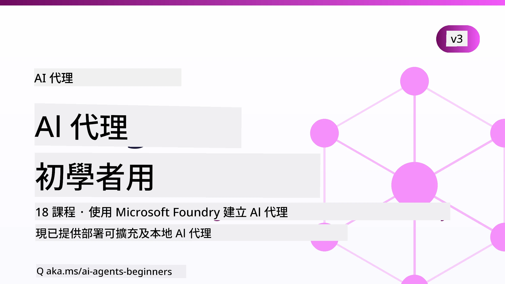

# AI Agents for Beginners - 課程



## 教授如何開始構建 AI Agents 的一切知識的課程

[](https://github.com/microsoft/ai-agents-for-beginners/blob/master/LICENSE?WT.mc_id=academic-105485-koreyst)
[](https://GitHub.com/microsoft/ai-agents-for-beginners/graphs/contributors/?WT.mc_id=academic-105485-koreyst)
[](https://GitHub.com/microsoft/ai-agents-for-beginners/issues/?WT.mc_id=academic-105485-koreyst)
[](https://GitHub.com/microsoft/ai-agents-for-beginners/pulls/?WT.mc_id=academic-105485-koreyst)
[](http://makeapullrequest.com?WT.mc_id=academic-105485-koreyst)

### 🌐 多語言支援

#### 透過 GitHub Action 支援（自動化且始終保持最新）

<!-- CO-OP TRANSLATOR LANGUAGES TABLE START -->
[Arabic](../ar/README.md) | [Bengali](../bn/README.md) | [Bulgarian](../bg/README.md) | [Burmese (Myanmar)](../my/README.md) | [Chinese (Simplified)](../zh-CN/README.md) | [Chinese (Traditional, Hong Kong)](../zh-HK/README.md) | [Chinese (Traditional, Macau)](./README.md) | [Chinese (Traditional, Taiwan)](../zh-TW/README.md) | [Croatian](../hr/README.md) | [Czech](../cs/README.md) | [Danish](../da/README.md) | [Dutch](../nl/README.md) | [Estonian](../et/README.md) | [Finnish](../fi/README.md) | [French](../fr/README.md) | [German](../de/README.md) | [Greek](../el/README.md) | [Hebrew](../he/README.md) | [Hindi](../hi/README.md) | [Hungarian](../hu/README.md) | [Indonesian](../id/README.md) | [Italian](../it/README.md) | [Japanese](../ja/README.md) | [Kannada](../kn/README.md) | [Khmer](../km/README.md) | [Korean](../ko/README.md) | [Lithuanian](../lt/README.md) | [Malay](../ms/README.md) | [Malayalam](../ml/README.md) | [Marathi](../mr/README.md) | [Nepali](../ne/README.md) | [Nigerian Pidgin](../pcm/README.md) | [Norwegian](../no/README.md) | [Persian (Farsi)](../fa/README.md) | [Polish](../pl/README.md) | [Portuguese (Brazil)](../pt-BR/README.md) | [Portuguese (Portugal)](../pt-PT/README.md) | [Punjabi (Gurmukhi)](../pa/README.md) | [Romanian](../ro/README.md) | [Russian](../ru/README.md) | [Serbian (Cyrillic)](../sr/README.md) | [Slovak](../sk/README.md) | [Slovenian](../sl/README.md) | [Spanish](../es/README.md) | [Swahili](../sw/README.md) | [Swedish](../sv/README.md) | [Tagalog (Filipino)](../tl/README.md) | [Tamil](../ta/README.md) | [Telugu](../te/README.md) | [Thai](../th/README.md) | [Turkish](../tr/README.md) | [Ukrainian](../uk/README.md) | [Urdu](../ur/README.md) | [Vietnamese](../vi/README.md)

> **想要本地複製？**
>
> 本存儲庫包含超過 50 種語言翻譯，會顯著增加下載大小。若想下載無翻譯版本，請使用 sparse checkout：
>
> **Bash / macOS / Linux：**
> ```bash
> git clone --filter=blob:none --sparse https://github.com/microsoft/ai-agents-for-beginners.git
> cd ai-agents-for-beginners
> git sparse-checkout set --no-cone '/*' '!translations' '!translated_images'
> ```
>
> **CMD (Windows)：**
> ```cmd
> git clone --filter=blob:none --sparse https://github.com/microsoft/ai-agents-for-beginners.git
> cd ai-agents-for-beginners
> git sparse-checkout set --no-cone "/*" "!translations" "!translated_images"
> ```
>
> 這樣你會得到完成課程所需的一切，且下載速度會快得多。
<!-- CO-OP TRANSLATOR LANGUAGES TABLE END -->

**如果您希望支援更多翻譯語言，請參閱[此處](https://github.com/Azure/co-op-translator/blob/main/getting_started/supported-languages.md)。**

[](https://GitHub.com/microsoft/ai-agents-for-beginners/watchers/?WT.mc_id=academic-105485-koreyst)
[](https://GitHub.com/microsoft/ai-agents-for-beginners/network/?WT.mc_id=academic-105485-koreyst)
[](https://GitHub.com/microsoft/ai-agents-for-beginners/stargazers/?WT.mc_id=academic-105485-koreyst)

[](https://discord.com/invite/ATgtXmAS5D)


## 🌱 開始使用

本課程包含關於建立 AI Agents 基礎的課程。每堂課都涵蓋獨立主題，可按喜好開始！

本課程支援多語言。請前往我們的[可用語言這裡](#-multi-language-support)。

如果您是首次使用生成式 AI 模型構建，請參考我們的[生成式 AI 初學者](https://aka.ms/genai-beginners)課程，包含 21 節課教授如何使用 GenAI。

別忘了給這個 repo [點星 (🌟)](https://docs.github.com/en/get-started/exploring-projects-on-github/saving-repositories-with-stars?WT.mc_id=academic-105485-koreyst) 並 [fork 這個 repo](https://github.com/microsoft/ai-agents-for-beginners/fork)來運行程式碼。

### 認識其他學習者，解決你的疑問

如果卡住或有任何有關建立 AI Agents 的問題，請加入我們的專用 Discord 頻道，在 [Microsoft Foundry Discord](https://aka.ms/ai-agents/discord)。

### 你需要準備什麼

本課程的每堂課包含程式碼範例，可以在 code_samples 文件夾中找到。你可以[fork 這個 repo](https://github.com/microsoft/ai-agents-for-beginners/fork)來建立自己的副本。

這些練習的程式碼範例使用 Microsoft Agent Framework 及 Microsoft Foundry Agent Service V2：

- [Microsoft Foundry](https://aka.ms/ai-agents-beginners/ai-foundry) - 需要 Azure 帳戶

本課程使用下列 Microsoft 的 AI Agent 框架和服務：

- [Microsoft Agent Framework (MAF)](https://aka.ms/ai-agents-beginners/agent-framework)
- [Microsoft Foundry Agent Service V2](https://aka.ms/ai-agents-beginners/ai-agent-service)

部分程式碼範例也支援其他相容 OpenAI 的供應商，比如提供大容量上下文模型（高達 204K 代幣）的 [MiniMax](https://platform.minimaxi.com/)。詳情請參閱[課程設定](./00-course-setup/README.md)。

想了解更多如何運行本課程程式碼，請參閱[課程設定](./00-course-setup/README.md)。

## 🙏 想要幫忙嗎？

有建議或發現拼字或程式碼錯誤嗎？請[提出 issue](https://github.com/microsoft/ai-agents-for-beginners/issues?WT.mc_id=academic-105485-koreyst)或[發起 pull request](https://github.com/microsoft/ai-agents-for-beginners/pulls?WT.mc_id=academic-105485-koreyst)


## 📂 每堂課包括

- README 中文書面課程和短片教學
- 使用 Microsoft Agent Framework 和 Microsoft Foundry 的 Python 程式碼範例
- 額外資源連結，持續你的學習


## 🗃️ 課程清單

| <strong>課程</strong>                                    | <strong>書面及程式碼</strong>                                   | <strong>影片</strong>                                                   | <strong>額外學習</strong>                                                                             |
|----------------------------------------------|----------------------------------------------------|------------------------------------------------------------|----------------------------------------------------------------------------------------|
| AI Agents 和 Agent 使用案例簡介              | [連結](./01-intro-to-ai-agents/README.md)           | [影片](https://youtu.be/3zgm60bXmQk?si=z8QygFvYQv-9WtO1)   | [連結](https://aka.ms/ai-agents-beginners/collection?WT.mc_id=academic-105485-koreyst)   |
| 探索 AI Agentic 框架                         | [連結](./02-explore-agentic-frameworks/README.md)   | [影片](https://youtu.be/ODwF-EZo_O8?si=Vawth4hzVaHv-u0H)   | [連結](https://aka.ms/ai-agents-beginners/collection?WT.mc_id=academic-105485-koreyst)   |
| 理解 AI Agentic 設計模式                     | [連結](./03-agentic-design-patterns/README.md)      | [影片](https://youtu.be/m9lM8qqoOEA?si=BIzHwzstTPL8o9GF)   | [連結](https://aka.ms/ai-agents-beginners/collection?WT.mc_id=academic-105485-koreyst)   |
| 工具使用設計模式                             | [連結](./04-tool-use/README.md)                       | [影片](https://youtu.be/vieRiPRx-gI?si=2z6O2Xu2cu_Jz46N)    | [連結](https://aka.ms/ai-agents-beginners/collection?WT.mc_id=academic-105485-koreyst)   |
| Agentic RAG                                  | [連結](./05-agentic-rag/README.md)                    | [影片](https://youtu.be/WcjAARvdL7I?si=gKPWsQpKiIlDH9A3)    | [連結](https://aka.ms/ai-agents-beginners/collection?WT.mc_id=academic-105485-koreyst)   |
| 建立可信任的 AI Agents                       | [連結](./06-building-trustworthy-agents/README.md)   | [影片](https://youtu.be/iZKkMEGBCUQ?si=jZjpiMnGFOE9L8OK )   | [連結](https://aka.ms/ai-agents-beginners/collection?WT.mc_id=academic-105485-koreyst)   |
| 規劃設計模式                                 | [連結](./07-planning-design/README.md)                | [影片](https://youtu.be/kPfJ2BrBCMY?si=6SC_iv_E5-mzucnC)    | [連結](https://aka.ms/ai-agents-beginners/collection?WT.mc_id=academic-105485-koreyst)   |
| 多代理設計模式                               | [連結](./08-multi-agent/README.md)                    | [影片](https://youtu.be/V6HpE9hZEx0?si=rMgDhEu7wXo2uo6g)    | [連結](https://aka.ms/ai-agents-beginners/collection?WT.mc_id=academic-105485-koreyst)   |

| 反思設計模式                             | [連結](./09-metacognition/README.md)               | [影片](https://youtu.be/His9R6gw6Ec?si=8gck6vvdSNCt6OcF)  | [連結](https://aka.ms/ai-agents-beginners/collection?WT.mc_id=academic-105485-koreyst) |
| 產線中的 AI 代理                          | [連結](./10-ai-agents-production/README.md)        | [影片](https://youtu.be/l4TP6IyJxmQ?si=31dnhexRo6yLRJDl)  | [連結](https://aka.ms/ai-agents-beginners/collection?WT.mc_id=academic-105485-koreyst) |
| 使用 Agentic 協議 (MCP、A2A 及 NLWeb)    | [連結](./11-agentic-protocols/README.md)           | [影片](https://youtu.be/X-Dh9R3Opn8)                                 | [連結](https://aka.ms/ai-agents-beginners/collection?WT.mc_id=academic-105485-koreyst) |
| AI 代理的上下文工程                      | [連結](./12-context-engineering/README.md)         | [影片](https://youtu.be/F5zqRV7gEag)                                 | [連結](https://aka.ms/ai-agents-beginners/collection?WT.mc_id=academic-105485-koreyst) |
| 管理 Agentic 記憶                        | [連結](./13-agent-memory/README.md)     |      [影片](https://youtu.be/QrYbHesIxpw?si=vZkVwKrQ4ieCcIPx)                                                      |                                                                                        |
| 探索 Microsoft Agent Framework            | [連結](./14-microsoft-agent-framework/README.md)                            |                                                            |                                                                                        |
| 建立電腦使用代理 (CUA)                    | [連結](./15-browser-use/README.md)     |                                                            | [連結](https://docs.browser-use.com/examples/templates/playwright-integration)         |
| 部署可擴展代理                           | [連結](./16-deploying-scalable-agents/README.md) |                                                    | [連結](https://learn.microsoft.com/azure/ai-foundry/agents/overview)                   |
| 建立本地 AI 代理                         | [連結](./17-creating-local-ai-agents/README.md)  |                                                    | [連結](https://learn.microsoft.com/azure/ai-foundry/foundry-local/)                    |
| AI 代理安全保護                         | [連結](./18-securing-ai-agents/README.md)  |                                                            | [連結](https://aka.ms/ai-agents-beginners/collection?WT.mc_id=academic-105485-koreyst) |

## 🎒 其他課程

我們團隊還有其他課程！歡迎瀏覽：

<!-- CO-OP TRANSLATOR OTHER COURSES START -->
### LangChain
[](https://aka.ms/langchain4j-for-beginners)
[](https://aka.ms/langchainjs-for-beginners?WT.mc_id=m365-94501-dwahlin)
[](https://github.com/microsoft/langchain-for-beginners?WT.mc_id=m365-94501-dwahlin)
---

### Azure / Edge / MCP / 代理
[](https://github.com/microsoft/AZD-for-beginners?WT.mc_id=academic-105485-koreyst)
[](https://github.com/microsoft/edgeai-for-beginners?WT.mc_id=academic-105485-koreyst)
[](https://github.com/microsoft/mcp-for-beginners?WT.mc_id=academic-105485-koreyst)
[](https://github.com/microsoft/ai-agents-for-beginners?WT.mc_id=academic-105485-koreyst)

---
 
### 生成式 AI 系列
[](https://github.com/microsoft/generative-ai-for-beginners?WT.mc_id=academic-105485-koreyst)
[-9333EA?style=for-the-badge&labelColor=E5E7EB&color=9333EA)](https://github.com/microsoft/Generative-AI-for-beginners-dotnet?WT.mc_id=academic-105485-koreyst)
[-C084FC?style=for-the-badge&labelColor=E5E7EB&color=C084FC)](https://github.com/microsoft/generative-ai-for-beginners-java?WT.mc_id=academic-105485-koreyst)
[-E879F9?style=for-the-badge&labelColor=E5E7EB&color=E879F9)](https://github.com/microsoft/generative-ai-with-javascript?WT.mc_id=academic-105485-koreyst)

---
 
### 核心學習
[](https://aka.ms/ml-beginners?WT.mc_id=academic-105485-koreyst)
[](https://aka.ms/datascience-beginners?WT.mc_id=academic-105485-koreyst)
[](https://aka.ms/ai-beginners?WT.mc_id=academic-105485-koreyst)
[](https://github.com/microsoft/Security-101?WT.mc_id=academic-96948-sayoung)
[](https://aka.ms/webdev-beginners?WT.mc_id=academic-105485-koreyst)
[](https://aka.ms/iot-beginners?WT.mc_id=academic-105485-koreyst)
[](https://github.com/microsoft/xr-development-for-beginners?WT.mc_id=academic-105485-koreyst)

---
 
### Copilot 系列
[](https://aka.ms/GitHubCopilotAI?WT.mc_id=academic-105485-koreyst)
[](https://github.com/microsoft/mastering-github-copilot-for-dotnet-csharp-developers?WT.mc_id=academic-105485-koreyst)
[](https://github.com/microsoft/CopilotAdventures?WT.mc_id=academic-105485-koreyst)
<!-- CO-OP TRANSLATOR OTHER COURSES END -->

## 🌟 社群感謝

感謝 [Shivam Goyal](https://www.linkedin.com/in/shivam2003/) 貢獻示範 Agentic RAG 的重要程式碼範例。

## 貢獻方式

此專案歡迎貢獻與建議。大多數貢獻需要您同意
貢獻者授權協議 (Contributor License Agreement, CLA)，宣告您有權且確實授權我們
使用您的貢獻。詳情請見 <https://cla.opensource.microsoft.com>。

當您提交拉取請求時，CLA 機器人會自動判斷您是否需要提供
CLA 並適當地標記 PR（例如，狀態檢查、留言）。請依照機器人指示操作。
整個過程您只需執行一次，適用於所有使用本 CLA 的儲存庫。

本專案已採用 [Microsoft 開放原始碼行為準則](https://opensource.microsoft.com/codeofconduct/)。
如需更多信息，請參閱 [行為準則常見問答](https://opensource.microsoft.com/codeofconduct/faq/) 或
聯絡 [opencode@microsoft.com](mailto:opencode@microsoft.com) 以取得其他問題或建議。

## 商標

本專案可能包含專案、產品或服務的商標或標誌。授權使用 Microsoft
商標或標誌須遵守
[Microsoft 商標與品牌指南](https://www.microsoft.com/legal/intellectualproperty/trademarks/usage/general)。
在本專案修改版本中使用 Microsoft 商標或標誌，不能造成混淆或暗示微軟背書。
第三方商標或標誌之使用，須遵循該等第三方政策。

## 尋求協助


如果您遇到困難或對建置 AI 應用有任何疑問，歡迎加入：

[](https://aka.ms/foundry/discord)

若您在建置過程中有產品意見或錯誤，請造訪：

[](https://aka.ms/foundry/forum)

---

<!-- CO-OP TRANSLATOR DISCLAIMER START -->
**免責聲明**：
本文件使用 AI 翻譯服務 [Co-op Translator](https://github.com/Azure/co-op-translator) 進行翻譯。雖然我們力求準確，但請注意，自動翻譯可能包含錯誤或不準確之處。原始文件的母語版本應被視為權威來源。對於重要資訊，建議尋求專業人工翻譯。我們不對因使用本翻譯而引起的任何誤解或曲解承擔責任。
<!-- CO-OP TRANSLATOR DISCLAIMER END -->