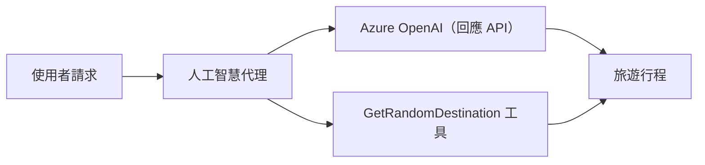

# 🌍 使用 Microsoft Agent Framework (.NET) 的 AI 旅遊代理

## 📋 情境概述

此範例展示如何使用 Microsoft Agent Framework for .NET 建立智能旅遊規劃代理。該代理能自動生成全球各地隨機目的地的個人化一日遊行程。

### 主要功能：

- 🎲 <strong>隨機目的地選擇</strong>：使用自訂工具挑選度假景點
- 🗺️ <strong>智能行程規劃</strong>：建立詳細的每日行程
- 🔄 <strong>實時串流</strong>：支援即時和串流回應
- 🛠️ <strong>自訂工具整合</strong>：演示擴充代理功能的方法

## 🔧 技術架構

### 核心技術

- **Microsoft Agent Framework**：最新的 .NET AI 代理開發框架
- **Azure OpenAI (Responses API)**：使用 Azure OpenAI Responses API 進行模型推理
- **Azure Identity**：透過 `AzureCliCredential` (`az login`) 安全登入
- <strong>安全配置</strong>：基於環境的端點管理

### 主要組件

1. **AIAgent**：主要代理協調者，負責對話流程
2. <strong>自訂工具</strong>：`GetRandomDestination()` 函式可供代理使用
3. **Responses Client**：基於 Azure OpenAI Responses 的對話介面
4. <strong>串流支援</strong>：即時回應生成能力

### 整合模式



## 🚀 快速開始

### 先決條件

- [.NET 10 SDK](https://dotnet.microsoft.com/download/dotnet/10.0) 或更高版本
- 具備 Azure OpenAI 資源與模型部署的 [Azure 訂閱](https://azure.microsoft.com/free/)
- [Azure CLI](https://learn.microsoft.com/cli/azure/install-azure-cli) — 使用 `az login` 登入

### 必要環境變數

```bash
# zsh/bash
export AZURE_OPENAI_ENDPOINT=https://<your-resource>.openai.azure.com
export AZURE_OPENAI_DEPLOYMENT=gpt-5-mini
# 然後登入，讓 AzureCliCredential 能取得權杖
az login
```

```powershell
# PowerShell
$env:AZURE_OPENAI_ENDPOINT = "https://<your-resource>.openai.azure.com"
$env:AZURE_OPENAI_DEPLOYMENT = "gpt-5-mini"
# 然後登入以便 AzureCliCredential 可以取得令牌
az login
```

### 範例程式碼

要執行程式碼範例，

```bash
# zsh/bash
chmod +x ./01-dotnet-agent-framework.cs
./01-dotnet-agent-framework.cs
```

或使用 dotnet CLI：

```bash
dotnet run ./01-dotnet-agent-framework.cs
```

完整程式碼請參見 [`01-dotnet-agent-framework.cs`](../../../../01-intro-to-ai-agents/code_samples/01-dotnet-agent-framework.cs)。

```csharp
#!/usr/bin/dotnet run

#:package Microsoft.Extensions.AI@10.4.1
#:package Microsoft.Agents.AI.OpenAI@1.1.0
#:package Azure.AI.OpenAI@2.1.0
#:package Azure.Identity@1.13.1

using System.ComponentModel;

using Microsoft.Agents.AI;
using Microsoft.Extensions.AI;

using Azure.AI.OpenAI;
using Azure.Identity;

// Tool Function: Random Destination Generator
// This static method will be available to the agent as a callable tool
// The [Description] attribute helps the AI understand when to use this function
// This demonstrates how to create custom tools for AI agents
[Description("Provides a random vacation destination.")]
static string GetRandomDestination()
{
    // List of popular vacation destinations around the world
    // The agent will randomly select from these options
    var destinations = new List<string>
    {
        "Paris, France",
        "Tokyo, Japan",
        "New York City, USA",
        "Sydney, Australia",
        "Rome, Italy",
        "Barcelona, Spain",
        "Cape Town, South Africa",
        "Rio de Janeiro, Brazil",
        "Bangkok, Thailand",
        "Vancouver, Canada"
    };

    // Generate random index and return selected destination
    // Uses System.Random for simple random selection
    var random = new Random();
    int index = random.Next(destinations.Count);
    return destinations[index];
}

// Azure OpenAI with the Responses API (stable v1 endpoint). Sign in with `az login`.
var azureEndpoint = Environment.GetEnvironmentVariable("AZURE_OPENAI_ENDPOINT")
    ?? throw new InvalidOperationException("AZURE_OPENAI_ENDPOINT is not set.");
var deployment = Environment.GetEnvironmentVariable("AZURE_OPENAI_DEPLOYMENT") ?? "gpt-5-mini";

var azureClient = new AzureOpenAIClient(new Uri(azureEndpoint), new AzureCliCredential());

// Create AI Agent with Travel Planning Capabilities
// Get the Responses client for the specified deployment and create the AI agent
// Configure agent with travel planning instructions and random destination tool
// The agent can now plan trips using the GetRandomDestination function
AIAgent agent = azureClient
    .GetChatClient(deployment)
    .AsAIAgent(
        instructions: "You are a helpful AI Agent that can help plan vacations for customers at random destinations",
        tools: [AIFunctionFactory.Create(GetRandomDestination)]
    );

// Execute Agent: Plan a Day Trip
// Run the agent with streaming enabled for real-time response display
// Shows the agent's thinking and response as it generates the content
// Provides better user experience with immediate feedback
await foreach (var update in agent.RunStreamingAsync("Plan me a day trip"))
{
    await Task.Delay(10);
    Console.Write(update);
}
```

## 🎓 重要學習重點

1. <strong>代理架構</strong>：Microsoft Agent Framework 提供了在 .NET 上建構 AI 代理的清晰且型別安全的方法
2. <strong>工具整合</strong>：使用 `[Description]` 屬性標記的函式會成為代理可用的工具
3. <strong>配置管理</strong>：環境變數和安全憑證處理符合 .NET 最佳實踐
4. **Azure OpenAI Responses API**：代理透過 Azure.AI.OpenAI SDK 使用 Azure OpenAI Responses API

## 🔗 其他資源

- [Microsoft Agent Framework 文件](https://learn.microsoft.com/agent-framework)
- [Microsoft Foundry 的 Azure OpenAI](https://learn.microsoft.com/azure/ai-services/openai/)
- [Microsoft.Extensions.AI](https://learn.microsoft.com/dotnet/ai/microsoft-extensions-ai)
- [.NET 單一檔案應用程式](https://devblogs.microsoft.com/dotnet/announcing-dotnet-run-app)

---

<!-- CO-OP TRANSLATOR DISCLAIMER START -->
**免責聲明**：
此文件已使用 AI 翻譯服務 [Co-op Translator](https://github.com/Azure/co-op-translator) 進行翻譯。雖然我們努力追求準確性，但請注意自動翻譯可能包含錯誤或不準確之處。原始文件的母語版本應視為權威來源。對於關鍵資訊，建議採用專業人工翻譯。我們不對因使用此翻譯所產生的任何誤解或誤譯承擔責任。
<!-- CO-OP TRANSLATOR DISCLAIMER END -->