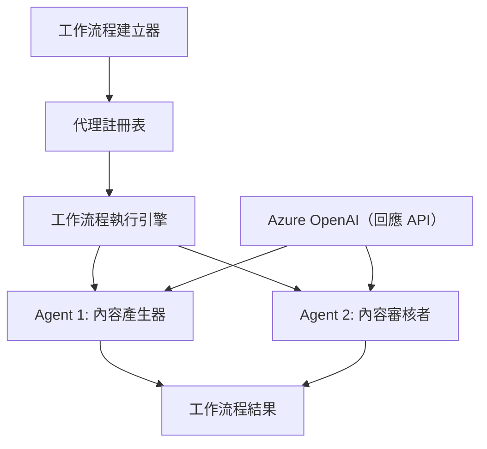

# 🔄 使用 Azure OpenAI (Responses API) 的基本代理工作流程 (.NET)

## 📋 工作流程協作教學

本筆記本展示如何使用 Microsoft Agent Framework for .NET 及 Azure OpenAI (Responses API) 建立複雜的 <strong>代理工作流程</strong>。您將學習創建多步驟的商業流程，讓 AI 代理通過結構化的協作模式共同完成複雜任務。

## 🎯 學習目標

### 🏗️ <strong>工作流程架構基礎</strong>
- <strong>工作流程建構器</strong>：設計並協調複雜的多步驟 AI 流程
- <strong>代理協調</strong>：在工作流程中協調多個專業代理
- **Azure OpenAI (Responses API)**：在工作流程中運用 Azure OpenAI Responses API
- <strong>視覺化工作流程設計</strong>：創建並可視化工作流程結構以增強理解

### 🔄 <strong>流程協作模式</strong>
- <strong>序列處理</strong>：依邏輯順序串聯多個代理任務
- <strong>狀態管理</strong>：維持流程階段的上下文與資料流
- <strong>錯誤處理</strong>：實現穩健的錯誤復原與流程韌性
- <strong>效能優化</strong>：設計企業級運營的高效流程

### 🏢 <strong>企業工作流程應用</strong>
- <strong>商業流程自動化</strong>：自動化複雜的組織流程
- <strong>內容生產流程</strong>：含審核與批准階段的編輯流程
- <strong>客戶服務自動化</strong>：多步驟客戶詢問解決流程
- <strong>資料處理工作流程</strong>：結合 AI 驅動轉換的 ETL 流程

## ⚙️ 先決條件與設定

### 📦 **必要的 NuGet 套件**

本工作流程示範使用以下幾個關鍵的 .NET 套件：

```xml
<!-- Core AI Framework -->
<PackageReference Include="Microsoft.Extensions.AI" Version="10.*" />

<!-- Azure OpenAI (Responses API) -->
<PackageReference Include="Azure.AI.OpenAI" Version="2.1.0" />
<PackageReference Include="Azure.Identity" Version="1.15.0" />

<!-- Agent Framework (Local Development) -->
<!-- Microsoft.Agents.AI.dll - Core agent abstractions -->
<!-- Microsoft.Agents.AI.OpenAI.dll - Azure OpenAI (Responses API) integration -->

<!-- Configuration and Environment -->
<PackageReference Include="DotNetEnv" Version="3.1.1" />
```

### 🔑 **Azure OpenAI 配置**

**環境設定 (.env 檔案)：**
```env
AZURE_OPENAI_ENDPOINT=https://<your-resource>.openai.azure.com
AZURE_OPENAI_DEPLOYMENT=gpt-5-mini
```

**Azure OpenAI 存取：**
1. 在 Azure 入口網站建立 Azure OpenAI 資源
2. 部署模型（例如 `gpt-5-mini`）並記下部署名稱
3. 使用 `az login` 登入並依上述設定環境變數

### 🏗️ <strong>工作流程架構總覽</strong>



**主要組件：**
- **WorkflowBuilder**：設計工作流程的主要協調引擎
- **AIAgent**：具備特定能力的個別專業代理
- **Azure OpenAI Client**：Azure OpenAI Responses API 整合
- <strong>執行上下文</strong>：管理工作流程階段間的狀態與資料流

## 🎨 <strong>企業工作流程設計模式</strong>

### 📝 <strong>內容生產工作流程</strong>
```
User Request → Content Generation → Quality Review → Final Output
```

### 🔍 <strong>文件處理管線</strong>
```
Document Input → Analysis → Extraction → Validation → Structured Output
```

### 💼 <strong>商業智能工作流程</strong>
```
Data Collection → Processing → Analysis → Report Generation → Distribution
```

### 🤝 <strong>客戶服務自動化</strong>
```
Customer Inquiry → Classification → Processing → Response Generation → Follow-up
```

## 🏢 <strong>企業效益</strong>

### 🎯 <strong>可靠性與可擴展性</strong>
- <strong>確定性執行</strong>：一致且可重複的工作流程結果
- <strong>錯誤復原</strong>：各流程階段失敗時的優雅處理
- <strong>效能監控</strong>：追蹤執行指標和優化機會
- <strong>資源管理</strong>：高效配置與利用 AI 模型資源

### 🔒 <strong>安全性與合規性</strong>
- <strong>安全驗證</strong>：藉由 `az login` (AzureCliCredential) 實現 Microsoft Entra ID 驗證
- <strong>稽核追蹤</strong>：完整記錄工作流程執行與決策點
- <strong>存取控制</strong>：細膩的工作流程執行與監控權限管理
- <strong>資料隱私</strong>：工作流程全程安全處理敏感資訊

### 📊 <strong>可觀察性與管理</strong>
- <strong>視覺化工作流程設計</strong>：清晰呈現流程流向與相依關係
- <strong>執行監控</strong>：即時追蹤工作流程進度與效能
- <strong>錯誤報告</strong>：詳盡的錯誤分析與除錯能力
- <strong>效能分析</strong>：指標用於優化與容量規劃

讓我們開始構建您的第一個企業級 AI 工作流程！🚀

## 💻 執行程式碼

完整範例實作位於 `01.dotnet-agent-framework-workflow-ghmodel-basic.cs`。此檔示範：

1. <strong>環境配置</strong> - 從 `.env` 檔載入 Azure OpenAI 設定
2. **Azure OpenAI 客戶端設定** - 配置客戶端以使用 Azure OpenAI Responses API
3. <strong>代理建立</strong> - 定義專業代理（櫃檯與服務員）
4. <strong>工作流程建構器</strong> - 建立具有序列處理的多代理工作流程
5. <strong>工作流程執行</strong> - 執行工作流程並串流輸出結果

### 🚀 執行範例

```bash
# 使腳本可執行（Unix/Linux/macOS）
chmod +x 01.dotnet-agent-framework-workflow-ghmodel-basic.cs

# 執行工作流程
./01.dotnet-agent-framework-workflow-ghmodel-basic.cs
```

或在 Windows 上：
```powershell
dotnet run 01.dotnet-agent-framework-workflow-ghmodel-basic.cs
```

### 📝 預期輸出

工作流程將：
1. 接受您的旅遊目的地請求（「我想去巴黎」）
2. 櫃檯代理提供初步建議
3. 服務員代理審查並精煉建議
4. 最終輸出顯示完整對話串流

### 🔧 自訂化

您可以通過以下方式自訂工作流程：
- 修改代理指令以改變其行為
- 新增更多代理以建立複雜的多步驟工作流程
- 更改使用者訊息以測試不同情境
- 調整工作流程邊緣以建立不同執行模式

---

<!-- CO-OP TRANSLATOR DISCLAIMER START -->
**免責聲明**：
此文件已使用 AI 翻譯服務 [Co-op Translator](https://github.com/Azure/co-op-translator) 進行翻譯。雖然我們努力追求準確性，但請注意自動翻譯可能包含錯誤或不準確之處。原始文件的母語版本應視為權威來源。對於關鍵資訊，建議採用專業人工翻譯。我們不對因使用此翻譯所產生的任何誤解或誤譯承擔責任。
<!-- CO-OP TRANSLATOR DISCLAIMER END -->