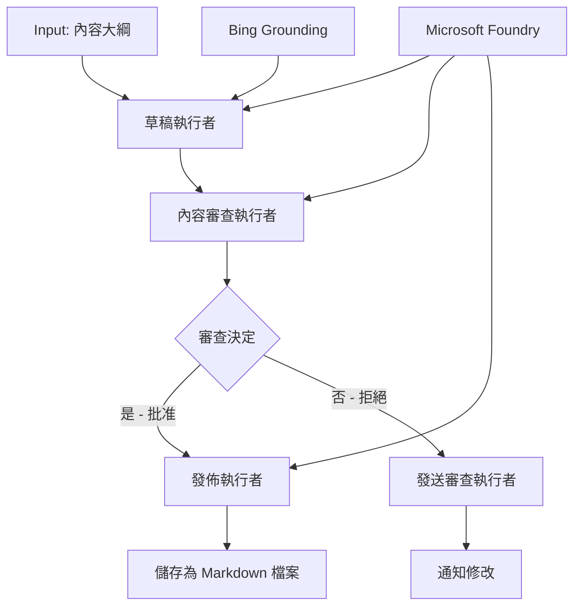

# 🔀 使用 Microsoft Foundry (.NET) 的條件代理工作流程

## 📋 智能決策導向工作流程教學

本筆記本示範如何使用 Microsoft Foundry 與 .NET 的 Microsoft Agent Framework 實作<strong>條件工作流程模式</strong>。您將學會如何建立複雜、決策驅動的工作流程，根據 AI 分析、商業規則及動態條件智能地引導處理，打造企業級自動化。

## 🎯 學習目標

### 🧠 <strong>智能決策架構</strong>
- <strong>條件邏輯實作</strong>：建立多重分支點的複雜決策樹
- **AI驅動路由**：使用 Microsoft Foundry 模型做智能路由決策
- <strong>動態工作流程調整</strong>：根據執行時分析與條件修改工作流程行為
- <strong>企業規則整合</strong>：將商業邏輯與合規需求納入工作流程

### 🔀 <strong>進階條件模式</strong>
- <strong>多標準決策制定</strong>：評估多項因素進行路由決策
- <strong>情境感知處理</strong>：根據累積的工作流程上下文與歷史做決策
- <strong>自適應工作流程修改</strong>：根據即時狀況動態調整處理路徑
- <strong>規則引擎整合</strong>：在工作流程中實作複雜商業規則引擎

### 🏢 <strong>企業條件應用</strong>
- <strong>文件分類與路由</strong>：自動將文件分類並導向適當工作流程
- <strong>客戶服務分流</strong>：智能將客戶詢問路由到專門處理團隊
- <strong>合規與風險處理</strong>：根據風險評估套用不同驗證與審查流程
- <strong>品管工作流程</strong>：根據品質指標引導內容通過適當審查流程

## ⚙️ 前置需求與設定

### 📦 **必要的 NuGet 套件**

用於條件工作流程處理的進階套件：

```xml
<!-- Core AI Framework -->
<PackageReference Include="Microsoft.Extensions.AI" Version="9.9.0" />

<!-- Azure AI Agents with Persistent State -->
<PackageReference Include="Azure.AI.Agents.Persistent" Version="1.2.0-beta.5" />

<!-- Azure Identity and Utilities -->
<PackageReference Include="Azure.Identity" Version="1.15.0" />
<PackageReference Include="System.Linq.Async" Version="6.0.3" />
<PackageReference Include="DotNetEnv" Version="3.1.1" />

<!-- Local Workflow Framework References -->
<!-- Microsoft.Agents.Workflows.dll - Advanced workflow orchestration -->
<!-- Microsoft.Agents.AI.AzureAI.dll - Microsoft Foundry integration -->
<!-- Microsoft.Agents.AI.dll - Core agent abstractions -->
```

### 🔑 **Microsoft Foundry 設定**

**必要 Azure 資源：**
- 具條件處理模型的 Microsoft Foundry 工作區
- 具適當運算額度與權限的 Azure 訂閱
- 用於決策與內容分析的已部署 AI 模型
- （選用）Bing Search API 連線以提供基礎資訊

**環境設定 (.env 檔案)：**
```env
# Microsoft Foundry Configuration
AZURE_AI_PROJECT_ENDPOINT=https://your-project.cognitiveservices.azure.com/
BING_CONNECTION_ID=your-bing-connection-id
```

**身份驗證設定：**
```csharp
// Azure CLI or Managed Identity authentication
using Azure.Identity;
var credential = new AzureCliCredential();

// Load environment configuration
DotNetEnv.Env.Load("../../../.env");
```

### 🏗️ <strong>條件工作流程架構</strong>



**主要元件：**
- **Draft Executor**：從大綱建立初稿內容的 AI 代理
- **Content Review Executor**：評估初稿品質與合規性的 AI 代理
- **Conditional Routing**：依據審查結果做路由決策的邏輯
- **Publish/Review Paths**：核准與拒絕內容的不同處理路徑
- **State Management**：維持內容與審查上下文於工作流程中

## 🎨 <strong>條件工作流程設計模式</strong>

### 📋 <strong>帶品質門檻的內容生產</strong>
```
Outline → Draft Creation → Quality Review → {Approve: Publish | Reject: Revise}
```

### 🎯 <strong>基於風險的文件處理</strong>
```
Document → Risk Assessment → {Low: Standard | High: Enhanced Review}
```

### 🔍 <strong>智能客戶服務路由</strong>
```
Customer Query → Analysis → {Simple: FAQ Bot | Complex: Human Agent}
```

### 💼 <strong>合規驅動工作流程</strong>
```
Content → Compliance Check → {Pass: Publish | Fail: Legal Review}
```

## 🏢 <strong>企業條件優勢</strong>

### 🎯 <strong>智能自動化</strong>
- <strong>智能決策制定</strong>：基於內容分析與情境的 AI 驅動路由決策
- <strong>自適應處理</strong>：根據變化的條件自動調整工作流程
- <strong>商規執行</strong>：自動套用複雜商業邏輯與政策
- <strong>情境感知路由</strong>：基於完整工作流程歷史與累積上下文做決策

### 📈 <strong>營運卓越</strong>
- <strong>優化資源分配</strong>：將工作路由給最合適的專家和流程
- <strong>減少人工介入</strong>：自動決策降低人工路由需求
- <strong>加速問題解決</strong>：直接導向適當專業與處理能力
- <strong>一致性應用</strong>：統一執行商業規則與決策標準

### 🛡️ <strong>風險管理與合規</strong>
- <strong>自動化風險評估</strong>：AI 驅動內容與情境風險層級評估
- <strong>合規執行</strong>：自動導向必須的法規流程
- <strong>安全協議應用</strong>：根據風險評估強化安全措施
- <strong>審計軌跡維護</strong>：完整記錄路由決策與理由

### 📊 <strong>分析與持續改進</strong>
- <strong>決策分析</strong>：追蹤路由決策的效果與準確度
- <strong>模式識別</strong>：辨識路由決策的趨勢與模式
- <strong>效能優化</strong>：持續改進決策標準與路由效率
- <strong>商業智慧</strong>：洞察內容特性與處理需求

### 🔧 <strong>技術卓越</strong>
- <strong>持久狀態管理</strong>：維持工作流程執行中的複雜狀態
- <strong>可擴展架構</strong>：應付高流量條件處理需求
- <strong>整合能力</strong>：與現有商業系統及流程無縫整合
- <strong>監控與可觀察性</strong>：全面追蹤工作流程效能與決策

讓我們用 .NET 一起打造智能、決策驅動的企業工作流程吧！🚀

## 💻 執行程式碼

完整實作位於 `04.dotnet-agent-framework-workflow-aifoundry-condition.cs`，展示了<strong>帶品質門檻的內容生產工作流程</strong>：

### 🏗️ <strong>工作流程架構</strong>

```
Content Outline → Draft Creation → Quality Review → Conditional Routing:
                                                      ├─ Approved (>200 words) → Publish
                                                      └─ Rejected (<200 words) → Review Notification
```

**流程中的代理：**
1. **Evangelist Agent**：使用 Bing 基礎資訊從大綱建立教學草稿
2. **Content Reviewer Agent**：評估草稿品質（字數、完整性）
3. **Publisher Agent**：將核准內容儲存為加時戳的 Markdown 檔案

**自訂執行者：**
1. **DraftExecutor**：協調草稿建立
2. **ContentReviewExecutor**：執行品質評估
3. **PublishExecutor**：處理核准內容發布
4. **SendReviewExecutor**：管理拒絕內容通知

### 🚀 執行範例

**前置條件：**
- 已設定好的 Microsoft Foundry 工作區
- Azure CLI 身份驗證（`az login`）
- （選用）Bing Search 的基礎資訊連線

```bash
# 使腳本可執行（Unix/Linux/macOS）
chmod +x 04.dotnet-agent-framework-workflow-aifoundry-condition.cs

# 執行條件流程
./04.dotnet-agent-framework-workflow-aifoundry-condition.cs
```

或在 Windows 上：
```powershell
dotnet run 04.dotnet-agent-framework-workflow-aifoundry-condition.cs
```

### 📝 預期輸出

工作流程將會：
1. <strong>建立代理</strong>：初始化三個專門的 Microsoft Foundry 代理
2. <strong>產出草稿</strong>：Evangelist 代理從大綱建立教學草稿
3. <strong>審查內容</strong>：Content Reviewer 評估草稿品質
4. <strong>條件路由</strong>：
   - **若核准（>200 字）**：Publish Executor 將內容存為 Markdown 檔案
   - **若拒絕（<200 字）**：發送審查通知
5. <strong>顯示結果</strong>：呈現最終工作流程成果

### 🔧 自訂選項

**修改審查條件：**
```csharp
const string ContentReviewerInstructions = @"
You are a content reviewer...
1. Check if content is more than 500 words (instead of 200)
2. Verify technical accuracy
3. Ensure proper formatting
...";
```

**新增更多條件路徑：**
```csharp
var workflow = new WorkflowBuilder(draftExecutor)
    .AddEdge(draftExecutor, contentReviewerExecutor)
    .AddEdge(contentReviewerExecutor, publishExecutor, condition: GetCondition("Excellent"))
    .AddEdge(contentReviewerExecutor, editExecutor, condition: GetCondition("Good"))
    .AddEdge(contentReviewerExecutor, sendReviewerExecutor, condition: GetCondition("Poor"))
    .Build();
```

**變更內容需求：**
```csharp
string OUTLINE_Content = @"
# Your Custom Topic
## Section 1
https://your-reference-url
## Section 2
...
";
```

### 🎯 實務應用

此條件工作流程模式適合：
- <strong>內容管理系統</strong>：具品質門檻的自動編輯工作流程
- <strong>文件處理</strong>：根據分類與合規性路由文件
- <strong>客戶支援</strong>：根據複雜度與緊急性智能分派工單
- <strong>法律審查</strong>：依風險評估與合約價值路由合約
- <strong>人資流程</strong>：將申請依適當篩選工作流程分流

### 🔍 理解條件邏輯

**條件函式：**
```csharp
public Func<object?, bool> GetCondition(string expectedResult) =>
    reviewResult => reviewResult is ReviewResult review && review.Result == expectedResult;
```

此函式建立一個謂詞：
1. 檢查結果是否為 `ReviewResult` 類型
2. 比較 `Result` 屬性與預期值
3. 回傳 true/false 以決定路由

**帶條件的工作流程邊界：**
```csharp
.AddEdge(contentReviewerExecutor, publishExecutor, condition: GetCondition("Yes"))
.AddEdge(contentReviewerExecutor, sendReviewerExecutor, condition: GetCondition("No"))
```

### 📊 進階功能

**JSON Schema 驗證：**
工作流程使用 JSON schema 確保回應結構正確：

```csharp
// Define response structure
public class ReviewResult
{
    [JsonPropertyName("review_result")]
    public string Result { get; set; } = string.Empty;
    
    [JsonPropertyName("reason")]
    public string Reason { get; set; } = string.Empty;
    
    [JsonPropertyName("draft_content")]
    public string DraftContent { get; set; } = string.Empty;
}

// Apply to agent
ResponseFormat = ChatResponseFormat.ForJsonSchema(
    AIJsonUtilities.CreateJsonSchema(typeof(ReviewResult)), 
    "ReviewResult", 
    "Review Result From DraftContent"
)
```

**Bing 基礎資訊整合：**
Evangelist 代理使用 Bing 基礎資訊存取即時資訊：

```csharp
var bingGroundingConfig = new BingGroundingSearchConfiguration(bing_conn_id);
BingGroundingToolDefinition bingGroundingTool = new(
    new BingGroundingSearchToolParameters([bingGroundingConfig])
);
```

這使代理能追蹤大綱中的 URL 並擷取當前資訊。

### 🛡️ 錯誤處理

工作流程包含完善的拒絕內容錯誤處理：
- 審查失敗時觸發替代路徑
- 通知提供清楚的拒絕理由
- 保留內容供後續修訂

### 🔄 擴充工作流程

**新增修訂迴圈：**
建立反饋迴圈自動重寫內容：

```csharp
.AddEdge(contentReviewerExecutor, publishExecutor, condition: GetCondition("Yes"))
.AddEdge(contentReviewerExecutor, draftExecutor, condition: GetCondition("No")) // Loop back
```

**實作多階段審查：**
增加多個審查階段，並設不同標準：

```csharp
.AddEdge(draftExecutor, technicalReviewer)
.AddEdge(technicalReviewer, editorialReviewer, condition: GetCondition("TechPass"))
.AddEdge(editorialReviewer, publishExecutor, condition: GetCondition("EditPass"))
```

此條件工作流程模式為構建先進智能企業自動化系統奠定基礎！🚀

---

<!-- CO-OP TRANSLATOR DISCLAIMER START -->
**免責聲明**：
此文件已使用 AI 翻譯服務 [Co-op Translator](https://github.com/Azure/co-op-translator) 進行翻譯。雖然我們努力追求準確性，但請注意自動翻譯可能包含錯誤或不準確之處。原始文件的母語版本應視為權威來源。對於關鍵資訊，建議採用專業人工翻譯。我們不對因使用此翻譯所產生的任何誤解或誤譯承擔責任。
<!-- CO-OP TRANSLATOR DISCLAIMER END -->