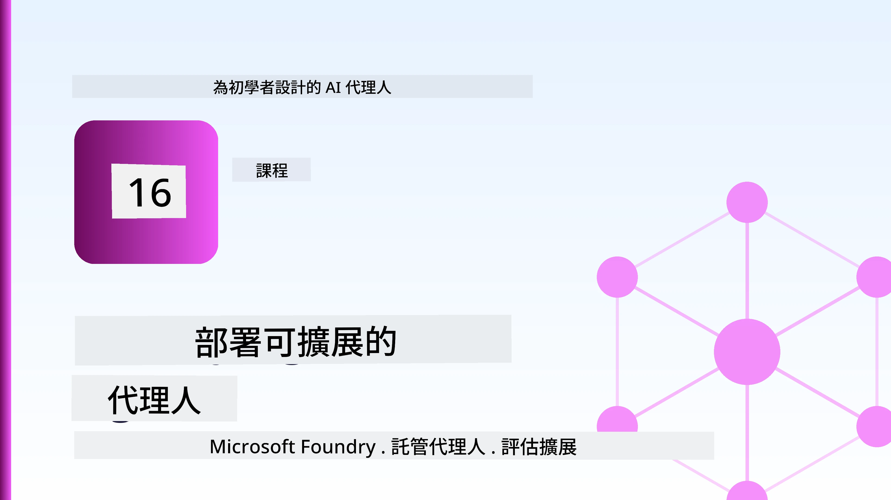
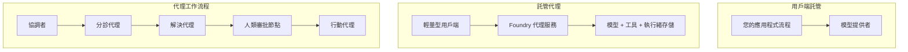
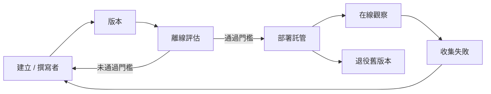
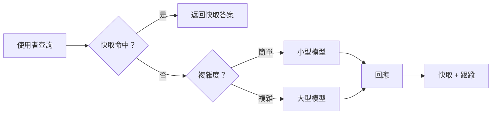
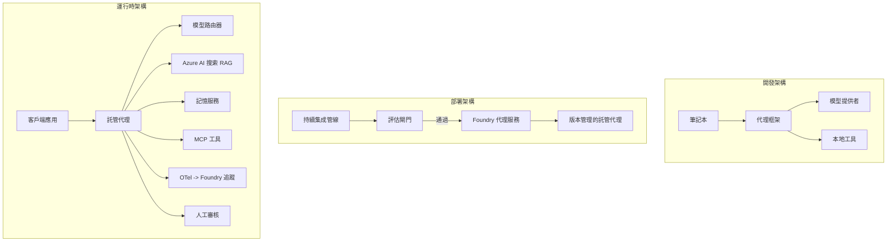

# 使用 Microsoft Foundry 部署可擴展代理



到目前為止，您已經建立了在筆記本電腦上運行的代理，在筆記本內，透過 `az login` 和一些環境變數驅動。這正是學習的正確方式。然而，這不是讓成千上萬客戶在凌晨三點依賴的代理運行的正確方式。

本課程討論從「在我機器上運作」到「在生產環境中可靠且經濟地運作」之間的差距。我們將使用 **Microsoft Foundry** 和 **Microsoft Foundry Agent Service** 來彌合這個差距，並透過構建一個具備工具、檢索、記憶、評估及監控的真實客服代理來實現。

## 介紹

本課程將涵蓋：

- <strong>原型代理</strong> 與 <strong>部署代理</strong> 的差異，以及為何轉變主要關乎模型周邊的所有事物。
- 代理的 <strong>部署模式</strong>：用戶端託管、服務託管（託管代理）和工作流程協調。
- Microsoft Foundry 上的 <strong>代理生命週期</strong> — 建立、版本管理、部署、評估、觀察、退役。
- <strong>擴展策略</strong>：模型路由、快取、並發性及無狀態設計。
- 使用 OpenTelemetry 及 Foundry 跟蹤的 <strong>可觀察性</strong>。
- 透過模型選擇、路由及評估檢查點的 <strong>成本優化</strong>。
- <strong>企業考量</strong>：治理、人為審核及在生產環境中安全運行 MCP 伺服器。

## 學習目標

完成本課程後，您將能夠：

- 根據代理工作負載選擇合適的部署模式。
- 將代理部署到 Microsoft Foundry Agent Service，使其版本管理、治理並具備可觀察性。
- 為代理加入追蹤記錄並連接評估流程，每次釋出前執行。
- 應用模型路由與快取，保持延遲和成本可控且具擴展性。
- 為高風險動作新增人為審核門檻，並以生產安全方式整合 MCP 伺服器。

## 前置需求

本課程假設您已完成先前課程，並熟悉：

- 使用 [Microsoft Agent Framework](../14-microsoft-agent-framework/README.md) 建立代理（課程 14）。
- [工具使用](../04-tool-use/README.md)（課程 4）及 [Agentic RAG](../05-agentic-rag/README.md)（課程 5）。
- [代理記憶體](../13-agent-memory/README.md)（課程 13）及 [Agentic Protocols / MCP](../11-agentic-protocols/README.md)（課程 11）。
- [可觀察性及評估](../10-ai-agents-production/README.md)（課程 10）— 本課程直接建立於此基礎。

您還需要：

- 一個 **Azure 訂閱** 及一個至少部署一個聊天模型的 **Microsoft Foundry 專案**。
- 已驗證的 **Azure CLI**（使用 `az login`）。
- Python 3.12+ 及本專案中的 [`requirements.txt`](../../../requirements.txt) 套件。

## 從原型到生產：實際變化

原型代理與生產代理共享相同的核心迴圈 — 推理、呼叫工具、回應。不同的是該迴圈之外的所有周邊事物。模型可能只佔生產代理的 20%；其餘 80% 是操作骨架。

| 關注點 | 原型 | 生產 |
| --- | --- | --- |
| <strong>託管環境</strong> | 在您的筆記本執行 | 作為託管服務執行，有版本及滾動釋出管理 |
| <strong>身份識別</strong> | 使用您的 `az login` 令牌 | 使用具範圍 RBAC 管理的託管身份 |
| <strong>狀態管理</strong> | 記憶體中，重新啟動即遺失 | 外部化（線程存儲、記憶服務） |
| <strong>故障處理</strong> | 您看到錯誤追蹤 | 重試、備援、死信隊列、警示 |
| <strong>成本</strong> | “幾分錢” | 逐請求追蹤、路由、快取、預算控制 |
| <strong>品質</strong> | 您人工檢視輸出 | 於每次釋出前自動評估 |
| <strong>信任</strong> | 您審核每個動作 | 針對風險動作，政策與人為介入審核 |

請記住上表。下方每個章節對應表格中的一行。

## 代理部署模式

有三種模式，通常會組合使用。

### 1. 用戶端託管代理

代理物件存在於<em>您的</em>應用程序進程中。程式直接呼叫模型提供者；推理迴圈運行在您的服務中。這是前面所有課程所採用的方式。

- <strong>適用時機</strong>：您需要完全控制推理迴圈、自訂中介軟體，或將代理嵌入既有後端時。
- <strong>取捨</strong>：您需自行負責擴展、狀態及韌性。

### 2. 託管代理（Foundry Agent Service）

代理<em>註冊為 Microsoft Foundry 的資源</em>。Foundry 承擔推理迴圈、線程存儲、內容安全及 RBAC，並讓代理可在 Foundry 入口網站中查看。您的應用程式變成輕量客戶端，建立線程並讀取回應。

- <strong>適用時機</strong>：需要持久性、內建可觀察性、治理與較少操作面積時。
- <strong>取捨</strong>：較少低階控制，但獲得受管執行時環境。

### 3. 代理工作流程

多個代理（及工具）組合成一個具有明確控制流程的圖譜 — 順序步驟、分支、人為審核節點及可暫停／繼續的持久性檢查點。這是部署規模上應用的 Microsoft Agent Framework <strong>工作流程</strong> 功能。

- <strong>適用時機</strong>：單一任務涉及多個專業代理或需要中間審核流程時。
- <strong>取捨</strong>：更多組件，需要編排級別的可觀察性。



## Microsoft Foundry 上的代理生命週期

部署代理不是一次性 `push`。它是個迴圈，且看起來非常像軟體發行週期，因為它本質就是如此。



這個重點來自於 [課程 10](../10-ai-agents-production/README.md)：**離線評估是一道閘門，而非事後思考。** 新代理版本如果未通過評估閾值，就不會上線。線上可觀察性回傳真實世界失效案例到離線測試集，形成完整迴圈。

## 擴展策略

擴展代理不同於擴展無狀態 Web API，因為每個請求可觸發多次昂貴的模型及工具呼叫。以下四種技術承擔大部分負載。

**無狀態請求處理。** 不在進程記憶體保留每個用戶狀態。將對話線程存於 Foundry 線程存儲或記憶服務，使任一實例皆可處理任一請求。此法支持水平擴展 — 增加實例數量，不需黏性會話。

**模型路由。** 不需每次請求都使用功能最強（同時最昂貴）模型。將簡單請求 — 意圖分類、簡短事實性回答 — 路由至小型快速模型，大型模型保留給真正的推理任務。Foundry 的 <strong>模型路由器</strong> 可協助此作業，您亦可自行實作輕量分類器。實驗室將帶您建立自行版。

**回應快取。** 多數客服查詢近似重複（像是「如何重設密碼？」）。快取常見問題答案，直接回應，完全不必觸及模型。即使是適度的快取命中率也能有效降低成本與延遲。

**並發與背壓。** 模型供應商有限速。限制您的並發數，使用指數退避重試，並優雅失敗（排隊「我們正在處理」回應優於 500 錯誤）。



## 生產環境的可觀察性

未看見即無法操作。如課程 10 所述，Microsoft Agent Framework 原生發出 **OpenTelemetry** 跟蹤 — 每次模型呼叫、工具呼叫及協調步驟皆成為 span。在生產中，您將這些 span 匯出至 Microsoft Foundry（或任何 OTel 相容後端），以便：

- 端到端追蹤單個客戶抱怨，涵蓋每次模型及工具呼叫。
- 觀察請求的 p50/p95 延遲與成本趨勢。
- 在用戶（或財務團隊）注意到之前，對錯誤率激增與成本異常發出警示。

```python
from agent_framework.observability import get_tracer

tracer = get_tracer()

with tracer.start_as_current_span("support_request") as span:
    span.set_attribute("customer.tier", "enterprise")
    span.set_attribute("routed.model", "gpt-4.1-mini")
    # 代理執行會自動在此區塊內追蹤
```

像 `customer.tier` 與 `routed.model` 這樣的屬性，讓大量追蹤資料化身為可解答的問題（「企業客戶是否過度被路由到小模型？」）。

## 成本優化

生產代理成本主要由代幣數量決定。三大槓桿，依影響力排序：

1. **合適規模的模型。** 通過你的評估閘門的小型模型，幾乎總是比通過並且更大的模型便宜。利用評估證明小型模型足夠，而非出於保守選擇最大模型。
2. **依複雜度路由。** 如上所述 — 只對需要大型模型推理的請求支付大型模型費用。
3. **積極快取。** 最便宜的模型呼叫是永遠不必呼叫的。

評估門檻與成本控制是從兩個角度看同一門學問：評估告訴你<em>品質底線</em>，路由及快取保持您盡可能接近該底線的<em>成本</em>。

## 企業部署考量

**治理。** 託管代理繼承 Foundry 的 RBAC、內容安全及稽核日誌。賦予每個代理恰當的最小權限管理身份 — 只讀知識庫、對工單 API 有限存取，無其他權限。

**人為介入。** 某些行動影響重大，不能完全自動化 — 例如退款、刪除帳戶、升級至法務團隊。Microsoft Agent Framework 支援 <strong>審核必須</strong> 工具：代理提出行動建議，中止執行，待人類審核通過或拒絕後流程繼續。您已在 [課程 6](../06-building-trustworthy-agents/README.md) 見過此原語，現在部署它。

**生產中的 MCP。** [MCP](../11-agentic-protocols/README.md) 讓代理透過標準介面使用外部工具。生產中，將每個 MCP 伺服器視為不受信任邊界：鎖定伺服器版本、以範圍身份執行、驗證其輸出，且永不向其揭露秘密。MCP 伺服器屬於依賴項，而依賴項需進行補丁、安全稽核及速率限制。



這三張圖 — 開發、部署、運行時 — 分別代表同一代理生命的三個階段。接下來的實作實驗室將手把手帶您完成。

## 實作實驗室：生產就緒的客服代理

開啟 [`code_samples/16-python-agent-framework.ipynb`](./code_samples/16-python-agent-framework.ipynb)，從頭到尾完成。您將組裝一個具備所有生產關注點的 **Contoso 客服代理**：

1. <strong>工具呼叫</strong> — 查詢訂單狀態及開啟客訴工單。
2. **RAG** — 從知識庫回答政策問題（使用 Azure AI Search，並提供記憶體備援，使筆記本可在無 Search 資源時執行）。
3. <strong>記憶</strong> — 跨多輪對話記住客戶資訊。
4. <strong>模型路由</strong> — 複雜度分類器將每個請求路由至小型或大型模型。
5. <strong>回應快取</strong> — 重複問題直接從快取回應。
6. <strong>人為審核</strong> — 超過門檻的退款需人員簽核。
7. <strong>評估流程</strong> — 利用小規模離線測試集評分代理，作為釋出門檻。
8. <strong>可觀察性</strong> — 每次請求環繞OpenTelemetry追蹤。

### 操作導覽

筆記本以每個生產關注點為獨立可執行章節組織。核心是路由加快取的請求處理程式：

```python
async def handle_support_request(query: str, customer_id: str) -> str:
    # 1. 盡可能從快取提供。
    cached = response_cache.get(normalize(query))
    if cached:
        return cached

    # 2. 依複雜度路由以控制成本。
    model = "gpt-4.1-mini" if is_simple(query) else "gpt-4.1"

    # 3. 在追蹤區段內執行代理以利觀察。
    with tracer.start_as_current_span("support_request") as span:
        span.set_attribute("routed.model", model)
        span.set_attribute("customer.id", customer_id)
        response = await support_agent.run(query, model=model)

    # 4. 快取並回傳。
    response_cache.set(normalize(query), response.text)
    return response.text
```

釋出前守護的評估門檻如下：

```python
async def evaluation_gate(agent, test_cases, threshold: float = 0.8) -> bool:
    passed = 0
    for case in test_cases:
        result = await agent.run(case["input"])
        if score_response(result.text, case["expected"]) >= 0.8:
            passed += 1
    pass_rate = passed / len(test_cases)
    print(f"Evaluation pass rate: {pass_rate:.0%} (gate: {threshold:.0%})")
    return pass_rate >= threshold  # 僅當門檻通過時才部署
```

細讀每行程式碼 — 筆記本故意使原語小型，避免任何東西隱藏在框架呼叫後面。

## 使用煙霧測試驗證部署代理

上述評估門檻是對代理物件的<em>離線</em>檢測。代理一旦作為託管代理部署，還需再進一步、成本更低的檢查：**部署的端點真的有回應嗎？**

「部署成功」只證明控制平面接受定義 — 不保證代理回應正常。缺少依賴、模型路由不當或連線逾期都可能造成綠燈部署卻無回應。<strong>煙霧測試</strong>能在數秒內、於每次部署時捕捉此狀況，成本遠低於完整評估。

本專案提供即用型煙霧測試管線，基於 [AI Smoke Test](https://github.com/marketplace/actions/ai-smoke-test) GitHub Action：

- <strong>目錄</strong> — [`tests/lesson-16-smoke-tests.json`](../../../tests/lesson-16-smoke-tests.json) 包含 Contoso 支援代理的提示句及斷言（有底層政策回答、訂單查詢、保持主題及多輪對話連續性）。其他課程代理的目錄也並存於此。詳見 [`tests/README.md`](../tests/README.md)。
- <strong>工作流程</strong> — [`.github/workflows/smoke-test.yml`](../../../.github/workflows/smoke-test.yml) 使用 Azure OIDC 登入，將每個提示 POST 至代理的 Responses 端點，任何斷言錯誤即使作業失敗。

```yaml
- name: Smoke-test hosted agent
  uses: JFolberth/ai-smoketest@v1
  with:
    project_endpoint: ${{ inputs.project_endpoint }}
    agent_name: ContosoSupportAgent
    tests_file: tests/lesson-16-smoke-tests.json
```


從 **Actions** 索引標籤啟動它，一旦您的代理部署完成，並提供您的 Foundry 專案端點和代理名稱。聯邦身份需要在 Foundry 專案範圍內具有 **Azure AI User** 角色。將層級想像成一座金字塔：煙霧測試（可連線且有回應嗎？）在每次部署時執行，離線評估（足夠好可以發佈嗎？）在升級前執行，線上評估（在實際應用中表現如何？）則持續執行。

## 知識檢查

在進入作業前測試您的理解。

**1. 大約多少比例的生產代理是「模型」，其他部分又是什麼？**

<details>
<summary>答案</summary>

模型只佔系統的一小部分 — 通常約 20%。其餘是操作骨架：主機與版本控制、身份與 RBAC、外部狀態、錯誤處理、成本追蹤、評估與人機介入控制。推向生產主要是在推理迴圈 <em>周圍</em> 建構所有這些。
</details>

**2. 何時會選擇托管代理而非客戶端托管代理？**

<details>
<summary>答案</summary>

當您想要一個具備內建持久性（可持續運行且可恢復的執行緒）、可觀察性、內容安全與 RBAC 的託管執行環境，且願意用較少的推理迴圈底層控制來換取較少的操作維護面時。需要完全控制迴圈或將代理整合入現有後端時，則較適合使用客戶端托管方式。
</details>

**3. 為什麼可擴展代理必須在自身進程記憶體中是無狀態的？**

<details>
<summary>答案</summary>

這樣任何執行個體都可以處理任何請求，這就是讓水平擴展不需黏著會話的關鍵。每位用戶的對話狀態被外部化至執行緒存儲或記憶體服務。如果狀態存在於進程記憶體中，重新啟動時會遺失，且無法自由分配負載。
</details>

**4. 模型路由解決了什麼問題，與評估又有何關係？**

<details>
<summary>答案</summary>

路由會將簡單請求送到小、便宜且快速的模型，將大型模型保留給真正推理的部分，控制延遲和成本。它與評估相關，因為評估能 <em>證明</em> 小模型對某類請求足夠好 — 沒有評估的路由就是猜測。
</details>

**5. 什麼是「評估門檻」(evaluation gate)？它在生命週期中佔什麼位置？**

<details>
<summary>答案</summary>

評估門檻會針對新代理版本執行離線測試集，並在通過率未達門檻時阻止部署。它位於生命週期中的「版本」與「部署」之間，使品質成為發佈的前提，而非事後檢查。
</details>

**6. 為什麼 MCP 伺服器在生產環境中應視為不受信任的邊界？**

<details>
<summary>答案</summary>

因為它是代理呼叫的外部依賴。您應該固定其版本、使用具限制身份運行、驗證其輸出、限制其速率，且絕不向它暴露機密 — 這是對第三方依賴所應有的紀律。它的輸出會流入代理的推理，因此不經驗證的信任是安全風險。
</details>

**7. 哪一個單一改變通常對生產代理成本影響最大？為什麼？**

<details>
<summary>答案</summary>

模型規模的合適調整 — 使用仍能通過評估門檻的最小模型。成本主要來自令牌量，且一個符合品質標準的更小模型幾乎總比大模型便宜。快取與路由能進一步降低成本，但選對基礎模型會產生最大一階影響。
</details>

**8. 像 `customer.tier` 與 `routed.model` 這類 span 屬性在可觀察性中扮演什麼角色？**

<details>
<summary>答案</summary>

它們將原始追蹤轉成可回答的商業問題。沒有屬性時，您只有一堆 span 堆積；有了屬性，您可以問「企業客戶是否太常被路由到小模型？」「哪個模型處理我們最慢的請求？」屬性是依照對營運重要的維度切割遙測資料的方式。
</details>

## 作業

以實驗室中的客服代理為基礎並加強為特定場景：**適用於 SaaS 公司的訂閱計費客服代理。**

您的提交應該包含：

1. <strong>將工具替換成與計費相關的</strong>：`get_subscription_status`、`get_invoice` 和 `issue_credit`（超過 $50 的信用需人為核准）。
2. **新增三份 RAG 文件**，涵蓋公司退費政策、計費週期與取消政策。
3. <strong>擴充評估集</strong> 至至少八個案例，其中至少兩個必須觸發人為核准流程，並確認您的評估門檻正確通過或未通過。
4. <strong>新增一份成本報告</strong>：在代理執行十個混合查詢後，列印送到小模型、送到大模型、和從快取服務的次數。

於 markdown 儲存格中撰寫短文說明您選擇的模型路由規則，以及如何用實際流量驗證它。沒有唯一正確答案 — 評量重點在於生產層面的連貫整合。

## 小結

在本課程中，您將代理從原型推向 Microsoft Foundry 上的生產：

- 跳轉生產主要在模型周圍的 <strong>操作骨架</strong> — 包括主機、身份、狀態、錯誤處理、成本、品質及信任。
- 您了解了三種 <strong>部署模式</strong> — 客戶端托管、Hosted Agents 與 Agent Workflows — 以及各自適用時機。
- 您走過了 <strong>代理生命週期</strong>，離線 <strong>評估擔任釋出門檻</strong>，線上可觀察性則將失敗回饋回測試集。
- 您施行了 <strong>擴展策略</strong> — 無狀態設計、模型路由、快取與界限並發，並連結至 <strong>成本優化</strong>。
- 您整合了 <strong>企業控制</strong>：RBAC、人機核准和生產安全的 MCP 整合。
- 您建置了一個 <strong>可投入生產的客服代理</strong>，將所有議題以可執行程式碼串聯。

下一課程走反向路徑：不將代理擴展到雲端，而是將它們<em>縮小</em>至單一開發機器，完全在本地執行。

## 附加資源

- <a href="https://learn.microsoft.com/azure/ai-foundry/what-is-azure-ai-foundry" target="_blank">Microsoft Foundry 文件</a>
- <a href="https://learn.microsoft.com/azure/ai-foundry/agents/overview" target="_blank">Microsoft Foundry 代理服務概述</a>
- <a href="https://aka.ms/ai-agents-beginners/agent-framework" target="_blank">Microsoft Agent Framework</a>
- <a href="https://learn.microsoft.com/azure/ai-foundry/concepts/model-router" target="_blank">Microsoft Foundry 中的模型路由</a>
- <a href="https://learn.microsoft.com/azure/search/search-what-is-azure-search" target="_blank">Azure AI Search</a>
- <a href="https://opentelemetry.io/" target="_blank">OpenTelemetry</a>
- <a href="https://github.com/marketplace/actions/ai-smoke-test" target="_blank">AI Smoke Test GitHub Action</a>
- <a href="https://modelcontextprotocol.io/" target="_blank">Model Context Protocol (MCP)</a>

## 前一課程

[建立計算機使用代理 (CUA)](../15-browser-use/README.md)

## 下一課程

[建立本地 AI 代理](../17-creating-local-ai-agents/README.md)

---

<!-- CO-OP TRANSLATOR DISCLAIMER START -->
**免責聲明**：
此文件已使用 AI 翻譯服務 [Co-op Translator](https://github.com/Azure/co-op-translator) 進行翻譯。雖然我們努力追求準確性，但請注意自動翻譯可能包含錯誤或不準確之處。原始文件的母語版本應視為權威來源。對於關鍵資訊，建議採用專業人工翻譯。我們不對因使用此翻譯所產生的任何誤解或誤譯承擔責任。
<!-- CO-OP TRANSLATOR DISCLAIMER END -->