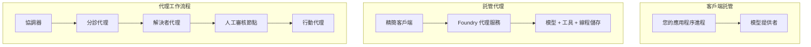
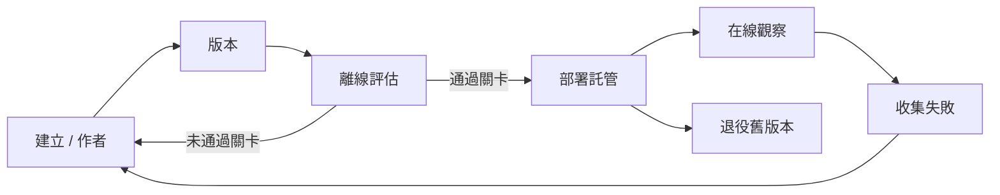
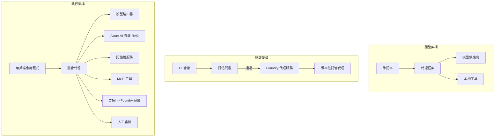

# 使用 Microsoft Foundry 部署可擴展代理


到目前為止，你已經建構了在你的筆記型電腦上運行的代理，透過筆記本內執行，使用 `az login` 及少數環境變數來驅動。這確實是學習的正確方式。但這並不是讓數千用戶凌晨 3 點依賴的代理運行的正確方式。

本課程講授「在我機器上可用」和「在生產環境中可靠且實惠地可用」之間的差距。我們將使用 **Microsoft Foundry** 和 **Microsoft Foundry Agent Service** 來縮小這個差距，並透過構建具有工具調用、檢索、記憶、評估和監控功能的真實客戶支援代理來實現。

## 簡介

本課程將涵蓋：

- <strong>原型代理</strong>與<strong>部署代理</strong>的差異，以及為何過渡主要關乎模型<em>周邊</em>的一切。
- 代理的 <strong>部署模式</strong>: 用戶端託管、服務託管（託管代理）和工作流程編排。
- Microsoft Foundry 上的 <strong>代理生命週期</strong> — 建立、版本、部署、評估、觀察、退役。
- <strong>擴展策略</strong>：模型路由、快取、併發、無狀態設計。
- 使用 OpenTelemetry 和 Foundry 跟蹤的 <strong>可觀察性</strong>。
- 透過模型選擇、路由和評估門檻實現的 <strong>成本優化</strong>。
- <strong>企業考量</strong>：治理、人工作業批准，以及在生產環境中安全運行 MCP 服務器。

## 學習目標

完成本課程後，你將會瞭解如何：

- 為特定代理工作負載選擇合適的部署模式。
- 將代理部署至 Microsoft Foundry Agent Service，使其具備版本控制、治理與可觀察性。
- 為代理加入追蹤儀表，並連接每次發佈前執行的評估程序。
- 應用模型路由和快取，以維持大規模時的延遲與成本可控。
- 對高風險操作設置人工作業批准門檻，並以生產安全的方式整合 MCP 服務器。

## 先決條件

本課程假設你已完成先前課程並對以下內容熟悉：

- 使用 [Microsoft Agent Framework](../14-microsoft-agent-framework/README.md) 建構代理（第14課）。
- [工具使用](../04-tool-use/README.md)（第4課）和 [Agentic RAG](../05-agentic-rag/README.md)（第5課）。
- [Agent 記憶](../13-agent-memory/README.md)（第13課）和 [Agentic 協議 / MCP](../11-agentic-protocols/README.md)（第11課）。
- [可觀察性與評估](../10-ai-agents-production/README.md)（第10課）— 本課程直接建立在此基礎上。

你還需要：

- 一個 **Azure 訂閱** 和一個包含至少一個部署聊天室模型的 **Microsoft Foundry 專案**。
- 已認證的 **Azure CLI** (`az login`)。
- Python 3.12+ 及本存放庫中的 [`requirements.txt`](../../../requirements.txt) 內套件。

## 從原型到生產：究竟改變了什麼

原型代理和生產代理共享相同的核心循環 — 推理、呼叫工具、回應。改變的是包裹該循環的所有周邊。模型約佔生產代理的20%；其餘80%是操作骨架。

| 關注點 | 原型 | 生產 |
| --- | --- | --- |
| <strong>託管方式</strong> | 運行於你的筆記本中 | 作為託管服務運行，具版本控制與分批推出 |
| <strong>身份</strong> | 你的 `az login` 令牌 | 具範圍 RBAC 的受管理身份 |
| <strong>狀態</strong> | 記憶體內，重啟時消失 | 外部化（線程存儲、記憶服務） |
| <strong>故障</strong> | 你看到追蹤堆疊 | 重試、後備、死信、警告 |
| <strong>成本</strong> | 「只有幾分錢」 | 按請求計費，路由，快取，預算控管 |
| <strong>品質</strong> | 你目視輸出 | 每次發佈前自動評估 |
| <strong>信任</strong> | 你批准每個行動 | 風險操作有政策 + 人工審核介入 |

請記住本表格。以下每個章節都對應到其中一行。

## 代理部署模式

你將使用三種模式，且經常組合使用。

### 1. 用戶端託管代理

代理物件在<em>你的</em>應用程序進程內。你的代碼直接呼叫模型提供者；推理循環在你的服務中运行。這就是之前所有課程所示範的方式。

- <strong>使用情況</strong>：當你需要完全控制循環、自訂中介軟體或將代理嵌入現有後端時使用。
- <strong>權衡</strong>：你自己管理擴展、狀態和彈性。

### 2. 託管代理（Foundry Agent Service）

代理被<em>註冊為 Microsoft Foundry 中的資源</em>。Foundry 託管推理循環，存儲線程，實施內容安全與 RBAC，並在 Foundry 入口網站中顯示代理。你的應用程序變為輕量用戶端，建立線程並讀取回應。

- <strong>使用情況</strong>：當你需要耐久性、內建可觀察性、治理並且希望減少操作範圍時使用。
- <strong>權衡</strong>：以較少的低階控制權交換受管理執行環境。

### 3. 代理工作流程

多個代理（和工具）被組合為具明確控制流的圖形 — 包含順序步驟、分支、人工作業節點，以及可暫停與恢復的持久化檢查點。這是 Microsoft Agent Framework **Workflows** 功能在部署規模上的應用。

- <strong>使用情況</strong>：當單一任務跨越數個專用代理或需要中途批准時使用。
- <strong>權衡</strong>：更多活動組件；需要編排層級的可觀察性。



## Microsoft Foundry 上的代理生命週期

部署代理不是一次性的 `push` 操作。它是個循環，看起來很像軟體發佈週期，因為它實際上就是那樣。



關鍵概念，延續自 [第10課](../10-ai-agents-production/README.md)：**離線評估是門檻，不是事後補充。** 新代理版本未通過評估門檻前不會發佈。線上可觀察性將真實世界錯誤反饋回離線測試集。這就是整個迴路。

## 擴展策略

代理擴展不同於無狀態的 Web API 擴展，因為每個請求可觸發多次昂貴的模型和工具呼叫。有四種技術承擔主要負載。

**無狀態請求處理。** 不在進程記憶體中保留任何每用戶狀態。請將對話線程持久化到 Foundry 線程存儲或記憶服務，使任何實例都能處理任何請求。這讓你能橫向擴展 — 新增實例，無需黏貼式會話。

**模型路由。** 不必每個請求都用最強大（且最昂貴）的模型。將簡單請求 — 意圖分類、簡短事實查詢 — 路由至小型快模型，保留大型模型給真正推理。Foundry 的 **Model Router** 可以替你做到，或你也可以自己實作輕量分類器。你會在實驗中構建 DIY 版本。

**回應快取。** 很多客服查詢都很類似（「我如何重設密碼？」）。快取常見問題答案，直接提供回應，完全不用碰模型。即使是中度的快取命中率也能明顯降低成本和延遲。

**併發與背壓。** 模型提供者有速率限制。限制併發度，使用指數退避重試，並優雅失敗（排隊回覆「我們正在處理」總比伺服器錯誤好）。


## 生產環境的可觀察性

「看不到就無法運營」。同第10課說明，Microsoft Agent Framework 原生輸出 **OpenTelemetry** 跟蹤 — 每次模型呼叫、工具調用和編排步驟變成一個 tracing span。在生產環境中你將這些 span 匯出到 Microsoft Foundry（或任何 OTel 相容後端），以：

- 全程追蹤單一客戶投訴所經歷的模型和工具呼叫。
- 監控各請求的 p50/p95 延遲和成本隨時間變化。
- 在用戶（或財務部門）發現之前，針對錯誤率激增和成本異常發出警告。

```python
from agent_framework.observability import get_tracer

tracer = get_tracer()

with tracer.start_as_current_span("support_request") as span:
    span.set_attribute("customer.tier", "enterprise")
    span.set_attribute("routed.model", "gpt-5-nano")
    # 程式代理的執行會在此區段中自動追蹤
```

`customer.tier` 與 `routed.model` 這類屬性，能將一堆單純追蹤資料轉化為可回覆的問題（「企業客戶是不是太常被路由到小模型？」）。

## 成本優化

生產代理中的成本主要來自代幣消耗。有三項槓桿，依影響力排序：

1. **選擇合適大小的模型。** 通過評估門檻的小型模型往往比同樣通過的巨型模型更便宜。用評估結果證明小模型足夠，而非保守地選用最大模型。
2. **依複雜度路由。** 路由策略如上——僅對需要大型模型推理的請求付出大模型價格。
3. **積極快取。** 最便宜的模型呼叫是你永遠不必呼叫的那一次。

評估門檻與成本控制是同一門學問的兩面：評估定義<em>品質底線</em>，路由和快取將成本盡量維持在該底線附近。

## 企業部署考量

**治理。** 託管代理繼承 Foundry 的 RBAC、內容安全和審計日誌。給每個代理受管理身份，並授與最低必要權限——知識庫唯讀，票務 API 範圍存取，不多於此。

**人機夾擊。** 某些行為過於重要，不能完全自動化——退款、刪除帳號、法律團隊升級。Microsoft Agent Framework 支援<strong>需要批准</strong>的工具：代理提出操作方案，執行暫停，人工批准或拒絕，工作流程再繼續。你在[第6課](../06-building-trustworthy-agents/README.md)中見過這個原始範例；這裡是正式部署。

**生產中的 MCP。** [MCP](../11-agentic-protocols/README.md) 允許代理通過標準介面消費外部工具。在生產中，將每個 MCP 服務器視作不受信任的邊界：固定服務器版本，以範圍身份執行，驗證其輸出，且永遠不暴露機密。MCP 服務器是一個依賴，所有依賴都要打補丁、審計和速率限制。



這三張圖——開發、部署、運行時——都是該代理生命週期中的不同階段。接下來的實驗室將引導你完成構建。

## 實戰實驗室：準備生產的客戶支援代理

打開 [`code_samples/16-python-agent-framework.ipynb`](./code_samples/16-python-agent-framework.ipynb)，全程手把手操作。你將組裝一個<strong>Contoso 客戶支援代理</strong>，並為所有生產需求佈線:

1. <strong>工具調用</strong> — 查詢訂單狀態及開啟支援票證。
2. **RAG** — 從知識庫回答政策問題（Azure AI Search，並備有記憶體回退方案，讓筆記本可以在無 Search 資源時運行）。
3. <strong>記憶</strong> — 在對話多輪中記住客戶。
4. <strong>模型路由</strong> — 複雜度分類器將每個請求路由至小模型或大模型。
5. <strong>回應快取</strong> — 重複問題從快取提供答案。
6. <strong>人工作業批准</strong> — 超出門檻的退款暫停等待人工批准。
7. <strong>評估管線</strong> — 使用小型離線測試集評分代理並作為發佈門檻。
8. <strong>可觀察性</strong> — 每個請求周圍的 OpenTelemetry 跟蹤。

### 過程導覽

筆記本組織為每個生產需求一個獨立、可執行的區塊。核心是路由加快取的請求處理器：

```python
async def handle_support_request(query: str, customer_id: str) -> str:
    # 1. 盡可能從快取提供服務。
    cached = response_cache.get(normalize(query))
    if cached:
        return cached

    # 2. 根據複雜度來路由以控制成本。
    model = "gpt-5-nano" if is_simple(query) else "gpt-5-mini"

    # 3. 在追蹤範圍內執行代理以便觀察。
    with tracer.start_as_current_span("support_request") as span:
        span.set_attribute("routed.model", model)
        span.set_attribute("customer.id", customer_id)
        response = await support_agent.run(query, model=model)

    # 4. 快取並回傳。
    response_cache.set(normalize(query), response.text)
    return response.text
```

用於守護發佈的評估門檻如下：

```python
async def evaluation_gate(agent, test_cases, threshold: float = 0.8) -> bool:
    passed = 0
    for case in test_cases:
        result = await agent.run(case["input"])
        if score_response(result.text, case["expected"]) >= 0.8:
            passed += 1
    pass_rate = passed / len(test_cases)
    print(f"Evaluation pass rate: {pass_rate:.0%} (gate: {threshold:.0%})")
    return pass_rate >= threshold  # 只有通過閘道才部署
```

詳細閱讀每行——筆記本特意保持原始範例小巧，所有細節不藏於框架調用後面。

## 用煙霧測試驗證已部署代理

上述評估門檻是在<em>離線</em>對你的代理物件進行。代理一旦作為託管代理部署，你還需要一個更便宜的檢查：**部署端點是否真正在回應？**

「成功部署」只證明控制平面接受了定義，卻不代表代理會回應。缺失依賴、錯誤模型路由或連線失效都可能導致綠燈部署卻無回應。<strong>煙霧測試</strong>在數秒內捕捉這情況，每次部署執行且成本遠低於完整評估。

本存放庫提供現成的煙霧測試管線，建立在 [AI Smoke Test](https://github.com/marketplace/actions/ai-smoke-test) GitHub Action 上：

- <strong>目錄</strong> — [`tests/lesson-16-smoke-tests.json`](../../../tests/lesson-16-smoke-tests.json) 包含 Contoso 支援代理的提示與斷言（有基於政策的答案、訂單查詢、專注主題及多輪對話連續性）。其他課程代理的目錄與其並列，參閱 [`tests/README.md`](../tests/README.md)。
- <strong>工作流程</strong> — [`.github/workflows/smoke-test.yml`](../../../.github/workflows/smoke-test.yml) 透過 Azure OIDC 登錄，並向代理的 Responses 端點 POST 每個提示，任一斷言失敗即使作業失敗。

```yaml
- name: Smoke-test hosted agent
  uses: JFolberth/ai-smoketest@v1
  with:
    project_endpoint: ${{ inputs.project_endpoint }}
    agent_name: ContosoSupportAgent
    tests_file: tests/lesson-16-smoke-tests.json
```


在您的代理部署後，從 <strong>操作</strong> 標籤頁執行，並提供您的 Foundry 專案端點與代理名稱。聯邦身份需對 Foundry 專案作用域擁有 **Azure AI User** 角色。將這些層次想像成一個金字塔：煙霧測試（是否可達且有回應？）在每次部署時執行，離線評估（是否足夠好到可以發布？）在升級前執行，線上評估（實際運行狀況如何？）則持續執行。

## 知識檢測

在進入作業前測試您的理解。

**1. 大約生產代理中「模型」佔多大比例，剩下的是什麼？**

<details>
<summary>答案</summary>

模型是系統的少數部分——通常約占 20%。剩下的是運作骨架：主機和版本控制、身份與 RBAC、外部狀態、故障處理、成本追蹤、評估，以及人機介面控制。進入生產主要是建構在推理迴圈 <em>周圍</em> 的所有功能。
</details>

**2. 何時會選擇 Hosted Agent 而非由客戶端託管的代理？**

<details>
<summary>答案</summary>

當您想要一個具備內建耐久性（可持續與恢復的執行緒）、可觀察性、內容安全及 RBAC 的託管運行環境，並願意為了較少的操作面而放棄一些低階的推理迴圈控制時。當您需要完全控制迴圈或將代理嵌入現有後端時，客戶端託管較理想。
</details>

**3. 為什麼可擴展代理必須在其自身程序記憶體中保持無狀態？**

<details>
<summary>答案</summary>

如此任何實例都能處理任何請求，這就是允許水平擴展而無需黏性會話。每個用戶的對話狀態被外部化至執行緒存放或記憶體服務。如果狀態存在程序記憶體，一旦重新啟動就會遺失，且無法自由分配負載。
</details>

**4. 模型路由解決了什麼問題？它與評估有何關聯？**

<details>
<summary>答案</summary>

路由將簡單請求發送至小型、便宜且快速的模型，並保留大型模型處理真正的推理，控制延遲與成本。它與評估相關，因為評估用來<em>證明</em>小模型對某類請求是足夠好的——沒有評估的路由只是猜測。
</details>

**5. 什麼是「評估閘門」，它在生命周期的何處？**

<details>
<summary>答案</summary>

評估閘門在新代理版本上執行離線測試集，並在通過率未達標時阻擋部署。它位於生命周期中的「版本」與「部署」間，使品質成為釋出前的前提條件，而非發佈後才檢查。
</details>

**6. 為什麼 MCP 伺服器在生產環境中應被視為不受信任的邊界？**

<details>
<summary>答案</summary>

因為它是您的代理調用的外部依賴。您應鎖定其版本、以範圍身份執行、驗證輸出、限制速率，且絕不可暴露秘密給它——這是您對任何第三方依賴的相同紀律。其輸出會流入代理推理，未驗證的信任是安全風險。
</details>

**7. 通常哪個單一變更對生產代理成本影響最大？為什麼？**

<details>
<summary>答案</summary>

合理定義模型大小——使用通過評估閘門且最小的模型。成本以代幣量為主，而符合質量標準的較小模型幾乎總比較大的便宜。接著快取與路由可進一步降低成本，但選擇正確基礎模型對成本有最大的一階影響。
</details>

**8. `customer.tier` 和 `routed.model` 這類 span 屬性在可觀察性中扮演什麼角色？**

<details>
<summary>答案</summary>

它們將原始追蹤轉化為可回答的商業問題。沒有屬性，您看到的只是滿牆的 span；有了屬性，您可以問「企業客戶是否過度被路由到小模型？」或者「哪個模型處理我們最慢的請求？」屬性讓您依重要維度切分遙測數據來輔助營運。
</details>

## 作業

以實驗室中的客戶支援代理為基礎，並針對特定場景強化：**SaaS 公司的訂閱計費支援代理。**

您的提交應包含：

1. <strong>替換工具</strong>，採用與計費相關的：`get_subscription_status`、`get_invoice` 與 `issue_credit`（超過 50 美元的信用額需人員核准）。
2. **新增三份 RAG 文件**，涵蓋公司的退款政策、計費週期及取消政策。
3. <strong>擴展評估集</strong> 至至少八個案例，其中至少兩個必須觸發人員核准路徑，並確認評估閘門能正確通過或失敗。
4. <strong>新增一份成本報告</strong>：經由代理執行十次混合查詢後，列印多少次使用小模型、多少次使用大模型，以及多少次來自快取。

撰寫一段簡短摘要（在 markdown 儲存格中），說明您選擇的模型路由規則，以及如何用真實流量驗證它。無單一正確答案，評估重點在生產考量是否彼此銜接合理。

## 總結

本課程中，您將代理從原型推進到 Microsoft Foundry 的生產：

- 進入生產主要是模型周圍的 <strong>操作骨架</strong>——主機、身份、狀態、故障處理、成本、品質與信任。
- 您瞭解了三種 <strong>部署模式</strong>——客戶端託管、Hosted Agents 與 Agent Workflows，及它們適用的時機。
- 您走過了 <strong>代理生命周期</strong>，其中離線<strong>評估作為發佈閘門</strong>，線上可觀察性將失敗反饋回測試集。
- 您應用了 <strong>擴展策略</strong>——無狀態設計、模型路由、快取及範圍並發，並將它們與 <strong>成本優化</strong> 連結。
- 您整合了 <strong>企業管控</strong>：RBAC、人員介入核准、和生產安全的 MCP 集成。
- 您打造了一個 <strong>生產就緒的客戶支援代理</strong>，將所有這些考量整合為可執行代碼。

下一課程將走反方向旅程：您將把代理從雲端向下帶到單一開發者機器，完全本地執行。

## 參考資源

- <a href="https://learn.microsoft.com/azure/ai-foundry/what-is-azure-ai-foundry" target="_blank">Microsoft Foundry 文件</a>
- <a href="https://learn.microsoft.com/azure/ai-foundry/agents/overview" target="_blank">Microsoft Foundry 代理服務概覽</a>
- <a href="https://aka.ms/ai-agents-beginners/agent-framework" target="_blank">Microsoft Agent Framework</a>
- <a href="https://learn.microsoft.com/azure/ai-foundry/concepts/model-router" target="_blank">Microsoft Foundry 的模型路由器</a>
- <a href="https://learn.microsoft.com/azure/search/search-what-is-azure-search" target="_blank">Azure AI 搜索</a>
- <a href="https://opentelemetry.io/" target="_blank">OpenTelemetry</a>
- <a href="https://github.com/marketplace/actions/ai-smoke-test" target="_blank">AI 煙霧測試 GitHub Action</a>
- <a href="https://modelcontextprotocol.io/" target="_blank">模型上下文協定 (MCP)</a>

## 前一課程

[建立電腦使用代理（CUA）](../15-browser-use/README.md)

## 下一課程

[建立本地 AI 代理](../17-creating-local-ai-agents/README.md)

---

<!-- CO-OP TRANSLATOR DISCLAIMER START -->
**免責聲明**：
此文件已使用 AI 翻譯服務 [Co-op Translator](https://github.com/Azure/co-op-translator) 進行翻譯。雖然我們努力追求準確性，但請注意自動翻譯可能包含錯誤或不準確之處。原始文件的母語版本應視為權威來源。對於關鍵資訊，建議採用專業人工翻譯。我們不對因使用此翻譯所產生的任何誤解或誤譯承擔責任。
<!-- CO-OP TRANSLATOR DISCLAIMER END -->