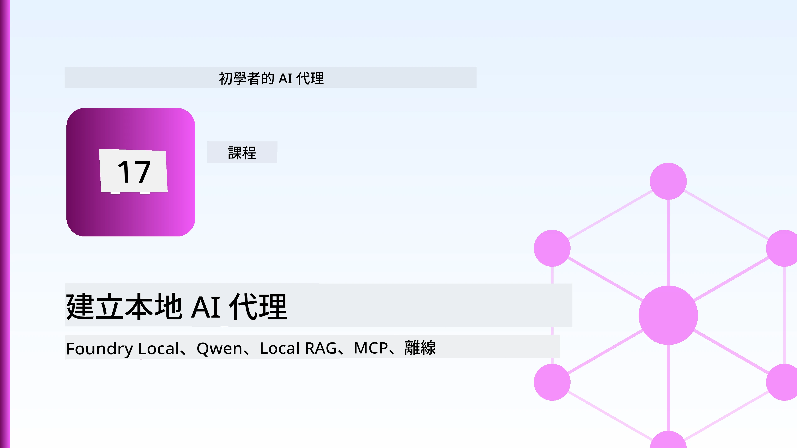
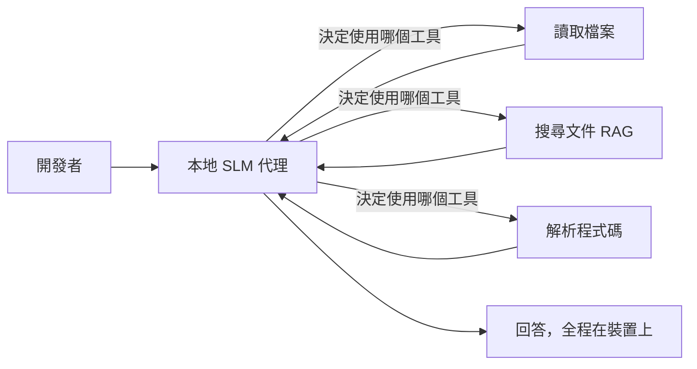
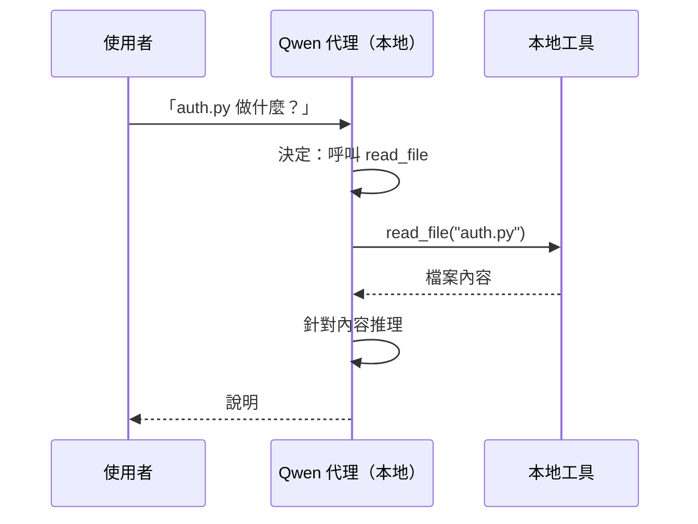
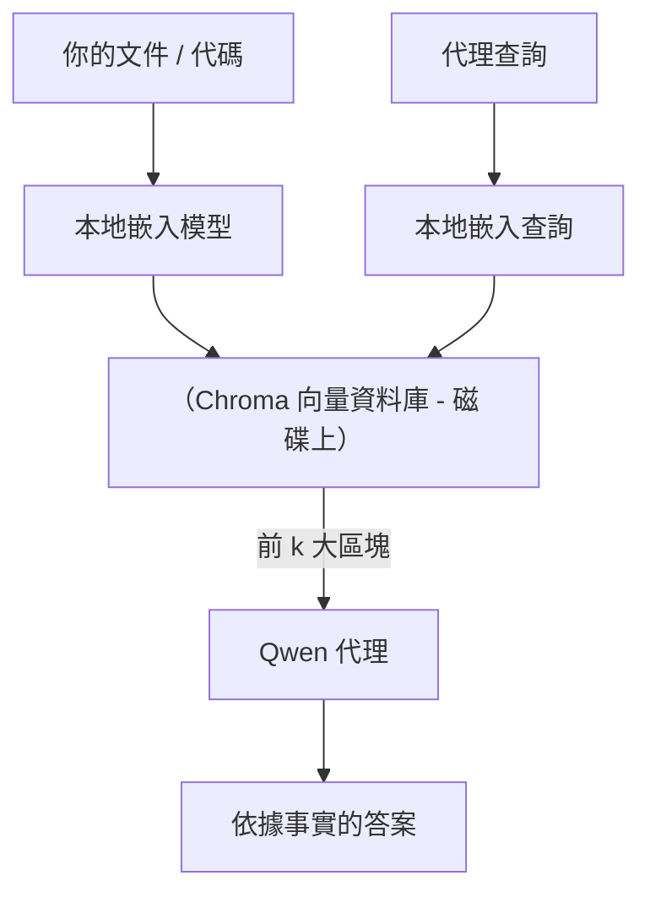
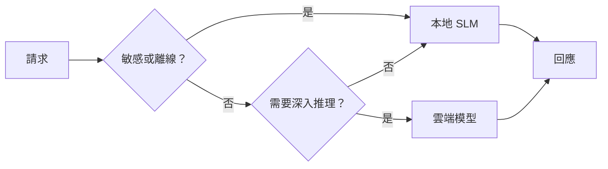

# 使用 Microsoft Foundry Local 和 Qwen 建立本地 AI 代理



前一課將代理擴展至雲端。本課則將它們帶回到單一裝置上。結束時，你將擁有一個可以推理、呼叫工具、閱讀你的檔案並搜尋文件的工程助理 — **不需任何雲端推論呼叫。**

為什麼會需要這樣？真實的工程工作中，這裡有三個常見原因：

- **隱私。** 程式碼與文件永遠不會離開裝置。沒有提示、沒有片段、沒有客戶資料穿越網路邊界。
- **成本。** 本地推論沒有每 token 的計費。你可以全天迭代，只需付電費。
- **離線。** 在飛機上、受控設施內或停機時，代理仍能正常工作。

代價是你用一個運行在 CPU、GPU 或 NPU 上的 **小型語言模型（SLM）** 取代了先進的雲端模型。本課將著重於建構在此限制下 <em>表現良好</em> 的代理，而不是假裝這個限制不存在。

## 介紹

本課將涵蓋：

- **小型語言模型（SLM）** — 它們是什麼，適合的場景及不適合的場景。
- **Microsoft Foundry Local** — 一個在裝置上下載及提供模型服務的執行環境，並提供 **OpenAI 相容的 API**。
- **Qwen 函式呼叫模型** — 可可靠產生工具呼叫的 SLM，使得本地 <em>代理</em>（不只本地聊天）成為可能。
- **本地工具、本地 RAG 與本地 MCP** — 讓代理具備無雲端能力。
- <strong>混合模式</strong> — 何時保留本地，何時呼叫雲端。

## 學習目標

完成本課後，你將會知道如何：

- 解釋 SLM 的權衡並選擇合適的本地代理使用案例。
- 利用 Foundry Local 於本機部署 Qwen 模型，並透過 OpenAI 相容端點連接。
- 建立一個完全運行於工作站上的工具呼叫代理。
- 利用本地向量資料庫（Chroma）在自己的文件上建構本地 RAG。
- 連接代理至本地 MCP 伺服器，並思考混合本地/雲端設計。

## 先決條件

本課假設你已完成先前課程，並熟悉：

- [工具使用](../04-tool-use/README.md)（第4課）與 [Agentic RAG](../05-agentic-rag/README.md)（第5課）。
- [Agentic 協定 / MCP](../11-agentic-protocols/README.md)（第11課）。
- [Microsoft Agent Framework](../14-microsoft-agent-framework/README.md)（第14課）。

你也需要：

- 一台開發工作站。**8 GB RAM 是現實的最低限度**；16 GB 以上更佳。GPU 或 NPU 有幫助，但非必須。
- 安裝好 **Microsoft Foundry Local**（請參看下方安裝說明）。
- Python 3.12+ 以及本倉庫中的 [`requirements.txt`](../../../requirements.txt) 套件，此外本課還需要 `foundry-local-sdk`、`openai` 與 `chromadb`。

## 小型語言模型：本地工作的適合工具

先進雲端模型有數千億參數，並由資料中心支援。SLM 則只有幾十億參數，必須容納於你筆電的 RAM 中。這個差異設定了明確的期待值。

**SLM 擅長：**

- 結構化、有限範圍任務 — 分類、抽取、已知文件的摘要。
- <strong>工具呼叫</strong> — 決定呼叫哪個函式以及使用何種參數。
- 快速、廉價、私密地在自己的資料上迭代。

**SLM 較弱於：**

- 在大型上下文中進行開放式、多跳推理。
- 廣泛的世界知識（因為見識較少且忘得較快）。

因此本地代理的致勝策略是：**讓 SLM 負責編排，讓工具負責繁重工作。** 模型不需要 <em>了解</em> 你的程式碼庫 — 它只要知道何時呼叫 `read_file` 與 `search_docs`。這正好發揮 SLM 的長處。



## Microsoft Foundry Local

**Microsoft Foundry Local** 是一個輕量級執行環境，能在你的機器上完整下載、管理及提供模型服務。我們最重要的功能是它曝露了 **OpenAI 相容的 HTTP 端點** — 這表示 OpenAI SDK 與 Microsoft Agent Framework 的 OpenAI 用戶端只要更改 `base_url` 即可對接。你所有建構代理的學習都直接適用；唯獨端點從雲端變成本機 `localhost`。

Foundry Local 也會自動依據你的硬體挑選模型最佳編譯版 — CPU 版、CUDA/GPU 版或 NPU 版 — 讓你不必手動優化每台機器。

### 安裝說明

安裝 Foundry Local（請參照針對你的作業系統的[文件](https://learn.microsoft.com/azure/ai-foundry/foundry-local/)），接著確認它正常運作：

```bash
# 安裝（範例；依據您的平台遵循文件）
winget install Microsoft.FoundryLocal      # Windows（視窗系統）
# brew install microsoft/foundrylocal/foundrylocal   # macOS（蘋果系統）

# 下載並運行 Qwen 模型，然後啟動本地服務
foundry model run qwen2.5-7b-instruct
foundry service status
```

服務啟動後，你將擁有一個本地 OpenAI 相容端點（通常為 `http://localhost:PORT/v1`）。筆記本使用 `foundry-local-sdk` 自動發現端點，因此你不必硬編寫端口。

## Qwen 函式呼叫：重要性何在

代理之所以是代理，是因為它能呼叫工具。許多 SLM 可以聊天，但會產生不可靠、不規則的工具呼叫。**Qwen** 模型經過函式呼叫訓練，能持續發出正確格式的工具呼叫結構 — 這正是將本地聊天模型變成本地 <em>代理</em> 的關鍵。

流程是你已熟悉的標準工具呼叫迴圈，只是在本機運行：



## 本地 RAG

文件搜尋是本地代理發揮價值的關鍵。不必指望 SLM 記住你的框架文件，而是將文件嵌入到 <strong>本地向量資料庫</strong>，讓代理按需檢索相關段落。

我們使用 **Chroma**，一款內嵌式向量儲存庫，與程序同在，無需管理伺服器。流程完全本地化：本地嵌入模型 → 本地向量 → 本地檢索 → 本地 SLM。



這是第 5 課 Agentic RAG 模式的本地化版本 — 唯一差別是所有元件都運行於你的機器上。

## 本地 MCP 伺服器

[MCP](../11-agentic-protocols/README.md) 是一種傳輸協定，而非雲端服務。MCP 伺服器可以作為本地程序在 `stdio` 上運行，透過標準協定向代理開放工具。這讓你可以離線重用日益增長的 MCP 伺服器生態系統 — 檔案系統存取、git 操作、資料庫查詢。

安全性姿態與雲端不同，但並非不存在：本地 MCP 伺服器仍以你的使用者權限運行，因此需限制其可觸及範圍（如特定專案資料夾，而非整個家目錄），並對其輸出視為輸入進行驗證。

## 混合雲端與本地模式

本地優先並不表示只能本地。成熟系統會依敏感性與難度進行路由：

| 情境 | 運行地點 |
| --- | --- |
| 敏感程式碼／資料，或離線 | **本地 SLM** |
| 簡單、有限任務 | **本地 SLM**（便宜且快速） |
| 複雜多跳推理非敏感資料 | <strong>雲端模型</strong> |
| 故障期間全部任務 | **本地 SLM**（優雅降級） |

這呼應了第 16 課的 <strong>模型路由</strong> 概念 — 只是「模型」之一現在是你的本機。健全設計會在雲端不可用時退回本地，讓代理品質降級而非直接失敗。



## 實作練習：本地工程助理

打開 [`code_samples/17-local-agent-foundry-local.ipynb`](./code_samples/17-local-agent-foundry-local.ipynb) 並跟著操作。你將構建一個 <strong>完全在工作站執行的本地工程助理</strong>，它能：

1. <strong>呼叫工具</strong> — 透過 Foundry Local 的 Qwen 函式呼叫。
2. <strong>執行本地檔案操作</strong> — 列出及讀取專案目錄中的檔案。
3. <strong>分析程式碼</strong> — 報告原始碼檔案的基本度量。
4. <strong>搜尋文件</strong> — 透過 Chroma 在文件資料夾上建構本地 RAG。
5. **使用 MCP** — 連接到本地 MCP 伺服器（若無設定則優雅跳過）。

全程不使用任何雲端推論。

### 操作導覽

助理透過 OpenAI 相容端點連接 Foundry Local，所以代理程式碼與雲端課程幾乎一模一樣 — 只有用戶端變更：

```python
from foundry_local import FoundryLocalManager
from openai import OpenAI

# Foundry Local 發現/下載模型並提供本地端點。
manager = FoundryLocalManager(\"qwen2.5-7b-instruct\")
client = OpenAI(base_url=manager.endpoint, api_key=manager.api_key)  # api_key 是本地占位符
```

工具是範圍限定於專案資料夾的普通 Python 函式：

```python
def read_file(path: str) -> str:
    \"\"\"Read a file, but only inside the sandboxed project directory.\"\"\"
    full = (PROJECT_ROOT / path).resolve()
    if PROJECT_ROOT not in full.parents and full != PROJECT_ROOT:
        return \"Access denied: path is outside the project directory.\"
    return full.read_text(encoding=\"utf-8\")
```

注意沙盒檢查 — 即使本地，讀取任意路徑的工具也是風險。筆記本將每個工具限縮在單一專案根目錄。

## 知識檢核

在進入作業前測試你的理解。

**1. 請舉出兩個在本地而非雲端執行代理的具體原因。**

<details>
<summary>答案</summary>

以下任兩項：<strong>隱私</strong>（程式碼與資料不離開裝置）、<strong>成本</strong>（無每 token 推論計費）與<strong>離線能力</strong>（無網路時運作 — 飛機、受控設施或停電期間）。法律／合規限制禁止資料外送也是隱私原因常見驅動力。
</details>

**2. 在本地代理中，SLM 與工具之間建議的任務分工是什麼，為什麼？**

<details>
<summary>答案</summary>

讓 SLM <strong>負責編排</strong>（決定呼叫哪個工具及參數），讓 <strong>工具負責繁重工作</strong>（讀檔、取文件、計算結果）。SLM 擅長有限決策如工具選擇，但廣泛知識與多跳推理能力較弱，靠工具發揮其強項。
</details>

**3. 是什麼讓我們能用 Foundry Local 重用雲端代理程式碼？**

<details>
<summary>答案</summary>

Foundry Local 提供一個 **OpenAI 相容的 HTTP 端點**。OpenAI SDK 與 Agent Framework 的 OpenAI 客戶端只需更改 `base_url`（並使用本地占位 API key）即可連線，代理程式碼其餘部分保持不變。
</details>

**4. 為什麼我們特別使用 Qwen 函式呼叫模型，而非任何 SLM？**

<details>
<summary>答案</summary>

因為代理必須產生可靠且格式正確的 <strong>工具呼叫</strong>。許多 SLM 能聊天卻輸出格式錯誤或不一致的工具呼叫結構。Qwen 模型專為函式呼叫訓練，生成穩定的工具呼叫，讓本地聊天模型成為有效的本地代理。
</details>

**5. 在本地 RAG 流程中，哪些元件運行於本機？**

<details>
<summary>答案</summary>

全部：嵌入模型、本地向量資料庫（磁碟上的 Chroma）、檢索步驟及 SLM。文件本地嵌入、儲存、檢索且由本地模型推理 — 無元件觸及雲端。
</details>

**6. 本地 MCP 伺服器運行於你的機器，是否自動代表安全？你還應該採取哪些預防措施？**

<details>
<summary>答案</summary>

否。本地 MCP 伺服器以你的使用者權限運行，因此可存取你能存取的一切。務必限制其範圍（例如限定專案資料夾而非整個家目錄），並將其輸出視為輸入來驗證後再使用。
</details>

**7. 請描述包含本地模型的合理混合路由規則。**

<details>
<summary>答案</summary>

將敏感或離線請求路由至本地 SLM；簡單有限任務也路由本地 SLM 以提升速度與降低成本；將複雜多跳推理（非敏感資料）路由至雲端模型；若雲端不可用則回退至本地 SLM，讓代理優雅降級而非故障。這是第 16 課模型路由的延伸，本地機器成為其中一個模型。
</details>

**8. 執行本課本地代理的現實最低 RAM 要求是多少？更多 RAM 有什麼好處？**

<details>
<summary>答案</summary>

大約 **8 GB** 是現實最低；16 GB 以上較舒適。更多 RAM 讓你能執行更大、更強的模型，並保留更多上下文在記憶體中。GPU 或 NPU 可加速推論但非必須 — Foundry Local 若無加速器則選用 CPU 版。
</details>

## 作業

將本地工程助理擴展成一個你選擇的小型專案的 <strong>本地文件審查員</strong>（若喜歡可使用本倉庫的任何課程資料夾）。

你的提交應該：

1. 將一個真實的文件／程式碼資料夾索引進 Chroma（至少五個檔案）。
2. 新增一個 `find_todos` 工具，掃描專案中所有 `TODO` / `FIXME` 註解並回傳，包含檔案及行號 — 並保持與 `read_file` 相同的沙盒檢查。

3. <strong>問代理三個問題</strong>，迫使它結合工具：一個純RAG問題，一個需要閱讀特定檔案，還有一個需要尋找TODO。
4. <strong>測量它</strong>：計時三個回答的時間，並在 markdown 儲存格中記錄。評論這些延遲是否可接受於你預期的工作流程。

然後寫一段短文說明<strong>你會把什麼移至雲端，什麼會保留在本地</strong>給這位評論者，以及原因。你的評分將基於本地組件是否正確連接以及你的混合推理是否合理——而非模型品質。

## 摘要

在本課程中你建構了一個完全在你自己的機器上運行的代理：

- **SLMs** 用隱私、成本和離線運行換取廣度 — 並且當它們<strong>協調工具</strong>而非單靠自身攜帶所有知識時大放異彩。
- **Foundry Local** 在裝置上透過一個<strong>OpenAI相容端點</strong>提供模型，因此你的雲代理程式碼只需一行更改即可轉移。
- **Qwen 函數呼叫模型** 使得可靠的本地工具呼叫 — 進而本地<em>代理</em> — 成為可能。
- **本地 RAG**（Chroma）和<strong>本地 MCP</strong> 讓代理具備能力而不離開機器。
- <strong>混合模式</strong> 讓你可以依敏感度和難易度路由，並以本地作為優雅的後備。

本課程完成了部署過程：第16課將代理擴展到 Microsoft Foundry，本課將它們縮小到單一工作站。下一課將聚焦於保持已部署代理的安全。

## 額外資源

- <a href="https://learn.microsoft.com/azure/ai-foundry/foundry-local/" target="_blank">Microsoft Foundry Local 文件</a>
- <a href="https://learn.microsoft.com/azure/ai-foundry/what-is-azure-ai-foundry" target="_blank">Microsoft Foundry 文件</a>
- <a href="https://aka.ms/ai-agents-beginners/agent-framework" target="_blank">Microsoft Agent Framework</a>
- <a href="https://qwen.readthedocs.io/en/latest/framework/function_call.html" target="_blank">Qwen 函數呼叫文件</a>
- <a href="https://modelcontextprotocol.io/" target="_blank">Model Context Protocol (MCP)</a>
- <a href="https://docs.trychroma.com/" target="_blank">Chroma 向量資料庫</a>

## 前一課

[部署可擴展代理](../16-deploying-scalable-agents/README.md)

## 下一課

[保障 AI 代理安全](../18-securing-ai-agents/README.md)

---

<!-- CO-OP TRANSLATOR DISCLAIMER START -->
**免責聲明**：
此文件已使用 AI 翻譯服務 [Co-op Translator](https://github.com/Azure/co-op-translator) 進行翻譯。雖然我們努力追求準確性，但請注意自動翻譯可能包含錯誤或不準確之處。原始文件的母語版本應視為權威來源。對於關鍵資訊，建議採用專業人工翻譯。我們不對因使用此翻譯所產生的任何誤解或誤譯承擔責任。
<!-- CO-OP TRANSLATOR DISCLAIMER END -->