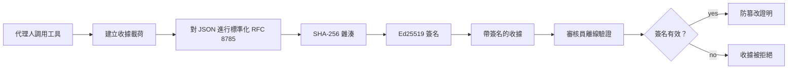
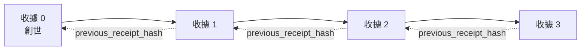

[觀看教學影片：使用密碼收據保護 AI 代理](https://youtu.be/PLACEHOLDER_VIDEO_ID)

> _(教學影片與縮圖將由 Microsoft 內容團隊在合併後新增，符合第14/15課的模式。)_

# 使用密碼收據保護 AI 代理

## 介紹

本課程將涵蓋：

- 為什麼 AI 代理的稽核追蹤對合規、除錯與信任很重要。
- 什麼是密碼收據以及它與未簽署的日誌行有何不同。
- 如何使用純 Python 產生代理工具呼叫的簽署收據。
- 如何離線驗證收據並檢測竄改。
- 如何串聯收據，使刪除或重新排序其中一筆會破壞整個鏈條。
- 收據能證明什麼及明確無法證明什麼。

## 學習目標

完成本課程後，您將能夠：

- 辨識促使代理行為使用密碼來源（provenance）動機的失效模式。
- 產生針對規範 JSON 負載的 Ed25519 簽署收據。
- 僅使用簽署者的公開金鑰獨立驗證收據。
- 透過重新驗證被修改的收據來檢測竄改。
- 架構一串以雜湊鏈結的收據序列並解釋為何此串鏈重要。
- 識別收據能證明（歸屬性、完整性、排序）與不能證明（行為正確性、政策合理性）之間的界線。

## 問題：您代理的稽核追蹤

假設您部署了一個供 Contoso Travel 使用的 AI 代理。該代理讀取客戶請求，呼叫航班 API 查詢選項，並代表客戶訂位。上季度，代理處理了 50,000 筆訂位。

今天來了一位稽核人員。他們問了一個簡單的問題：「請展示您的代理所做的事。」

您遞交了日誌檔案。稽核人員查看後，問了更難的問題：「我怎麼知道這些日誌沒有被編輯？」

這就是稽核追蹤問題。目前大多的代理部署依賴的是：

- <strong>應用程式日誌</strong>：由代理自身撰寫，任何具有檔案系統訪問權限的人都可編輯。
- <strong>雲端日誌服務</strong>：在平台層面抗竄改，但前提是稽核人員信任平台營運者。
- <strong>資料庫交易日誌</strong>：適合資料庫變更，卻不適合任意工具呼叫記錄。

這些方式無一能在稽核人員不需信任某人（您、您的雲端供應商、您的資料庫商）的情況下回答問題。內部使用通常可接受該信任，但對受規範工作負載（金融、醫療、任何受歐盟 AI 法規約束）則不行。

密碼收據透過使每個代理操作可獨立驗證解決此問題。稽核人員不需信任您，只需您的公開金鑰和收據本身。

## 什麼是密碼收據？

收據是一個 JSON 物件，記錄代理所做的事，並使用數位簽章簽署。



簡易收據如下：

```json
{
  "type": "agent.tool_call.v1",
  "agent_id": "contoso-travel-bot",
  "tool_name": "lookup_flights",
  "tool_args_hash": "sha256:a3f9c1...",
  "result_hash": "sha256:7b2e1d...",
  "policy_id": "contoso-travel-policy-v3",
  "timestamp": "2026-04-25T14:30:00Z",
  "sequence": 47,
  "previous_receipt_hash": "sha256:9d4e6a...",
  "signature": {
    "alg": "EdDSA",
    "sig": "c5af83...",
    "public_key": "8f3b2c..."
  }
}
```

三個屬性協同運作：

1. <strong>簽章</strong>。收據由代理閘道使用 Ed25519 私鑰簽署。持有對應公開鍵的任何人都能離線驗證簽章。任何欄位的竄改都會使簽章無效。

2. <strong>規範編碼</strong>。簽署前收據使用 JSON 規範化方案 (JCS, RFC 8785) 序列化。這保證兩個實作產生相同邏輯收據時輸出位元相同。若非規範化，不同 JSON 序列化器會為相同内容產生不同簽名。

3. <strong>雜湊鏈結</strong>。`previous_receipt_hash` 欄位連結每個收據與上一個。刪除或重新排序收據會破壞後續所有收據。即使個別簽章被繞過，鏈條也會呈現竄改跡象。

這些屬性合力提供三項保證：

- <strong>歸屬性</strong>：此金鑰簽署此內容。
- <strong>完整性</strong>：內容自簽署後未被更改。
- <strong>排序性</strong>：此收據在鏈條中位於該收據之後。

## 使用 Python 產生收據

產生收據不需要專門庫。密碼基元廣泛可用，邏輯也只有數十行 Python 程式碼。

`code_samples/18-signed-receipts.ipynb` 的實作練習會完整說明流程。摘要版：

```python
import json
import hashlib
import base64
from nacl import signing
from jcs import canonicalize  # RFC 8785 標準化 JSON

def b64url_nopad(data: bytes) -> str:
    return base64.urlsafe_b64encode(data).decode("ascii").rstrip("=")

def sha256_canonical(obj) -> str:
    """SHA-256 of a Python object's JCS-canonical JSON form."""
    return f"sha256:{hashlib.sha256(canonicalize(obj)).hexdigest()}"

# 產生或載入簽名金鑰（生產環境中，請存放於密鑰保管庫）
signing_key = signing.SigningKey.generate()
verify_key = signing_key.verify_key

# 建立收據負載（尚未簽名）
tool_args = {"origin": "SYD", "destination": "LAX"}
tool_result = [{"flight": "QF11", "price": 1850, "stops": 0}]

payload = {
    "type": "agent.tool_call.v1",
    "agent_id": "contoso-travel-bot",
    "tool_name": "lookup_flights",
    "tool_args_hash": sha256_canonical(tool_args),
    "result_hash": sha256_canonical(tool_result),
    "policy_id": "contoso-travel-policy-v3",
    "timestamp": "2026-04-25T14:30:00Z",
    "sequence": 0,
    "previous_receipt_hash": None,
}

# 進行標準化、雜湊、簽署。
canonical_bytes = canonicalize(payload)
message_hash = hashlib.sha256(canonical_bytes).digest()
signature_bytes = signing_key.sign(message_hash).signature

# 附加結構化的簽名字串物件。
receipt = {
    **payload,
    "signature": {
        "alg": "EdDSA",
        "sig": b64url_nopad(signature_bytes),
        "public_key": b64url_nopad(bytes(verify_key)),
    },
}
```

這就是整個簽章流程。筆記型檔中的練習逐步說明每個步驟。

## 驗證收據與偵測竄改

驗證是相反過程：

```python
import base64
import hashlib
from nacl import signing
from nacl.exceptions import BadSignatureError
from jcs import canonicalize

def b64url_decode(s: str) -> bytes:
    padding = "=" * ((4 - len(s) % 4) % 4)
    return base64.urlsafe_b64decode(s + padding)

def verify_receipt(receipt: dict) -> bool:
    # 此簽名是一個結構化物件：{"alg", "sig", "public_key"}。
    sig_obj = receipt.get("signature")
    if not sig_obj or sig_obj.get("alg") != "EdDSA":
        return False

    # 重建實際被簽署的載荷（除了簽名之外的所有內容）。
    payload = {k: v for k, v in receipt.items() if k != "signature"}

    canonical_bytes = canonicalize(payload)
    message_hash = hashlib.sha256(canonical_bytes).digest()

    try:
        verify_key = signing.VerifyKey(b64url_decode(sig_obj["public_key"]))
        verify_key.verify(message_hash, b64url_decode(sig_obj["sig"]))
        return True
    except BadSignatureError:
        return False
```

此函數接收收據，在簽名有效時回傳 `True`，否則 `False`。不需網路呼叫、不依賴服務，無需信任第三方。

要看看偵測竄改的實際效果，筆記型檔會示範：

1. 產生有效收據並確認驗證通過。
2. 修改 `tool_args_hash` 欄位的一個位元組。
3. 重新執行驗證並看到失敗。

這是收據能抗竄改的實例證明：任何微小修改都會破壞簽章。

## 串聯多步驟代理的收據

單張簽署收據保護一個行為。一串收據保護一連串行為。



每張收據都記錄前一張收據的雜湊，要靜默刪除收據2，攻擊者必須：

- 修改收據3的 `previous_receipt_hash` 欄位 (破壞收據3的簽章)，或
- 對修改後的收據3重新偽造簽章 (需要代理私鑰)。

如果私鑰保存在硬體金鑰庫，而您與每張收據一起發佈公開金鑰，兩種攻擊都無法在不被偵測下進行。

筆記型檔演示：

1. 建構三張收據的鏈。
2. 確認每張收據的 `previous_receipt_hash` 與前一張收據的實際雜湊吻合。
3. 竄改中間某收據並看到鏈條在此點中斷。

如此即可產生外部稽核員可在不信任您前提下驗證的稽核追蹤。

## 收據可證明的事（和不可證明的事）

這是本課最重要的章節。收據功能強大但有限制。

**收據可證明三件事：**

1. <strong>歸屬性</strong>：特定金鑰簽署特定負載。
2. <strong>完整性</strong>：負載自簽署後未被更改。
3. <strong>排序性</strong>：此收據在雜湊鏈條中在另一收據之後。

**收據無法證明：**

1. <strong>正確性</strong>：代理行為是否正確。收據可為錯誤答案產生，和正確答案一樣乾淨簽署。
2. <strong>政策遵循性</strong>：`policy_id` 中的政策是否真的被評估，或若被檢查是否會允許該行為。收據記錄所宣稱的，不是所強制的。
3. <strong>金鑰以外的身分</strong>：收據只說「此金鑰簽署此内容」，不會說「此人授權此事」。將金鑰與個人或組織連結需另外的身份基礎架構（目錄、公開金鑰登錄等）。
4. <strong>輸入的真實性</strong>：若代理接受被操控提示並採取行動，收據忠實記錄行動。收據位於輸入驗證鏈下游，非替代品。

這界線重要有兩個理由：

- 它告訴您收據的用途：讓代理行為可稽核且抗竄改，甚至跨組織界限。
- 它告訴您仍需哪些額外層次：輸入驗證（第6課）、政策強制（以下簡述）和身份基礎架構（超出本課範圍）。

常見錯誤是認為「我們有收據」就代表「我們被治理」。並不如此。收據是基礎，治理是您打造的系統。

## 證明人類認可特定行為

上述第3點值得獨立章節：行為收據說「此金鑰簽署此内容」，永遠不說「此人授權此事」。對高風險行為（退款、刪除、匯款），治理框架日益要求正是缺失的此聲明，而這可用本課構建的原始基元產生。

後續筆記 `code_samples/human-authorization-receipts.ipynb` 增加第二種收據類型 `human.approval.v1`，與本課收據同包裝格式（透過 Ed25519 簽署其規範 SHA-256 的型別負載，`signature` 物件在簽署位元組外）。具名核准者在執行前簽署 <strong>完整規範行動與其摘要</strong>；代理的行為收據攜帶 <strong>相同動作摘要</strong> 與 `parent_approval_ref`，即該核準收據的 `receipt_hash`，採用與之前串鏈中 `previous_receipt_hash` 相同慣例。一個 `verify_chain` 對兩個工件在 <strong>獨立的固定金鑰註冊中心</strong> （核准密鑰與代理密鑰）下核查，故路徑共用但權限分開。

仔細說明此特性：*人類認可此精確行為，且代理執行完全該認可行為*。筆記中拒絕測試使此屬性具體真實而非空言：

- 經典組合：竄改、代理混淆、重放、雙方偽造金鑰、格式錯誤輸入；
- <strong>過時權限</strong>：簽章仍驗證通過，但因政策版本更新、核准密鑰被撤銷、或核准在執行前過期而被拒絕；
- <strong>摘要替換</strong>：有效簽章行為收據指向一份綁定 <em>不同</em> 規範行為的 <em>真實</em> 核准。

每種失效理由皆有明確拒絕訊息，方便稽核人員判別權限是否過期或執行行為是否更改。筆記所教規則：簽署核准本身不代表權限。只有兩種收據執行時仍指向同一規範動作，權限才存在。本課追隨的同一草案 (`draft-farley-acta-signed-receipts`) 中的聯簽路徑，是此模式的標準化形態。

## 產品參考

本課 Python 程式碼故意簡潔，讓您可以逐行閱讀並完全理解。實務上有兩個選擇：

1. **直接基於密碼基元自行構建。** 上述50行代碼對許多案例足夠。PyNaCl（Ed25519）和 `jcs` 套件（規範 JSON）皆為維護良好且經過審核的庫。

2. **使用產品級收據庫。** 多個開源專案實作相同模式並有額外功能（金鑰輪替、批次驗證、JWK 集發佈、政策引擎整合）：
   - 本課使用的收據格式遵循 IETF 網際網路草案（[`draft-farley-acta-signed-receipts`](https://datatracker.ietf.org/doc/draft-farley-acta-signed-receipts/)，第02版），正處於標準化過程，並帶有公用一致測試套件（[agent-governance-testvectors](https://github.com/ScopeBlind/agent-governance-testvectors)），供獨立實作交叉驗證產出位元確定的規範輸出。
   - Microsoft Agent Governance Toolkit 將收據與基於 Cedar 的政策決策結合；請參考該存放庫的第33課教學獲得端到端示範。
   - `protect-mcp` (npm) 與 `@veritasacta/verify` (npm) 套件提供基於 Node 的收據簽署及離線驗證實作，旨在為任何 MCP 伺服器包裝帶有抗竄改稽核追蹤，包括一個暫停動作發出核准收據且綁定該動作摘要的共簽流程（桌面流程中以 WebAuthn 支援），即人類授權筆記中使用的核准收據模式。
   - **[nobulex](https://github.com/arian-gogani/nobulex)** Python SDK (`pip install nobulex`) 提供相同 Ed25519 + JCS 簽署模式，並與 LangChain 及 CrewAI 整合，含跨驗證測試向量與透過 [OWASP PR #2210](https://github.com/OWASP/CheatSheetSeries/pull/2210) 貢獻的合規映射。

自行開發和採用庫的選擇與撰寫或採用 JWT 库相似：兩者皆合理；庫可省時減少審計範圍；自行編寫促使您理解每種基元。本課授課採自行編寫途徑，為您奠定任選基礎。

## 知識檢核

在繼續實作練習前，請測試您的理解。

**1. 收據由代理的私鑰 Ed25519 簽署，稽核人員只有公開鑰。稽核人員能離線驗證收據嗎？**

<details>
<summary>答案</summary>

可以。Ed25519 驗證僅需公開鑰與簽署位元組。無需任何網路呼叫或服務依賴。此特性使收據適用於隔離網路、多組織或低信任稽核環境。
</details>

**2. 攻擊者修改收據的 `policy_id` 欄位，聲稱它受更寬鬆政策管控，簽章仍為原始負載。驗證時會發生什麼？**

<details>
<summary>答案</summary>


驗證失敗。簽名是針對原始負載的規範位元組計算的；修改任何欄位都會改變規範位元組，而這會改變 SHA-256 雜湊值，進而使簽名無效。攻擊者需要私鑰才能產生新的有效簽名，但他們並不擁有該私鑰。
</details>

**3. 為什麼收據包含 `tool_args_hash` 和 `result_hash`，而不是原始的參數和結果？**

<details>
<summary>答案</summary>

有兩個原因。首先，收據可能需要在洩漏原始內容（個人識別資訊、業務資料）會有問題的環境中存檔或傳輸。透過雜湊可以保持收據的大小精簡並保持內容私密；稽核者驗證該雜湊是否與另外存放的實際內容一致。其次，雜湊有固定大小；使用雜湊的收據大小是有界的，無論輸入和輸出多大。
</details>

**4. `previous_receipt_hash` 欄位將每個收據與其前一頁連結。如果攻擊者暗中刪除鏈中間的一個收據，什麼會變得無效？**

<details>
<summary>答案</summary>

被刪除收據之後的所有收據。它們的 `previous_receipt_hash` 欄位將不再與實際鏈匹配（因為它們參考的收據已不存在，或鏈現在指向不同的前置者）。若要隱藏刪除，攻擊者必須重新簽署之後的每個收據，這需要私鑰。
</details>

**5. 收據驗證通過。這是否證明代理的行動是正確、合理或符合政策？**

<details>
<summary>答案</summary>

不。有效的收據證明三件事：歸屬（此密鑰簽署了此內容）、完整性（內容未更改）、和排序（此收據是在另一收據之後）。它不證明該行動正確，`policy_id` 指定的政策確實有被評估，或代理遵守了每條規則。收據使代理行為可稽核，但不保證行為正確。這是本課程中最重要的界線。
</details>

## 練習題

打開 `code_samples/18-signed-receipts.ipynb` 並完成所有四個部分：

1. **第 1 部分**：簽署你的第一張收據並驗證。
2. **第 2 部分**：篡改收據並觀察驗證失敗。
3. **第 3 部分**：建立由三張收據組成的鏈並驗證鏈的完整性。
4. **第 4 部分**：將此模式應用於使用 Microsoft Agent Framework 建立的代理：將工具呼叫包裹在收據簽署中，然後獨立驗證收據。

**挑戰任務 1：** 將收據架構擴展一個你自己選擇的新欄位（例如追蹤用的請求 ID），更新規範簽署邏輯將它包括進去，並確認收據仍能在驗證中正確往返。之後在簽署後修改該欄位，確認驗證失敗。這會迫使你理解規範編碼的每一個位元如何影響簽名。

**挑戰任務 2：** 將你的兩張收據的規範位元組（以確定性順序串接）做 SHA-256 雜湊，並將該摘要作為第三張收據中新增欄位嵌入，然後簽署它。驗證三張收據仍能正確往返。你剛剛建立了一個單步包含證明：任何持有第三張收據的人都可證明第一和第二張收據在簽署時是存在的，且不用揭露它們的內容。這是大規模選擇性揭露收據採用的模式（Merkle 承諾，RFC 6962）。

## 結論

密碼學收據為 AI 代理提供了一條審核軌跡，具備：

- <strong>獨立可驗證</strong>：任何持有公鑰的第三方可驗證，無需依賴任何服務。
- <strong>防篡改</strong>：任何修改都會使簽名無效。
- <strong>可攜帶</strong>：收據是小型 JSON 檔案；可被存檔、傳輸並於任何地點驗證。
- <strong>標準相容</strong>：基於 Ed25519（RFC 8032）、JCS（RFC 8785）和 SHA-256，所有是廣泛部署的原語。

它們不能替代輸入驗證、政策執行或身份基礎建設，而是這些層的基礎。當你在受規範限制的工作負載、多組織工作流程或任何無法假設未來稽核者會信任你的環境中部署代理時，收據讓你的審核軌跡保持誠實。

最重要的觀點是：收據證明誰在何時說了什麼。它們不證明所說內容的真實或正確。堅守這個區別。這決定了一個誠實的來源系統與誤導系統之間的差異。

## 生產環境清單

當你準備從本課程畢業並在實際環境部署收據簽署代理時：

- [ ] **將簽署私鑰從開發者筆電移出。** 使用 Azure Key Vault、AWS KMS 或硬體安全模組。用於簽署收據的私鑰絕不能存在原始碼控管或應用機器的明文裡。
- [ ] **公開驗證公鑰。** 稽核者需要它離線驗證。標準模式是放在知名 URL 的 JWK 集（RFC 7517），例如 `https://your-org.example.com/.well-known/agent-keys.json`。
- [ ] **鏈錨定於外部。** 定期將最新鏈頂雜湊寫入透明度日誌（Sigstore Rekor、RFC 3161 時戳權威，或第二個內部系統），讓外部方可確認「該鏈在此時存在」。
- [ ] **不可變地存儲收據。** 使用僅追加 Blob 儲存（帶不可變政策的 Azure Storage、AWS S3 Object Lock）避免內部人員在存儲層重寫歷史。
- [ ] **決定保留期限。** 許多合規體系要求多年保留。計劃好收據成長（每張收據約 500 位元組；代理每日呼叫 10K 次，一年約 1.8 GB）。
- [ ] **記錄收據不涵蓋的內容。** 收據證明歸屬、完整性和排序。你的運維手冊應明確列出哪些額外控管（輸入驗證、政策執行、速率限制、身份基礎建設）與收據共同存在於治理態勢中。

### 想知道更多關於保護 AI 代理的問題嗎？

加入 [Microsoft Foundry Discord](https://aka.ms/ai-agents/discord)，與其他學習者見面、參加辦公時間，並獲得 AI 代理問題的解答。

## 超越本課程

本課程涵蓋單張收據簽署和雜湊鏈序列。相同原語可組合出多種進階模式，隨著你治理態勢成熟可能會遇到：

- **選擇性揭露。** 當一張收據的欄位獨立承諾（RFC 6962 風格的 Merkle 樹），你可以向特定稽核者揭露特定欄位，並證明其餘欄位未變而不暴露它們。當同一張收據必須同時滿足完整性稽核和如 GDPR 這類最小化數據的規範時非常有用。
- **收據撤銷。** 若簽署密鑰被洩露，你需要有機制將該密鑰簽署的所有收據自某一時間點起標記為不可信。標準模式：短效簽署密鑰及公開撤銷列表，或有撤銷條目的透明度日誌。
- **雙方 / 分割簽名收據。** 有些實作將簽署的負載拆成執行前（`authorization_*`）與執行後（`result_*`）兩半，各自獨立簽名。當授權決定和觀察結果由不同角色或在不同比時刻產生時很有用。這可附加於本課程所教的收據格式上。
- **負載組合。** 收據封印你放入 `result_hash` 的任何位元組。實際負載通常比單一工具呼叫結果豐富：預決策推理（模型預測、考慮的選項、證據及其完整性、風險姿態、責任鏈、閘門結果）皆可存在負載中，由單張收據封印。保持收據格式最小化，同時讓負載架構可依領域演進。
- **跨實作相容。** 多個獨立實作（Python、TypeScript、Rust、Go）對收據格式交叉驗證共享的測試向量。若你建立自家實作，針對已發布向量驗證可確認正確的通訊相容性。
- **後量子遷移。** Ed25519 目前廣泛部署但非抗量子。收據格式算法敏捷：`signature.alg` 欄位可攜帶 `ML-DSA-65`（NIST 後量子簽名標準），當你需要遷移時可使用。規劃一個收據雙簽的過渡期。

## 附加資源

- <a href="https://datatracker.ietf.org/doc/draft-farley-acta-signed-receipts/" target="_blank">IETF 網際網路草案：機器對機器存取控制的簽署決定收據</a>
- <a href="https://learn.microsoft.com/azure/ai-studio/responsible-use-of-ai-overview" target="_blank">負責任的 AI 概述（Azure AI）</a>
- <a href="https://datatracker.ietf.org/doc/html/rfc8032" target="_blank">RFC 8032：Edwards 曲線數位簽章演算法 (EdDSA)</a>
- <a href="https://datatracker.ietf.org/doc/html/rfc8785" target="_blank">RFC 8785：JSON 規範化方案 (JCS)</a>
- <a href="https://datatracker.ietf.org/doc/html/rfc6962" target="_blank">RFC 6962：憑證透明度</a>（選擇性揭露收據採用的 Merkle 樹構造）
- <a href="https://github.com/microsoft/agent-governance-toolkit/blob/main/docs/tutorials/33-offline-verifiable-receipts.md" target="_blank">Microsoft Agent Governance Toolkit, 教學 33：離線可驗證決定收據</a>
- <a href="https://github.com/ScopeBlind/agent-governance-testvectors" target="_blank">本課程收據格式的跨實作相容測試向量</a>（Apache-2.0）
- <a href="https://pynacl.readthedocs.io/" target="_blank">PyNaCl 文件</a>（Python 中的 Ed25519）

## 上一課程

[建立本地 AI 代理](../17-creating-local-ai-agents/README.md)

---

<!-- CO-OP TRANSLATOR DISCLAIMER START -->
**免責聲明**：
此文件已使用 AI 翻譯服務 [Co-op Translator](https://github.com/Azure/co-op-translator) 進行翻譯。雖然我們努力追求準確性，但請注意自動翻譯可能包含錯誤或不準確之處。原始文件的母語版本應視為權威來源。對於關鍵資訊，建議採用專業人工翻譯。我們不對因使用此翻譯所產生的任何誤解或誤譯承擔責任。
<!-- CO-OP TRANSLATOR DISCLAIMER END -->