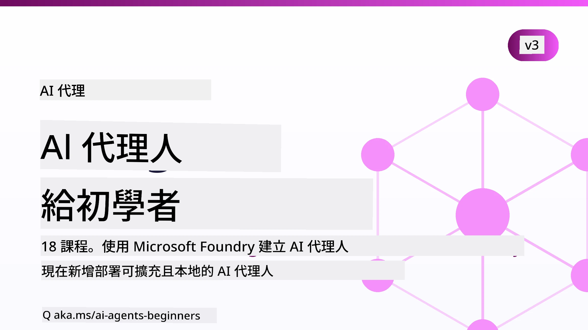

# AI代理初學者課程



## 教你開始打造AI代理所需了解的一切課程

[](https://github.com/microsoft/ai-agents-for-beginners/blob/master/LICENSE?WT.mc_id=academic-105485-koreyst)
[](https://GitHub.com/microsoft/ai-agents-for-beginners/graphs/contributors/?WT.mc_id=academic-105485-koreyst)
[](https://GitHub.com/microsoft/ai-agents-for-beginners/issues/?WT.mc_id=academic-105485-koreyst)
[](https://GitHub.com/microsoft/ai-agents-for-beginners/pulls/?WT.mc_id=academic-105485-koreyst)
[](http://makeapullrequest.com?WT.mc_id=academic-105485-koreyst)

### 🌐 多語言支援

#### 透過GitHub Action支援（自動且隨時更新）

<!-- CO-OP TRANSLATOR LANGUAGES TABLE START -->
[阿拉伯語](../ar/README.md) | [孟加拉語](../bn/README.md) | [保加利亞語](../bg/README.md) | [緬甸語 (Myanmar)](../my/README.md) | [中文 (簡體)](../zh-CN/README.md) | [中文 (繁體，香港)](../zh-HK/README.md) | [中文 (繁體，澳門)](../zh-MO/README.md) | [中文 (繁體，台灣)](./README.md) | [克羅地亞語](../hr/README.md) | [捷克語](../cs/README.md) | [丹麥語](../da/README.md) | [荷蘭語](../nl/README.md) | [愛沙尼亞語](../et/README.md) | [芬蘭語](../fi/README.md) | [法語](../fr/README.md) | [德語](../de/README.md) | [希臘語](../el/README.md) | [希伯來語](../he/README.md) | [印地語](../hi/README.md) | [匈牙利語](../hu/README.md) | [印尼語](../id/README.md) | [義大利語](../it/README.md) | [日語](../ja/README.md) | [坎納達語](../kn/README.md) | [高棉語](../km/README.md) | [韓語](../ko/README.md) | [立陶宛語](../lt/README.md) | [馬來語](../ms/README.md) | [馬拉雅拉姆語](../ml/README.md) | [馬拉地語](../mr/README.md) | [尼泊爾語](../ne/README.md) | [奈及利亞洋涇濱英語](../pcm/README.md) | [挪威語](../no/README.md) | [波斯語 (Farsi)](../fa/README.md) | [波蘭語](../pl/README.md) | [葡萄牙語 (巴西)](../pt-BR/README.md) | [葡萄牙語 (葡萄牙)](../pt-PT/README.md) | [旁遮普語 (Gurmukhi)](../pa/README.md) | [羅馬尼亞語](../ro/README.md) | [俄語](../ru/README.md) | [塞爾維亞語 (西里爾字母)](../sr/README.md) | [斯洛伐克語](../sk/README.md) | [斯洛維尼亞語](../sl/README.md) | [西班牙語](../es/README.md) | [斯瓦希里語](../sw/README.md) | [瑞典語](../sv/README.md) | [他加祿語 (菲律賓語)](../tl/README.md) | [泰米爾語](../ta/README.md) | [泰盧固語](../te/README.md) | [泰語](../th/README.md) | [土耳其語](../tr/README.md) | [烏克蘭語](../uk/README.md) | [烏爾都語](../ur/README.md) | [越南語](../vi/README.md)

> **偏好本機複製？**
>
> 本存儲庫包含50多種語言的翻譯，會大幅增加下載大小。若要不含翻譯地複製，請使用稀疏簽出：
>
> **Bash / macOS / Linux:**
> ```bash
> git clone --filter=blob:none --sparse https://github.com/microsoft/ai-agents-for-beginners.git
> cd ai-agents-for-beginners
> git sparse-checkout set --no-cone '/*' '!translations' '!translated_images'
> ```
>
> **CMD (Windows):**
> ```cmd
> git clone --filter=blob:none --sparse https://github.com/microsoft/ai-agents-for-beginners.git
> cd ai-agents-for-beginners
> git sparse-checkout set --no-cone "/*" "!translations" "!translated_images"
> ```
>
> 這讓你可以用更快的速度下載，獲得完成課程所需的一切。
<!-- CO-OP TRANSLATOR LANGUAGES TABLE END -->

**若希望支援更多翻譯語言，請參閱此處清單：[here](https://github.com/Azure/co-op-translator/blob/main/getting_started/supported-languages.md)。**

[](https://GitHub.com/microsoft/ai-agents-for-beginners/watchers/?WT.mc_id=academic-105485-koreyst)
[](https://GitHub.com/microsoft/ai-agents-for-beginners/network/?WT.mc_id=academic-105485-koreyst)
[](https://GitHub.com/microsoft/ai-agents-for-beginners/stargazers/?WT.mc_id=academic-105485-koreyst)

[](https://discord.com/invite/ATgtXmAS5D)


## 🌱 開始使用

本課程涵蓋打造AI代理的基礎課題。每課都有獨立主題，隨意選擇開始！

本課程支援多語言。請前往[此處查看可用語言](#-multi-language-support)。

若你是首次使用生成式AI模型建構，請參考我們的 [生成式AI初學者課程](https://aka.ms/genai-beginners)，涵蓋21課生成式AI建立教學。

別忘了[標星 (🌟) 此存儲庫](https://docs.github.com/en/get-started/exploring-projects-on-github/saving-repositories-with-stars?WT.mc_id=academic-105485-koreyst)並[分支此存儲庫](https://github.com/microsoft/ai-agents-for-beginners/fork)來執行代碼。

### 遇見其他學習者，獲得問題解答

若遇到困難或有任何AI代理建立相關提問，歡迎加入我們專用Discord頻道，位於[Microsoft Foundry Discord](https://aka.ms/ai-agents/discord)。

### 你需要什麼

每個課程都附有程式碼範例，可在code_samples資料夾找到。你可以[分支此存儲庫](https://github.com/microsoft/ai-agents-for-beginners/fork)並建立自有副本。

這些練習裡的程式碼範例使用Microsoft Agent Framework結合Microsoft Foundry Agent Service V2：

- [Microsoft Foundry](https://aka.ms/ai-agents-beginners/ai-foundry) - 需要Azure帳戶

本課程使用以下Microsoft AI代理框架與服務：

- [Microsoft Agent Framework (MAF)](https://aka.ms/ai-agents-beginners/agent-framework)
- [Microsoft Foundry Agent Service V2](https://aka.ms/ai-agents-beginners/ai-agent-service)

部分程式碼範例也支援其他兼容OpenAI的服務提供者，例如提供大上下文模型（最高204K代幣）的[MiniMax](https://platform.minimaxi.com/)。詳細配置請見[課程設定](./00-course-setup/README.md)。

欲了解本課程程式碼運行詳情，請見[課程設定](./00-course-setup/README.md)。

## 🙏 想幫忙嗎？

若有建議或發現拼寫、代碼錯誤，請[提出議題](https://github.com/microsoft/ai-agents-for-beginners/issues?WT.mc_id=academic-105485-koreyst)或[發起拉取請求](https://github.com/microsoft/ai-agents-for-beginners/pulls?WT.mc_id=academic-105485-koreyst)。


## 📂 每堂課包含

- 一篇位於README的書面課程與一個短影片
- 使用Microsoft Agent Framework和Microsoft Foundry的Python程式碼範例
- 延續學習的額外資源連結


## 🗃️ 課程列表

| <strong>課程</strong>                                   | <strong>文本與程式碼</strong>                                    | <strong>影片</strong>                                                  | <strong>額外學習資源</strong>                                                                     |
|----------------------------------------------|----------------------------------------------------|------------------------------------------------------------|----------------------------------------------------------------------------------------|
| AI代理介紹與代理使用案例                    | [連結](./01-intro-to-ai-agents/README.md)          | [影片](https://youtu.be/3zgm60bXmQk?si=z8QygFvYQv-9WtO1)  | [連結](https://aka.ms/ai-agents-beginners/collection?WT.mc_id=academic-105485-koreyst) |
| 探索AI代理框架                              | [連結](./02-explore-agentic-frameworks/README.md)  | [影片](https://youtu.be/ODwF-EZo_O8?si=Vawth4hzVaHv-u0H)  | [連結](https://aka.ms/ai-agents-beginners/collection?WT.mc_id=academic-105485-koreyst) |
| 理解AI代理設計模式                          | [連結](./03-agentic-design-patterns/README.md)     | [影片](https://youtu.be/m9lM8qqoOEA?si=BIzHwzstTPL8o9GF)  | [連結](https://aka.ms/ai-agents-beginners/collection?WT.mc_id=academic-105485-koreyst) |
| 工具使用設計模式                            | [連結](./04-tool-use/README.md)                    | [影片](https://youtu.be/vieRiPRx-gI?si=2z6O2Xu2cu_Jz46N)  | [連結](https://aka.ms/ai-agents-beginners/collection?WT.mc_id=academic-105485-koreyst) |
| 代理式RAG                                  | [連結](./05-agentic-rag/README.md)                 | [影片](https://youtu.be/WcjAARvdL7I?si=gKPWsQpKiIlDH9A3)  | [連結](https://aka.ms/ai-agents-beginners/collection?WT.mc_id=academic-105485-koreyst) |
| 建立可信賴的AI代理                         | [連結](./06-building-trustworthy-agents/README.md) | [影片](https://youtu.be/iZKkMEGBCUQ?si=jZjpiMnGFOE9L8OK ) | [連結](https://aka.ms/ai-agents-beginners/collection?WT.mc_id=academic-105485-koreyst) |
| 規劃設計模式                                | [連結](./07-planning-design/README.md)             | [影片](https://youtu.be/kPfJ2BrBCMY?si=6SC_iv_E5-mzucnC)  | [連結](https://aka.ms/ai-agents-beginners/collection?WT.mc_id=academic-105485-koreyst) |
| 多代理設計模式                              | [連結](./08-multi-agent/README.md)                 | [影片](https://youtu.be/V6HpE9hZEx0?si=rMgDhEu7wXo2uo6g)  | [連結](https://aka.ms/ai-agents-beginners/collection?WT.mc_id=academic-105485-koreyst) |

| 元認知設計模式                 | [連結](./09-metacognition/README.md)               | [影片](https://youtu.be/His9R6gw6Ec?si=8gck6vvdSNCt6OcF)  | [連結](https://aka.ms/ai-agents-beginners/collection?WT.mc_id=academic-105485-koreyst) |
| 已投入生產的 AI 代理                      | [連結](./10-ai-agents-production/README.md)        | [影片](https://youtu.be/l4TP6IyJxmQ?si=31dnhexRo6yLRJDl)  | [連結](https://aka.ms/ai-agents-beginners/collection?WT.mc_id=academic-105485-koreyst) |
| 使用 Agentic 協議 (MCP、A2A 及 NLWeb) | [連結](./11-agentic-protocols/README.md)           | [影片](https://youtu.be/X-Dh9R3Opn8)                                 | [連結](https://aka.ms/ai-agents-beginners/collection?WT.mc_id=academic-105485-koreyst) |
| AI 代理的情境工程            | [連結](./12-context-engineering/README.md)         | [影片](https://youtu.be/F5zqRV7gEag)                                 | [連結](https://aka.ms/ai-agents-beginners/collection?WT.mc_id=academic-105485-koreyst) |
| 管理 Agentic 記憶                      | [連結](./13-agent-memory/README.md)     |      [影片](https://youtu.be/QrYbHesIxpw?si=vZkVwKrQ4ieCcIPx)                                                      |                                                                                        |
| 探索 Microsoft Agent Framework                         | [連結](./14-microsoft-agent-framework/README.md)                            |                                                            |                                                                                        |
| 建立電腦使用代理 (CUA)           | [連結](./15-browser-use/README.md)     |                                                            | [連結](https://docs.browser-use.com/examples/templates/playwright-integration)         |
| 部署可擴充代理                    | [連結](./16-deploying-scalable-agents/README.md) |                                                    | [連結](https://learn.microsoft.com/azure/ai-foundry/agents/overview)                   |
| 建立本地 AI 代理                     | [連結](./17-creating-local-ai-agents/README.md)  |                                                    | [連結](https://learn.microsoft.com/azure/ai-foundry/foundry-local/)                    |
| 保障 AI 代理安全                           | [連結](./18-securing-ai-agents/README.md)  |                                                            | [連結](https://aka.ms/ai-agents-beginners/collection?WT.mc_id=academic-105485-koreyst) |

## 🎒 其他課程

我們團隊還製作了其他課程！請參考：

<!-- CO-OP TRANSLATOR OTHER COURSES START -->
### LangChain
[](https://aka.ms/langchain4j-for-beginners)
[](https://aka.ms/langchainjs-for-beginners?WT.mc_id=m365-94501-dwahlin)
[](https://github.com/microsoft/langchain-for-beginners?WT.mc_id=m365-94501-dwahlin)
---

### Azure / Edge / MCP / 代理
[](https://github.com/microsoft/AZD-for-beginners?WT.mc_id=academic-105485-koreyst)
[](https://github.com/microsoft/edgeai-for-beginners?WT.mc_id=academic-105485-koreyst)
[](https://github.com/microsoft/mcp-for-beginners?WT.mc_id=academic-105485-koreyst)
[](https://github.com/microsoft/ai-agents-for-beginners?WT.mc_id=academic-105485-koreyst)

---
 
### 生成式 AI 系列
[](https://github.com/microsoft/generative-ai-for-beginners?WT.mc_id=academic-105485-koreyst)
[-9333EA?style=for-the-badge&labelColor=E5E7EB&color=9333EA)](https://github.com/microsoft/Generative-AI-for-beginners-dotnet?WT.mc_id=academic-105485-koreyst)
[-C084FC?style=for-the-badge&labelColor=E5E7EB&color=C084FC)](https://github.com/microsoft/generative-ai-for-beginners-java?WT.mc_id=academic-105485-koreyst)
[-E879F9?style=for-the-badge&labelColor=E5E7EB&color=E879F9)](https://github.com/microsoft/generative-ai-with-javascript?WT.mc_id=academic-105485-koreyst)

---
 
### 核心學習
[](https://aka.ms/ml-beginners?WT.mc_id=academic-105485-koreyst)
[](https://aka.ms/datascience-beginners?WT.mc_id=academic-105485-koreyst)
[](https://aka.ms/ai-beginners?WT.mc_id=academic-105485-koreyst)
[](https://github.com/microsoft/Security-101?WT.mc_id=academic-96948-sayoung)
[](https://aka.ms/webdev-beginners?WT.mc_id=academic-105485-koreyst)
[](https://aka.ms/iot-beginners?WT.mc_id=academic-105485-koreyst)
[](https://github.com/microsoft/xr-development-for-beginners?WT.mc_id=academic-105485-koreyst)

---
 
### Copilot 系列
[](https://aka.ms/GitHubCopilotAI?WT.mc_id=academic-105485-koreyst)
[](https://github.com/microsoft/mastering-github-copilot-for-dotnet-csharp-developers?WT.mc_id=academic-105485-koreyst)
[](https://github.com/microsoft/CopilotAdventures?WT.mc_id=academic-105485-koreyst)
<!-- CO-OP TRANSLATOR OTHER COURSES END -->

## 🌟 社群感謝

感謝 [Shivam Goyal](https://www.linkedin.com/in/shivam2003/) 貢獻展示 Agentic RAG 重要程式碼範例。 

## 貢獻

本專案歡迎貢獻與建議。大多數貢獻需要您同意一份
貢獻者授權協議 (CLA)，聲明您擁有並實際授權我們
使用您的貢獻。詳情請參訪 <https://cla.opensource.microsoft.com>。

當您提交拉取請求時，CLA 機器人會自動判斷您是否需要提供
CLA，並適當裝飾該 PR (例如狀態檢查、評論)。請依照機器人
提供之指示操作。對使用我們 CLA 的所有 repo，您只需執行一次此程序。

本專案已採用 [Microsoft 開源行為守則](https://opensource.microsoft.com/codeofconduct/)。
更多資訊請參閱 [行為守則 FAQ](https://opensource.microsoft.com/codeofconduct/faq/) 或
聯絡 [opencode@microsoft.com](mailto:opencode@microsoft.com) 提問及意見。

## 商標

本專案可能包含專案、產品或服務的商標或標誌。對 Microsoft
商標或標誌的授權使用必須遵守
[Microsoft 商標與品牌使用指引](https://www.microsoft.com/legal/intellectualproperty/trademarks/usage/general)。
在本專案修改版中使用 Microsoft 商標或標誌不得造成混淆或暗示 Microsoft 贊助。
對第三方商標或標誌的任何使用須遵守該第三方之政策。

## 尋求協助


如果您遇到困難或有任何關於建置 AI 應用程式的問題，歡迎加入：

[](https://aka.ms/foundry/discord)

如果您在建置過程中有產品回饋或發現錯誤，請至：

[](https://aka.ms/foundry/forum)

---

<!-- CO-OP TRANSLATOR DISCLAIMER START -->
**免責聲明**：
此文件已使用 AI 翻譯服務 [Co-op Translator](https://github.com/Azure/co-op-translator) 進行翻譯。雖然我們努力追求準確性，但請注意自動翻譯可能包含錯誤或不準確之處。原始文件的母語版本應視為權威來源。對於關鍵資訊，建議採用專業人工翻譯。我們不對因使用此翻譯所產生的任何誤解或誤譯承擔責任。
<!-- CO-OP TRANSLATOR DISCLAIMER END -->